# Plan

## 1. Requisitos de Hardware y Software

### 1.1 Infraestructura VPS Propia

| Nodo     | Rol                       | CPU    | RAM                          | Almacenamiento | Servicios Docker                                                                |
| -------- | ------------------------- | ------ | ---------------------------- | -------------- | ------------------------------------------------------------------------------- |
| **VPS1** | Frontend + Edge           | 2 vCPU | 2 GB                         | 40 GB SSD      | Nginx, SPA estática                                                             |
| **VPS2** | API Core + Colaboración   | 8 vCPU | 16 GB                        | 80 GB SSD      | FastAPI (Uvicorn×4), Hocuspocus (Node.js 20), Redis (broker+pubsub)             |
| **VPS3** | Workers IA + TEI          | 8 vCPU | 32 GB RAM *(ampliado de 24)* | 150 GB NVMe    | TEI (puerto 8080), worker-fast×4, worker-nlp×2, worker-heavy×1, LangGraph state |
| **VPS4** | Base de Datos             | 8 vCPU | 16 GB                        | 300 GB NVMe    | PostgreSQL 16 + pgvector, PgBouncer, réplica síncrona                           |
| **VPS5** | Almacenamiento de Objetos | 4 vCPU | 8 GB                         | 500 GB HDD     | MinIO, ClamAV                                                                   |

> **Nota sobre VPS3:** se amplía de 24 GB a 32 GB RAM. El TEI reserva hasta 6 GB para el modelo de embeddings. Los tres pools de workers consumen \~18 GB en pico. Los 8 GB restantes actúan como buffer del SO y para el estado de LangGraph durante fases complejas de CGT.

**Distribución de RAM en VPS3 bajo carga máxima:**

| Servicio                      | RAM reservada                                           |
| ----------------------------- | ------------------------------------------------------- |
| TEI (Jina v5 text small, F16) | \~3.5 GB                                                |
| TEI (F2LLM-v2-4B, F16)        | \~8 GB *(alternativa pesada)*                           |
| worker-fast × 4 procesos      | \~4 GB (1 GB c/u)                                       |
| worker-nlp × 2 procesos       | \~4 GB (2 GB c/u, BERTopic sin transformer)             |
| worker-heavy × 1 proceso      | \~6 GB (LangGraph + checkpointer + buffers de contexto) |
| SO + buffers                  | \~3 GB                                                  |
| **Total con Jina v5**         | **\~20 GB** ✅                                           |
| **Total con F2LLM-v2-4B**     | **\~28 GB** ✅ (con 32 GB totales)                       |

**Recomendación:** iniciar con Jina v5 text small (3.5 GB, 677M parámetros). Migrar a F2LLM-v2-4B solo si los benchmarks de calidad de búsqueda RAG lo justifican. El TEI permite el swap de modelo sin tocar el código de la aplicación (solo cambiar la variable de entorno `TEI_MODEL_ID`).

**Estimación de almacenamiento:**

* PostgreSQL + pgvector (metadatos, segmentos, vectores HNSW, checkpoints LangGraph): 80–120 GB NVMe
* MinIO (PDFs, audios, imágenes): 150–250 GB
* Contenedores, logs, modelos TEI cacheados: \~50 GB
* **Total recomendado VPS4+VPS5:** 400–600 GB

### 1.2 GPU Serverless Externo — Together.ai

**Ningún modelo de inferencia ≥ 7B se ejecuta en infraestructura propia.** Toda inferencia LLM pesada se delega a Together.ai.

| Modelo                 | Parámetros     | Propósito en IQAS                                    | Cola worker   | Nivel `EnrutadorDeModelos` |
| ---------------------- | -------------- | ---------------------------------------------------- | ------------- | -------------------------- |
| **DeepSeek Pro (MoE)** | \~671B activos | Razonamiento profundo, trilogía CGT, síntesis final  | `heavy_tasks` | `RAZONAMIENTO_POTENTE`     |
| **Gemma 4 31B**        | 31B            | Estructuración lingüística, NER contextual, formateo | `fast_tasks`  | `EQUILIBRADO`              |
| **GLM-5V Turbo**       | \~6B           | Análisis visual aislado (imágenes, OCR estructurado) | `fast_tasks`  | `RÁPIDO_ECONÓMICO`         |
| **Nemotron 3**         | \~8B           | Deep Research AI-Q, comparación bibliográfica        | `heavy_tasks` | `RAZONAMIENTO_POTENTE`     |
| **DeepSeek Flash**     | \~8B activos   | Extracción atómica, tareas deterministas             | `fast_tasks`  | `RÁPIDO_ECONÓMICO`         |

**Estrategia anti-cold-start:**

* Warm-up activo: ping a modelos `heavy_tasks` cada 8 minutos durante sesiones activas
* Fallback temporal: si el modelo pesado está frío, el `EnrutadorDeModelos` enruta a DeepSeek Flash mientras se calienta
* Indicador de UX: el frontend muestra "preparando motor de razonamiento…" durante el warm-up
* El `ProxyLiteLLM` tiene circuit breaker (5 fallos → 60 s timeout) con retroceso exponencial

**GLM-5V Turbo — regla de aislamiento obligatoria:** nunca mezclar capacidad de visión con tool-calls en el mismo prompt. El sistema siempre ejecuta la herramienta `analizar_diagrama(imagen)` en un contexto limpio y devuelve JSON estructurado al orquestador.

### 1.3 Stack de Software Completo

**Infraestructura y DevOps**

* Docker + Docker Compose (9 servicios en dev; isomorfo a producción)
* GitHub Actions (7 workflows: `ci.yml`, `cd-backend.yml`, `cd-frontend.yml`, `cd-collab.yml`, `security-scan.yml`, `sbom-publish.yml`, `validate-templates.yml`)
* Cloudflare CDN (proxy inverso, WAF, terminación SSL/TLS 1.3, soporte WSS)
* Cosign + Syft (SPDX-JSON) + Grype (vulnerabilidades y licencias) — firma de imágenes y SBOM
* HashiCorp Vault / AWS Secrets Manager vía `AdaptadorGestorSecretos`

**Backend (VPS2 — API Core)**

* Python 3.11, FastAPI + Uvicorn (4 workers async)
* Celery 5.x (broker + result backend: Redis 7.x)
* LiteLLM (proxy multi-proveedor Together.ai / Fireworks / DeepInfra con fallback y circuit breaker)
* SQLAlchemy 2.x (async) + Alembic + pgvector
* PgBouncer (modo `transaction`, `max_client_conn=200`, `pool_size=25`)
* PyMuPDF, scikit-image (limpieza documental)
* ClamAV client (TCP a VPS5)

**Backend (VPS3 — Workers IA)**

* LangGraph 0.2+ con `langgraph-checkpoint-postgres` (PostgresSaver)
* `langchain-community` (herramientas y adaptadores base)
* BERTopic ≥ 0.16 (configurado con `embedding_model=None`)
* spaCy 3.x con pipeline `es_core_news_sm` **exclusivamente para tokenización y límites de oración**
* scikit-learn, scipy (Reinert/lexicométrico, MCA, RF/SHAP)
* Whisper (faster-whisper, optimizado para CPU)

**Colaboración (VPS2)**

* Node.js 20 LTS, Hocuspocus 2.x, `@hocuspocus/extension-*`
* Yjs 13.x CRDT
* `ioredis` (Redis Pub/Sub para multi-instancia)
* Extensiones: `persistence.ts` (Write-Behind + debounce), `auth.ts`, `awareness.ts`, `canvas-sync.ts`

**TEI — Text Embeddings Inference (VPS3)**

* `ghcr.io/huggingface/text-embeddings-inference:cpu-1.5`
* Modelo por defecto: `jinaai/Octen-embedding-0.6B` (677M, multilingüe, dim=1024)
* Alternativa: `ucaslcl/F2LLM-v2-4B` (4B, superior en benchmarks multilingual)
* Puerto interno: 8080; API REST compatible con OpenAI embeddings
* Dynamic batching nativo (hasta 32 textos por lote automáticamente)

**Frontend (VPS1)**

* React 18 + TypeScript, Rsbuild
* TanStack Query v5 (servidor de estado)
* Zustand (estado local SPA)
* Sigma.js 3.x (renderizado WebGL, hasta 5000 nodos × 60 fps)
* Yjs client + `y-websocket`
* Nginx 1.25 (servidor estáticos + proxy inverso)

**Base de Datos y Almacenamiento (VPS4 + VPS5)**

* PostgreSQL 16 + extensión pgvector 0.7+
* Índice HNSW en `segmentos.embedding` (`m=16`, `ef_construction=64`)
* Tabla `checkpoints` para estado de LangGraph (creada por `PostgresSaver.setup()`)
* MinIO (S3-compatible, WORM opcional para datos de investigación)
* ClamAV + YARA (escaneo previo a almacenamiento)
* Backblaze B2 (destino de backup cifrado)

**SCA — Análisis de Composición de Software (CI/CD)**

* `pip-licenses` (Python: genera tabla de licencias de dependencias)
* `license-checker` (Node.js: mismo propósito para npm)
* Syft SPDX-JSON (licencias en SBOM de contenedores)
* Script `check_license_policy.py` (política whitelist/blacklist automatizada)
* `pip-audit` (vulnerabilidades CVE en dependencias Python)
* `npm audit` (vulnerabilidades CVE en dependencias Node.js)
* Trivy (vulnerabilidades + licencias en imágenes de contenedor)

***

## 2. Principios Arquitectónicos Obligatorios

### 2.1 Patrón Factory para LLMs (`ILLMClient`)

Ningún servicio de negocio importa directamente un cliente de Together.ai, DeepSeek o Gemma. La interfaz `ILLMClient` tiene implementaciones concretas gestionadas por el `LLMServiceFactory`. El `EnrutadorDeModelos` decide qué implementación invocar. Este patrón es el único punto de entrada para cualquier llamada a API de IA.

**Tres niveles de enrutamiento:**

| Nivel                  | Modelos candidatos       | Criterio de activación                                |
| ---------------------- | ------------------------ | ----------------------------------------------------- |
| `RÁPIDO_ECONÓMICO`     | DeepSeek Flash, GLM-5V   | Tareas deterministas, extracción simple, <1 s         |
| `EQUILIBRADO`          | Gemma 4 31B              | Estructuración, NER contextual, muestreo teórico      |
| `RAZONAMIENTO_POTENTE` | DeepSeek Pro, Nemotron 3 | Trilogía CGT, síntesis crítica, comparación literaria |

### 2.2 Gestión Dinámica de la Ventana de Contexto

El `ConstructorDeContextoDeAgente` opera con presupuesto de **4000 tokens**. Antes de construir el contexto para cada nodo del grafo LangGraph, aplica en orden:

1. **Verificar&#x20;****`SemanticPromptCache`** (Redis): si el hash del prompt ya existe, devolver respuesta sin llamada a API
2. **Seguimiento de mutaciones RCWM**: re-inyectar definiciones de categorías solo si `category.updated_at > state.last_injected_at[category_id]`
3. **Componer contexto mínimo**: resumen de ventana rodante + categorías mutadas + preocupación principal activa + instrucción de fase

### 2.3 Celery como lanzador de intenciones, no como orquestador de agentes

Celery gestiona tres colas con semántica de alto nivel. Los agentes A01–A32 son nodos internos de grafos LangGraph; Celery nunca los conoce individualmente.

| Cola          | Responsabilidad                                                     | Concurrencia worker |
| ------------- | ------------------------------------------------------------------- | ------------------- |
| `fast_tasks`  | Consultas RAG, extracción atómica, llamadas cortas a LLM            | 4 (worker-fast)     |
| `nlp_tasks`   | Análisis lexicométrico, BERTopic, visualizaciones, embeddings batch | 2 (worker-nlp)      |
| `heavy_tasks` | Intenciones de fase CGT completas (LangGraph StateGraph)            | 1 (worker-heavy)    |

### 2.4 TEI como única fuente de embeddings locales

Ningún proceso Python carga un modelo de embeddings en su propia memoria. Todos los componentes que necesiten vectores locales (SharedEmbeddingCache, BERTopic, RAG) llaman al endpoint HTTP del TEI en `http://tei:8080/embed`. El modelo está cargado una sola vez en el contenedor TEI.

```
SharedEmbeddingCache → POST http://tei:8080/embed → TEI (modelo en RAM, cargado 1 vez)
                     ↑
  BERTopic, RAG, Reinert, pgvector indexer
```

### 2.5 LangGraph con PostgresSaver como fuente de verdad del estado de análisis

El estado de cada fase de análisis en curso se persiste automáticamente en PostgreSQL vía `PostgresSaver` (checkpointing nativo de LangGraph). Esto habilita:

* Pausar un análisis complejo a la mitad y reanudarlo días después
* Reconstruir trazabilidad de decisiones por nodo
* Soporte nativo para interrupciones humanas (escaladas del `BucleGeneradorCrítico`)
* Fundamento para AI-Q v2 (que también usa checkpointing sobre PostgreSQL)

### 2.6 Hocuspocus: estado vivo en memoria, persistencia diferida

El estado colaborativo en tiempo real vive en la memoria de Node.js (sincronizado vía Redis Pub/Sub entre instancias). La escritura a PostgreSQL solo ocurre bajo debounce configurable o evento explícito de guardado. Esto protege el VPS4 de inundación de transacciones CRDT.

### 2.7 Integración NVIDIA AI-Q (drb2) como microservicio

AI-Q se despliega como un contenedor separado en VPS3. El `api_gateway` en VPS2 envía webhooks. AI-Q usa:

* **Shallow Researcher**: Gemma 4 31B / DeepSeek Flash para consultas simples
* **Deep Researcher**: DeepSeek Pro / Nemotron 3 para teorización profunda
* **Tools registradas como funciones Python puras**: `buscar_en_pgvector()`, `analizar_diagrama()`, `recuperar_memos()`
* Estado de grafo checkpointed en PostgreSQL (compatible con LangGraph)

### 2.8 Prompt Engineering Skill (`prompt_library/`)

Módulo versionado con plantillas de prompt específicas por modelo y tarea. Cada modelo tiene un perfil de prompting documentado:

* **DeepSeek Pro**: razonamiento en cadena explícita (CoT), separadores de rol claros
* **Gemma 4 31B**: XML estructurado, instrucciones en la etiqueta `<system>`, salida JSON forzada
* **GLM-5V Turbo**: prompt visual limpio sin mezcla de herramientas, salida JSON con bounding boxes
* **DeepSeek Flash**: instrucciones cortas y directas, sin razonamiento elaborado

Los prompts son versionados y su hash se registra en `DB_EXEC_LOG` junto a cada invocación de agente.

***

## 3. Análisis de Composición de Software (SCA) — Requisito de Seguridad Obligatorio

### 3.1 Por qué es crítico para IQAS

El SCA no es burocracia legal; es un **requisito de confianza institucional**. Los usuarios de IQAS son investigadores y organizaciones (NGOs, universidades, institutos de políticas públicas) que operan bajo marcos de cumplimiento propios: contratos de datos con participantes de investigación, acuerdos de financiamiento con cláusulas de software open source, políticas institucionales de TI. Una licencia AGPL-3.0 no detectada en una dependencia de producción puede obligar técnicamente a publicar el código fuente completo de IQAS, violando la confidencialidad de los datos de investigación procesados. El SCA automatizado convierte este riesgo en un control de CI que falla antes de que el problema llegue a producción.

Además, la cadena de proveedores de software (*supply chain*) es un vector de ataque activo. El SCA verifica que ninguna dependencia haya sido comprometida con código malicioso (typosquatting, dependency confusion), lo que protege directamente los datos cualitativos sensibles que los investigadores confían al sistema.

### 3.2 Política de Licencias (License Policy v1.0)

```
IQAS License Policy v1.0
Proyecto: IQAS v5 — Plataforma CAQDAS
Fecha: 2025
Contacto: security@iqas.internal

LISTA VERDE (permitidas sin revisión adicional)
────────────────────────────────────────────────
Apache-2.0          → Concesión de patentes explícita. Estándar corporativo.
MIT                 → Permisiva. Sin escudo de patentes, riesgo bajo.
BSD-2-Clause        → Permisiva. Equivalente a MIT en práctica.
BSD-3-Clause        → Permisiva. Restricción de atribución.
ISC                 → Funcionalmente equivalente a MIT.
Python-2.0          → Aprobada por OSI. Usada por paquetes de stdlib Python.
CC0-1.0             → Dominio público. Sin restricciones.
Unlicense           → Dominio público efectivo.
LGPL-2.1 / LGPL-3.0 → Permitida si el componente se usa como biblioteca externa
                       (linkeo dinámico, no modificación de código fuente).

LISTA AMARILLA (requieren revisión antes de incorporar)
────────────────────────────────────────────────────────
MPL-2.0             → Copyleft débil. Aceptable si no se modifica el archivo original.
EPL-2.0             → Similar a MPL-2.0. Requiere revisión de caso de uso.
EUPL-1.2            → Compatible GPL, contexto europeo. Revisar si hay distribución.
CDDL-1.0            → Incompatible con GPL. Revisar compatibilidad de stack.

LISTA ROJA (bloqueadas — falla automática del CI)
──────────────────────────────────────────────────
AGPL-3.0-only       → Network use clause: obliga a publicar código fuente completo
                       si el software se usa como servicio (SaaS). CRÍTICO para IQAS.
AGPL-3.0-or-later   → Igual que anterior.
GPL-2.0-only        → Copyleft fuerte con distribución binaria.
GPL-2.0-or-later    → Idem.
GPL-3.0-only        → Copyleft fuerte. Sin concesión de patentes implícita en v3.
SSPL-1.0            → Licencia MongoDB. Mucho más restrictiva que AGPL para SaaS.
BUSL-1.1            → Business Source License. No es open source.
Commons-Clause      → Restringe uso comercial. Incompatible con modelo SaaS.
Sin licencia (NONE) → Ningún derecho otorgado por defecto. Riesgo máximo.
```

### 3.3 Implementación Automatizada en CI/CD

**Job&#x20;****`license-check`****&#x20;en&#x20;****`ci.yml`****&#x20;(se ejecuta en cada PR a&#x20;****`develop`****&#x20;y&#x20;****`main`****):**

```yaml
license-check:
  runs-on: ubuntu-latest
  steps:
    - uses: actions/checkout@v4

    # ─── Python ───────────────────────────────────────────
    - uses: actions/setup-python@v5
      with: { python-version: '3.11' }

    - name: Install and audit Python licenses
      run: |
        pip install pip-licenses pip-audit
        pip install -r backend/requirements/prod.txt \
                    -r backend/requirements/nlp.txt
        # Genera reporte JSON para el artefacto
        pip-licenses --format=json \
                     --output-file python-licenses.json
        # Falla el job si encuentra licencias bloqueadas
        pip-licenses --fail-on="AGPL-3.0-only;AGPL-3.0-or-later;\
                                  GPL-2.0-only;GPL-2.0-or-later;\
                                  GPL-3.0-only;SSPL-1.0;BUSL-1.1;\
                                  Commons-Clause;UNKNOWN"
    - name: Audit Python CVEs
      run: pip-audit -r backend/requirements/prod.txt \
                     -r backend/requirements/nlp.txt \
                     --fix --dry-run

    # ─── Node.js (Frontend) ───────────────────────────────
    - uses: actions/setup-node@v4
      with: { node-version: 20 }

    - name: Install and audit Frontend licenses
      run: |
        cd frontend && npm ci
        npx license-checker --json \
                             --out ../frontend-licenses.json
        npx license-checker --failOn \
          "AGPL-3.0-only;AGPL-3.0-or-later;GPL-2.0-only;\
           GPL-3.0-only;SSPL-1.0;BUSL-1.1"
    - name: Audit Frontend CVEs
      run: cd frontend && npm audit --audit-level=high

    # ─── Node.js (Collab) ─────────────────────────────────
    - name: Install and audit Collab licenses
      run: |
        cd collab && npm ci
        npx license-checker --json \
                             --out ../collab-licenses.json
        npx license-checker --failOn \
          "AGPL-3.0-only;AGPL-3.0-or-later;GPL-2.0-only;\
           GPL-3.0-only;SSPL-1.0;BUSL-1.1"
    - name: Audit Collab CVEs
      run: cd collab && npm audit --audit-level=high

    # ─── Publicar artefactos para revisión manual ─────────
    - name: Upload license reports
      uses: actions/upload-artifact@v4
      with:
        name: license-reports-${{ github.sha }}
        path: |
          python-licenses.json
          frontend-licenses.json
          collab-licenses.json
        retention-days: 90
```

**Integración en SBOM (****`sbom-publish.yml`****):** Syft ya genera SPDX-JSON que incluye la licencia SPDX de cada paquete en la imagen de contenedor. Grype, configurado con `--fail-on high`, verifica además que ninguna vulnerabilidad CVE de severidad alta o crítica esté presente en los paquetes escaneados.

### 3.4 Procedimiento ante Licencia Bloqueada

Cuando el job `license-check` falla:

1. El desarrollador identifica el paquete infractor en el log del CI.
2. Abre un Issue con etiqueta `type:security` + `area:security` + `priority:critical`.
3. Opciones de resolución (en orden de preferencia):
   * Reemplazar el paquete por una alternativa de licencia compatible
   * Usar el paquete solo como servicio externo (si aplica; nunca distribuir el binario)
   * Solicitar revisión legal al responsable del proyecto (solo para lista amarilla)
4. Ninguna excepción permanente puede fusionarse a `main` sin aprobación de al menos 2 mantenedores + un responsable de seguridad.

### 3.5 Protección Comunitaria: Open Invention Network (OIN)

Registrar el proyecto IQAS en la **Open Invention Network** (`openinventionnetwork.com`). El registro es gratuito y proporciona:

* Acceso defensivo a miles de patentes del consorcio (Google, IBM, Red Hat, etc.) para proteger el uso de tecnología base (Python, Linux, PostgreSQL)
* Escudo de no agresión entre miembros del consorcio
* Protección frente a demandas de trolls de patentes sobre el uso de software de código abierto estándar

### 3.6 Documentación y Auditoría

* Mantener `/docs/compliance/LICENSE_POLICY.md` con la política actualizada
* Publicar el SBOM firmado en cada release (`sbom-publish.yml`)
* Revisión semestral del árbol de dependencias transitivas por parte del equipo de seguridad
* Incluir cláusula de cumplimiento de licencias en el `CONTRIBUTING.md`

***

## 4. Fases de Desarrollo (17 Fases — 46 Semanas)

> **Convenciones:** `[NUEVO]` = elemento ausente en versiones anteriores · `[v5]` = cambio de iteración actual · `[C1–C5]` = referencia a la corrección arquitectónica del §0

***

### Fase 1 — Infraestructura Base, Autenticación e Interfaces de Módulo

**Semanas 1–4 · Hito:&#x20;****`v0.1-infrastructure`**

**Equipo:** Backend + DevOps

1. **Docker Compose con 11 servicios** (isomorfo a producción): PostgreSQL 16 + pgvector, PgBouncer, Redis 7, MinIO, ClamAV, Hocuspocus (stub), FastAPI, worker-fast, worker-nlp, worker-heavy, **TEI** `[C3][NUEVO]`.
2. **TEI desde el día 1:** configurar el contenedor TEI con Jina v5 text small; verificar que responde a `POST /embed` antes de escribir cualquier lógica de embeddings en Python.
3. **PgBouncer:** modo `transaction`, `max_client_conn=200`, `default_pool_size=25`. La API y los workers siempre se conectan a PgBouncer.
4. **Migraciones Alembic — esquema completo:**
   * Tablas de dominio: `usuarios`, `proyectos`, `documentos`, `segmentos`, `categorías`, `memos`, `asignaciones`, `fases`, `nodos_lienzo`
   * pgvector + índice HNSW en `segmentos.embedding` (`m=16`, `ef_construction=64`)
   * Tabla de checkpoints de LangGraph: ejecutar `PostgresSaver.setup()` sobre la conexión de base de datos `[C1][NUEVO]`
   * `db_exec_log` (append-only, sin UPDATE/DELETE): `id UUID`, `agent_id`, `phase_id`, `prompt_version`, `prompt_hash`, `llm_model`, `llm_provider`, `input_hash`, `output_hash`, `timestamp`, `cost_usd`, `critic_verdict`
   * `model_versions`, `webhook_logs`, `celery_task_ids`, `saturation_config` \[v5]
5. **Autenticación y seguridad base:**
   * `ServicioAutenticación`: JWT + rotación de refresh tokens + andamio MFA + PKCE
   * `ListaNegraJWT` en Redis DB-1 (TTL exacto del token, consultada en cada request autenticado)
   * `FirmadorTareasCelery`: HMAC-SHA256 generado al encolar, validado en el worker antes de ejecutar
   * `AdaptadorGestorSecretos`: abstracción Vault/AWS SM; fallback `.env` en `ENVIRONMENT=dev`
6. **Interfaces de plugin (7 contratos):** `IMóduloNLP`, `IAgente`, `IAdaptadorDeAlmacenamiento`, `IRenderizadorDeVisualización`, `IPlantillaMetodológica`, `ILLMClient`, `IProveedorSecretos`. Primera implementación concreta: `AdaptadorPostgres`.
7. **RBAC + RLS:** cuatro roles (Colaborador, Estudiante, Auditor, Visualizador), Row-Level Security activado globalmente.
8. **Pipeline de seguridad en API Gateway** (orden estricto): CORS → CSRF → Rate Limiter (Redis) → cabeceras de seguridad → sanitizador de errores → JWT + ListaNegraJWT → permisos RBAC.
9. **CI/CD inicial:** lint (ruff + mypy + eslint), type-check, migraciones, **job&#x20;****`license-check`** `[C5][NUEVO]`, tests unitarios de seguridad (ListaNegraJWT, HMAC), build de imágenes.
10. Verificar que `db_exec_log` rechaza UPDATE/DELETE con credenciales de aplicación (`verify_exec_log_table.py`). Verificar que el contenedor TEI responde correctamente y que `PostgresSaver.setup()` crea las tablas de checkpoints.

***

### Fase 2 — Colaboración en Tiempo Real y Seguridad Transversal \[NUEVO]

**Semanas 3–6 · Hito:&#x20;****`v0.2-collaboration`**

**Equipo:** Backend + DevOps

1. **Hocuspocus + Yjs con Write-Behind** `[C2]`:
   * `persistence.ts`: implementar debounce de 5000 ms por documento con `setTimeout`/`clearTimeout`. Escritura a PostgreSQL solo ante inactividad o cierre explícito.
   * `auth.ts`: validación JWT en el handshake WebSocket; rechazar tokens en ListaNegraJWT.
   * `awareness.ts`: cursores, nombre, color de usuario.
   * `canvas-sync.ts`: CRDT para el Lienzo del Plan de Análisis.
   * Variable de entorno: `COLLAB_PERSIST_DEBOUNCE_MS=5000`.
   * Multi-instancia: usar `ioredis` para Redis Pub/Sub de sincronización entre pods de Hocuspocus. Lock de escritura Redis (`SET NX EX`) para que solo un pod escriba por documento.
2. Tests de integración del Escenario Colaborativo: dos clientes concurrentes, mover nodo, fusión sin conflicto CRDT, broadcast, awareness recíproco. Latencia objetivo < 100 ms.
3. Verificar que VPS4 **no** recibe una transacción por cada micro-actualización Yjs (medir con `pg_stat_activity` durante 2 minutos de edición activa).
4. CD del servicio de colaboración (`cd-collab.yml`): build, firma Cosign, despliegue rolling a VPS2.
5. **GestorVersionesModelo:** tabla `model_versions` como fuente de verdad de hashes autorizados; validación antes de cada llamada LLM o TEI; bloquear alias dinámicos; cargar hashes iniciales para `jina-embeddings-v3`, `deepseek-flash`, `gemma-31b`.
6. **DetectorInyeccionPrompt:** normalización Unicode hostil (homoglifos, RTLO, zero-width); detección de metacomandos; riesgo ALTO → cuarentena + `DB_SEC_LOG`; riesgo MEDIO → sanitizar y continuar. Integrado en `ProxyLiteLLM`.
7. **GestorRetencionGDPR:** pipeline right-to-erasure, borrado programado (`DATA_RETENTION_DAYS`), registro de conformidad en `DB_SEC_LOG`. Endpoint `DELETE /api/users/{id}/data`.
8. **SBOM + firma:** Syft + Grype + Cosign en todos los CD pipelines. Documentar en `ADR-XXX-sbom-pipeline.md`.

***

### Fase 3 — Sistema de Orientación y Plantillas Metodológicas

**Semanas 5–8**

**Equipo:** Backend + Frontend + Content

1. Configurar CMS Headless (Strapi autoalojado): cargar tooltips, tutoriales, tarjetas primarias y `PaqueteDeOrientación` para las 9 plantillas metodológicas.
2. **Motor de Plantillas:** implementar y validar las 9 implementaciones de `IPlantillaMetodológica`. Las firmas de plantilla quedan expuestas en el `NodoDeLienzo` para verificación en la UI de auditoría.
3. **Servicio de Registro de Plantillas:** verificación de firma de paquetes JSON, descarga y publicación.
4. **Servicio del Lienzo:** CRUD de nodos y bordes, validación de topología, generación de `EspecificaciónDeEjecución`, push de estado vía WebSocket.
5. **Servidor de Contenido de Orientación:** obtención diferida del CMS, caché local TTL 1h. Endpoints: tooltip, tutorial, tarjeta primaria.
6. **Backend del Asistente de Investigación IA:** ensamblaje de instantánea de contexto, respuesta a preguntas vía LLM, explicación de nodos, propuesta de memo. Todas las interacciones registradas como candidatos a memo reflexivo.
7. **UI del Lienzo:** drag-and-drop de nodos, dibujo de bordes, insignias de estado en vivo, selector de plantillas, exportación (PNG + PDF).
8. Verificar las 9 topologías de plantilla cargando correctamente en el lienzo.

***

### Fase 4 — Pipeline de Ingesta de Documentos \[EXPANDIDA]

**Semanas 6–9**

**Equipo:** Backend + NLP

Pipeline de seguridad en **orden estricto e inamovible**:

1. `DS_MALWARE` (primero): ClamAV + YARA, sandbox aislado. Positivo → cuarentena + `DB_SEC_LOG` + bloqueo total.
2. `DS_FILE_SANIT`: validar magic bytes vs. MIME declarado; eliminar metadatos EXIF/PDF/Office. Rechazar en discrepancia.
3. `DS_ANON`: anonimización de PII antes de cualquier llamada a API externa. Claves gestionadas por `AdaptadorGestorSecretos`.
4. Solo tras los 3 pasos anteriores: `DS_SEG → DS_RAG → DS_IDX`

Componentes a implementar en `nlp_tasks` queue (worker-nlp):

* `Procesador de Documentos` para 8 tipos de fuente (PDF, audio, imagen, texto plano, DOCX, ePub, BibTeX, URL)
* `Servicio OCR / Transcripción` (faster-whisper para audio, PyMuPDF para PDFs)
* `Enrutador de Estrategia de Volumen de Tokens` (determina chunking vs. contexto completo)
* `Motor de Segmentación` (spaCy para límites de oración + reglas gramaticales + BERTopic para segmentación temática)
* `Generador de Índice Estructural`
* `Servicio de Paráfrasis y Resumen`

**Nota sobre embeddings en esta fase:** el `Motor de Segmentación` llama al TEI `[C3]` para generar vectores. No carga ningún modelo de embeddings en el worker-nlp.

Pruebas de integración obligatorias: EICAR para malware, metadatos sospechosos, magic bytes manipulados, todos los 8 tipos de fuente.

***

### Fase 5 — Pipeline NLP — Núcleo Modular \[REFACTORIZADA]

**Semanas 8–12**

**Equipo:** NLP + Backend

1. **SharedEmbeddingCache — adaptado para TEI** `[C3][C4]`:
   * Capa de caché Redis en front del endpoint TEI.
   * Clave: `SHA-256(texto + model_id)`. TTL configurable por tipo de contenido.
   * El `IncrustadorTEI` llama a `http://tei:8080/embed` y guarda el resultado en Redis.
   * Verificar que el hash del modelo activo en TEI coincide con `model_versions` antes de aceptar el primer vector de cada sesión.
   * Reducción estimada de llamadas al TEI: 40–60% en corpus con segmentos repetitivos.
2. **Módulo Reinert / Lexicométrico** como `IMóduloNLP`:
   * Segmentación UC/UCE, agrupamiento χ², asignación de clases, `InformeLexicométrico`.
   * **Entrada de embeddings:** usa los vectores ya generados por `SharedEmbeddingCache`, no genera los suyos.
   * Resultados versionados en `DB_NLP`.
3. **BERTopic** como `IMóduloNLP` `[C3]`:
   * Instanciar con `embedding_model=None` (ningún transformer interno).
   * Recibir embeddings precalculados del `SharedEmbeddingCache`.
   * Reducción de RAM del worker-nlp: \~4 GB vs. BERTopic con transformer propio.
4. Resto de módulos como `IMóduloNLP` (todos llamando al TEI o usando vectores del cache): fastText (si se mantiene para análisis léxico específico, no para embeddings semánticos), RF/SHAP, MCA, KWIC, Servicio ML de Calidad.
5. **RegistroDeMódulosNLP:** cada módulo registrado genera automáticamente un `NodoDeLienzo` arrastrable.
6. **Motor de Visualización** como plugins `IRenderizadorDeVisualización`: Venn, distribución radial, grafo de co-ocurrencia, dispersión UMAP, biplots MCA, Sankey, dendrogramas, matrices 2×2. Artefactos en `DB_VIZ`.
7. **Benchmark de RAM** obligatorio al finalizar esta fase: cargar el worker-nlp con BERTopic + módulo Reinert + 3 análisis concurrentes; verificar que el consumo no supera 4 GB por proceso.

***

### Fase 6 — RAG, GraphRAG y Bibliografía

**Semanas 10–13**

**Equipo:** Backend + NLP

1. pgvector activo desde Fase 1. Implementar `ServicioConsultaRAG` (top-K=5, timeout 3 s). Todos los vectores para búsqueda se generan llamando al TEI `[C3]`.
2. `ServicioGraphRAG`: construir grafo entidad-relación desde salidas NER de Gemma 4 31B `[C3]`; endpoints de recuperación consciente de relaciones.
3. `IndexadorBibTeX + PDF`, `BúsquedaSemánticaCitas`, `AdministradorCitas`.
4. Endpoint de inyección de Fase 0.3 (activar marco teórico dispara indexación RAG bibliográfica).
5. Modo "como-datos" de Fase 6c.

***

### Fase 7 — Sistema de Codificación \[EXPANDIDO + v5]

**Semanas 11–15**

**Equipo:** Backend + Frontend

1. **ConfiguraciónDeSaturaciónGlobal \[v5]:** `saturation_config.py` con `umbralIncidente=3`, `umbralCategoría=3`, `umbralRelación=5`, `umbralFaseSelectiva=5`, `guardiaGlobalBucle=20`, `maxIterPorFase=100`. Almacenada por proyecto en tabla `saturation_config`.
2. **RegistroDeCambioPorDiferencias \[v5]:** columna `incidentes_motivadores UUID[]` en `db_hist`. Cada decisión (división/fusión/renombrado) persiste los IDs de segmentos motivadores + parche JSON diff.
3. **CRUD de Categoría:** versionado completo, ejemplos típicos/atípicos, `verificarIntercambiabilidad()`, `obtenerResumen()`. El campo `updated_at` es **obligatorio** para el seguimiento de mutaciones del RCWM `[C4]`.
4. **Asignación de Código** con optimistic update + registro completo de reasignaciones + broadcast Hocuspocus.
5. **AdministradorDeMemos:** ciclo de vida `EstadoDeMemo`, índice `hashDeTema` (detección O(1) de duplicados), pipeline `MemosFinales`.
6. **MódulodePreservaciónDeAnomalías** como servicio de primera clase: escanea cada pasada de consolidación en busca de segmentos divergentes; registra en `DB_ANOM`; muestra `RegistroDePreservaciónDeAnomalías` en Visor de Corpus.
7. AdministradorGrupoVariables, AdministradorBufferResiduos (límite 500 ítems), ServicioCandidatosFusión, ProtocoloPruebaHipótesisRelación.

***

### Fase 8 — Suscripciones, Stripe y Retención GDPR \[NUEVO]

**Semanas 13–16**

**Equipo:** Backend

1. **ServicioSuscripciones + Stripe:** planes BÁSICO (2.5M tokens/mes) y PROFESIONAL (5M tokens/mes). Actualización atómica de `tokensMensualesUsados`.
2. **Webhooks Stripe con idempotencia estricta:** verificar `webhook_logs` por `stripe_event_id` antes de procesar; si existe → 200 sin efecto; si no → procesar + registrar en una sola transacción.
3. **Idempotencia de tareas Celery:** tabla `celery_task_ids`; segunda llamada con el mismo ID → estado `DUPLICADA_BLOQUEADA`.
4. Endpoints: `GET /api/subscriptions/`, `POST /api/subscriptions/upgrade`, `/downgrade`.
5. **GestorRetencionGDPR activo:** job Celery Beat diario a las 3 AM; anonimización de registros > `DATA_RETENTION_DAYS`.

***

### Fase 9 — Capa de Arquitectura de IA \[EXPANDIDA + v5]

**Semanas 14–18**

**Equipo:** Backend IA + NLP

1. **RegistroEjecuciónAgente \[v5]:** `agent_execution_registry.py` persiste en `DB_EXEC_LOG` cada invocación de nodo del grafo LangGraph con: `id`, `idAgente`, `idFase`, `versiónPrompt`, `hashPrompt` `[C4]`, `modeloLLM`, `proveedorLLM`, `hashEntrada`, `hashSalida`, `fecha`, `costoTokensUsd`, `veredictoDelCrítico`. **El&#x20;****`hashPrompt`****&#x20;es la clave del&#x20;****`SemanticPromptCache`****.**
2. **`SemanticPromptCache`** `[C4][NUEVO]`: clase en `infrastructure/cache/semantic_prompt_cache.py`. TTLs diferenciados por tier: `category_def` (24h, estables), `context_window` (30 min, volátil), `memo_synthesis` (2h). Integrada en `ConstructorDeContextoDeAgente` como primer paso de cada construcción de contexto.
3. **RCWM con seguimiento de mutaciones** `[C4][NUEVO]`: el estado de LangGraph incluye el campo `last_injected_at: dict[str, datetime]` por categoría. El `ConstructorDeContextoDeAgente` compara `category.updated_at` contra `state.last_injected_at[cat_id]` antes de re-inyectar definiciones.
4. **Streaming SSE** (`POST /api/agents/generate-memo?stream=true`): `StreamingResponse` FastAPI, chunks SSE `data: {token}\n\n`, finaliza con `data: [DONE]\n\n`.
5. **ProxyLiteLLM:** Together.ai como proveedor primario; fallback a Fireworks/DeepInfra; circuit breaker 5 fallos → 60 s; retroceso exponencial máx 2 reintentos.
6. **EnrutadorDeModelos (3 niveles):** seguimiento de costo acumulado por sesión contra presupuesto configurable. Objetivo: reducción del 60% en tokens de entrada vs. línea base de solo-modelo-potente.
7. **BucleGeneradorCrítico:** productor-crítico en subgrafo LangGraph `[C1]`, máximo 3 ciclos, `VeredictoDelCrítico`, escalada humana como interrupción nativa de LangGraph (`interrupt()`) en `VIOLACIÓN_METODOLÓGICA`.
8. **AplicadorDePolíticasIA:** verificación anti-alucinación, verificación ética, verificación PII, verificación de restricciones metodológicas.
9. **Anti-repetición de Bucles:** enfriamiento 30 s por bucle, previene vibración en los 15 bucles de retroalimentación.
10. **Prompt Engineering Skill (****`prompt_library/`****):** plantillas versionadas con perfiles por modelo (DeepSeek Pro → CoT; Gemma → XML estructurado; GLM-5V → prompt visual limpio; DeepSeek Flash → instrucción directa corta). Los hashes de prompt se registran en `DB_EXEC_LOG`.

***

### Fase 10 — Orquestación de Flujo de Trabajo e Infraestructura CWD \[EXPANDIDA]

**Semanas 16–20**

**Equipo:** Backend IA

1. **OrquestadorDeFases con LangGraph StateGraph** `[C1]`:
   * El orquestador es un `StateGraph` de alto nivel cuyas transiciones corresponden a fases metodológicas (0→1→2→3…)
   * Cada transición de fase dispara la tarea Celery `run_phase_intent()` que instancia el subgrafo correspondiente
   * El `PostgresSaver` persiste el estado entre fases; el investigador puede pausar, cerrar el navegador y retomar sin perder contexto
   * Las precondiciones de cada fase se evalúan dentro del grafo (conditional edges), no en código de aplicación disperso
2. **AdministradorVentanaContextoRodante (RCWM):** ventana de 3 documentos, acumulación de resumen, instantánea pre-transición a `DB_CACHE`. La integración con seguimiento de mutaciones `[C4]` se produce aquí: el RCWM marca `last_injected_at` en el estado del grafo.
3. **AdministradorBuclesRetroalimentación:** los 15 bucles nombrados, enrutamiento con `requiereConfirmación`, coordinados como nodos condicionales en el StateGraph.
4. **Agente Coordinador + Agente Delegador (CWD):** el Coordinador y el Delegador son nodos en el StateGraph de fase; el Delegador despacha a subgrafos de agentes específicos (A01-A06 para codificación abierta, etc.) `[C1]`.
5. **Endpoint recodificación masiva \[v5]** `POST /api/phases/5a3/mass-recode`: requiere confirmación explícita + rol `INVESTIGADOR_PRINCIPAL`; encola tarea Celery firmada que lanza subgrafo A09.
6. **Integración AI-Q (drb2)** como microservicio en VPS3: contenedor separado, webhooks desde `api_gateway`; Shallow/Deep Researcher; tools registradas como funciones Python puras; checkpointing AI-Q sobre PostgreSQL (compatible con `PostgresSaver` de LangGraph) `[C1]`.

***

### Fase 11 — Conjunto de Agentes — Fases Metodológicas 3 y 4

**Semanas 19–24**

**Equipo:** Backend IA + NLP

Implementar los agentes como **funciones Python que se registran como nodos en el StateGraph** `[C1]`. Ningún agente es una tarea de Celery independiente.

```python
# Patrón correcto: agente como función nodo del grafo
def run_a01_open_coder(state: CodificacionState) -> CodificacionState:
    context = context_builder.build(state)          # SemanticPromptCache aquí [C4]
    response = llm_factory.invoke("RÁPIDO_ECONÓMICO", context)
    exec_registry.log(agent_id="A01", state=state, response=response)
    return {**state, "open_codes": response.codes}

builder.add_node("A01_open_coder", run_a01_open_coder)
builder.add_node("A02_resegmentor", run_a02_resegmentor)
# ...
```

Agentes a implementar en esta fase: A01 CodificadorAbierto, A02 Resegmentador, A03 AgrupadorDocumento, A04 AgrupadorInterDocumento, A05 ProponenteMemo, A06 ProbadorMemo, A07–A10 Recodificación, A11–A13 Finalización de memo, A14 SensorPreocupaciónPrincipal, A15 DetectorEmergenciaCentral, A16 ProbadorIntercambiabilidad, A32 PreservadorAnomalías.

Todos generan entrada en `DB_EXEC_LOG`. A14, A15 y A16 pasan por el subgrafo `BucleGeneradorCrítico` antes de aceptar su salida. Las búsquedas de vectores llaman al TEI vía `SharedEmbeddingCache` `[C3]`.

***

### Fase 12 — Conjunto de Agentes — Fases Metodológicas 5 y 6 \[EXPANDIDA + v5]

**Semanas 23–28**

**Equipo:** Backend IA + NLP

1. **A17 MuestreadorTeórico \[v5]:** agente de primera clase. Entrada: categorías con `puntajeDeRelevancia` y `estadoDeSaturación`. Salida: `PlanDeMuestreo` (`casosContraste`, `casosExtremos`, `casosConsistentes`). Nivel EQUILIBRADO. Consulta `ConfiguraciónDeSaturaciónGlobal`.
2. **BucleDeComparaciónConstante** como subgrafo LangGraph: por categoría × variable, clasificación NUEVO/CONFIRMADO/ACTUALIZADO, guardia global de 100 iteraciones verificada en cada ciclo `[C1]`.
3. **Análisis paralelo:** nodos A32–A35 (Patrones, Propiedades, Causas, Consecuencias) se ejecutan como ramas paralelas del StateGraph; `SintetizadorMemos` recoge todas las salidas.
4. Resto de agentes: A18, A21, A24, A22, A28, A29, A30, A31. Todos como nodos del StateGraph, todos con `SemanticPromptCache` `[C4]`.

***

### Fase 13 — Taller de Interpretación y Visualización \[EXPANDIDO]

**Semanas 26–30**

**Equipo:** Frontend + Backend

1. **Sigma.js WebGL:** grafos de co-ocurrencia hasta 5000 nodos × 60 fps. Layout precalculado en backend (Force Atlas 2 vía graphology). Endpoint `GET /api/graph/cooccurrence?project={id}`.
2. **UI Codificación manual (UI\_CORPUS):** seleccionar segmento → arrastrar código → optimistic update + TanStack Query + broadcast Hocuspocus.
3. **Modal de recodificación masiva:** confirmación explícita + campo de justificación obligatorio.
4. Taller de Interpretación: panel de memos con filtros, editor de redacción, visor de co-ocurrencias, tablero lexicométrico.
5. Exportación: PNG, PDF, CSV, DOCX.

***

### Fase 14 — Módulo de Redacción Científica y Exportación

**Semanas 29–33**

**Equipo:** Frontend + Backend IA

1. **Motor de Redacción** integrado con A24 EscritorNatural + Streaming SSE.
2. **Editor de prosa científica** con secciones, referencias cruzadas a memos/categorías, marcado de vacíos de evidencia.
3. Pipeline de exportación PDF/DOCX (estructura seccional + citas).
4. **UI de Auditoría&#x20;****`DB_EXEC_LOG`** \[v5]: tablero con costo acumulado de tokens por sesión, trazabilidad de invocaciones, navegación a segmentos motivadores desde historial de cambios.
5. Gestión de versiones del informe y comparación de borradores.

***

### Fase 15 — Panel de Administración y Tablero de Usuarios

**Semanas 31–35**

**Equipo:** Frontend + Backend

1. Panel de administración: gestión de usuarios, roles, planes de suscripción.
2. Tablero de métricas del investigador: tokens usados / límite, documentos procesados, proyectos activos.
3. Configuración de umbrales de saturación por proyecto (formulario conectado a tabla `saturation_config`).
4. Registro de actividad y auditoría (solo lectura para Auditor y Visualizador).

***

### Fase 16 — Testing de Integración, Concurrencia y Rendimiento

**Semanas 35–40**

**Equipo:** QA + Todo el equipo

1. **Test Colaborativo:** dos investigadores en el mismo lienzo; verificar CRDT sin conflicto; latencia < 100 ms; verificar que PostgreSQL no recibe más de 1 escritura por documento cada 5 s durante edición activa `[C2]`.
2. **Test LangGraph/Celery:** lanzar `run_phase_intent` para ruta CGT de 3 documentos; verificar que los nodos A01–A16 se ejecutan en la misma instancia del grafo sin cruzar Redis entre agentes `[C1]`; verificar checkpoints en tabla `checkpoints` de PostgreSQL.
3. **Test TEI:** lanzar 10 requests de embedding concurrentes; verificar que solo el contenedor TEI tiene el modelo en memoria (ningún worker-nlp ni worker-fast lo carga) `[C3]`; verificar que `DB_EXEC_LOG` incluye `hashPrompt` en cada entrada.
4. **Test SemanticPromptCache:** ejecutar la misma fase dos veces con el mismo corpus sin mutaciones de categorías; verificar que la segunda ejecución genera 0 llamadas a Together.ai para las definiciones de categorías `[C4]`.
5. **Test SCA:** forzar la introducción de una dependencia AGPL-3.0 de prueba en `requirements/dev.txt`; verificar que el job `license-check` falla y bloquea el merge `[C5]`.
6. **End-to-end CGT:** corpus de 10 documentos, ruta completa; 15 bucles de retroalimentación; Crítico bloquea al menos una salida alucinada; PreservadorAnomalías marca al menos un segmento divergente.
7. **Perfilado:** latencia RAG < 3 s; reducción 60% costos EnrutadorDeModelos; CachéIncrustaciones > 80% hit rate; Sigma.js 5000 nodos × 60 fps; RAM VPS3 en pico < 28 GB.
8. **Test de usabilidad:** dos investigadores novatos completan Fase 3 usando solo el lienzo + tooltips + Asistente IA, sin leer documentación.

***

### Fase 17 — Endurecimiento, Cumplimiento y Despliegue

**Semanas 39–46 · Hito:&#x20;****`v1.0`**

**Equipo:** DevOps + Seguridad + Todo el equipo

1. **Backup:** `backup_db.sh` (pg\_dump diario, cifrado, Backblaze B2); `backup_minio.sh` (`mc mirror --overwrite incremental`); prueba de restauración de 7 días atrás en staging.
2. **Gobernanza de versiones de modelos:** protocolo de actualización de hashes (2 aprobaciones + benchmark de reproducibilidad + CHANGELOG). Publicar `ADR-XXX-model-version-governance.md`.
3. **Auditoría SCA final:** ejecutar manualmente `pip-licenses` + `license-checker` sobre el árbol de producción y publicar el reporte en `/docs/compliance/`. Registrar en la OIN si aún no se ha hecho `[C5]`.
4. **Auditoría GDPR/HIPAA:** verificar pipeline `DS_ANON` cubre el 100% de rutas a APIs externas (incluido streaming SSE). Generar DPA template.
5. **Red team DetectorInyeccionPrompt:** 20 prompts adversariales (RTLO, homoglifos, base64, multi-idioma). Tests de límites RBAC para los 5 roles.
6. **Circuit breakers en LLM:** verificar retroceso exponencial y flag "requiere revisión manual" en fallo persistente.
7. **Gobernanza del Registro Comunitario:** protocolo de firma, revisión, versionado. Publicar las 9 plantillas iniciales.
8. **Despliegue escalonado:** alfa interna → beta limitada (3–5 equipos externos con distintas tradiciones metodológicas) → disponibilidad general.

***

## 5. Tabla de Trazabilidad Brecha → Fase (actualizada)

| Brecha | Descripción                                                    | Fase                    | Corrección |
| ------ | -------------------------------------------------------------- | ----------------------- | ---------- |
| G-C1   | LangGraph como orquestador de agentes; Celery solo intenciones | Fases 10–12             | C1         |
| G-C2   | Write-Behind en Hocuspocus; debounce 5000 ms                   | Fase 2                  | C2         |
| G-C3a  | TEI como microservicio de embeddings                           | Fase 1 (setup) + Fase 5 | C3         |
| G-C3b  | BERTopic con `embedding_model=None`                            | Fase 5                  | C3         |
| G-C3c  | Tres pools de workers aislados en memoria                      | Fase 1 + Fase 5         | C3         |
| G-C4a  | SemanticPromptCache con Redis                                  | Fase 9                  | C4         |
| G-C4b  | RCWM con seguimiento de mutaciones de categorías               | Fase 9                  | C4         |
| G-C5   | SCA (licencias + CVEs) en CI/CD + Política v1.0                | Fases 1 + 17            | C5         |
| G1a    | ConfiguraciónDeSaturaciónGlobal \[v5]                          | Fase 7                  | —          |
| G1b    | RegistroEjecuciónAgente \[v5]                                  | Fase 9                  | —          |
| G1c    | `incidentesMotivadores` en RegistroDeCambioDiferencias \[v5]   | Fase 7                  | —          |
| G1d    | `db_exec_log` migración                                        | Fase 1                  | —          |
| G2     | Hocuspocus + Yjs completamente ausente                         | Fase 2                  | C2         |
| G3a    | GestorVersionesModelo                                          | Fase 2                  | —          |
| G3b    | DetectorInyeccionPrompt                                        | Fase 2                  | —          |
| G3c    | ListaNegraJWT                                                  | Fase 1                  | —          |
| G3d    | FirmadorTareasCelery (HMAC)                                    | Fase 1                  | —          |
| G3e    | AdaptadorGestorSecretos                                        | Fase 1                  | —          |
| G3f    | GestorRetencionGDPR                                            | Fases 2 + 8             | —          |
| G4a    | PostgreSQL auto-hospedado (no Supabase)                        | Fase 1                  | —          |
| G4b    | MinIO local                                                    | Fase 1                  | —          |
| G4c    | PgBouncer                                                      | Fase 1                  | —          |
| G4d    | backup\_minio.sh                                               | Fase 17                 | —          |
| G5     | `collab/`, `models/`, `cd-collab.yml`                          | Fase 2                  | C2         |
| G6     | Suscripciones Stripe + idempotencia                            | Fase 8                  | —          |
| G7     | Recodificación masiva 5a.3 \[v5]                               | Fase 10                 | —          |
| G8     | UI\_AUDIT → DB\_EXEC\_LOG \[v5]                                | Fase 14                 | —          |
| G9a    | A17 MuestreadorTeórico explícito \[v5]                         | Fase 12                 | —          |
| G10a   | WebGL Sigma.js grafos grandes                                  | Fase 13                 | —          |
| G10b   | Streaming SSE LLM                                              | Fases 9 + 14            | —          |
| G11    | SBOM sin fase asignada                                         | Fase 2                  | —          |

***

## 6. Variables de Entorno Clave (actualizadas)

```shellscript
# ── TEI (Text Embeddings Inference) ─────────────────────
TEI_ENDPOINT=http://tei:8080
TEI_MODEL_ID=jinaai/jina-embeddings-v3   # o ucaslcl/F2LLM-v2-4B
TEI_MAX_BATCH_SIZE=32
TEI_MEM_LIMIT=6g

# ── LLM (Together.ai primario) ───────────────────────────
LITELLM_DEFAULT_PROVIDER=together_ai
LITELLM_FALLBACK_PROVIDERS=fireworks,deepinfra
TOGETHER_AI_API_KEY=...
LITELLM_CIRCUIT_BREAKER_FAILURES=5
LITELLM_CIRCUIT_BREAKER_TIMEOUT=60

# ── Caché semántico de prompts [C4] ─────────────────────
PROMPT_CACHE_ENABLED=true
PROMPT_CACHE_TTL_CATEGORY_DEF=86400    # 24h (estable)
PROMPT_CACHE_TTL_CONTEXT_WINDOW=1800   # 30min (volátil)
PROMPT_CACHE_TTL_MEMO_SYNTHESIS=7200   # 2h

# ── Colaboración — Write-Behind [C2] ────────────────────
COLLAB_PERSIST_DEBOUNCE_MS=5000
COLLAB_MAX_CONNECTIONS_PER_DOC=50
COLLAB_WS_IDLE_TIMEOUT=300

# ── LangGraph checkpointing [C1] ─────────────────────────
LANGGRAPH_CHECKPOINTER=postgres        # nunca redis
DATABASE_URL=postgresql+psycopg://...  # psycopg3 requerido por PostgresSaver

# ── Hashes de modelos (nunca alias dinámicos) ────────────
MODEL_HASH_JINA_V3=sha256:...
MODEL_VERSION_DEEPSEEK_FLASH=sha256:...
MODEL_VERSION_GEMMA_31B=sha256:...

# ── Embeddings locales (solo para validación de hash) ────
LOCAL_EMBEDDING_MODEL_PATH=/data      # directorio del TEI, no del worker Python

# ── SCA License Policy [C5] ─────────────────────────────
LICENSE_POLICY_BLOCKED=AGPL-3.0-only,AGPL-3.0-or-later,GPL-2.0-only,GPL-3.0-only,SSPL-1.0,BUSL-1.1

# ── Saturación global [v5] ───────────────────────────────
DEFAULT_SAT_UMBRAL_INCIDENTE=3
DEFAULT_SAT_UMBRAL_CATEGORIA=3
DEFAULT_SAT_UMBRAL_RELACION=5
DEFAULT_SAT_MAX_ITER_POR_FASE=100
DEFAULT_SAT_GUARDIA_GLOBAL_BUCLE=20
```

# Tablero


````
# IQAS v5 — Diagramas UML Adicionales
 
## Diagrama 1: User Story Map

```plantuml
@startwbs
<style>
wbsDiagram {
  .epic {
    BackgroundColor #1a3a5c
    FontColor white
    FontStyle bold
    FontSize 13
  }
  .release1 {
    BackgroundColor #2e7d32
    FontColor white
    FontSize 11
  }
  .release2 {
    BackgroundColor #0277bd
    FontColor white
    FontSize 11
  }
  .release3 {
    BackgroundColor #6a1b9a
    FontColor white
    FontSize 11
  }
  .release4 {
    BackgroundColor #e65100
    FontColor white
    FontSize 11
  }
  .release5 {
    BackgroundColor #4e342e
    FontColor white
    FontSize 11
  }
}
</style>
 
* IQAS v5 — User Story Map
 
** [Columna 1] Identidad y Proyecto <<epic>>
*** [v1.0-alpha] Registro y login con JWT <<release1>>
*** [v1.0-alpha] Gestión de roles (Investigador / Auditor / Visualizador) <<release1>>
*** [v1.0-alpha] Crear proyecto y definir PIs <<release1>>
*** [v1.0-alpha] Seleccionar ruta de codificación (Deductiva / CGT / Inductiva) <<release1>>
*** [v1.0-beta] Configurar POOL de variables iniciales <<release2>>
*** [v1.0-beta] Panel de suscripción y cuota de tokens <<release2>>
*** [v1.0] Invitar colaboradores con permisos diferenciados <<release3>>
 
** [Columna 2] Ingesta de Corpus <<epic>>
*** [v1.0-alpha] Subir PDF, DOCX, audio, imagen <<release1>>
*** [v1.0-alpha] Pipeline de seguridad obligatorio (ClamAV → Sanitización → Anonimización) <<release1>>
*** [v1.0-alpha] OCR de imágenes escaneadas <<release1>>
*** [v1.0-alpha] Transcripción de audio (Whisper) <<release1>>
*** [v1.0-beta] Segmentación automática por unidad de comportamiento <<release2>>
*** [v1.0-beta] Vista de índice estructural del documento <<release2>>
*** [v1.0] Procesamiento en lote (hasta 50 documentos) con notificación SSE <<release3>>
 
** [Columna 3] Lienzo del Plan de Análisis <<epic>>
*** [v1.0-alpha] Seleccionar plantilla metodológica (9 disponibles) <<release1>>
*** [v1.0-alpha] Ver topología de nodos del flujo de trabajo <<release1>>
*** [v1.0-beta] Editar lienzo (drag-and-drop de nodos, bordes, fases) <<release2>>
*** [v1.0-beta] Ver estado en vivo de cada nodo (pulsando / completado / bloqueado) <<release2>>
*** [v1.0-beta] Colaborar en el lienzo en tiempo real (Yjs CRDT) <<release2>>
*** [v1.0] Exportar diagrama metodológico (PNG + PDF) <<release3>>
*** [v1.0] Publicar plantilla propia en el Registro Comunitario <<release3>>
 
** [Columna 4] Codificación <<epic>>
*** [v1.0-alpha] Asignar código a un segmento manualmente (drag & drop) <<release1>>
*** [v1.0-beta] Ver sugerencias de código asistidas por IA (A01–A04) <<release2>>
*** [v1.0-beta] Gestionar categorías (crear, dividir, fusionar, renombrar) <<release2>>
*** [v1.0-beta] Ver historial de cambios con parches JSON diff <<release2>>
*** [v1.0-beta] Ver alertas del Módulo de Preservación de Anomalías <<release2>>
*** [v1.0] Recodificación masiva con confirmación explícita (A09) <<release3>>
*** [v1.0] Ver y filtrar segmentos divergentes en el Registro de Anomalías <<release3>>
 
** [Columna 5] Memos e Hipótesis <<epic>>
*** [v1.0-alpha] Crear y editar memos libres <<release1>>
*** [v1.0-beta] Ver propuestas de memo generadas por IA (A05–A06) <<release2>>
*** [v1.0-beta] Clasificar memos (SAT / MOD / FORZADO) <<release2>>
*** [v1.0-beta] Organizar memos en grupos temáticos <<release2>>
*** [v1.0] Generar memo en streaming (ver texto aparecer palabra por palabra) <<release3>>
*** [v1.0] Exportar Banco de Memos a PDF/DOCX <<release3>>
 
** [Columna 6] Análisis NLP y Visualizaciones <<epic>>
*** [v1.0-beta] Ejecutar análisis lexicométrico (Reinert) desde el lienzo <<release2>>
*** [v1.0-beta] Ver informe de clases con Venn y árbol de persistencia <<release2>>
*** [v1.0-beta] Ejecutar BERTopic y ver distribución de tópicos <<release2>>
*** [v1.0] Buscar segmentos similares con RAG (top-K) <<release3>>
*** [v1.0] Ver grafo de co-ocurrencia interactivo (WebGL, 5000 nodos) <<release3>>
*** [v1.0] Exportar visualizaciones como PNG/SVG/CSV <<release3>>
 
** [Columna 7] Saturación y Teorización CGT <<epic>>
*** [v1.0-beta] Ver score de saturación por categoría <<release2>>
*** [v1.0-beta] Detectar preocupación principal con A14 <<release2>>
*** [v1.0-beta] Confirmar categoría central con A15 y A16 <<release2>>
*** [v1.0] Configurar umbrales de saturación por proyecto <<release3>>
*** [v1.0] Ver alerta cuando se alcanza la guardia global de iteraciones <<release3>>
*** [v1.0-post] Diseñar plan de muestreo teórico con A17 <<release4>>
 
** [Columna 8] Redacción y Exportación <<epic>>
*** [v1.0-beta] Generar borrador de sección desde memos clasificados (A24) <<release2>>
*** [v1.0] Editar prosa científica con referencias cruzadas a categorías <<release3>>
*** [v1.0] Exportar informe completo a PDF y DOCX <<release3>>
*** [v1.0-post] Comparar borradores y versiones del informe <<release4>>
 
** [Columna 9] Auditoría y Seguridad <<epic>>
*** [v1.0-beta] Ver log de invocaciones de agentes (DB_EXEC_LOG) <<release2>>
*** [v1.0] Ver costo acumulado de tokens por sesión <<release3>>
*** [v1.0] Navegar de historial de cambios a segmentos motivadores <<release3>>
*** [v1.0] Solicitar eliminación de datos propios (GDPR right-to-erasure) <<release3>>
*** [v1.0-post] Ver tablero de auditoría completo con hash-chaining <<release4>>
 
** [Columna 10] Orientación y Asistente de Investigación <<epic>>
*** [v1.0-alpha] Ver tooltip de orientación al pasar el cursor sobre un nodo <<release1>>
*** [v1.0-alpha] Leer tutorial completo expandible desde el nodo <<release1>>
*** [v1.0-beta] Ver tarjeta primaria de fase antes de cada transición <<release2>>
*** [v1.0-beta] Hacer preguntas metodológicas al Asistente de Investigación IA <<release2>>
*** [v1.0] Ver respuestas del Asistente con resaltado de nodos relevantes <<release3>>
@endwbs
```
 

 
---
 
## Diagrama 2: Use Case Diagram

```plantuml
@startuml
title IQAS v5 — Diagrama de Casos de Uso
 
left to right direction
skinparam packageStyle rectangle
skinparam actorStyle awesome
skinparam usecaseBackgroundColor #EEF4FB
skinparam usecaseBorderColor #1a3a5c
skinparam actorBackgroundColor #FFF8E7
skinparam packageBackgroundColor #F8F9FA
 
actor "Investigador\nPrincipal" as INV #LightBlue
actor "Colaborador\n(co-investigador)" as COLAB #LightCyan
actor "Auditor" as AUD #Wheat
actor "Visualizador" as VIZ #LightGreen
actor "Administrador" as ADM #Plum
actor "Agentes IA\n(sistema)" as AI #PeachPuff
 
INV --|> COLAB : es un tipo de
INV --|> AUD : puede actuar como
 
' ==================== PAQUETE: Identidad y Acceso ====================
package "Identidad y Acceso" {
  usecase "Registrarse / Iniciar sesión" as UC_AUTH
  usecase "Gestionar perfil\ny contraseña" as UC_PROFILE
  usecase "Gestionar usuarios\ny roles del proyecto" as UC_RBAC
  usecase "Solicitar eliminación\nde datos (GDPR)" as UC_GDPR
}
 
' ==================== PAQUETE: Proyecto y Configuración ====================
package "Proyecto y Configuración" {
  usecase "Crear y configurar\nproyecto de análisis" as UC_PROJECT
  usecase "Definir preguntas\nde investigación (PIs)" as UC_PI
  usecase "Seleccionar ruta de\ncodificación (CGT/Inductiva/Deductiva)" as UC_ROUTE
  usecase "Configurar POOL\nde variables" as UC_POOL
  usecase "Configurar umbrales\nde saturación" as UC_SAT_CFG
}
 
' ==================== PAQUETE: Lienzo ====================
package "Lienzo del Plan de Análisis" {
  usecase "Seleccionar plantilla\nmetodológica" as UC_TEMPLATE
  usecase "Editar lienzo\n(nodos y bordes)" as UC_CANVAS
  usecase "Colaborar en\nlienzo en tiempo real" as UC_CANVAS_COLLAB
  usecase "Ver estado en vivo\nde cada nodo" as UC_CANVAS_STATUS
  usecase "Exportar diagrama\nmetodológico" as UC_CANVAS_EXPORT
}
 
' ==================== PAQUETE: Ingesta ====================
package "Ingesta y Corpus" {
  usecase "Subir documentos\n(PDF/audio/imagen/texto)" as UC_UPLOAD
  usecase "Ver y navegar\nel corpus" as UC_CORPUS
  usecase "Procesar en lote\n(hasta 50 docs)" as UC_BATCH
}
 
' ==================== PAQUETE: Codificación ====================
package "Codificación" {
  usecase "Asignar código\na segmento" as UC_CODE
  usecase "Gestionar categorías\n(dividir / fusionar)" as UC_CATEGORY
  usecase "Ver anomalías\ny segmentos divergentes" as UC_ANOMALY
  usecase "Solicitar recodificación\nmasiva (5a.3)" as UC_MASSCODE
  usecase "Ver historial de cambios\n(diff JSON)" as UC_HISTORY
}
 
' ==================== PAQUETE: Memos ====================
package "Memos e Hipótesis" {
  usecase "Crear y editar\nmemos" as UC_MEMO
  usecase "Revisar propuestas de\nmemo generadas por IA" as UC_MEMO_AI
  usecase "Clasificar memos\n(SAT/MOD/FORZADO)" as UC_MEMO_CLASS
  usecase "Generar memo\nen streaming" as UC_MEMO_STREAM
}
 
' ==================== PAQUETE: Análisis ====================
package "Análisis NLP y Visualización" {
  usecase "Ejecutar análisis\nlexicométrico" as UC_LEXICO
  usecase "Ver grafo de\nco-ocurrencia (WebGL)" as UC_GRAPH
  usecase "Buscar segmentos\npor similitud (RAG)" as UC_RAG
  usecase "Exportar visualizaciones" as UC_VIZ_EXPORT
}
 
' ==================== PAQUETE: Teorización ====================
package "Saturación y Teorización" {
  usecase "Ver saturación por\ncategoría" as UC_SATURATION
  usecase "Confirmar preocupación\nprincipal y categoría central" as UC_CORE
  usecase "Diseñar plan de\nmuestreo teórico" as UC_SAMPLING
}
 
' ==================== PAQUETE: Redacción ====================
package "Redacción y Exportación" {
  usecase "Generar borrador desde\nmemos clasificados" as UC_WRITE
  usecase "Editar informe final\ny exportar (PDF/DOCX)" as UC_EXPORT
}
 
' ==================== PAQUETE: Auditoría ====================
package "Auditoría y Administración" {
  usecase "Ver log de ejecución\nde agentes" as UC_AUDIT
  usecase "Ver costo de\ntokens por sesión" as UC_TOKENS
  usecase "Gestionar suscripción\ny facturación" as UC_BILLING
  usecase "Administrar usuarios\ny planes" as UC_ADMIN
}
 
' ==================== PAQUETE: Orientación ====================
package "Orientación y Asistente IA" {
  usecase "Ver tooltips y\ntutoriales del lienzo" as UC_TOOLTIP
  usecase "Consultar al\nAsistente de Investigación" as UC_ASSISTANT
}
 
' ==================== RELACIONES INVESTIGADOR ====================
INV --> UC_AUTH
INV --> UC_PROJECT
INV --> UC_PI
INV --> UC_ROUTE
INV --> UC_POOL
INV --> UC_SAT_CFG
INV --> UC_TEMPLATE
INV --> UC_CANVAS
INV --> UC_UPLOAD
INV --> UC_BATCH
INV --> UC_CODE
INV --> UC_CATEGORY
INV --> UC_ANOMALY
INV --> UC_MASSCODE
INV --> UC_MEMO
INV --> UC_MEMO_CLASS
INV --> UC_MEMO_STREAM
INV --> UC_LEXICO
INV --> UC_GRAPH
INV --> UC_RAG
INV --> UC_SATURATION
INV --> UC_CORE
INV --> UC_SAMPLING
INV --> UC_WRITE
INV --> UC_EXPORT
INV --> UC_AUDIT
INV --> UC_TOKENS
INV --> UC_BILLING
INV --> UC_GDPR
INV --> UC_ASSISTANT
INV --> UC_TOOLTIP
 
' ==================== RELACIONES COLABORADOR ====================
COLAB --> UC_AUTH
COLAB --> UC_CANVAS_COLLAB
COLAB --> UC_CODE
COLAB --> UC_MEMO
COLAB --> UC_CORPUS
COLAB --> UC_TOOLTIP
COLAB --> UC_ASSISTANT
 
' ==================== RELACIONES AUDITOR ====================
AUD --> UC_AUTH
AUD --> UC_CORPUS
AUD --> UC_HISTORY
AUD --> UC_AUDIT
AUD --> UC_TOKENS
AUD --> UC_CANVAS_STATUS
 
' ==================== RELACIONES VISUALIZADOR ====================
VIZ --> UC_AUTH
VIZ --> UC_CANVAS_STATUS
VIZ --> UC_GRAPH
VIZ --> UC_VIZ_EXPORT
VIZ --> UC_CORPUS
 
' ==================== RELACIONES ADMINISTRADOR ====================
ADM --> UC_ADMIN
ADM --> UC_RBAC
ADM --> UC_BILLING
ADM --> UC_AUDIT
 
' ==================== RELACIONES AGENTES IA ====================
AI --> UC_MEMO_AI
AI --> UC_MASSCODE
AI --> UC_LEXICO
AI --> UC_RAG
AI --> UC_CORE
AI --> UC_SAMPLING
AI --> UC_WRITE
 
' ==================== INCLUDE / EXTEND ====================
UC_UPLOAD ..> UC_CORPUS : <<include>>
UC_CANVAS ..> UC_CANVAS_STATUS : <<include>>
UC_CANVAS_COLLAB ..> UC_CANVAS : <<extend>>
UC_MASSCODE ..> UC_CODE : <<extend>>
UC_MEMO_STREAM ..> UC_MEMO : <<extend>>
UC_BATCH ..> UC_UPLOAD : <<include>>
UC_CORE ..> UC_SATURATION : <<include>>
UC_SAMPLING ..> UC_CORE : <<include>>
UC_WRITE ..> UC_MEMO : <<include>>
 
@enduml
```
 

 
---
 
## Diagrama 3: Secuencia con Swimlanes — Etapas de Desarrollo
 

```plantuml
@startuml
title IQAS v5 — Roadmap de Desarrollo con Swimlanes (17 Fases)

skinparam ActivityBackgroundColor #EEF4FB
skinparam ActivityBorderColor #1a3a5c
skinparam ArrowColor #1a3a5c
skinparam PartitionBackgroundColor #F0F7FF
skinparam ActivityFontSize 11

|#E8F5E9| Infraestructura & DevOps |
|#E3F2FD| Backend (FastAPI + Celery) |
|#FFF8E1| Colaboración (Hocuspocus + Yjs) |
|#F3E5F5| Capa IA (LangGraph + AI-Q) |
|#FBE9E7| Frontend (React + Lienzo) |
|#E8EAF6| NLP & Agentes |
|#EFEBE9| Testing & QA |

' =============================================
' BLOQUE 1: SEMANAS 1-6 (Fases 1-2)
' =============================================

|Infraestructura & DevOps|
start
:🏗️ **FASE 1** (Sem. 1-4)
Docker Compose con 10 servicios
(PostgreSQL, Redis, MinIO, ClamAV,
PgBouncer, Hocuspocus stub,
**Microservicio TEI/Infinity**) ;

|Backend (FastAPI + Celery)|
:🔐 **FASE 1** (Sem. 1-4)
Migraciones Alembic
(tablas de dominio + pgvector HNSW
+ db_exec_log + model_versions)
Auth: JWT, Refresh, ListaNegraJWT
FirmadorTareasCelery (HMAC)
7 interfaces de plugin;

|Frontend (React + Lienzo)|
:🖥️ **FASE 1** (Sem. 1-4)
Scaffolding React + Rsbuild
Login / Registro UI
Primeras rutas protegidas;

' ----------------------------------------
|Infraestructura & DevOps|
:🔒 **FASE 2** (Sem. 3-6)
CI/CD para collab (cd-collab.yml)
SBOM: Syft + Grype + Cosign
en todos los pipelines;

|Colaboración (Hocuspocus + Yjs)|
:🤝 **FASE 2** (Sem. 3-6)
Servidor Hocuspocus + Yjs
(persistence, auth JWT, awareness,
canvas-sync CRDT)
Tests de integración colaborativa;

|Backend (FastAPI + Celery)|
:🛡️ **FASE 2** (Sem. 3-6)
GestorVersionesModelo
DetectorInyeccionPrompt
GestorRetencionGDPR
AdaptadorGestorSecretos completo;

|Testing & QA|
:✅ Tests unitarios de seguridad
(ListaNegraJWT, HMAC, JWT,
DetectorInyeccionPrompt)
Verificar db_exec_log append-only;

' =============================================
' BLOQUE 2: SEMANAS 5-12 (Fases 3-5)
' =============================================

|Backend (FastAPI + Celery)|
:📚 **FASE 3** (Sem. 5-8)
Motor de Plantillas (9 implementaciones)
Servicio de Orientación (CMS Headless)
Backend Asistente de Investigación IA
Lienzo: CRUD nodos/bordes
EspecificaciónDeEjecución;

|Frontend (React + Lienzo)|
:🎨 **FASE 3** (Sem. 5-8)
UI del Lienzo del Plan de Análisis
(drag-and-drop, nodos, bordes)
Selector de plantillas metodológicas
Tooltips y tarjetas didácticas
Insignias de estado en vivo;

|Backend (FastAPI + Celery)|
:📄 **FASE 4** (Sem. 6-9)
Pipeline de ingesta (orden estricto):
ClamAV → Sanitización → Anonimización
→ Segmentación → RAG → Indexado
Procesador para 8 tipos de fuente
Whisper (audio) + OCR (imágenes);

|NLP & Agentes|
:🔬 **FASE 5** (Sem. 8-12)
**Integración microservicio TEI** (HTTP API)
Módulo Reinert / Lexicométrico
BERTopic, UMAP, RF/SHAP, MCA, NER
RegistroDeMódulosNLP
Motor de Visualización (plugins);

|Testing & QA|
:✅ Tests de ingesta:
EICAR, metadatos sospechosos,
magic bytes manipulados,
todos los 8 tipos de fuente;

' =============================================
' BLOQUE 3: SEMANAS 10-18 (Fases 6-9)
' =============================================

|NLP & Agentes|
:📖 **FASE 6** (Sem. 10-13)
ServicioConsultaRAG (top-K=5, 3s)
ServicioGraphRAG (grafo NER)
IndexadorBibTeX + PDF
BúsquedaSemánticaCitas;

|Backend (FastAPI + Celery)|
:📝 **FASE 7** (Sem. 11-15)
ConfiguraciónDeSaturaciónGlobal [v6]
RegistroDeCambiosDiff + incidentesMotivadores [v6]
CRUD Categoría versionado
Asignación de Código + optimistic update
MódulodePreservaciónDeAnomalías
AdministradorDeMemos + hashing;

|Backend (FastAPI + Celery)|
:💳 **FASE 8** (Sem. 13-16)
ServicioSuscripciones (BÁSICO / PRO)
Webhooks Stripe con idempotencia estricta
Tabla celery_task_ids (idempotencia)
GestorRetencionGDPR activado (Celery Beat);

|Capa IA (LangGraph + AI-Q)|
:🤖 **FASE 9** (Sem. 14-18)
RegistroEjecuciónAgente [v6] → DB_EXEC_LOG
Streaming SSE (generate-memo?stream=true)
ProxyLiteLLM (Together.ai + circuit breaker)
EnrutadorDeModelos (3 niveles)
ConstructorDeContextoDeAgente (4000 tokens)
BucleGeneradorCrítico (max 3 ciclos)
AplicadorDePolíticasIA
Skill de Prompt Engineering por modelo;

|Frontend (React + Lienzo)|
:🖥️ **FASES 7-8** (Sem. 11-16)
UI Codificación: drag & drop códigos
Vista de anomalías y segmentos divergentes
Historial de cambios navegable
Panel de suscripción y cuota de tokens;

|Testing & QA|
:✅ Tests Fase 7:
Saturación con umbral configurado
Anomalías marcadas en corpus
Tests idempotencia Stripe (dos webhooks);

' =============================================
' BLOQUE 4: SEMANAS 16-28 (Fases 10-12)
' =============================================

|Capa IA (LangGraph + AI-Q)|
:⚙️ **FASE 10** (Sem. 16-20)
OrquestadorDeFases (máquina de estados)
AdministradorVentanaContextoRodante (RCWM)
AdministradorBuclesRetroalimentación (15 bucles)
Agente Coordinador + Agente Delegador (CWD)
Endpoint recodificación masiva 5a.3 [v6]
Integración AI-Q (drb2) como microservicio;

|NLP & Agentes|
:🧠 **FASE 11** (Sem. 19-24)
Agentes A01–A16 + A32
(CodificadorAbierto, Resegmentador,
AgrupadorDocumento, AgrupadorInterDocumento,
ProponenteMemo, ProbadorMemo,
SensorPreocupaciónPrincipal,
DetectorEmergenciaCentral,
ProbadorIntercambiabilidad,
PreservadorAnomalías)
Todos generan entrada en DB_EXEC_LOG;

|NLP & Agentes|
:🔭 **FASE 12** (Sem. 23-28)
A17 MuestreadorTeórico [v6]
BucleDeComparaciónConstante
Análisis paralelo (Patrones/Propiedades/
Causas/Consecuencias → SintetizadorMemos)
A18, A21, A24, A22, A28, A29, A30, A31;

|Testing & QA|
:✅ Tests Fases 10-12:
Enrutamiento CWD registrado en DB_EXEC_LOG
BucleGeneradorCrítico bloquea salida alucinada
A17 genera plan de muestreo correcto
Todos los agentes A01-A32 logueados;

' =============================================
' BLOQUE 5: SEMANAS 26-35 (Fases 13-15)
' =============================================

|Frontend (React + Lienzo)|
:📊 **FASE 13** (Sem. 26-30)
Grafo co-ocurrencia WebGL (Sigma.js, 5000 nodos)
Interfaz codificación manual mejorada
Modal recodificación masiva (confirmación)
Taller de interpretación (memos + filtros)
Exportación de visualizaciones;

|Frontend (React + Lienzo)|
:✍️ **FASE 14** (Sem. 29-33)
Motor de Redacción Científica + Streaming SSE
Editor de prosa con referencias cruzadas
Pipeline de exportación PDF/DOCX
UI Auditoría: DB_EXEC_LOG navegable [v6]
Costo acumulado tokens por sesión [v6];

|Frontend (React + Lienzo)|
:👤 **FASE 15** (Sem. 31-35)
Panel de administración
Tablero de métricas del investigador
Configuración de umbrales por proyecto
Registro de actividad (solo lectura);

|Testing & QA|
:✅ Tests Fases 13-15:
Sigma.js 5000 nodos a 60 fps
Streaming SSE correctamente recibido
Export PDF/DOCX con estructura
UI Auditoría muestra segmentos motivadores;

' =============================================
' BLOQUE 6: SEMANAS 35-46 (Fases 16-17)
' =============================================

|Testing & QA|
:🧪 **FASE 16** (Sem. 35-40)
Test colaborativo (2 investigadores, lienzo CRDT)
Test E2E ruta CGT completa (10 docs)
15 bucles de retroalimentación verificados
DetectorInyeccionPrompt adversarial
Test concurrencia multi-usuario
Perfilado: RAG <3s, EnrutadorModelos -60% costo
CachéIncrustaciones >80% hit rate;

|Infraestructura & DevOps|
:🚀 **FASE 17** (Sem. 39-46)
backup_db.sh + backup_minio.sh (Backblaze B2)
Prueba de restauración (7 días atrás)
Gobernanza de versiones de modelos (ADR)
Red team DetectorInyeccionPrompt (20 prompts)
Circuit breakers en LLM
Publicar 9 plantillas en Registro Comunitario
Despliegue escalonado:
Alfa interna → Beta limitada → GA;

stop

@enduml
```
````
