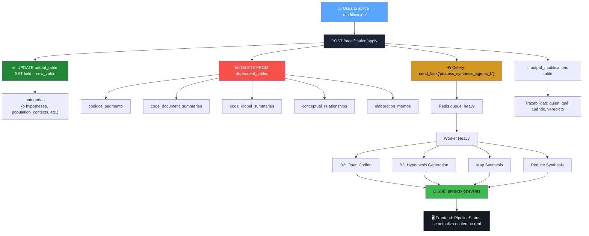
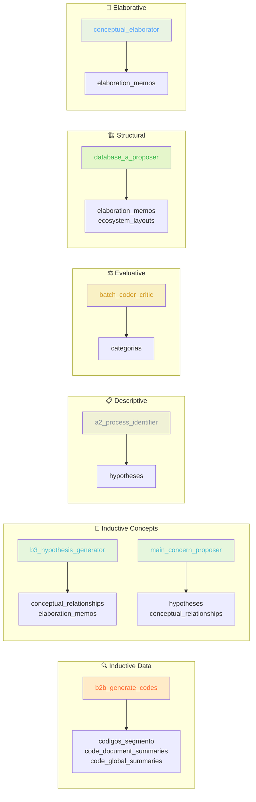
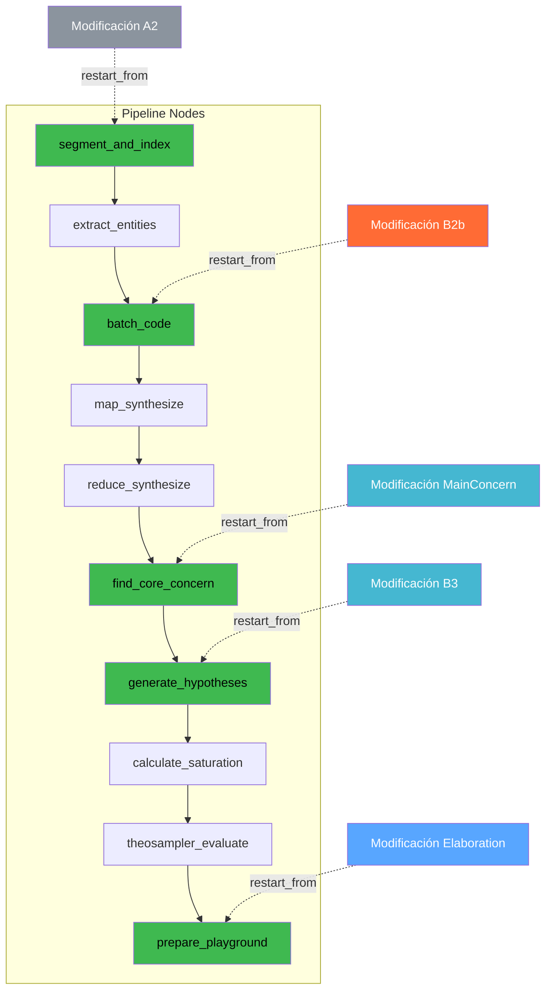

# Mapa de Cascada de Modificaciones — P5 HITL

> **¿Qué pasa cuando un usuario aplica una modificación a un output de agente CGT?**

## ¿Qué tablas se limpian según el agente modificado?

## ¿Dónde se reinicia el pipeline?

