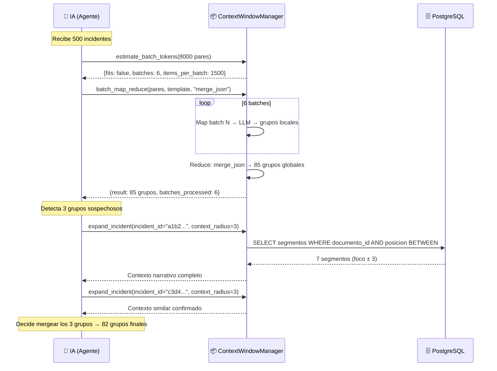

# 6 — ContextWindowManager: Tools de Exploración Contextual para la IA

> **Diseño.** Resuelve el problema de saturación de contexto dándole a la IA "ojos" para explorar segmentos bajo demanda, en vez de volcar todos los datos crudos en cada llamada LLM.

---

## 1. El Problema: Cuando 500+ Incidentes Saturan el Contexto

### 1.1 La raíz del problema

El sistema CGT opera sobre corpus de entrevistas que producen cientos de segmentos e incidentes. Una entrevista de 45 minutos genera ~50 segmentos. Diez entrevistas = 500 segmentos = 500 incidentes. Veinte entrevistas = 1000+.

Si la IA intenta procesar todos los incidentes en una sola llamada LLM:

| Escenario | Incidentes | Tokens estimados | ¿Cabe en 60K? |
|-----------|-----------|------------------|-----------------|
| 5 entrevistas | ~250 | ~50K | ✅ Justo |
| 10 entrevistas | ~500 | ~100K | ❌ No cabe |
| 20 entrevistas | ~1000 | ~200K | ❌❌ Ni de cerca |
| Comparación todos vs todos (B1) | 125K pares | ~25M | ❌❌❌ Imposible |

### 1.2 El problema no es solo de volumen — es de cognición

Incluso si cupieran todos los datos en el contexto técnico del modelo (ventanas de 128K-200K tokens), hay un problema más sutil: **la atención se diluye**. Los modelos LLM pierden precisión cuando se les pide razonar sobre miles de items simultáneamente. Es como pedirle a un humano que compare 500 fichas de una sola sentada — puede hacerlo, pero la calidad del análisis se degrada.

### 1.3 Lo que la IA realmente necesita

La IA no necesita ver los 500 incidentes crudos todo el tiempo. Necesita:

1. **Ver resúmenes** para orientarse (grupos, etiquetas, scores)
2. **Abrir segmentos específicos** cuando necesita verificar un patrón
3. **Explorar el contexto narrativo** alrededor de un segmento clave
4. **Buscar patrones relacionados** en otras partes del corpus
5. **Tomar decisiones** basadas en la evidencia que ella misma recupera

---

## 2. La Solución: Tools como "Ojos" de la IA

### 2.1 Metáfora: El investigador con fichas

Imagina un investigador cualitativo trabajando con 500 fichas de entrevistas:

- **No** tiene las 500 fichas desplegadas sobre la mesa todo el tiempo.
- **Sí** tiene un fichero con resúmenes (una línea por ficha).
- Cuando encuentra un patrón interesante en los resúmenes, **saca la ficha original** del fichero.
- Si necesita más contexto, **saca las fichas adyacentes** (lo que se dijo antes y después).
- Si quiere ver si el patrón aparece en otras entrevistas, **busca en el fichero** por temas similares.

El `ContextWindowManager` es el **fichero** y las **manos** del investigador. La IA es el **cerebro** que decide qué fichas sacar.

### 2.2 Las 5 tools — el "juego de ojos"

```
┌─────────────────────────────────────────────────────────┐
│                 CONTEXT WINDOW MANAGER                   │
│                                                         │
│  ┌──────────────────┐  ┌──────────────────────────┐    │
│  │ expand_incident  │  │ get_document_window      │    │
│  │ "Abrir ficha"    │  │ "Ver alrededor"          │    │
│  │ Incidente →      │  │ Modo Radio o Modo Rango  │    │
│  │ Segmentos antes  │  │ La IA elige el tamaño    │    │
│  │ y después        │  │ de ventana               │    │
│  └──────────────────┘  └──────────────────────────┘    │
│                                                         │
│  ┌──────────────────┐  ┌──────────────────────────┐    │
│  │ search_precise   │  │ estimate_batch_tokens    │    │
│  │ "Buscar entidades"│  │ "Medir la mesa"          │    │
│  │ ILIKE PostgreSQL │  │ ¿Caben todos? ¿Cuántos   │    │
│  │ → Menciones      │  │ batches necesito?        │    │
│  │ exactas          │  │ (usa context_config)      │    │
│  └──────────────────┘  └──────────────────────────┘    │
│                                                         │
│  ┌──────────────────────────────────────────────────┐  │
│  │ batch_map_reduce                                 │  │
│  │ "Procesar el fichero entero"                     │  │
│  │ N batches → Map cada batch → Reduce resultados   │  │
│  │ ThreadPoolExecutor MAP → REDUCE → log batch_exec │  │
│  └──────────────────────────────────────────────────┘  │
│                                                         │
└─────────────────────────────────────────────────────────┘
```

### 2.3 Principio de diseño: La IA ve resúmenes, no datos crudos

| Capa | Lo que la IA recibe | Lo que la IA puede "abrir" |
|------|--------------------|---------------------------|
| **Inicial** | Lista de incidentes con jot_text + score | `expand_incident(id)` → segmentos fuente + contexto |
| **Exploración** | Grupos de incidentes con etiquetas | `get_document_window(doc, seg)` → flujo narrativo |
| **Búsqueda** | Un incidente que menciona una entidad | `search_precise_entities(nombre)` → menciones exactas (ILIKE, no RAG) |
| **Planificación** | Lista de items a procesar | `estimate_batch_tokens(items)` → ¿caben en una llamada? |
| **Procesamiento** | Resultado reducido de N batches | `batch_map_reduce(items, template)` → resultado consolidado |

---

## 3. Flujo de Ejemplo: B1 Comparator con 500 Incidentes

### 3.1 Escenario

Un proyecto tiene 10 documentos procesados, generando 500 incidentes extraídos. El `incident_comparator` (agente B1) necesita agruparlos por el fenómeno subyacente que miden. Comparar todos contra todos = 125K pares. La ventana de contexto del LLM es de 60K tokens.

### 3.2 Paso a paso

```
PASO 0: PRE-FILTRO (⚙️ sin LLM)
─────────────────────────────────
  Para cada incidente, calcular embedding (TEI, 1024-dim).
  Para cada par (i, j) con i < j:
    sim = cosine(embedding[i], embedding[j])
    si sim < 0.70 → descartar (no son intercambiables)
    si sim >= 0.70 → agregar a candidatos

  Resultado: ~8K pares sobreviven (6.4% de 125K).
  Estos 8K pares son los que realmente necesitan evaluación LLM.

PASO 1: ESTIMAR (🧠 IA llama a estimate_batch_tokens)
────────────────────────────────────────────────────
  IA: "Tengo 8000 pares para procesar. ¿Caben en la ventana?"

  estimate_batch_tokens(items=pares, text_keys=["incident_a_jot", "incident_b_jot"])
  → {
      "fits": false,
      "total_items": 8000,
      "total_tokens_estimated": 320000,
      "avg_tokens_per_item": 40.0,
      "max_tokens": 150000,
      "batches": 3,
      "items_per_batch": 2667,
      "utilization_pct": 213.3,
      "recommendation": "NO caben. Se necesitan 3 batches de ~2667 items cada uno."
    }

PASO 2: MAP (🧠 IA llama a batch_map_reduce)
────────────────────────────────────────────
  IA: "Procesa los 8000 pares en batches de 1500, agrupando por fenómeno subyacente."

  batch_map_reduce(
    items=pares,
    map_prompt_template="""
      Evalúa estos pares de incidentes. Para cada par, decide si miden
      el mismo fenómeno subyacente (intercambiables).
      Devuelve JSON: {"grupos": [{"label": "...", "incident_ids": [...]}]}

      {items}
    """,
    reduce_strategy="merge_json",
    max_tokens_per_batch=150000,
  )

  Internamente:
    Batch 1 (2667 pares) → LLM → 45 grupos locales
    Batch 2 (2667 pares) → LLM → 38 grupos locales
    Batch 3 (2666 pares) → LLM → 42 grupos locales

  REDUCE (merge_json): Combina los 125 grupos locales en 85 grupos globales
  (algunos grupos de distintos batches se mergean por tener la misma label).

PASO 3: VERIFICAR (🧠 IA llama a expand_incident)
─────────────────────────────────────────────────
  La IA recibe los 85 grupos reducidos. Pero hay 3 grupos con etiquetas
  muy similares: "Negociando límites", "Negociando fronteras", "Regateando
  con el sistema".

  IA: "Necesito verificar si estos 3 grupos realmente miden fenómenos distintos
       o si deberían ser un solo grupo."

  Llama a expand_incident() para el incidente más representativo de cada grupo:

  expand_incident(incident_id="a1b2...", context_radius=3)
  → Segmentos antes: [pregunta del entrevistador sobre relación con la app]
  → Segmento foco: "Bueno, yo siempre estoy como negociando con el algoritmo,
     tipo 'si hago esto, ¿me mostrará más cosas que me gustan?'"
  → Segmentos después: [elaboración sobre cómo aprendió a manipular el feed]

  expand_incident(incident_id="c3d4...", context_radius=3)
  → Contexto similar: misma dinámica de negociación con la plataforma.

  expand_incident(incident_id="e5f6...", context_radius=3)
  → Contexto similar: regateo con las reglas implícitas del sistema.

  IA: "Los tres grupos hablan del mismo fenómeno. Los mergeo en uno solo:
       'Negociando límites con el algoritmo'."

PASO 4: RESULTADO FINAL
───────────────────────
  La IA entrega 82 grupos consolidados (los 85 originales menos 3 mergeados + 1 nuevo).
  Cada grupo tiene incidentes que miden el mismo fenómeno subyacente.
```

### 3.3 Resumen del flujo



---

## 4. Las Tools como "Ojos" de la IA

### 4.1 La analogía completa

| El investigador humano... | La IA con ContextWindowManager... |
|---------------------------|----------------------------------|
| Tiene un fichero con 500 fichas resumidas | Recibe una lista de incidentes con `jot_text` + metadata |
| Cuando ve un patrón, saca la ficha original | Llama a `expand_incident(id)` para ver el segmento fuente |
| Si necesita contexto, saca las fichas de al lado | `expand_incident` devuelve ±N segmentos adyacentes |
| Si busca una entidad concreta en otras entrevistas | Llama a `search_precise_entities(query)` — ILIKE, no RAG |
| Para entender una entrevista completa, despliega sus fichas en orden | Llama a `get_document_window(doc, seg, radius=N)` — modo radio o rango |
| Antes de empezar, estima cuántas fichas puede manejar a la vez | Llama a `estimate_batch_tokens(items, max)` usando `context_config` |
| Procesa el fichero por tandas, anotando resultados parciales | Llama a `batch_map_reduce(items, template)` con ThreadPoolExecutor |
| Al final, tiene un informe consolidado | Recibe el resultado reducido de `batch_map_reduce` |

### 4.2 Qué NO ve la IA

La IA **nunca** ve:
- Los 500 segmentos crudos en una sola llamada
- Los 125K pares de comparación crudos
- Los batches intermedios del map-reduce
- Los embeddings (no se usan en búsqueda — es ILIKE directo)

La IA **sí** ve:
- Resúmenes de incidentes (jot_text, scores)
- Resultados reducidos de map-reduce (grupos consolidados)
- Segmentos específicos que ella solicita (bajo demanda)
- Contexto narrativo alrededor de segmentos clave
- Métricas de presupuesto (fits, batches, items_per_batch)

### 4.3 Por qué esto es mejor

| Enfoque ingenuo | Enfoque con ContextWindowManager |
|-----------------|----------------------------------|
| Volcar 500 incidentes en cada llamada LLM | La IA recibe resúmenes + herramientas para explorar |
| ~100K tokens por llamada | ~5K-10K tokens por llamada típica |
| La atención del LLM se diluye | La IA enfoca su atención en lo relevante |
| Sin capacidad de verificación | La IA verifica sus hipótesis abriendo segmentos |
| Una sola pasada (frágil) | Iterativo: resumir → verificar → decidir |
| Costo: ~$0.10/llamada | Costo: ~$0.01/llamada (10x menos) |

---

## 5. API de la Clase `ContextWindowManager`

### 5.1 `expand_incident(incident_id, context_radius=3, search_entities=False) → dict`

**Propósito:** "Abrir la ficha" de un incidente y ver qué hay alrededor.

**Flujo interno (compone las otras tools):**
1. Busca el segmento fuente del incidente (FK directa SQL)
2. Obtiene ventana de contexto alrededor del segmento foco (misma lógica que `get_document_window`)
3. Opcionalmente, extrae entidades del `jot_text` y las busca con `search_precise_entities()`

**Input:**
- `incident_id`: UUID del `ExtractedIncident`
- `context_radius`: Número de segmentos antes y después (default: 3)
- `search_entities`: Si buscar entidades mencionadas en todo el corpus (default: False)

**Output:**
```json
{
  "incident": {
    "incident_id": "uuid",
    "jot_text": "Negociando límites con el algoritmo",
    "tipo_dato_glaser": "baseline_data",
    "keep_moving": true,
    "documento_id": "uuid",
    "segmento_id": "uuid",
    "documento_nombre": "entrevista_maria.txt"
  },
  "source_segment": {
    "segmento_id": "uuid",
    "posicion": 15,
    "texto": "Siempre estoy como midiendo hasta dónde puedo llegar..."
  },
  "context_before": [
    {"segmento_id": "...", "posicion": 12, "texto": "...", "distancia": -3},
    {"segmento_id": "...", "posicion": 13, "texto": "...", "distancia": -2},
    {"segmento_id": "...", "posicion": 14, "texto": "...", "distancia": -1}
  ],
  "context_after": [
    {"segmento_id": "...", "posicion": 16, "texto": "...", "distancia": 1},
    {"segmento_id": "...", "posicion": 17, "texto": "...", "distancia": 2},
    {"segmento_id": "...", "posicion": 18, "texto": "...", "distancia": 3}
  ],
  "entities_found": null
}
```

Cuando `search_entities=True`, `entities_found` contiene resultados de `search_precise_entities` para cada entidad extraída del `jot_text`, deduplicados por `segmento_id`.

### 5.2 `search_precise_entities(query_text, proyecto_id, document_id=None, max_results=10) → list[dict]`

**Propósito:** "Buscar en el fichero" menciones EXACTAS de entidades concretas. **NO usa embeddings. NO usa RAG.**

**Filosofía:** El lenguaje cualitativo no es homogéneo ni estructurado. RAG puede devolver resultados engañosos por similitud semántica superficial. Solo búsqueda precisa con PostgreSQL ILIKE.

**Input:**
- `query_text`: Texto exacto a buscar (ej: "María", "hospital", "despido")
- `proyecto_id`: UUID del proyecto
- `document_id`: UUID del documento (opcional, para limitar scope)
- `max_results`: Máximo de resultados (default: 10, max: 50)

**Output:**
```json
[
  {
    "segmento_id": "uuid",
    "texto": "... menciona 'María' en este contexto ...",
    "documento_id": "uuid",
    "documento_nombre": "entrevista_maria.txt",
    "posicion": 15
  },
  {
    "segmento_id": "uuid",
    "texto": "... otra mención de 'María' ...",
    "documento_id": "uuid",
    "documento_nombre": "entrevista_pedro.txt",
    "posicion": 22
  }
]
```

### 5.3 `get_document_window(document_id, focus_segment_id=None, radius=None, start_position=None, end_position=None) → dict`

**Propósito:** "Desplegar las fichas en orden" con ventana flexible. La IA elige el tamaño.

**Dos modos:**
- **Modo Radio:** `focus_segment_id + radius` → ±N segmentos alrededor del foco
- **Modo Rango:** `start_position + end_position` → segmentos en ese rango exacto

**Input:**
- `document_id`: UUID del documento (obligatorio)
- `focus_segment_id`: UUID del segmento foco — Modo Radio
- `radius`: Número de segmentos antes y después del foco (default: 3)
- `start_position`: Posición inicial — Modo Rango (1-indexed)
- `end_position`: Posición final — Modo Rango (1-indexed, inclusivo)

**Output (Modo Radio):**
```json
{
  "documento_id": "uuid",
  "documento_nombre": "entrevista_maria.txt",
  "focus_segmento_id": "uuid",
  "focus_posicion": 15,
  "radius": 5,
  "modo": "radius",
  "segmentos": [
    {
      "segmento_id": "uuid",
      "posicion": 10,
      "texto": "P: ¿Cómo describirías tu relación con la aplicación?",
      "es_foco": false,
      "distancia": -5
    },
    ...
  ],
  "total_segmentos_en_documento": 50,
  "rango_cubierto": "posiciones 10-20 de 50"
}
```

**Output (Modo Rango):**
```json
{
  "documento_id": "uuid",
  "documento_nombre": "entrevista_maria.txt",
  "focus_segmento_id": null,
  "focus_posicion": null,
  "radius": null,
  "modo": "range",
  "segmentos": [
    {
      "segmento_id": "uuid",
      "posicion": 10,
      "texto": "...",
      "es_foco": false,
      "distancia": null
    },
    ...
  ],
  "total_segmentos_en_documento": 50,
  "rango_cubierto": "posiciones 10-25 de 50"
}
```

### 5.4 `estimate_batch_tokens(items, max_tokens=60000) → dict`

**Propósito:** "Medir la mesa" antes de desplegar las fichas. Usa `context_config` de `app.core.context_config`.

**Input:**
- `items`: Lista de dicts a estimar
- `max_tokens`: Presupuesto máximo (default: `context_config.effective_window`)
- `text_keys`: Keys con texto a contar (opcional)

**Output:**
```json
{
  "fits": false,
  "total_items": 8000,
  "total_tokens_estimated": 320000,
  "avg_tokens_per_item": 40.0,
  "max_tokens": 150000,
  "batches": 6,
  "items_per_batch": 1500,
  "utilization_pct": 213.3,
  "recommendation": "NO caben. Se necesitan 6 batches de ~1500 items cada uno (estimado: 320000 tokens totales vs 150000 disponibles).",
  "needs_fragmentation": true
}
```

### 5.5 `batch_map_reduce(items, map_prompt_template, reduce_strategy="merge_json") → dict`

**Propósito:** "Procesar el fichero entero por tandas" y recibir el consolidado.

**Flujo interno:**
1. `estimate_batch_tokens()` con `context_config.calculate_batches()`
2. Si no necesita fragmentación → llamada directa (bypass)
3. Si necesita → MAP (ThreadPoolExecutor, FLASH) → REDUCE (PRO) → opcionalmente ReAct
4. Loggea en `batch_executions` para trazabilidad

**Input:**
- `items`: Lista de dicts a procesar
- `map_prompt_template`: Template con placeholder `{items}`
- `proyecto_id`: UUID del proyecto (para logging en batch_executions)
- `reduce_strategy`: "merge_json" | "union" | "vote" | "concat"
- `max_tokens_per_batch`: Default usa `context_config.effective_window`

**Output:**
```json
{
  "result": {
    "grupos": [
      {"label": "Negociando límites con el algoritmo", "incident_ids": ["id1", "id2", ...]},
      ...
    ]
  },
  "batches_processed": 6,
  "items_processed": 8000,
  "reduce_strategy": "merge_json",
  "tokens_per_batch": 53333,
  "items_per_batch": 1500,
  "fits_in_one_batch": false,
  "strategy_used": "map_reduce"
}
```

---

## 6. Registro en ToolRegistry

### 6.1 Las 5 tools registradas

Cada método de `ContextWindowManager` se expone como una tool independiente en el `ToolRegistry` mediante el decorador `@tool`:

```python
# En backend/app/agents/tools/context_window.py

from app.agents.tool_registry import tool

@tool(
    name="expand_incident",
    description="Expande un incidente a su contexto narrativo completo. "
                "Busca el segmento fuente (FK directa), obtiene ventana de contexto, "
                "y opcionalmente busca entidades mencionadas...",
    parameters={
        "incident_id": "UUID del incidente (ExtractedIncident) a expandir",
        "context_radius": "Número de segmentos antes y después (default: 3)",
        "search_entities": "Si buscar entidades mencionadas en el corpus (default: false)",
    },
)
def expand_incident(incident_id: str, context_radius: int = 3, search_entities: bool = False) -> dict:
    ...

@tool(
    name="search_precise_entities",
    description="Busca menciones EXACTAS de entidades concretas. "
                "Usa PostgreSQL ILIKE — NO usa embeddings/RAG...",
    parameters={
        "query_text": "Texto exacto a buscar (ej: 'María', 'hospital')",
        "proyecto_id": "UUID del proyecto",
        "document_id": "UUID del documento (opcional)",
        "max_results": "Máximo de resultados (default: 10, max: 50)",
    },
)
def search_precise_entities(query_text: str, proyecto_id: str, ...) -> list:
    ...

@tool(
    name="get_document_window",
    description="Ventana flexible de segmentos. Dos modos: Radio (focus_segment_id+radius) "
                "o Rango (start_position+end_position). La IA decide cuánto contexto...",
    parameters={
        "document_id": "UUID del documento (obligatorio)",
        "focus_segment_id": "UUID del segmento foco — Modo Radio",
        "radius": "Segmentos antes y después del foco (default: 3)",
        "start_position": "Posición inicial — Modo Rango",
        "end_position": "Posición final — Modo Rango",
    },
)
def get_document_window(document_id: str, ...) -> dict:
    ...
```

### 6.2 Integración en `__init__.py`

```python
# En backend/app/agents/tools/__init__.py

from app.agents.tools.context_window import (
    ContextWindowManager,
    expand_incident,
    search_precise_entities,
    get_document_window,
    estimate_batch_tokens,
    batch_map_reduce,
)

__all__ = [
    # ... existing exports ...
    "ContextWindowManager",
    "expand_incident",
    "search_precise_entities",
    "get_document_window",
    "estimate_batch_tokens",
    "batch_map_reduce",
]
```

### 6.3 Registro automático

El `ToolRegistry.register_from_module()` escanea el módulo y registra automáticamente todas las funciones decoradas con `@tool`:

```python
# En el orchestrator o donde se inicialice el registry:

from app.agents.tool_registry import ToolRegistry
from app.agents.tools import context_window

registry = ToolRegistry()
count = registry.register_from_module(context_window)
# count = 5 (las 5 tools)
```

### 6.4 Schema para el LLM

El `ToolRegistry.to_openai_tools()` genera automáticamente el schema de function calling:

```json
{
  "type": "function",
  "function": {
    "name": "search_precise_entities",
    "description": "Busca menciones EXACTAS de entidades concretas usando PostgreSQL ILIKE...",
    "parameters": {
      "type": "object",
      "properties": {
        "query_text": {"type": "string", "description": "Texto exacto a buscar (ej: 'María', 'hospital')"},
        "proyecto_id": {"type": "string", "description": "UUID del proyecto"},
        "document_id": {"type": "string", "description": "UUID del documento (opcional)"},
        "max_results": {"type": "integer", "description": "Máximo de resultados (default: 10, max: 50)"}
      },
      "required": ["query_text", "proyecto_id"]
    }
  }
}
```

El LLM ve estas tools en su system prompt y decide cuándo invocarlas.

---

## 7. Relación con el Diseño Anterior (`6-ContextWindowManager.md`)

El diseño anterior de `ContextWindowManager` se enfocaba en el **procesamiento algorítmico por batches** (Map-Reduce como patrón de implementación interna). Este nuevo diseño **complementa** esa visión añadiendo la capa de **exploración interactiva**:

| Aspecto | Diseño anterior | Este diseño |
|---------|----------------|-------------|
| **Foco** | Map-Reduce algorítmico | Tools de exploración para la IA |
| **batch_process** | Kernel central | Renombrado a `batch_map_reduce`, mismo núcleo pero expuesto como tool |
| **Exploración** | No contemplada | `expand_incident`, `search_precise_entities`, `get_document_window` |
| **Búsqueda** | Embeddings/RAG semántico | ILIKE preciso en PostgreSQL (el lenguaje cualitativo no es homogéneo) |
| **Estimación** | Interna (auto batch_size) | Expuesta como tool: `estimate_batch_tokens` usando `context_config` |
| **Ventana** | Radio hardcodeado | Flexible: modo radio O modo rango, la IA decide |
| **Rol de la IA** | Consumidora pasiva de resultados | Exploradora activa: decide qué abrir, cuándo verificar, qué tamaño de ventana usar |
| **Metáfora** | Cadena de montaje | Investigador con fichero |

**No se reemplaza** el diseño anterior. Se **extiende** con las tools de exploración. La clase `ContextWindowManager` ahora tiene dos familias de métodos:

1. **Exploración** (nuevo, con filosofía de búsqueda precisa): `expand_incident`, `search_precise_entities`, `get_document_window`
2. **Procesamiento** (existente, refinado, usa `context_config`): `estimate_batch_tokens`, `batch_map_reduce`

---

## 8. Plan de Implementación

| Prioridad | Qué | Dónde | Esfuerzo | Estado |
|-----------|-----|-------|----------|--------|
| **1** | Implementar `expand_incident` | `context_window.py` | Medio — FK SQL + ventana + búsqueda opcional de entidades | ✅ Implementado |
| **2** | Implementar `search_precise_entities` | `context_window.py` | Bajo — ILIKE PostgreSQL, sin embeddings | ✅ Implementado |
| **3** | Implementar `get_document_window` | `context_window.py` | Bajo — Modo Radio + Modo Rango, IA elige | ✅ Implementado |
| **4** | Implementar `estimate_batch_tokens` | `context_window.py` | Bajo — usa `context_config` | ✅ Implementado |
| **5** | Implementar `batch_map_reduce` | `context_window.py` | Alto — ThreadPoolExecutor MAP + REDUCE + logging | ✅ Implementado |
| **6** | Registrar las 5 tools en ToolRegistry | `__init__.py` | Bajo — lazy imports | ✅ Implementado |
| **7** | Integrar en `incident_comparator` (B1) | `workers/heavy/comparator.py` | Alto | Pendiente |
| **8** | Integrar en `pattern_labeler` (B2) | `workers/heavy/labeler.py` | Medio | Pendiente |

---

## 9. Principios de Diseño

1. **La IA decide, las tools ejecutan.** La IA es el cerebro que elige qué explorar. Las tools son los ojos y las manos que recuperan la información.

2. **Resúmenes primero, detalle bajo demanda.** La IA siempre recibe resúmenes. Solo ve datos crudos cuando ella explícitamente los solicita.

3. **Búsqueda PRECISA, no semántica.** `search_precise_entities` usa ILIKE en PostgreSQL. NO usa embeddings. NO usa RAG. En investigación cualitativa, el lenguaje no es homogéneo y la similitud semántica superficial puede ser engañosa.

4. **Ventana flexible, no hardcodeada.** `get_document_window` ofrece dos modos (radio y rango). La IA decide cuánto contexto necesita en cada momento.

5. **Sin LLM para decisiones de exploración.** `estimate_batch_tokens` es puramente algorítmico (usa `context_config`). Las tools de exploración solo hacen queries SQL — sin gastar tokens del LLM.

6. **Tool, no framework.** Cada método es una tool independiente registrada en `ToolRegistry`. No requiere modificar la arquitectura de agentes.

7. **Componibilidad.** Las tools se componen: `batch_map_reduce` para procesar en lote → `expand_incident` para verificar casos dudosos (internamente usa `get_document_window` + opcionalmente `search_precise_entities`).

8. **Transparencia y trazabilidad.** Cada tool devuelve metadatos completos (totales, posiciones, modo usado, estrategia). `batch_map_reduce` loggea en `batch_executions`.
