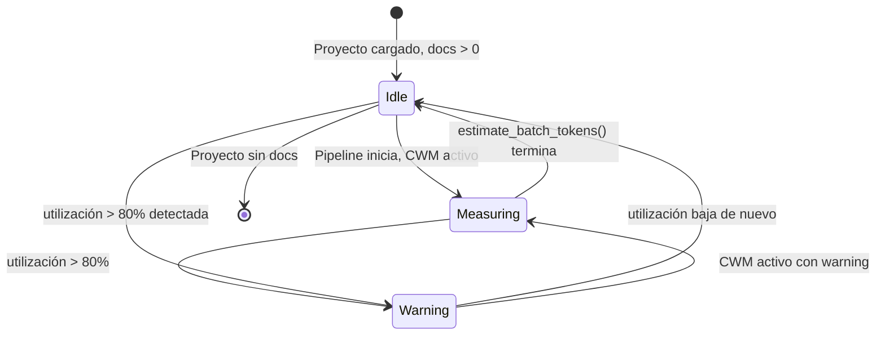
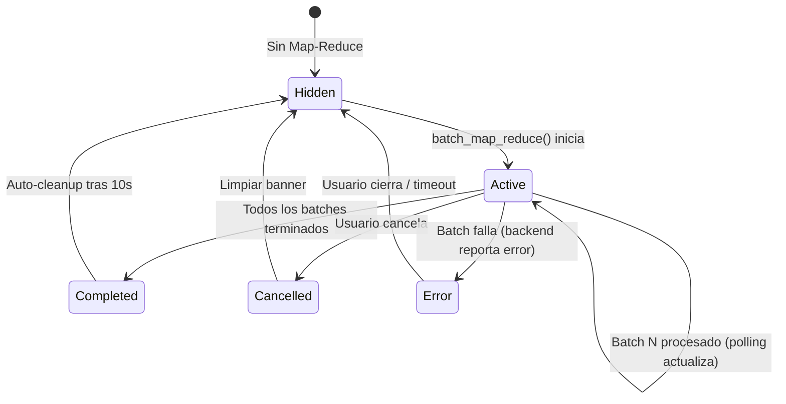

# 6 — ContextWindowManager: Diseño de Frontend

> **Diseño de UI.** Cambios mínimos de frontend para dar visibilidad al procesamiento Map-Reduce del `ContextWindowManager` (CWM). El CWM es principalmente backend — el frontend solo necesita indicadores informativos y una configuración simple.
>
> **No implementar.** Este documento es especificación/blueprint.

---

## Tabla de Contenidos

1. [Resumen de Cambios](#1-resumen-de-cambios)
2. [Mockups ASCII](#2-mockups-ascii)
3. [Especificación de Componentes](#3-especificación-de-componentes)
4. [Nuevos Endpoints Necesarios](#4-nuevos-endpoints-necesarios)
5. [Nuevos Estados en Project.tsx](#5-nuevos-estados-en-projecttsx)
6. [Plan de Integración](#6-plan-de-integración)
7. [Estados de UI y Transiciones](#7-estados-de-ui-y-transiciones)

---

## 1. Resumen de Cambios

| # | Componente | Tipo | Ubicación |
|---|-----------|------|-----------|
| 1 | **Indicador de ventana de contexto** | Nuevo (integrado en sidebar) | `Project.tsx`, dentro del sidebar existente |
| 2 | **Banner de fragmentación Map-Reduce** | Nuevo (integrado en sidebar) | `Project.tsx`, reemplaza/extiende `pipelineMsg` |
| 3 | **Configuración de ventana** | Extensión de tab existente | `ProjectConfigPanel.tsx`, nuevo tab `"context"` |
| 4 | **Indicador de batch progreso** | Nuevo (integrado en sidebar) | `Project.tsx`, sección debajo del banner |

**No se crean archivos nuevos de componente.** Todos los cambios son extensiones de `Project.tsx` y `ProjectConfigPanel.tsx`. Esto mantiene el patrón existente donde `Project.tsx` es un componente monolítico que contiene todo el estado y UI del proyecto.

---

## 2. Mockups ASCII

### 2.1 Sidebar del Proyecto (Vista Completa)

```
┌─────────────────────────────────────────┐
│  ⚙️ Config · Settings                    │  ← header existente
│  [🔄] [▶ Run Pipeline]                   │  ← controles pipeline
│──────────────────────────────────────────│
│  [🤖 Agentes] [📋 Etapas] [📋 Logs]      │  ← tabs existentes
│──────────────────────────────────────────│
│                                          │
│  ┌── Indicador de Contexto ──────────┐  │  ← 🆕 NUEVO: siempre visible
│  │  📊 Ventana de contexto            │  │
│  │  ┌────────────────────────────┐   │  │
│  │  │ ████████████████░░░░░░░░░░ │   │  │     barra de progreso
│  │  └────────────────────────────┘   │  │
│  │  85,000 / 150,000 tokens (57%)   │  │     texto numérico
│  └──────────────────────────────────┘  │
│                                          │
│  ┌── Banner Map-Reduce ─────────────┐  │  ← 🆕 NUEVO: solo visible
│  │  📊 Procesando en 5 batches de   │  │     durante Map-Reduce
│  │  ~100 incidentes cada uno.       │  │
│  │  Esto puede tomar unos minutos. │  │
│  │  ┌──────────────────────────┐   │  │
│  │  │ Batch 3/5 procesado      │   │  │  ← 🆕 NUEVO: progreso batch
│  │  │ · 42 grupos locales      │   │  │
│  │  └──────────────────────────┘   │  │
│  └──────────────────────────────────┘  │
│                                          │
│  ── Pipeline Agents ──                   │  ← existente
│  📥 Data Management 0/4                  │
│    ○ util_punctuator                     │
│    ○ fa_glaser_data_classifier           │
│    ...                                   │
│                                          │
└──────────────────────────────────────────┘
```

### 2.2 Indicador de Contexto — Estados

#### Estado Normal (sin CWM activo)
```
┌────────────────────────────────────────┐
│  📊 Ventana de contexto                │
│  ┌──────────────────────────────────┐  │
│  │ ████████████████░░░░░░░░░░░░░░░  │  │  ← barra con gradiente #A371F7 → #3FB950
│  └──────────────────────────────────┘  │
│  85,000 / 150,000 tokens (57%)        │
└────────────────────────────────────────┘
```

#### Tooltip al hacer hover
```
┌─────────────────────────────────────┐
│ Ventana de contexto: 150K tokens    │
│ disponibles para datos.             │
│ Configurable en Settings → Context. │
└─────────────────────────────────────┘
```

#### Estado "midiendo" (CWM está calculando estimate_batch_tokens)
```
┌────────────────────────────────────────┐
│  📊 Ventana de contexto                │
│  ┌──────────────────────────────────┐  │
│  │ ████████████████░░░░░░░░░░░░░░░  │  │  ← barra animada con shimmer
│  └──────────────────────────────────┘  │
│  85,000 / 150,000 tokens (57%)        │
│  ⏳ Midiendo presupuesto...           │  ← texto temporal
└────────────────────────────────────────┘
```

#### Estado "crítico" (>80% de uso)
```
┌────────────────────────────────────────┐
│  📊 Ventana de contexto ⚠️             │  ← icono warning
│  ┌──────────────────────────────────┐  │
│  │ ██████████████████████████░░░░░  │  │  ← barra cambia a #D29922/ambar
│  └──────────────────────────────────┘  │
│  128,000 / 150,000 tokens (85%)       │  ← texto en #D29922
│  Alta utilización — considera         │
│  reducir datos o aumentar ventana.    │
└────────────────────────────────────────┘
```

### 2.3 Banner de Fragmentación Map-Reduce — Detalle

```
┌──────────────────────────────────────────┐
│  📊 Map-Reduce activo                    │  ← header
│                                          │
│  Procesando 8,000 pares en 5 batches    │
│  de ~100 incidentes cada uno.           │
│  Esto puede tomar unos minutos.      │
│                                          │
│  ┌────────────────────────────────────┐  │
│  │  Progreso de batches               │  │
│  │  ████████████░░░░░░░░ 3/5         │  │  ← barra de progreso batch
│  │                                    │  │
│  │  Batch 1 ✓  45 grupos locales     │  │  ← completado (verde)
│  │  Batch 2 ✓  38 grupos locales     │  │
│  │  Batch 3 ●  42 grupos locales     │  │  ← en progreso (violeta, pulso)
│  │  Batch 4 ○  pendiente             │  │  ← pendiente (gris)
│  │  Batch 5 ○  pendiente             │  │
│  └────────────────────────────────────┘  │
│                                          │
│  [Cancelar Map-Reduce]                   │  ← botón para abortar
└──────────────────────────────────────────┘
```

### 2.4 Configuración en ProjectConfigPanel — Nueva Tab "Context"

```
┌─────────────────────────────────────────────────────┐
│  🧬 Project Configuration                    [✕]    │
│─────────────────────────────────────────────────────│
│  [Config] [History] [Suggestions] [Policy]          │
│  [Preprocesado] [📊 Context]  ← 🆕 NUEVO            │
│─────────────────────────────────────────────────────│
│                                                     │
│  ── VENTANA DE CONTEXTO PARA DATOS ──               │
│                                                     │
│  Define cuántos tokens de contexto quieres          │
│  reservar para los datos de tus entrevistas.        │
│  Un valor más bajo fuerza más fragmentación         │
│  (Map-Reduce); uno más alto permite procesar        │
│  más datos juntos pero consume más créditos LLM.   │
│                                                     │
│  ┌─────────────────────────────────────────────┐   │
│  │ Tamaño de ventana                            │   │
│  │                                              │   │
│  │  10K ◄══════════════●══════════► 250K       │   │ ← slider
│  │             150,000 tokens                    │   │ ← valor numérico
│  │                                              │   │
│  │  [  150000  ] tokens                         │   │ ← input number editable
│  └─────────────────────────────────────────────┘   │
│                                                     │
│  ┌── Valor Efectivo ──────────────────────────┐    │
│  │  Con overhead del sistema (system prompt,   │    │
│  │  instrucciones), tu ventana efectiva para   │    │
│  │  datos es de ~127,500 tokens (85% del      │    │
│  │  total).                                    │    │
│  └─────────────────────────────────────────────┘    │
│                                                     │
│  ⚠️  Solo puedes DISMINUIR la ventana desde        │
│      el valor por defecto (150K). Subirla           │
│      requiere editar backend/config.                │
│                                                     │
│  [ Guardar ]  [ Restaurar default (150K) ]          │
│                                                     │
│  ───────────────────────────────────────────────    │
│  │ 💾 Context | estado: activo                    │  ← footer
└─────────────────────────────────────────────────────┘
```

### 2.5 Indicador de Batch Progreso — Estados Compactos

#### Vista compacta en sidebar (sin expandir)
```
┌────────────────────────────────────────┐
│  📊 Map-Reduce: Batch 3/5             │
│  ████████████░░░░░░░░                 │
│  42 grupos locales encontrados        │
└────────────────────────────────────────┘
```

#### Batch completado (estado final)
```
┌────────────────────────────────────────┐
│  ✅ Map-Reduce completado              │
│  5/5 batches · 212 grupos locales     │
│  → Reducidos a 85 grupos globales     │
└────────────────────────────────────────┘
```

---

## 3. Especificación de Componentes

### 3.1 `ContextWindowIndicator` (inline en Project.tsx)

**Qué es:** Una sección colapsable en el sidebar que muestra el estado de la ventana de contexto.

**Ubicación exacta:** Dentro del sidebar izquierdo (340px), **antes** de los tabs `Agentes / Etapas / Logs`, justo debajo de la fila de header/controles del pipeline. Se renderiza condicionalmente: siempre visible si el proyecto tiene documentos.

**Props/Estado que consume:**
- `contextWindowTokensUsed: number` — tokens usados actualmente (estimados)
- `contextWindowTokensMax: number` — máximo configurado (default 150K)
- `contextWindowStatus: "idle" | "measuring" | "warning"` — estado del indicador
- `contextWindowEffectiveTokens: number` — tokens efectivos después de overhead

**Estilos:** Sigue el patrón de inline styles del proyecto.
- Fondo: `#0D1117`
- Borde: `1px solid #21262D`, `borderRadius: 6`
- Padding: `10px 12px`, marginBottom: `12px`
- Texto: `fontSize: 11`, `color: #8B949E`

**Barra de progreso:**
- Altura: 6px, borderRadius: 3px
- Fondo track: `#21262D`
- Fondo fill: gradiente `#A371F7 → #3FB950` (normal), `#D29922 → #F85149` (warning)
- Transición: `width 0.5s ease` para animación suave al actualizar
- Texto: `fontSize: 11`, `fontFamily: monospace`, `color: #8B949E`

**Tooltip:** Implementado con atributo `title` nativo.

**Animación shimmer (midiendo):**
```css
@keyframes contextShimmer {
  0% { background-position: -200% 0; }
  100% { background-position: 200% 0; }
}
```
Solo se activa cuando `contextWindowStatus === "measuring"`. Se aplica un overlay con gradiente animado sobre la barra.

**Lógica de visibilidad:**
- Siempre visible si `docs.length > 0`
- El texto "⏳ Midiendo presupuesto..." aparece solo durante `measuring`
- El warning ⚠️ aparece solo cuando `pct > 80`

**Pseudo-código (React inline):**
```tsx
const contextPct = contextWindowTokensMax > 0
  ? Math.min(100, Math.round((contextWindowTokensUsed / contextWindowTokensMax) * 100))
  : 0;

const isWarning = contextPct > 80;
const barColor = isWarning ? "#D29922" : undefined;
const barGradient = isWarning
  ? "linear-gradient(90deg, #D29922, #F85149)"
  : "linear-gradient(90deg, #A371F7, #3FB950)";

<div style={{ marginBottom: 12, padding: "10px 12px", background: "#0D1117", borderRadius: 6, border: "1px solid #21262D" }}>
  <div style={{ display: "flex", justifyContent: "space-between", marginBottom: 4 }}>
    <span style={{ fontSize: 11, color: "#8B949E" }}>
      📊 {isWarning ? "⚠️ " : ""}Ventana de contexto
    </span>
    <span style={{ fontSize: 11, fontFamily: "monospace", color: isWarning ? "#D29922" : "#8B949E" }}>
      {contextWindowTokensUsed.toLocaleString()} / {contextWindowTokensMax.toLocaleString()} tokens ({contextPct}%)
    </span>
  </div>
  <div style={{ height: 6, borderRadius: 3, background: "#21262D", overflow: "hidden" }}>
    <div style={{
      height: "100%",
      width: `${contextPct}%`,
      borderRadius: 3,
      background: barGradient,
      transition: "width 0.5s ease",
    }} />
  </div>
  {contextWindowStatus === "measuring" && (
    <div style={{ fontSize: 10, color: "#A371F7", marginTop: 3 }}>⏳ Midiendo presupuesto...</div>
  )}
</div>
```

### 3.2 `MapReduceBanner` (inline en Project.tsx)

**Qué es:** Un banner informativo NO bloqueante que aparece cuando el CWM está ejecutando `batch_map_reduce`.

**Ubicación exacta:** En el sidebar, **reemplazando o debajo** del `pipelineMsg` actual, pero solo cuando hay una operación Map-Reduce activa. Si hay Map-Reduce Y pipelineMsg, el banner de Map-Reduce se muestra primero.

**Props/Estado que consume:**
- `mapReduceActive: boolean` — si hay una operación Map-Reduce en curso
- `mapReduceTotalBatches: number` — total de batches
- `mapReduceCurrentBatch: number` — batch actual (1-indexed)
- `mapReduceItemsTotal: number` — total de items a procesar
- `mapReduceItemsPerBatch: number` — items por batch
- `mapReduceBatchResults: Array<{ batch: number; localGroups: number; status: "pending" | "running" | "done" | "error" }>`
- `mapReduceResult: { globalGroups: number } | null` — resultado reducido final

**Estilos:**
- Fondo: `#1C2333` con borde izquierdo `3px solid #A371F7`
- Padding: `10px 12px`, marginBottom: `12px`, borderRadius: `6px`
- Texto header: `fontSize: 12, fontWeight: 600, color: "#E6EDF3"`
- Texto body: `fontSize: 11, color: "#8B949E"`
- Lista de batches: `fontSize: 10`, cada línea un batch

**Íconos de estado por batch:**
- `✓` = completado, color `#3FB950`
- `●` = en progreso, color `#A371F7` con animación pulse
- `○` = pendiente, color `#484F58`
- `✕` = error, color `#F85149`

**Botón Cancelar:**
- Solo visible mientras hay batches pendientes
- Estilo: `background: "#D2992222", border: "1px solid #D2992244", color: "#D29922"`
- onClick: llama a endpoint `POST /api/v1/projects/{id}/cwm/cancel`

**Pseudo-código:**
```tsx
{mapReduceActive && (
  <div style={{ marginBottom: 12, padding: "10px 12px", background: "#1C2333", borderRadius: 6, borderLeft: "3px solid #A371F7" }}>
    <div style={{ fontSize: 12, fontWeight: 600, color: "#E6EDF3", marginBottom: 4 }}>
      📊 Map-Reduce activo
    </div>
    <div style={{ fontSize: 11, color: "#8B949E", marginBottom: 8 }}>
      Procesando {mapReduceItemsTotal.toLocaleString()} items en {mapReduceTotalBatches} batches
      de ~{mapReduceItemsPerBatch} items cada uno. Esto puede tomar unos minutos.
    </div>
    {/* Barra de progreso de batches */}
    <div style={{ height: 4, borderRadius: 2, background: "#21262D", marginBottom: 6, overflow: "hidden" }}>
      <div style={{
        height: "100%",
        width: `${(mapReduceCurrentBatch / mapReduceTotalBatches) * 100}%`,
        borderRadius: 2,
        background: "linear-gradient(90deg, #A371F7, #3FB950)",
        transition: "width 0.3s ease",
      }} />
    </div>
    <div style={{ fontSize: 10, color: "#8B949E", marginBottom: 6 }}>
      Batch {mapReduceCurrentBatch}/{mapReduceTotalBatches} procesado
      {mapReduceBatchResults[mapReduceCurrentBatch - 1] && (
        <span> · {mapReduceBatchResults[mapReduceCurrentBatch - 1].localGroups} grupos locales encontrados</span>
      )}
    </div>
    {/* Lista de batches */}
    <div style={{ fontSize: 10, marginBottom: 8 }}>
      {mapReduceBatchResults.map((br) => {
        const icon = br.status === "done" ? "✓" : br.status === "running" ? "●" : br.status === "error" ? "✕" : "○";
        const color = br.status === "done" ? "#3FB950" : br.status === "running" ? "#A371F7" : br.status === "error" ? "#F85149" : "#484F58";
        return (
          <div key={br.batch} style={{ color, padding: "2px 0" }}>
            {icon} Batch {br.batch}
            {br.status === "done" && ` — ${br.localGroups} grupos locales`}
            {br.status === "pending" && " — pendiente"}
            {br.status === "error" && " — error"}
          </div>
        );
      })}
    </div>
    {mapReduceCurrentBatch < mapReduceTotalBatches && (
      <button
        onClick={handleCancelMapReduce}
        style={{
          background: "#D2992222",
          border: "1px solid #D2992244",
          borderRadius: 4,
          color: "#D29922",
          fontSize: 10,
          fontWeight: 600,
          padding: "3px 10px",
          cursor: "pointer",
        }}
      >
        Cancelar Map-Reduce
      </button>
    )}
    {mapReduceResult && (
      <div style={{ fontSize: 10, color: "#3FB950", marginTop: 6 }}>
        ✅ Completado — {mapReduceResult.globalGroups} grupos globales reducidos
      </div>
    )}
  </div>
)}
```

### 3.3 `ContextConfigTab` (en ProjectConfigPanel.tsx)

**Qué es:** Nueva pestaña en el modal de configuración para ajustar el tamaño de la ventana de contexto.

**Ubicación:** Se agrega al array de tabs existente en `ProjectConfigPanel.tsx`:
```tsx
["context", "📊 Context"]
```

**TabKey se extiende:**
```tsx
type TabKey = "config" | "history" | "suggestions" | "policy" | "preprocess" | "context";
```

**Nuevo estado necesario en ProjectConfigPanel:**
```tsx
const [contextWindowMax, setContextWindowMax] = useState(150000);
const [contextWindowSaving, setContextWindowSaving] = useState(false);
const [contextWindowMsg, setContextWindowMsg] = useState("");
```

**API calls necesarias (nuevas funciones en client.ts):**
```tsx
// GET /api/v1/projects/{projectId}/context-window
async function getContextWindowConfig(projectId: string): Promise<ContextWindowConfig>

// PUT /api/v1/projects/{projectId}/context-window
async function updateContextWindowConfig(projectId: string, maxTokens: number): Promise<ContextWindowConfig>
```

**Interfaz nueva en client.ts:**
```tsx
interface ContextWindowConfig {
  project_id: string;
  context_window_max_tokens: number;     // valor configurado (10K–250K, default 150K)
  effective_tokens: number;              // después de overhead (~85%)
  overhead_pct: number;                  // porcentaje de overhead (default 15%)
  context_window_can_increase: boolean;   // siempre false (solo disminuir)
}
```

**Render de la tab:**
```tsx
const renderContextTab = () => {
  const SLIDER_MIN = 10000;
  const SLIDER_MAX = 250000;
  const SLIDER_STEP = 5000;
  const pct = ((contextWindowMax - SLIDER_MIN) / (SLIDER_MAX - SLIDER_MIN)) * 100;
  const effectiveTokens = Math.round(contextWindowMax * 0.85);

  return (
    <div>
      <SectionTitle title="VENTANA DE CONTEXTO PARA DATOS" />

      <div style={{ fontSize: 11, color: "#8B949E", marginBottom: 14, lineHeight: 1.5 }}>
        Define cuántos tokens de contexto quieres reservar para los datos de tus entrevistas.
        Un valor más bajo fuerza más fragmentación (Map-Reduce); uno más alto permite procesar
        más datos juntos pero consume más créditos LLM.
      </div>

      {/* Slider + Input */}
      <div style={{ marginBottom: 16 }}>
        <div style={{ fontSize: 11, color: "#E6EDF3", marginBottom: 8, fontWeight: 600 }}>
          Tamaño de ventana
        </div>

        <div style={{ display: "flex", alignItems: "center", gap: 10, marginBottom: 6 }}>
          <span style={{ fontSize: 10, color: "#484F58" }}>10K</span>
          <input
            type="range"
            min={SLIDER_MIN}
            max={SLIDER_MAX}
            step={SLIDER_STEP}
            value={contextWindowMax}
            onChange={(e) => setContextWindowMax(Number(e.target.value))}
            style={{
              flex: 1,
              height: 6,
              WebkitAppearance: "none",
              appearance: "none",
              background: `linear-gradient(90deg, #A371F7 ${pct}%, #21262D ${pct}%)`,
              borderRadius: 3,
              outline: "none",
              cursor: "pointer",
            }}
          />
          <span style={{ fontSize: 10, color: "#484F58" }}>250K</span>
        </div>

        <div style={{ display: "flex", alignItems: "center", gap: 8 }}>
          <input
            type="number"
            min={SLIDER_MIN}
            max={SLIDER_MAX}
            step={SLIDER_STEP}
            value={contextWindowMax}
            onChange={(e) => {
              const v = Number(e.target.value);
              if (v >= SLIDER_MIN && v <= SLIDER_MAX) setContextWindowMax(v);
            }}
            style={{
              width: 120,
              padding: "6px 10px",
              borderRadius: 6,
              background: "#0D1117",
              border: "1px solid #30363D",
              color: "#E6EDF3",
              fontSize: 13,
              fontFamily: "monospace",
              textAlign: "center",
            }}
          />
          <span style={{ fontSize: 11, color: "#8B949E" }}>tokens</span>
        </div>
      </div>

      {/* Valor Efectivo */}
      <div style={{
        padding: "10px 12px",
        background: "#0D1117",
        borderRadius: 6,
        border: "1px solid #21262D",
        marginBottom: 16,
      }}>
        <div style={{ fontSize: 11, fontWeight: 600, color: "#58A6FF", marginBottom: 4 }}>
          💡 Valor Efectivo
        </div>
        <div style={{ fontSize: 11, color: "#8B949E", lineHeight: 1.5 }}>
          Con overhead del sistema (system prompt, instrucciones, tool schemas), tu ventana
          efectiva para datos es de <span style={{ color: "#E6EDF3", fontWeight: 600 }}>~{effectiveTokens.toLocaleString()} tokens</span> (85% del total).
        </div>
      </div>

      {/* Advertencia solo-disminuir */}
      <div style={{
        padding: "10px 12px",
        background: "#D2992211",
        borderRadius: 6,
        border: "1px solid #D2992233",
        marginBottom: 16,
      }}>
        <div style={{ fontSize: 11, color: "#D29922", lineHeight: 1.5 }}>
          ⚠️ Solo puedes <strong>disminuir</strong> la ventana desde el valor por defecto (150K).
          Para aumentarla, edita la configuración del backend.
        </div>
      </div>

      {/* Botones */}
      <div style={{ display: "flex", gap: 8 }}>
        <button
          onClick={handleSaveContextWindow}
          disabled={contextWindowSaving}
          style={{
            ...BTN_PRIMARY,
            opacity: contextWindowSaving ? 0.6 : 1,
            cursor: contextWindowSaving ? "wait" : "pointer",
          }}
        >
          {contextWindowSaving ? "Guardando..." : "Guardar"}
        </button>
        <button
          onClick={() => setContextWindowMax(150000)}
          style={BTN_SECONDARY}
        >
          Restaurar default (150K)
        </button>
      </div>

      {contextWindowMsg && (
        <div style={{
          marginTop: 10,
          fontSize: 11,
          color: contextWindowMsg.startsWith("❌") ? "#F85149" : "#3FB950",
        }}>
          {contextWindowMsg}
        </div>
      )}
    </div>
  );
};
```

---

## 4. Nuevos Endpoints Necesarios

### 4.1 `GET /api/v1/projects/{project_id}/context-window`

Devuelve la configuración actual de la ventana de contexto para el proyecto.

**Response (200):**
```json
{
  "project_id": "uuid",
  "context_window_max_tokens": 150000,
  "effective_tokens": 127500,
  "overhead_pct": 15,
  "context_window_can_increase": false
}
```

**Backend:** Se agrega en `backend/app/api/v1/projects.py`. El valor `context_window_max_tokens` se persiste en la columna `config_segmentacion` del modelo `Proyecto` (o una nueva columna `context_window_config`). El default es 150000.

---

### 4.2 `PUT /api/v1/projects/{project_id}/context-window`

Actualiza el tamaño máximo de la ventana de contexto. Solo permite **disminuir** el valor.

**Request Body:**
```json
{
  "context_window_max_tokens": 100000
}
```

**Response (200):**
```json
{
  "project_id": "uuid",
  "context_window_max_tokens": 100000,
  "effective_tokens": 85000,
  "overhead_pct": 15,
  "message": "Ventana de contexto actualizada a 100,000 tokens"
}
```

**Error (422) — intento de aumentar:**
```json
{
  "detail": "Solo se permite disminuir la ventana de contexto. Valor actual: 150000, solicitado: 200000"
}
```

**Backend:**
```python
@router.put("/{project_id}/context-window")
async def update_context_window(
    project_id: UUID,
    body: ContextWindowUpdate,  # pydantic model con context_window_max_tokens: int
    db: AsyncSession = Depends(get_db),
    current_user: Usuario = Depends(get_current_user),
):
    proyecto = await db.get(Proyecto, project_id)
    if not proyecto:
        raise HTTPException(404, "Proyecto no encontrado")

    current = getattr(proyecto, 'context_window_max_tokens', 150000) or 150000

    if body.context_window_max_tokens > current:
        raise HTTPException(
            422,
            f"Solo se permite disminuir la ventana de contexto. "
            f"Valor actual: {current:,}, solicitado: {body.context_window_max_tokens:,}"
        )

    proyecto.context_window_max_tokens = body.context_window_max_tokens
    await db.commit()

    return {
        "project_id": str(project_id),
        "context_window_max_tokens": body.context_window_max_tokens,
        "effective_tokens": int(body.context_window_max_tokens * 0.85),
        "overhead_pct": 15,
        "message": f"Ventana de contexto actualizada a {body.context_window_max_tokens:,} tokens",
    }
```

---

### 4.3 `GET /api/v1/projects/{project_id}/cwm/status`

Devuelve el estado actual de cualquier operación Map-Reduce en curso para el proyecto.

**Response (200) — Sin operación activa:**
```json
{
  "project_id": "uuid",
  "active": false
}
```

**Response (200) — Con operación activa:**
```json
{
  "project_id": "uuid",
  "active": true,
  "operation": "batch_map_reduce",
  "total_items": 8000,
  "items_per_batch": 1500,
  "total_batches": 6,
  "current_batch": 3,
  "batches": [
    { "batch": 1, "status": "done", "local_groups": 45 },
    { "batch": 2, "status": "done", "local_groups": 38 },
    { "batch": 3, "status": "running", "local_groups": null },
    { "batch": 4, "status": "pending", "local_groups": null },
    { "batch": 5, "status": "pending", "local_groups": null },
    { "batch": 6, "status": "pending", "local_groups": null }
  ],
  "result": null,
  "started_at": "2026-06-21T14:30:00Z",
  "estimated_completion": "2026-06-21T14:32:30Z"
}
```

**Response (200) — Operación completada (se mantiene por 30s después de terminar):**
```json
{
  "project_id": "uuid",
  "active": false,
  "operation": "batch_map_reduce",
  "total_batches": 6,
  "batches": [
    { "batch": 1, "status": "done", "local_groups": 45 },
    ...
    { "batch": 6, "status": "done", "local_groups": 12 }
  ],
  "result": {
    "global_groups": 85,
    "items_processed": 8000,
    "reduce_strategy": "merge_json",
    "completed_at": "2026-06-21T14:32:30Z"
  }
}
```

**Backend:** Se implementa un store en memoria (Redis o dict global con lock) para seguir el progreso de operaciones Map-Reduce. El `ContextWindowManager` actualiza este store durante `batch_map_reduce()`.

---

### 4.4 `POST /api/v1/projects/{project_id}/cwm/cancel`

Cancela una operación Map-Reduce en curso.

**Response (200):**
```json
{
  "project_id": "uuid",
  "cancelled": true,
  "batches_completed": 3,
  "message": "Map-Reduce cancelado después de 3/6 batches"
}
```

**Response (404):**
```json
{
  "detail": "No hay operación Map-Reduce activa para cancelar"
}
```

---

### 4.5 `GET /api/v1/projects/{project_id}/cwm/tokens`

Devuelve una estimación actual de tokens usados en el contexto actual (basado en los datos cargados del proyecto: segmentos, incidentes, etc.).

**Response (200):**
```json
{
  "project_id": "uuid",
  "tokens_used_estimated": 85000,
  "tokens_max_configured": 150000,
  "utilization_pct": 56.7,
  "breakdown": {
    "segmentos": 45000,
    "incidentes": 25000,
    "categorias": 10000,
    "memos": 5000
  }
}
```

**Backend:** Llama a `estimate_batch_tokens()` del CWM sobre los datos actuales del proyecto.

---

## 5. Nuevos Estados en Project.tsx

### 5.1 Estados nuevos necesarios

```tsx
// ── Context Window state ──
const [contextWindowTokensUsed, setContextWindowTokensUsed] = useState(0);
const [contextWindowTokensMax, setContextWindowTokensMax] = useState(150000);
const [contextWindowStatus, setContextWindowStatus] = useState<"idle" | "measuring" | "warning">("idle");
const [contextWindowEffectiveTokens, setContextWindowEffectiveTokens] = useState(127500);

// ── Map-Reduce state ──
const [mapReduceActive, setMapReduceActive] = useState(false);
const [mapReduceTotalBatches, setMapReduceTotalBatches] = useState(0);
const [mapReduceCurrentBatch, setMapReduceCurrentBatch] = useState(0);
const [mapReduceItemsTotal, setMapReduceItemsTotal] = useState(0);
const [mapReduceItemsPerBatch, setMapReduceItemsPerBatch] = useState(0);
const [mapReduceBatchResults, setMapReduceBatchResults] = useState<
  Array<{ batch: number; localGroups: number; status: "pending" | "running" | "done" | "error" }>
>([]);
const [mapReduceResult, setMapReduceResult] = useState<{ globalGroups: number } | null>(null);

// Polling ref para CWM
const cwmPollRef = useRef<ReturnType<typeof setInterval> | null>(null);
```

### 5.2 Modificación de estados existentes

Ninguno. Los nuevos estados son aditivos. No se modifica la semántica de ningún estado existente.

### 5.3 Polling

Se agrega un `useEffect` que inicia polling a `GET /api/v1/projects/{id}/cwm/status` cada 2 segundos **solo cuando `pipelineRunning === true`**. El mismo `useEffect` también consulta `GET /api/v1/projects/{id}/cwm/tokens` para actualizar el indicador de ventana de contexto.

```tsx
useEffect(() => {
  if (!id || !pipelineRunning) {
    // Limpiar estado CWM cuando no hay pipeline
    setMapReduceActive(false);
    setMapReduceResult(null);
    return;
  }

  const pollCwm = async () => {
    try {
      // 1. Token usage
      const tokenRes = await fetch(`/api/v1/projects/${id}/cwm/tokens`, {
        headers: { Authorization: `Bearer ${localStorage.getItem("access_token")}` },
      });
      if (tokenRes.ok) {
        const data = await tokenRes.json();
        setContextWindowTokensUsed(data.tokens_used_estimated);
        setContextWindowTokensMax(data.tokens_max_configured);
        setContextWindowEffectiveTokens(Math.round(data.tokens_max_configured * 0.85));
        setContextWindowStatus(data.utilization_pct > 80 ? "warning" : "idle");
      }

      // 2. Map-Reduce status
      const mrRes = await fetch(`/api/v1/projects/${id}/cwm/status`, {
        headers: { Authorization: `Bearer ${localStorage.getItem("access_token")}` },
      });
      if (mrRes.ok) {
        const data = await mrRes.json();
        if (data.active) {
          setMapReduceActive(true);
          setMapReduceTotalBatches(data.total_batches);
          setMapReduceCurrentBatch(data.current_batch);
          setMapReduceItemsTotal(data.total_items);
          setMapReduceItemsPerBatch(data.items_per_batch);
          setMapReduceBatchResults(data.batches);
          setMapReduceResult(data.result);
        } else if (data.result) {
          // Completado recientemente
          setMapReduceActive(false);
          setMapReduceResult(data.result);
          // Auto-limpiar después de 10s
          setTimeout(() => setMapReduceResult(null), 10000);
        } else {
          setMapReduceActive(false);
        }
      }
    } catch {
      // Silencioso — el polling es best-effort
    }
  };

  pollCwm(); // inmediato
  cwmPollRef.current = setInterval(pollCwm, 2000);

  return () => {
    if (cwmPollRef.current) clearInterval(cwmPollRef.current);
  };
}, [id, pipelineRunning]);
```

### 5.4 Limpieza

En el `useEffect` de cleanup existente, agregar:
```tsx
if (cwmPollRef.current) clearInterval(cwmPollRef.current);
```

---

## 6. Plan de Integración

### 6.1 ¿Componente nuevo o integrado?

| Decisión | Razón |
|----------|-------|
| **Indicador de contexto** → integrado en `Project.tsx` | Sigue el patrón actual: todo el sidebar está inline en `Project.tsx`. Los componentes existentes (`PipelineAgents`, `MemoHistory`) están en archivos separados, pero el CWM es tan mínimo que no justifica un archivo nuevo. |
| **Banner Map-Reduce** → integrado en `Project.tsx` | Ídem. Es ~60 líneas de JSX. |
| **Indicador batch progreso** → integrado en `Project.tsx` | Es parte del banner. |
| **Config tab** → integrado en `ProjectConfigPanel.tsx` | Sigue el patrón de `renderPreprocessTab()`. Se agrega `renderContextTab()`. |

**No se crea `ContextWindowIndicator.tsx`, `MapReduceBanner.tsx`, ni `ContextWindowConfig.tsx`.** La filosofía del proyecto es mantener `Project.tsx` como un solo archivo monolítico con inline styles. Esto es consistente con cómo funciona actualmente: los ~4166 líneas de `Project.tsx` contienen toda la lógica de UI del proyecto.

Si en el futuro el componente crece demasiado, se puede extraer a `components/ContextWindowPanel.tsx`, pero con los ~150 líneas estimadas de JSX adicional, no lo justifica todavía.

### 6.2 Archivos a modificar

| Archivo | Cambios |
|---------|---------|
| `frontend/src/pages/Project.tsx` | +10 estados nuevos, +1 `useEffect` de polling, +~80 líneas JSX (indicador + banner), +1 cleanup en useEffect existente, +1 función `handleCancelMapReduce` |
| `frontend/src/components/ProjectConfigPanel.tsx` | Extender `TabKey` con `"context"`, agregar tab en array, agregar `renderContextTab()`, +3 estados, +2 funciones handler |
| `frontend/src/api/client.ts` | Agregar interfaces: `ContextWindowConfig`, `CwmStatus`, `CwmTokens`. Agregar funciones: `getContextWindowConfig()`, `updateContextWindowConfig()`, `getCwmStatus()`, `cancelCwm()`, `getCwmTokens()` |
| `backend/app/api/v1/projects.py` | +4 endpoints: `GET/PUT context-window`, `GET cwm/status`, `POST cwm/cancel`, `GET cwm/tokens` |
| `backend/app/models/` | Nueva columna `context_window_max_tokens` en modelo `Proyecto` (o reutilizar `config_segmentacion`) |

### 6.3 Orden de implementación

1. **Backend primero:** Agregar endpoints y columna de DB.
2. **API client:** Agregar interfaces y funciones en `client.ts`.
3. **ProjectConfigPanel:** Agregar tab de configuración.
4. **Project.tsx:** Agregar indicador de contexto (siempre visible).
5. **Project.tsx:** Agregar banner Map-Reduce + polling.
6. **Test manual:** Ejecutar pipeline con >500 incidentes, verificar que el banner aparece y la barra de progreso se actualiza.

---

## 7. Estados de UI y Transiciones

### 7.1 Diagrama de Estados — Indicador de Contexto



### 7.2 Diagrama de Estados — Banner Map-Reduce



### 7.3 Estados de cada Batch

| Estado | Ícono | Color | Significado |
|--------|-------|-------|-------------|
| `pending` | ○ | `#484F58` | No ha empezado |
| `running` | ● (pulso) | `#A371F7` | En progreso |
| `done` | ✓ | `#3FB950` | Completado exitosamente |
| `error` | ✕ | `#F85149` | Falló |

### 7.4 Transiciones de Configuración de Ventana

```
Usuario abre Settings → Tab "Context"
  ↓
Ve valor actual (150K default)
  ↓
Puede mover slider/ingresar número (10K–250K)
  ↓
"Guardar" → PUT /api/v1/projects/{id}/context-window
  ↓
  ├─ OK → mensaje verde "✅ Guardado"
  └─ Error (aumentar) → mensaje rojo "❌ Solo se permite disminuir"
```

---

## Resumen de Diseño para Implementación

```
ARCHIVOS A MODIFICAR:
─────────────────────────────────────────────────────────────
frontend/src/pages/Project.tsx
  + Estados (10 nuevas líneas de useState)
  + useEffect polling CWM (~50 líneas)
  + Indicador de contexto en sidebar (~30 líneas JSX)
  + Banner Map-Reduce en sidebar (~60 líneas JSX)
  + handleCancelMapReduce (~10 líneas)

frontend/src/components/ProjectConfigPanel.tsx
  + TabKey: agregar "context"
  + Estado: 3 nuevos useState
  + renderContextTab() (~100 líneas JSX)
  + Tab en array de tabs

frontend/src/api/client.ts
  + 3 interfaces nuevas
  + 5 funciones API nuevas

backend/app/api/v1/projects.py
  + 4 endpoints nuevos (~80 líneas)
─────────────────────────────────────────────────────────────
TOTAL ESTIMADO: ~350 líneas de código nuevo
```

---

> **Referencias:**
> - Diseño backend: `6-ContextWindowManager.md`
> - Diseño de tools: `6-ContextWindowManager-Design.md`
> - Checklist de refactor: `CHECKLIST_CGT_REFACTOR.md`
> - Patrones de UI existentes: `HITL_overlay_design.md`
