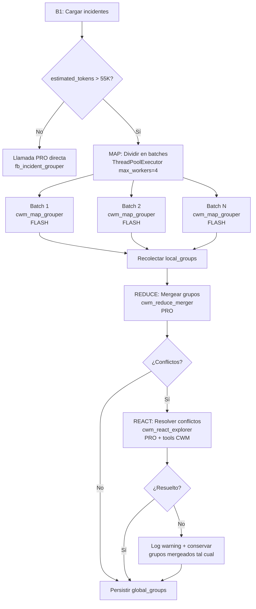

# 6 — ContextWindowManager: Plan de Integración en el Backend

> **Estado**: Planificación — NO implementar aún.
> **Fecha**: 2026-06-21
> **Dependencias**: `backend/app/agents/tools/context_window.py` (ya existe, esqueleto con stubs)

---

## PARTE 1: Mapeo de Recursos Existentes

### 1.1 ToolRegistry (`backend/app/agents/tool_registry.py`)

**¿Cómo se registran tools?**
- **Decorador `@tool(name, description, parameters)`**: anexa `fn._tool_meta` a la función.
- **`registry.register(fn, name, description, parameters)`**: registro manual.
- **`registry.register_from_module(module)`**: auto-descubre todas las funciones decoradas con `@tool` en un módulo.

**¿Qué necesitamos para registrar las 5 tools del CWM?**

Las 5 tools YA están decoradas con `@tool` en `context_window.py`:
| Tool | Línea | Estado |
|------|-------|--------|
| `expand_incident` | L383 | Decorada ✅ |
| `search_related_segments` | L411 | Decorada ✅ |
| `get_document_context` | L451 | Decorada ✅ |
| `estimate_batch_tokens` | L482 | Decorada ✅ |
| `batch_map_reduce` | L518 | Decorada ✅ |

**Falta**: El registro efectivo en el `ToolRegistry`. Hay que añadir en el `__init__.py` de tools o en el punto de entrada del agente:

```python
from app.agents.tools import context_window as cwm
registry.register_from_module(cwm)  # registra las 5 automáticamente
```

**Problema detectado**: Las funciones `expand_incident`, `search_related_segments`, etc. en `context_window.py` (L396–558) son wrappers que instancian `ContextWindowManager()` cada vez. Esto es correcto para el patrón stateless del ToolRegistry, pero **los métodos de la clase `ContextWindowManager` (L41–364) están vacíos** (`...` en L125, L182, L239, L287, L364). Hay que implementarlos ANTES de poder integrar.

### 1.2 SelfRefinementLoop (`backend/app/agents/self_refiner.py`)

**¿Podemos adaptarlo para el ciclo Map→Reduce→ReAct?**

| Fase | ¿SelfRefinementLoop sirve? | Alternativa |
|------|---------------------------|-------------|
| **Map** | ❌ No. Map es paralelo, no iterativo. | `ThreadPoolExecutor` + `llm.run_agent()` directo. |
| **Reduce** | ✅ Sí. Reduce puede ser iterativo: merge batch results → critic → refine → converge. | Subclasificar `SelfRefinementLoop` con `generate_prompt_id="cwm_reduce_merger"` y `critic_prompt_id="cwm_reduce_critic"`. |
| **ReAct** | ❌ No. ReAct requiere tools, no críticas. | `ReactRunner` es la base correcta (ver §1.5). |

**Conclusión**: `SelfRefinementLoop` es reutilizable para la fase REDUCE cuando hay conflictos que requieren refinamiento iterativo. NO sirve para MAP ni para ReAct.

**Requisito previo**: Crear los archivos de prompt `cwm_reduce_merger.md` y `cwm_reduce_critic.md` en `/app/prompts/agents/`.

### 1.3 LLMClient (`workers/heavy/llm_client.py`)

**¿Soporta llamadas paralelas (ThreadPoolExecutor)?**

- **`llm_client.py` NO tiene ThreadPoolExecutor incorporado.** El cliente es síncrono (`def run_agent(...) -> dict`).
- **`_call_llm` sí es thread-safe**: cada llamada crea su propio request HTTP a Together.ai. No comparte estado mutable entre llamadas.
- **Ya se usa `ThreadPoolExecutor` externamente** en el proyecto:
  - `workers/fast/tasks.py::punctuate_text` (L517–526): `ThreadPoolExecutor(max_workers=4)` para paralelizar bloques de texto.
  - `backend/app/agents/tools/search_tools.py::_run_async` (L25–30): executor para `asyncio.run()`.
  - `backend/app/agents/tools/compare_tools.py::_run_async` (L25–31): mismo patrón.

**¿Necesitamos adaptarlo?**

No se necesita modificar `LLMClient`. La paralelización se hace **por fuera**:

```python
from concurrent.futures import ThreadPoolExecutor, as_completed

with ThreadPoolExecutor(max_workers=4) as executor:
    futures = {
        executor.submit(llm.run_agent, "cwm_map_grouper",
                        variables={"batch_incidents_json": json.dumps(batch)}): i
        for i, batch in enumerate(batches)
    }
    for future in as_completed(futures):
        result = future.result()
        ...
```

**Precaución**: `max_workers=4` para no saturar el rate-limit de Together.ai (el cliente ya tiene backoff exponencial para 429). Si hay muchos batches, considerar semáforo o cola.

### 1.4 Comparator (`workers/heavy/comparator.py`)

**¿Cómo invocaría el CWM en `b1_group_incidents()`?**

El flujo actual (líneas 44–246):

```
1. Cargar incidentes de DB (L62-72)
2. Build incidents_text agrupado por documento (L78-133)
3. Log total_chars (L134-141)
4. Obtener project config (L143-145)
5. Llamada PRO: llm.run_agent("fb_incident_grouper", ...) (L148-155)
6. Persistir grupos (L157-246)
```

**Punto de decisión exacto**: Entre el paso 3 y el paso 5 — justo después de calcular `total_chars` (L141) y ANTES de `llm.run_agent("fb_incident_grouper", ...)` (L148).

```python
# ── NUEVO: Decisión de fragmentación ──
total_chars = len(incidents_text)
estimated_tokens = total_chars // 3  # ~3 chars/token en español

if estimated_tokens > 55000:  # umbral de fragmentación
    # → Map-Reduce con CWM
    result = b1_group_incidents_cwm(proyecto_id, rows, doc_blocks, inc_map, ...)
else:
    # → Comportamiento actual (una llamada PRO)
    response = llm.run_agent("fb_incident_grouper", variables={...})
```

### 1.5 ReactRunner (`backend/app/agents/react_runner.py`)

**¿Podemos usarlo como base para `cwm_react_explorer`?**

**SÍ, perfectamente.** `ReactRunner` es un motor ReAct genérico que:

- Soporta tools vía `ToolRegistry` (las 5 del CWM estarían disponibles).
- Soporta `native function calling` (Together.ai) y text parsing.
- Preserva `reasoning_content` para DeepSeek V4 Pro.
- Tiene el template method: `_build_system_prompt()` → `_step()` → `_should_stop()` → `_extract_result()`.

**Uso propuesto para `cwm_react_explorer`**:

```python
from app.agents.react_runner import ReactRunner
from app.agents.tool_registry import ToolRegistry

# 1. Crear registry con las 5 tools del CWM
registry = ToolRegistry()
registry.register_from_module(context_window_module)

# 2. Instanciar ReactRunner con system prompt específico para resolver conflictos
explorer = ReactRunner(
    agent_id="cwm_react_explorer",
    llm_client=llm,
    tool_registry=registry,
    max_iterations=5,
    use_native_fc=True,
)

# 3. Ejecutar
result = explorer.run(
    project_id=proyecto_id,
    role_description=(
        "Eres un agente explorador que resuelve conflictos entre grupos de incidentes "
        "generados por diferentes batches de Map-Reduce. Tienes acceso a tools para "
        "expandir incidentes, buscar segmentos relacionados, y obtener contexto narrativo. "
        "Tu objetivo: decidir si dos grupos con nombres similares miden el mismo fenómeno "
        "o deben permanecer separados."
    ),
)
```

**No requiere subclasificar**. Basta con instanciar `ReactRunner` con el `role_description` adecuado.

---

## PARTE 2: Puntos de Integración por Agente del Pipeline

### 2.1 B1 — Comparator (`comparator.py::b1_group_incidents`)

| Aspecto | Detalle |
|---------|---------|
| **Archivo** | `workers/heavy/comparator.py` |
| **Función** | `b1_group_incidents(proyecto_id, incremental=False)` |
| **Trigger** | `process_synthesis_agents_b` → paso 1 |
| **Modelo actual** | 1 llamada PRO (`fb_incident_grouper`), sin límite de incidentes |
| **Problema** | Con 200+ incidentes, el prompt puede exceder 60K tokens → truncamiento o error |
| **Punto de integración** | Línea 141 (después de `total_chars`), antes de L148 (`llm.run_agent`) |
| **Condición** | `estimated_tokens > 55000` → activar Map-Reduce |
| **Comportamiento sin CWM** | Una llamada PRO directa (sin cambios) |
| **Comportamiento con CWM** | Map (paralelo, FLASH) → Reduce (PRO) → ReAct (PRO si hay conflictos) |

**Pseudocódigo de la integración**:

```python
def b1_group_incidents(proyecto_id, incremental=False):
    # ... (carga de incidentes igual, líneas 51-141) ...

    total_chars = len(incidents_text)
    estimated_tokens = total_chars // 3

    if estimated_tokens > 55000:
        logger.info("B1: %d tokens estimados → activando Map-Reduce", estimated_tokens)
        return _b1_cwm_map_reduce(proyecto_id, rows, doc_blocks,
                                  inc_map, operational_question,
                                  object_of_study, grouped_note)
    else:
        # ── Comportamiento actual sin cambios ──
        response = llm.run_agent("fb_incident_grouper", variables={...})
        # ... (persistencia igual, líneas 157-246) ...
```

### 2.2 B2 — Labeler (`labeler.py::b2_label_groups`)

| Aspecto | Detalle |
|---------|---------|
| **Archivo** | `workers/heavy/labeler.py` |
| **Función** | `b2_label_groups(proyecto_id)` |
| **Trigger** | `process_synthesis_agents_b` → paso 2 |
| **Modelo actual** | Loop concepto-por-concepto: PRO genera → FLASH critica → repite (máx 3) |
| **Problema** | Con 50+ grupos, es linealmente costoso: `50 × (1 PRO + 1 FLASH × 3 iter) = 50 PRO + 150 FLASH` llamadas |
| **Punto de integración** | Antes del loop `for group in groups` (L163) |
| **Condición** | `len(groups) > 30` → activar batching |
| **Comportamiento con CWM** | Agrupar labels en batches de 10, etiquetar en paralelo, mergear resultados |

**Alternativa CWM — Label Batching**:

```python
def b2_label_groups_cwm(proyecto_id, groups, ...):
    # 1. Estimar tokens por grupo
    est = estimate_batch_tokens(groups, max_tokens=60000,
                                text_keys=["incidents"])

    if est["batches"] == 1:
        # Pocos grupos → comportamiento actual (loop normal)
        return _b2_label_sequential(groups)  # código actual

    # 2. MAP: dividir grupos en batches de ~10
    batches = split_into_batches(groups, 10)
    all_labels = []
    with ThreadPoolExecutor(max_workers=4) as executor:
        futures = [
            executor.submit(llm.run_agent, "fb_pattern_labeler",
                          variables={"groups_json": json.dumps(batch), ...})
            for batch in batches
        ]
        for f in as_completed(futures):
            all_labels.extend(f.result().get("proposed_labels", []))

    # 3. REDUCE: deduplicar labels (por nombre exacto)
    unique_labels = _dedup_labels_by_name(all_labels)

    # 4. CRITIC: validar labels mergeados (FLASH, una vez por label)
    # ... (usar fb_label_critic igual que ahora, pero con menos grupos)

    return unique_labels
```

**Nota**: El `SelfRefinementLoop` actual por grupo se conserva para batches pequeños. El CWM solo se activa cuando hay MUCHOS grupos.

### 2.3 B3 — Hypotheses (`agents_b.py::b3_generate_hypotheses`)

| Aspecto | Detalle |
|---------|---------|
| **Archivo** | `workers/heavy/agents_b.py` |
| **Función** | `b3_generate_hypotheses(proyecto_id, incident_groups_json=None)` |
| **Trigger** | `process_synthesis_agents_b` → paso 6 |
| **Modelo actual** | 1 llamada PRO (`fb_hypothesis_generator`) o agentic (`ReactRunner`) |
| **Problema** | Con 100+ categorías (códigos + labeled groups), el prompt `codes_text` puede ser enorme |
| **Punto de integración** | Línea 630–634 (después de construir `codes_text` y antes de llamar al LLM) |
| **Condición** | `len(all_codes) > 80` → activar fragmentación en batches de 30–40 |
| **Comportamiento con CWM** | MAP: generar hipótesis por batch de categorías → REDUCE: mergear hipótesis → REACT: resolver redundancias |

```python
def b3_generate_hypotheses(proyecto_id, incident_groups_json=None):
    # ... (carga igual, líneas 531-634) ...

    if len(all_codes) > 80:
        logger.info("B3: %d categorías → fragmentando en batches", len(all_codes))
        return _b3_cwm_map_reduce(proyecto_id, all_codes, pop_assumption,
                                  processes_text, hyp_text, ...)
    else:
        # ── Comportamiento actual sin cambios ──
        response = llm.run_agent("fb_hypothesis_generator", variables={...})
```

### 2.4 Saturation Loop — NO necesita CWM

| Aspecto | Detalle |
|---------|---------|
| **Archivo** | `workers/heavy/tasks.py::task_core_saturation_loop` y `workers/nlp/saturation.py::update_saturation` |
| **Modelo actual** | Iterativo por categoría × documento. Ya es incremental. |
| **Razón para NO integrar** | El loop de saturación ya procesa categoría por categoría. Cada iteración maneja UNA categoría contra sus segmentos asignados → el contexto es pequeño y manejable. No hay riesgo de saturación. |
| **Conclusión** | ❌ No integrar. El diseño actual es correcto para este caso. |

---

## PARTE 3: Flujo Map-Reduce-ReAct para B1

### 3.1 Diagrama de flujo



### 3.2 Pseudocódigo completo

```python
import json
from concurrent.futures import ThreadPoolExecutor, as_completed
from app.agents.tools.context_window import ContextWindowManager

# ═══════════════════════════════════════════════════════════════════════════
# Constantes de configuración
# ═══════════════════════════════════════════════════════════════════════════

FRAGMENTATION_THRESHOLD_TOKENS = 55000   # 55K tokens → fragmentar
MAX_TOKENS_PER_BATCH = 50000             # 50K tokens por batch (margen para schema + system prompt)
MAX_PARALLEL_WORKERS = 4                 # No saturar rate-limit de Together.ai
ITEMS_PER_BATCH_MAX = 80                 # Máximo de incidentes por batch (~200 tokens c/u)

# ═══════════════════════════════════════════════════════════════════════════
# Función principal con CWM
# ═══════════════════════════════════════════════════════════════════════════

def _b1_cwm_map_reduce(
    proyecto_id: str,
    rows: list,          # Resultados SQL de extracted_incidents
    doc_blocks: list,    # Lista de (doc_name, [incidents])
    inc_map: dict,       # short_id → UUID
    operational_question: str,
    object_of_study: str,
    grouped_note: str,
) -> dict:
    """
    B1 con Map-Reduce-ReAct para proyectos con 200+ incidentes.

    Flujo:
      1. MAP:  Dividir incidentes en batches, procesar en paralelo con FLASH.
      2. REDUCE: Mergear grupos locales en grupos globales con PRO.
      3. REACT: Si hay conflictos (grupos duplicados/solapados), resolver con PRO + tools.
    """

    # ── 1. Estimar batches ─────────────────────────────────────────────
    manager = ContextWindowManager()
    # Convertir rows a dicts para estimate_batch_tokens
    items = [
        {"id": f"inc_{i}", "description": r[1] or "", "doc": r[3] or "unknown"}
        for i, r in enumerate(rows, 1)
    ]
    est = manager.estimate_batch_tokens(
        items=items,
        max_tokens=MAX_TOKENS_PER_BATCH,
        text_keys=["description"],
    )

    batches = est["batches"]
    items_per_batch = est["items_per_batch"]
    logger.info(
        "B1 CWM: %d incidentes → %d batches de ~%d items c/u (%.0f%% utilización)",
        est["total_items"], batches, items_per_batch, est["utilization_pct"],
    )

    # ── 2. Dividir en batches preservando agrupación por documento ─────
    # Estrategia: aplanar doc_blocks a lista plana, luego chunk.
    # Mejor: distribuir docs enteros para no cortar un doc a la mitad.
    flat_items = []
    for doc_name, incidents in doc_blocks:
        for inc in incidents:
            flat_items.append({**inc, "_doc": doc_name})

    batch_chunks = _split_preserving_docs(flat_items, items_per_batch)

    # ── 3. MAP: Procesar batches en paralelo (FLASH) ───────────────────
    local_results = []
    with ThreadPoolExecutor(max_workers=MAX_PARALLEL_WORKERS) as executor:
        futures = {}
        for i, batch in enumerate(batch_chunks):
            # Reconstruir texto agrupado por documento para este batch
            batch_text = _build_incidents_text(batch, grouped_note if i == 0 else "")
            future = executor.submit(
                llm.run_agent,
                "cwm_map_grouper",           # ← NUEVO prompt: mismo schema que fb_incident_grouper
                variables={
                    "incidents_json": batch_text,
                    "operational_question": operational_question or "(not yet generated)",
                    "object_of_study": object_of_study,
                },
                temperature=0.2,             # FLASH: baja temperatura para clasificación
            )
            futures[future] = i

        for future in as_completed(futures):
            batch_idx = futures[future]
            try:
                result = future.result(timeout=120)
                local_groups = result.get("groups", [])
                # Anotar batch de origen para trazabilidad
                for g in local_groups:
                    g["_batch_source"] = batch_idx
                local_results.append(local_groups)
                logger.info(
                    "B1 CWM MAP batch %d/%d: %d grupos locales",
                    batch_idx + 1, batches, len(local_groups),
                )
            except Exception as e:
                logger.error("B1 CWM MAP batch %d failed: %s", batch_idx, e)

    if not local_results:
        logger.error("B1 CWM: Todos los batches MAP fallaron")
        return {"groups_created": 0, "incidents_grouped": 0}

    # ── 4. REDUCE: Mergear grupos locales → globales (PRO) ─────────────
    all_local_groups = []
    for lr in local_results:
        all_local_groups.extend(lr)

    logger.info(
        "B1 CWM REDUCE: mergeando %d grupos locales de %d batches",
        len(all_local_groups), len(local_results),
    )

    merge_response = llm.run_agent(
        "cwm_reduce_merger",                 # ← NUEVO prompt
        variables={
            "all_local_groups_json": json.dumps(all_local_groups, ensure_ascii=False),
            "operational_question": operational_question or "(not yet generated)",
            "object_of_study": object_of_study,
        },
    )

    global_groups = merge_response.get("global_groups", [])
    conflicts = merge_response.get("conflicts", [])

    # ── 5. REACT: Resolver conflictos si los hay (PRO + tools) ────────
    if conflicts:
        logger.info(
            "B1 CWM REACT: %d conflictos detectados entre grupos mergeados",
            len(conflicts),
        )
        from app.agents.react_runner import ReactRunner
        from app.agents.tool_registry import ToolRegistry
        from app.agents.tools import context_window as cwm_module

        # Crear registry con las 5 tools del CWM
        registry = ToolRegistry()
        registry.register_from_module(cwm_module)

        explorer = ReactRunner(
            agent_id="cwm_react_explorer",
            llm_client=llm,
            tool_registry=registry,
            max_iterations=5,
            timeout_seconds=180.0,
            use_native_fc=True,
        )

        react_result = explorer.run(
            project_id=proyecto_id,
            role_description=(
                "Eres un agente que resuelve conflictos entre grupos de incidentes "
                "generados por diferentes batches de Map-Reduce. Recibes pares de grupos "
                "que podrían medir el mismo fenómeno. Tu tarea:\n"
                "1. Para cada par conflictivo, usa expand_incident() para ver los "
                "   incidentes en su contexto narrativo completo.\n"
                "2. Si es necesario, usa search_related_segments() para buscar patrones "
                "   transversales en el corpus.\n"
                "3. Decide si los dos grupos deben mergearse (mismo fenómeno) o "
                "   permanecer separados (fenómenos distintos con nombres similares).\n"
                "4. Devuelve la lista final de grupos resueltos."
            ),
            conflicting_groups_json=json.dumps(conflicts, ensure_ascii=False),
            global_groups_json=json.dumps(global_groups, ensure_ascii=False),
            operational_question=operational_question,
        )

        if react_result.success:
            resolution = react_result.data
            # Aplicar resolución: mergear los grupos que el agente decidió unir
            global_groups = _apply_react_resolution(global_groups, conflicts, resolution)
            logger.info(
                "B1 CWM REACT: resolución completada en %d iteraciones, %d tokens",
                react_result.iterations, react_result.total_tokens,
            )
        else:
            logger.warning(
                "B1 CWM REACT: falló la resolución (%s). Usando merge sin resolver.",
                react_result.error,
            )

    # ── 6. Persistir (mismo código que el original, líneas 169-246) ───
    return _persist_groups(session, proyecto_id, global_groups, inc_map)


# ═══════════════════════════════════════════════════════════════════════════
# Helpers
# ═══════════════════════════════════════════════════════════════════════════

def _split_preserving_docs(items: list, max_per_batch: int) -> list[list]:
    """Divide items en batches SIN cortar documentos a la mitad."""
    batches = []
    current_batch = []
    current_doc = None

    for item in items:
        doc = item.get("_doc", "")
        if doc != current_doc:
            current_doc = doc
        current_batch.append(item)
        if len(current_batch) >= max_per_batch:
            batches.append(current_batch)
            current_batch = []
            current_doc = None

    if current_batch:
        batches.append(current_batch)

    return batches


def _build_incidents_text(batch: list[dict], prefix: str = "") -> str:
    """Reconstruye el texto de incidentes agrupado por documento para un batch."""
    text = prefix
    # Re-agrupar por documento
    by_doc: dict[str, list] = {}
    for inc in batch:
        doc = inc.get("_doc", "unknown")
        by_doc.setdefault(doc, []).append(inc)

    for doc_name, incidents in by_doc.items():
        text += f"\n=== Document: {doc_name} ({len(incidents)} incidents) ===\n"
        for inc in incidents:
            text += f"[{inc['id']}] {inc['description']}\n"

    return text


def _apply_react_resolution(global_groups, conflicts, resolution):
    """Aplica las decisiones de merge/split del agente ReAct."""
    merges = resolution.get("merges", [])  # Pares de índices a mergear
    # ... implementación específica según el schema de resolución ...
    return global_groups
```

### 3.3 Nuevos prompts requeridos

| Prompt ID | Archivo | Tier | Propósito |
|-----------|---------|------|-----------|
| `cwm_map_grouper` | `/app/prompts/agents/cwm_map_grouper.md` | FLASH | Agrupar incidentes en un batch (mismo schema que `fb_incident_grouper`, pero para batches pequeños) |
| `cwm_reduce_merger` | `/app/prompts/agents/cwm_reduce_merger.md` | PRO | Mergear grupos locales de N batches en grupos globales |
| `cwm_reduce_critic` | `/app/prompts/agents/cwm_reduce_critic.md` | FLASH | (Opcional) Criticar el merge para SelfRefinementLoop |

El `cwm_react_explorer` NO necesita un prompt file separado — usa el `ReactRunner` con `role_description` inyectado en runtime.

---

## PARTE 4: Separación de Tareas Simples → FLASH

### 4.1 Matriz de delegación FLASH vs PRO

| Función / Tool | ¿Necesita LLM? | Tier | Razón |
|----------------|:---:|------|-------|
| `estimate_batch_tokens` | ❌ | — | Matemática pura: `len(text) // 3` por item. Es un cálculo determinista que no requiere IA. |
| `expand_incident` | ❌ | — | SQL lookup: buscar incidente → segmento → segmentos adyacentes. JOIN y ORDER BY posicion. |
| `search_related_segments` | ❌ | — | Embedding search: TEI cosine similarity. Sin LLM. |
| `get_document_context` | ❌ | — | SQL lookup: igual que `expand_incident` pero partiendo de documento+segmento. |
| `batch_map_reduce` (orquestador) | ❌ | — | Lógica de partición: estimar, dividir, despachar, mergear resultados. |
| `cwm_map_grouper` | ✅ | **FLASH** | Clasificación estructurada por batch pequeño (~80 incidentes). Tarea de matching, no de síntesis creativa. Nemotron es suficiente y 4× más barato. |
| `cwm_reduce_merger` | ✅ | **PRO** | Síntesis de alto nivel: fusionar grupos de distintos batches requiere entender matices semánticos y detectar solapamientos parciales. DeepSeek V4 Pro es necesario. |
| `cwm_reduce_critic` | ✅ | **FLASH** | Evaluación binaria: ¿este merge es correcto? Tarea de critic, no de generación. Nemotron basta. |
| `cwm_react_explorer` | ✅ | **PRO** | Razonamiento multi-step con tools: decidir si mergear o separar grupos requiere explorar contexto narrativo, buscar evidencia transversal, y tomar decisiones fundadas. DeepSeek V4 Pro es necesario. |

### 4.2 Costos estimados por estrategia

**Escenario: 500 incidentes, 50 documentos**

| Estrategia | Llamadas PRO | Llamadas FLASH | Costo estimado |
|------------|:----------:|:------------:|----------------|
| **Actual** (1 llamada PRO) | 1 | 0 | $0.15 |
| **Actual** (si cupiera, pero NO cabe → error) | 1 (falla) | 0 | $0.00 + reintentos |
| **CWM Map-Reduce sin ReAct** | 1 (reduce) | 6 (map) | $0.15 + $0.02 = **$0.17** |
| **CWM Map-Reduce-ReAct** (con conflictos) | 2 (reduce + react) | 6 (map) | $0.30 + $0.02 = **$0.32** |

> Precios Together.ai aprox: DeepSeek V4 Pro ~$1.25/M tokens, Nemotron Flash ~$0.13/M tokens.

### 4.3 Principio de delegación

```
¿La tarea requiere CREAR conocimiento nuevo?
  ├── SÍ → PRO (DeepSeek V4 Pro)
  └── NO → ¿Requiere EVALUAR o CLASIFICAR?
            ├── SÍ → FLASH (Nemotron)
            └── NO → Sin LLM (cálculo directo)
```

---

## PARTE 5: Plan de Implementación (Secuencia)

### Fase A: Implementar stubs de ContextWindowManager (1–2 horas)

Los métodos de `ContextWindowManager` están vacíos (`...`). Implementar:

1. `expand_incident()` — SQL: buscar incidente → segmento → vecinos
2. `search_related_segments()` — TEI embeddings + cosine similarity
3. `get_document_context()` — SQL: segmento foco + radio
4. `estimate_batch_tokens()` — `len(text) // 3` por item
5. `batch_map_reduce()` — orquestador: estimar → particionar → map → reduce

### Fase B: Crear prompts para Map-Reduce (30 min)

1. `cwm_map_grouper.md` — adaptar `fb_incident_grouper.md` para batches
2. `cwm_reduce_merger.md` — prompt de merge de grupos

### Fase C: Integrar B1 Comparator (1 hora)

1. Añadir `_b1_cwm_map_reduce()` en `comparator.py`
2. Insertar punto de decisión en `b1_group_incidents()` (L141)
3. Probar con proyecto pequeño (< 50 incidentes) → sin CWM
4. Probar con proyecto grande simulado → con CWM

### Fase D: Integrar B2 Labeler (1 hora, opcional)

1. Añadir `_b2_cwm_batch_labels()` en `labeler.py`
2. Insertar punto de decisión antes del loop (L163)

### Fase E: Integrar B3 Hypotheses (30 min, opcional)

1. Añadir `_b3_cwm_map_reduce()` en `agents_b.py`
2. Insertar punto de decisión en `b3_generate_hypotheses()` (L634)

### Fase F: Validación y monitoreo

1. Logging: cada fase del CWM loguea `batches`, `tokens`, `duración`
2. Métricas: `cwm_fragmentations_total`, `cwm_map_duration_seconds`, `cwm_conflicts_resolved`
3. Rollback: si `estimated_tokens <= 55000`, el comportamiento es IDÉNTICO al actual

---

## PARTE 6: Riesgos y Mitigaciones

| Riesgo | Probabilidad | Impacto | Mitigación |
|--------|:---:|:---:|-----------|
| **Rate-limit de Together.ai** con 4 workers paralelos | Media | Medio | Backoff exponencial ya existe en `_call_llm`. Limitar `max_workers=3` si hay 429 frecuentes. |
| **Grupos inconsistentes entre batches** → conflictos no resueltos | Alta | Medio | El ReAct explorer puede fallar. Fallback: conservar merge del reducer tal cual + log warning. |
| **Pérdida de reasoning_content entre fases** | Baja | Alto | `_build_assistant_message()` preserva `reasoning_content`. El `ReactRunner` ya lo hace. |
| **Deadlock en ThreadPoolExecutor** si una llamada cuelga | Baja | Alto | `future.result(timeout=120)` en MAP. Si timeout → log + continuar con batches exitosos. |
| **Costo inesperado** si el umbral de fragmentación es muy bajo | Baja | Medio | Umbral de 55K tokens es conservador (~65% del contexto de 80K de DeepSeek). Solo se activa con proyectos grandes. |
| **B2 batching rompe el SelfRefinement** por grupo | Media | Medio | El batching de B2 es opcional y solo se activa con >30 grupos. El critic por grupo se conserva dentro de cada batch. |

---

## PARTE 7: Checklist Pre-Implementación

- [ ] `ContextWindowManager` tiene los 5 métodos implementados (no stubs)
- [ ] Las 5 tools están registradas en `ToolRegistry` (vía `register_from_module`)
- [ ] `cwm_map_grouper.md` y `cwm_reduce_merger.md` existen en `/app/prompts/agents/`
- [ ] `b1_group_incidents()` tiene el punto de decisión de fragmentación
- [ ] `_b1_cwm_map_reduce()` maneja graceful degradation si algún batch falla
- [ ] El `ReactRunner` para `cwm_react_explorer` tiene acceso al `ToolRegistry` con las 5 tools
- [ ] Logging detallado: batches, tokens, duración, conflictos
- [ ] Prueba con proyecto pequeño (< 50 incidentes): mismo output que sin CWM
- [ ] Prueba con proyecto grande simulado: Map-Reduce se activa, output válido
- [ ] No hay regresión en el flujo normal (sin CWM) — el threshold es conservador

---

## Referencias

- `backend/app/agents/tools/context_window.py` — Implementación actual (stubs)
- `backend/app/agents/tool_registry.py` — Mecanismo de registro de tools
- `backend/app/agents/self_refiner.py` — Patrón Generate→Critic→Refine
- `backend/app/agents/react_runner.py` — Motor ReAct genérico
- `workers/heavy/comparator.py` — B1: Incident Grouper
- `workers/heavy/labeler.py` — B2: Pattern Labeler
- `workers/heavy/agents_b.py` — B3: Hypothesis Generator
- `workers/heavy/llm_client.py` — Cliente LLM síncrono
- `Documentacion/cgt_alignment/6-ContextWindowManager.md` — Diseño original (v1)
- `Documentacion/cgt_alignment/6-ContextWindowManager-Design.md` — Diseño detallado (v2)
