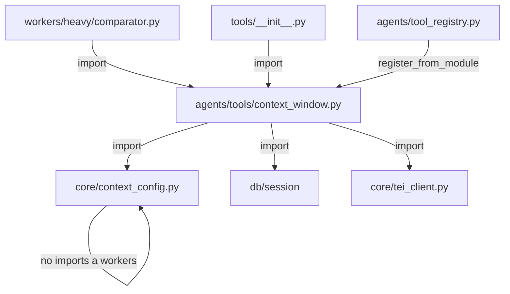

# 6 — ContextWindowManager: Análisis de Spillovers

> **Fecha:** 2026-06-21
> **Propósito:** Identificar todos los archivos y sistemas afectados por la implementación de los 3 nuevos agentes CWM (`cwm_map_grouper`, `cwm_reduce_merger`, `cwm_react_explorer`), el `ContextWindowManager` con sus 5 tools, y el patrón `batch_map_reduce`.

---

## Resumen Ejecutivo

| Componente | Archivo(s) afectado(s) | Tipo de cambio | Riesgo |
|-----------|----------------------|---------------|--------|
| Prompt registry | `prompts/__init__.py` | **CERO** — auto-descubrimiento | Ninguno |
| Prompt loader | `prompts/loader.py` | **CERO** — auto-descubrimiento | Ninguno |
| Tier mapping | `core/llm_config.py` | **REQUERIDO** — 3 entradas en `PROMPT_TIER_MAP` | Alto (KeyError si falta) |
| Tool registry | `agents/tool_registry.py` | **REQUERIDO** — registrar 5 tools | Alto (tools no encontradas) |
| CWM tools | `agents/tools/context_window.py` | **NUEVO ARCHIVO** | Alto (tools de exploración) |
| Tools `__init__` | `agents/tools/__init__.py` | **REQUERIDO** — exportar CWM | Medio |
| `batch_executions` | `models/exec_log.py` | **NUEVO MODELO** — `BatchExecution` | Medio (migración + FKs) |
| `context_config.py` | `core/context_config.py` | **CERO** — ya existe, sin imports circulares | Ninguno |
| Thread safety | `workers/` (futuro) | **REQUERIDO** — `scoped_session` | Alto (race conditions) |
| B1 integration | `workers/heavy/comparator.py` | **REQUERIDO** — `b1_group_incidents()` | Alto (nueva lógica) |

---

## 1. Prompt Registry — Auto-descubrimiento

### 1.1 ¿El `prompt_loader` los cargará automáticamente?

**SÍ.** Ambos sistemas de carga de prompts usan discovery automático:

#### `PROMPT_REGISTRY` (`prompts/__init__.py`, línea 234)

```python
PROMPT_REGISTRY: dict[str, PromptTemplate] = _discover_prompts()
```

La función `_discover_prompts()` (línea 219) hace `PROMPTS_DIR.rglob("*.md")`, que recorre recursivamente todos los `.md` dentro de `prompts/`. Los nuevos archivos `prompt.md` en `agents/cwm_map_grouper/`, `agents/cwm_reduce_merger/`, y `agents/cwm_react_explorer/` serán descubiertos automáticamente en el próximo reinicio del backend.

El `prompt_id` se extrae de `metadata.get("agent", path.stem)` (línea 204), por lo que el valor será `cwm_map_grouper`, `cwm_reduce_merger`, `cwm_react_explorer` — exactamente lo que necesitamos.

#### `PromptLoader` (`prompts/loader.py`, línea 50)

```python
prompt_path = self.base / "agents" / agent_id / "prompt.md"
```

También auto-descubre basado en path. Si el directorio `agents/{agent_id}/` existe con un `prompt.md`, lo carga.

**Conclusión: CERO cambios necesarios en el sistema de prompts. El auto-descubrimiento funciona out-of-the-box.**

### 1.2 ¿Hay que registrarlos manualmente?

**NO para el prompt loading.** Pero **SÍ para el tier mapping** (ver §2).

---

## 2. Tier Mapping en `llm_config.py`

### 2.1 El problema

`get_model_for_prompt(prompt_id)` en `core/llm_config.py` (línea 128) busca el prompt_id en `PROMPT_TIER_MAP`. Si no existe, lanza `KeyError`:

```python
def get_model_for_prompt(prompt_id: str) -> ModelEndpoint:
    tier = PROMPT_TIER_MAP.get(prompt_id)
    if tier is None:
        raise KeyError(f"Unknown prompt_id: {prompt_id}. Add it to PROMPT_TIER_MAP.")
```

### 2.2 Cambio requerido

Agregar las 3 entradas en `PROMPT_TIER_MAP` (archivo `backend/app/core/llm_config.py`, aproximadamente línea 85):

```python
PROMPT_TIER_MAP: dict[str, str] = {
    # ... existing entries ...
    
    # === CWM (Context Window Manager) ===
    "cwm_map_grouper": "flash",       # Nemotron, volumen alto, batches pequeños
    "cwm_reduce_merger": "pro",       # DeepSeek V4 Pro, razonamiento multi-párrafo
    "cwm_react_explorer": "pro",      # DeepSeek V4 Pro, ReAct con tools
}
```

**Nota importante:** El `cwm_react_explorer` usa `ReActRunner` (que invoca `self.llm.chat()` directamente, no `invoke_prompt()`). Si `ReActRunner` no usa `get_model_for_prompt()`, este mapping solo es necesario si se llama `invoke_prompt()`. De todas formas, agregarlo es buena práctica para consistencia.

### 2.3 Verificación

```python
# Al iniciar, verificar que todos los prompts en PROMPT_REGISTRY tengan tier mapping
for prompt_id in PROMPT_REGISTRY:
    if prompt_id not in PROMPT_TIER_MAP:
        logger.warning(f"Prompt '{prompt_id}' not in PROMPT_TIER_MAP — will fail at runtime")
```

---

## 3. ToolRegistry — Las 5 Tools del CWM

### 3.1 Nombres esperados por `cwm_react_explorer`

El prompt de `cwm_react_explorer` referencia exactamente 3 tools:

| Tool name | Propósito | Parámetros |
|-----------|-----------|------------|
| `expand_incident` | Expandir incidente a contexto narrativo | `incident_id`, `context_window` |
| `search_related_segments` | Buscar segmentos semánticamente similares | `query_text`, `top_k` |
| `get_document_context` | Recuperar contexto alrededor de un segmento | `documento_id`, `focus_segmento_id`, `radius` |

**Las tools DEBEN registrarse con estos nombres exactos** en el `ToolRegistry`. Si el LLM intenta llamar `expand_incident` y la tool está registrada como `expandIncident` o `cwm_expand_incident`, fallará con `"Tool 'expand_incident' not found"`.

### 3.2 Las otras 2 tools (algorítmicas)

| Tool name | Propósito | Expuesta al LLM |
|-----------|-----------|-----------------|
| `estimate_batch_tokens` | Estimar si se necesita fragmentación | **No directamente** — usada por el orchestrator |
| `batch_map_reduce` | Ejecutar Map-Reduce completo | **No directamente** — usada por el orchestrator |

Estas dos son para uso interno del `batch_map_reduce` flow. No necesitan exponerse al LLM, pero sí registrarse en `ToolRegistry` para consistencia.

### 3.3 Registro requerido

En `backend/app/agents/tools/context_window.py` (nuevo archivo):

```python
from app.agents.tool_registry import tool

@tool(
    name="expand_incident",
    description="Expande un incidente a su contexto narrativo completo en el documento original, mostrando los segmentos antes y después del incidente focal.",
    parameters={
        "incident_id": "UUID del incidente (ExtractedIncident) a expandir",
        "context_window": "Número de segmentos antes y después del incidente focal (default: 3)",
    },
)
def expand_incident(incident_id: str, context_window: int = 3) -> dict:
    ...

@tool(
    name="search_related_segments",
    description="Busca en el corpus segmentos semánticamente similares a un texto de consulta. Útil para verificar si un patrón aparece en otras partes del corpus.",
    parameters={
        "query_text": "Texto de búsqueda semántica (frase descriptiva del patrón a buscar)",
        "top_k": "Número máximo de resultados a devolver (default: 5)",
    },
)
def search_related_segments(query_text: str, top_k: int = 5) -> dict:
    ...

@tool(
    name="get_document_context",
    description="Recupera el contexto narrativo alrededor de un segmento específico en su documento original, mostrando N segmentos antes y después.",
    parameters={
        "documento_id": "UUID del documento",
        "focus_segmento_id": "UUID del segmento focal",
        "radius": "Número de segmentos antes y después del segmento focal (default: 5)",
    },
)
def get_document_context(documento_id: str, focus_segmento_id: str, radius: int = 5) -> dict:
    ...

@tool(
    name="estimate_batch_tokens",
    description="Estima cuántos tokens ocuparía un conjunto de items y determina si es necesario fragmentar en batches.",
    parameters={
        "items_json": "JSON string con el array de items a estimar",
    },
)
def estimate_batch_tokens(items_json: str) -> dict:
    ...

@tool(
    name="batch_map_reduce",
    description="Ejecuta el flujo completo de Map-Reduce: estima, fragmenta, mapea en paralelo, reduce, y opcionalmente ejecuta ReAct para resolver divergencias.",
    parameters={
        "items_json": "JSON string con el array de items a procesar",
        "map_prompt_template": "Nombre del prompt a usar en la fase MAP",
        "reduce_prompt_template": "Nombre del prompt a usar en la fase REDUCE",
        "operational_question": "Pregunta operacional del estudio",
        "object_of_study": "Objeto de estudio",
    },
)
def batch_map_reduce(items_json: str, map_prompt_template: str, reduce_prompt_template: str, operational_question: str, object_of_study: str) -> dict:
    ...
```

Y en `backend/app/agents/tools/__init__.py`:

```python
from app.agents.tools.context_window import (
    ContextWindowManager,
    expand_incident,
    search_related_segments,
    get_document_context,
    estimate_batch_tokens,
    batch_map_reduce,
)

__all__ = [
    # ... existing ...
    "ContextWindowManager",
    "expand_incident",
    "search_related_segments",
    "get_document_context",
    "estimate_batch_tokens",
    "batch_map_reduce",
]
```

---

## 4. Modelo `BatchExecution` y Migración

### 4.1 Estado actual

El modelo `RegistroEjecucionAgente` (`models/exec_log.py`) existe pero **no hay un modelo `BatchExecution`**. El pseudocódigo de `b1_group_incidents()` lo referencia como:

```python
batch_run = BatchExecution(project_id=project_id, agent_id="b1_group_incidents", ...)
```

### 4.2 Modelo requerido

Agregar a `backend/app/models/exec_log.py`:

```python
class BatchExecution(Base, TimestampMixin):
    """Log de ejecuciones batch (Map-Reduce) con trazabilidad completa."""

    __tablename__ = "batch_executions"

    id: Mapped[uuid.UUID] = mapped_column(primary_key=True, default=uuid.uuid4)
    project_id: Mapped[uuid.UUID] = mapped_column(
        ForeignKey("proyectos.id", ondelete="CASCADE"), index=True
    )
    agent_id: Mapped[str] = mapped_column(String(100))  # "b1_group_incidents"

    status: Mapped[str] = mapped_column(
        String(20), default="running"
    )  # running, completed, failed
    phase: Mapped[str] = mapped_column(
        String(20), nullable=True
    )  # map, reduce, react

    total_items: Mapped[int] = mapped_column(Integer, default=0)
    batches_count: Mapped[int] = mapped_column(Integer, default=1)
    items_per_batch: Mapped[int] = mapped_column(Integer, default=0)

    # Resultados
    map_results: Mapped[dict] = mapped_column(JSONB, default=dict)
    reduce_result: Mapped[dict] = mapped_column(JSONB, default=dict)
    react_result: Mapped[dict] = mapped_column(JSONB, nullable=True)

    error: Mapped[str] = mapped_column(String(500), nullable=True)
    started_at: Mapped[datetime] = mapped_column(DateTime(timezone=True), nullable=True)
    completed_at: Mapped[datetime] = mapped_column(DateTime(timezone=True), nullable=True)
```

### 4.3 Migración Alembic

```bash
cd backend
alembic revision --autogenerate -m "add_batch_executions_table"
alembic upgrade head
```

### 4.4 FKs correctas

- `project_id` → `proyectos.id` con `ON DELETE CASCADE`
- No necesita FK a `ejecuciones_agentes` porque un `BatchExecution` contiene múltiples llamadas a agentes (una por batch en MAP, una en REDUCE, opcional en REACT)

---

## 5. `context_config.py` — Sin Imports Circulares

### 5.1 Verificación

`context_config.py` (ya existente) **no importa nada de `workers/`**. Solo usa:
- `pydantic.Field`
- `pydantic_settings.BaseSettings`

Es completamente autocontenido. El `ContextWindowManager` (nuevo) que use `context_config` deberá importarlo:

```python
from app.core.context_config import context_config
```

Esto es un import unidireccional limpio: `context_window.py` → `context_config.py`. No hay ciclo.

### 5.2 Diagrama de imports



Sin ciclos.

---

## 6. Thread Safety: `ThreadPoolExecutor` + SQLAlchemy

### 6.1 El problema

El pseudocódigo de `b1_group_incidents()` usa `ThreadPoolExecutor`:

```python
with ThreadPoolExecutor(max_workers=4) as executor:
    futures = {executor.submit(llm.run_agent, "cwm_map_grouper", ...): i
               for i, batch in enumerate(batches)}
    local_results = [f.result() for f in futures]
```

**Las sesiones de SQLAlchemy NO son thread-safe.** Si `llm.run_agent()` internamente usa una `Session` compartida, habrá race conditions: dos threads intentando hacer `session.execute()` simultáneamente → errores de concurrencia, datos corruptos, o deadlocks.

### 6.2 Solución: `scoped_session`

```python
from sqlalchemy.orm import scoped_session, sessionmaker

# En db/session.py (o donde se cree la engine)
SessionFactory = sessionmaker(bind=engine)
ScopedSession = scoped_session(SessionFactory)

# Cada thread obtiene su propia sesión
def _process_batch(batch, agent_id, **kwargs):
    """Wrapper que ejecuta un batch en su propio thread con sesión aislada."""
    session = ScopedSession()
    try:
        llm = TogetherLLM()
        result = llm.invoke_prompt(
            template=get_prompt(agent_id),
            language=kwargs.get("language", "en"),
            batch_incidents_json=json.dumps(batch),
            operational_question=kwargs["operational_question"],
            object_of_study=kwargs["object_of_study"],
        )
        session.commit()
        return result
    except Exception as e:
        session.rollback()
        raise
    finally:
        ScopedSession.remove()  # CRÍTICO: limpia la sesión del thread
```

### 6.3 Alternativa: `ProcessPoolExecutor`

Si las tools del CWM (`expand_incident`, etc.) hacen queries complejos que lockean la DB, considerar `ProcessPoolExecutor` en vez de `ThreadPoolExecutor`. Pero SQLAlchemy sessions no se comparten entre procesos, así que cada proceso necesitaría su propio engine. Más complejo pero más seguro.

### 6.4 Alternativa preferida: Async + `asyncio.gather()`

Si el `TogetherLLM` soporta async (`chat_stream` ya existe), usar `asyncio.gather()`:

```python
async def b1_group_incidents_async(project_id, incidents, operational_question, object_of_study):
    cwm = ContextWindowManager(async_session)
    est = cwm.estimate_batch_tokens(incidents)

    if not est["needs_fragmentation"]:
        return await llm.invoke_prompt_async(get_prompt("fb_incident_grouper"), ...)

    batches = split_into_batches(incidents, est["batches"])
    
    # Async map — sin threads, sin problemas de sesión
    tasks = [llm.invoke_prompt_async(get_prompt("cwm_map_grouper"), ...)
             for batch in batches]
    local_results = await asyncio.gather(*tasks)
    
    # Reduce y ReAct también async
    ...
```

**Recomendación:** Usar `asyncio.gather()` si `TogetherLLM` ya tiene soporte async (tiene `chat_stream` async, falta `chat_async`). Es más limpio, evita problemas de threads, y escala mejor.

---

## 7. Herramientas de Exploración — Dependencias

### 7.1 `expand_incident`

**Dependencias:**
- `incidentes` table (ExtractedIncident) — para obtener `segmento_id`, `documento_id`
- `segmentos` table — para obtener el segmento focal y N segmentos antes/después
- `documentos` table — para obtener `nombre`

**Query SQL necesario:**
```sql
-- 1. Obtener incidente
SELECT segmento_id, documento_id, jot_text 
FROM extracted_incidents WHERE id = :incident_id;

-- 2. Obtener segmento focal y vecinos
SELECT id, posicion, texto, documento_id
FROM segmentos
WHERE documento_id = :doc_id
  AND posicion BETWEEN :pos - :window AND :pos + :window
ORDER BY posicion;
```

### 7.2 `search_related_segments`

**Dependencias:**
- TEI (Text Embeddings Inference) — para generar embedding del `query_text`
- pgvector — para búsqueda de similitud coseno
- `segmentos` table con columna `embedding`

**Query:**
```sql
SELECT s.id, s.texto, s.documento_id, s.posicion,
       1 - (s.embedding <=> :query_embedding) AS score
FROM segmentos s
ORDER BY s.embedding <=> :query_embedding
LIMIT :top_k;
```

**Dependencia de infraestructura:** Requiere que TEI esté corriendo y que los segmentos tengan embeddings generados.

### 7.3 `get_document_context`

**Dependencias:**
- `segmentos` table — similar a `expand_incident` pero sin pasar por incidente
- `documentos` table — para metadata

---

## 8. Pseudocódigo del Flujo Completo

### 8.1 `b1_group_incidents()` usando CWM

```python
import json
import asyncio
from concurrent.futures import ThreadPoolExecutor
from app.prompts import get_prompt
from app.core.together_client import TogetherLLM
from app.core.context_config import context_config
from app.agents.tools.context_window import ContextWindowManager


def b1_group_incidents(
    project_id: str,
    incidents: list[dict],
    operational_question: str,
    object_of_study: str,
    language: str = "en",
    db_session=None,
) -> dict:
    """
    Agrupa incidentes usando el ContextWindowManager con patrón Map-Reduce-ReAct.
    
    Args:
        project_id: UUID del proyecto
        incidents: Lista de incidentes [{id, jot_text, documento_id, ...}, ...]
        operational_question: Pregunta operacional
        object_of_study: Objeto de estudio (ej: "docentes")
        language: Código de idioma ('en', 'es', 'de', 'pt')
        db_session: Sesión SQLAlchemy (requerida para CWM tools)
    
    Returns:
        {"global_groups": [...], "merge_summary": {...}}
    """
    llm = TogetherLLM()
    
    # ═══════════════════════════════════════════════════════════════
    # 1. ESTIMAR: ¿Necesitamos fragmentación?
    # ═══════════════════════════════════════════════════════════════
    cwm = ContextWindowManager(db_session)
    est = cwm.estimate_batch_tokens(incidents)
    
    # 2. BYPASS: Si todo cabe en una llamada, usar el grouper normal
    if not est["needs_fragmentation"]:
        template = get_prompt("fb_incident_grouper")
        result = llm.invoke_prompt(
            template,
            language=language,
            incidents_json=json.dumps(incidents, ensure_ascii=False),
            operational_question=operational_question,
            object_of_study=object_of_study,
        )
        return _parse_json_response(result)
    
    # ═══════════════════════════════════════════════════════════════
    # 3. LOGEAR INICIO del batch execution
    # ═══════════════════════════════════════════════════════════════
    batch_run = BatchExecution(
        project_id=project_id,
        agent_id="b1_group_incidents",
        status="running",
        phase="map",
        total_items=len(incidents),
        batches_count=est["batches"],
        items_per_batch=est["items_per_batch"],
    )
    db_session.add(batch_run)
    db_session.commit()
    
    # ═══════════════════════════════════════════════════════════════
    # 4. MAP: Procesar batches en paralelo
    # ═══════════════════════════════════════════════════════════════
    batches = _split_into_batches(incidents, est["batches"])
    map_template = get_prompt("cwm_map_grouper")
    
    local_results: list[dict] = []
    
    # Opción A: ThreadPoolExecutor (requiere scoped_session)
    with ThreadPoolExecutor(max_workers=min(4, est["batches"])) as executor:
        futures = {}
        for i, batch in enumerate(batches):
            future = executor.submit(
                _process_map_batch,
                batch=batch,
                batch_index=i,
                template=map_template,
                language=language,
                operational_question=operational_question,
                object_of_study=object_of_study,
            )
            futures[future] = i
        
        for future in futures:
            result = future.result()
            local_results.append(result)
    
    # Ordenar por batch_index para determinismo
    local_results.sort(key=lambda r: r["batch_index"])
    
    # Guardar resultados MAP
    batch_run.phase = "reduce"
    batch_run.map_results = {"batches": local_results}
    db_session.commit()
    
    # ═══════════════════════════════════════════════════════════════
    # 5. REDUCE: Fusionar grupos locales → globales
    # ═══════════════════════════════════════════════════════════════
    reduce_template = get_prompt("cwm_reduce_merger")
    
    reduce_result = llm.invoke_prompt(
        reduce_template,
        language=language,
        all_local_groups_json=json.dumps(
            {"batches": local_results}, ensure_ascii=False
        ),
        operational_question=operational_question,
        object_of_study=object_of_study,
        batch_count=len(local_results),
    )
    merged = _parse_json_response(reduce_result)
    
    # ═══════════════════════════════════════════════════════════════
    # 6. REACT: Investigar divergencias (si las hay)
    # ═══════════════════════════════════════════════════════════════
    divergences = merged.get("merge_summary", {}).get("divergences_for_react", [])
    
    if divergences:
        batch_run.phase = "react"
        db_session.commit()
        
        react_template = get_prompt("cwm_react_explorer")
        
        # Preparar conflicting_groups_json para el ReAct explorer
        conflicting_groups = _build_conflicting_groups(divergences, local_results)
        
        # Crear ReactRunner con tools del CWM
        from app.agents.react_runner import ReactRunner
        from app.agents.tool_registry import ToolRegistry
        from app.agents.tools import context_window as cwm_tools
        
        tool_registry = ToolRegistry()
        tool_registry.register_from_module(cwm_tools)
        
        react_runner = ReactRunner(
            agent_id="cwm_react_explorer",
            llm_client=llm,
            tool_registry=tool_registry,
            max_iterations=5,
        )
        
        react_result = react_runner.run(
            project_id=project_id,
            role_description="Investiga y resuelve conflictos de agrupamiento entre batches.",
            operational_question=operational_question,
            conflicting_groups_json=json.dumps(conflicting_groups, ensure_ascii=False),
            language_name=_get_language_name(language),
        )
        
        if react_result.success:
            resolution = react_result.data
            merged = _apply_resolution(merged, resolution)
            batch_run.react_result = resolution
        
        batch_run.phase = "completed"
    
    # ═══════════════════════════════════════════════════════════════
    # 7. LOGEAR FIN
    # ═══════════════════════════════════════════════════════════════
    batch_run.status = "completed"
    batch_run.reduce_result = merged
    batch_run.completed_at = datetime.now(timezone.utc)
    db_session.commit()
    
    return merged


# ═══════════════════════════════════════════════════════════════════
# Helpers
# ═══════════════════════════════════════════════════════════════════

def _process_map_batch(
    batch: list[dict],
    batch_index: int,
    template,
    language: str,
    operational_question: str,
    object_of_study: str,
) -> dict:
    """Procesa un batch en el MAP. Thread-safe: crea su propio LLM client."""
    llm = TogetherLLM()
    result = llm.invoke_prompt(
        template,
        language=language,
        batch_incidents_json=json.dumps(batch, ensure_ascii=False),
        operational_question=operational_question,
        object_of_study=object_of_study,
    )
    parsed = _parse_json_response(result)
    parsed["batch_index"] = batch_index
    return parsed


def _split_into_batches(items: list, num_batches: int) -> list[list]:
    """Divide items en N batches de tamaño aproximadamente igual."""
    batch_size = len(items) // num_batches
    remainder = len(items) % num_batches
    batches = []
    start = 0
    for i in range(num_batches):
        size = batch_size + (1 if i < remainder else 0)
        batches.append(items[start:start + size])
        start += size
    return batches


def _build_conflicting_groups(
    divergences: list[dict],
    local_results: list[dict],
) -> list[dict]:
    """Construye el conflicting_groups_json para el ReAct explorer."""
    conflicting = []
    for i, div in enumerate(divergences):
        # Buscar los grupos originales que causaron la divergencia
        groups = []
        signal = div.get("global_group_signal", "")
        for batch_result in local_results:
            for lg in batch_result.get("local_groups", []):
                if lg.get("signal") == signal or signal in div.get("detail", ""):
                    groups.append({
                        "source_batch": batch_result["batch_index"],
                        "signal": lg["signal"],
                        "incident_ids": lg["incident_ids"],
                        "rationale": lg["rationale"],
                    })
        
        conflicting.append({
            "conflict_id": f"conflict_{i:03d}",
            "divergence_type": div.get("reason", "LOW_CONFIDENCE_MERGE"),
            "conflicting_groups": groups,
            "context_note": div.get("detail", ""),
        })
    return conflicting


def _apply_resolution(merged: dict, resolution: dict) -> dict:
    """Aplica la resolución del ReAct explorer al resultado del Reduce."""
    # Implementación: recorre resolutions y aplica merge/split/keep a global_groups
    # ... (depende de la estructura exacta del output del ReAct)
    return merged


def _parse_json_response(response: dict) -> dict:
    """Extrae y parsea JSON de la respuesta del LLM."""
    content = response.get("content", "")
    # Buscar el primer { balanceado
    import re
    json_match = re.search(r'\{.*\}', content, re.DOTALL)
    if json_match:
        return json.loads(json_match.group(0))
    return {}


def _get_language_name(code: str) -> str:
    return {"en": "English", "es": "Spanish", "de": "German", "pt": "Portuguese"}.get(code, "English")
```

---

## 9. Resumen de Acciones Requeridas

| # | Acción | Archivo | Prioridad |
|---|--------|---------|-----------|
| 1 | Agregar 3 entradas a `PROMPT_TIER_MAP` | `core/llm_config.py` | **ALTA** — bloquea runtime |
| 2 | Crear `context_window.py` con 5 tools | `agents/tools/context_window.py` | **ALTA** — requerido por ReAct |
| 3 | Actualizar exports en `__init__.py` | `agents/tools/__init__.py` | **MEDIA** — para imports limpios |
| 4 | Crear modelo `BatchExecution` | `models/exec_log.py` | **MEDIA** — para trazabilidad |
| 5 | Generar migración Alembic | `migrations/versions/` | **MEDIA** — después del modelo |
| 6 | Implementar `scoped_session` o async | `db/session.py` | **ALTA** — thread safety |
| 7 | Implementar `b1_group_incidents()` | `workers/heavy/comparator.py` | **ALTA** — integración B1 |
| 8 | Verificar prompt auto-discovery | Test de integración | **BAJA** — debería funcionar |

---

## 10. Verificación de Consistencia

### 10.1 Nombres de tools

| Prompt espera | ToolRegistry debe tener | Match |
|---------------|------------------------|-------|
| `expand_incident` | `expand_incident` | ✅ |
| `search_related_segments` | `search_related_segments` | ✅ |
| `get_document_context` | `get_document_context` | ✅ |

### 10.2 Nombres de agentes

| Directorio | `prompt_id` (del YAML) | Coinciden |
|-----------|----------------------|-----------|
| `cwm_map_grouper/` | `cwm_map_grouper` | ✅ |
| `cwm_reduce_merger/` | `cwm_reduce_merger` | ✅ |
| `cwm_react_explorer/` | `cwm_react_explorer` | ✅ |

### 10.3 Variables en prompts

| Prompt | Variables requeridas |
|--------|---------------------|
| `cwm_map_grouper` | `batch_incidents_json`, `operational_question`, `object_of_study`, `language_name` |
| `cwm_reduce_merger` | `all_local_groups_json`, `operational_question`, `object_of_study`, `batch_count`, `language_name` |
| `cwm_react_explorer` | `conflicting_groups_json`, `operational_question`, `language_name` |

Todas las variables son proporcionadas por `build_messages(language=..., **kwargs)` automáticamente (`language_name` y `language_code` se inyectan). El caller debe proporcionar las demás.
