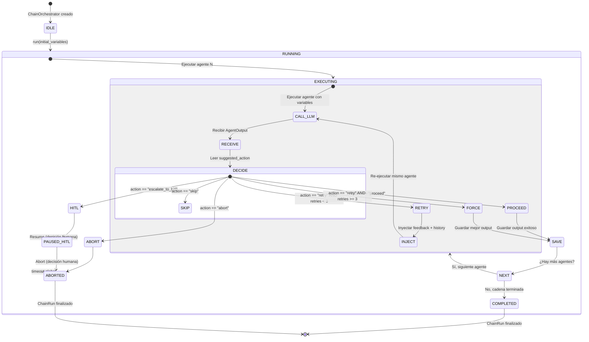

# 7-B — ChainOrchestrator: Diseño Final Rediseñado (v3)

> **Status:** Diseño completo — versión simplificada post-correcciones del usuario.
> **Fecha:** 2026-06-21
> **Propósito:** Especificación definitiva del `ChainOrchestrator` con 3 correcciones del usuario: (1) eliminación de thresholds y matemática compleja, (2) sistema de branching con historial de cadenas, (3) retry con contexto completo sin búsqueda fresca. Incluye mapa exacto de incorporación y schema SQL para `chain_runs`.

---

## Índice

1. [CORRECCIÓN 1: Eliminar thresholds y matemática compleja](#corrección-1-eliminar-thresholds-y-matemática-compleja)
2. [CORRECCIÓN 2: Branching system con historial de cadenas](#corrección-2-branching-system-con-historial-de-cadenas)
3. [CORRECCIÓN 3: Retry con contexto completo](#corrección-3-retry-con-contexto-completo-nunca-búsqueda-fresca)
4. [PARTE 4: Mapa exacto de incorporación](#parte-4-mapa-exacto-de-incorporación)
5. [PARTE 5: Tabla `chain_runs` para branching](#parte-5-tabla-chain_runs-para-branching)
6. [Contratos simplificados (nuevo _self_evaluation)](#contratos-simplificados)
7. [Diagrama de estados simplificado](#diagrama-de-estados-simplificado)

---

## CORRECCIÓN 1: Eliminar thresholds y matemática compleja

### FUERA (eliminado del diseño)

| Elemento eliminado | Razón |
|---|---|
| `confidence` (float 0.0–1.0) | Subjetivo, no calibrable, induce falsa precisión |
| `confidence` thresholds (0.5, 0.7, 0.85) | Umbrales arbitrarios sin evidencia empírica |
| Quality Gate (agente FLASH para casos borderline) | Over-engineering: añade latencia y costo sin valor claro |
| Budget percentages (90%, 15%) | El orquestador no debe decidir basado en métricas financieras |
| `tool_usage_justified` (bool subjetivo) | El agente no puede juzgar su propia eficiencia de tools |
| `retry_penalty` multiplicador (1.5×) | Over-engineering: los tokens se miden, no se penalizan |
| `quality_flags` | Subjetivo, no accionable por el orquestador |
| `missing_info` | El agente no sabe qué no sabe |
| `should_force_proceed()` (≥90% budget) | El orquestador no decide basado en porcentajes |
| `LoopDetector` con comparación de `retry_reason` | Over-engineering: contar retries es suficiente |
| `ToolBudget` con `max_calls_per_retry` | Over-engineering: las tools ya están en cache, no se re-ejecutan |
| `ChainBudget` con `retry_penalty` | Over-engineering |
| `ProjectBudget` con `allocate_chain` | Pre-optimización sin datos de uso real |
| `estimate_agent_tokens()` | Pre-optimización: medir es mejor que estimar |

### DENTRO (lo que permanece)

| Elemento | Tipo | Propósito |
|---|---|---|
| `needs_retry` | `bool` | El agente mismo decide si necesita reintentar |
| `retry_count` | `int` (máx 3) | Solo contar, no decidir |
| `timeout` | `bool` | Hard stop de toda la cadena |
| `suggested_action` | `enum["proceed","retry","escalate_to_hitl","skip","abort"]` | Decisión de routing del agente |
| `tokens_used` | `int` | Solo medir, no decidir |
| `elapsed` | `float` (segundos) | Tiempo transcurrido para timeout |

### NUEVA lógica del ChainOrchestrator (ultra-simple)

El `decide()` del orquestador es una función pura con 6 ramas. No hay confidence, no hay quality gate, no hay budget percentages. El agente decide, el orquestador cuenta.

```python
def decide(self, agent_output, retry_count, chain_state):
    """
    Toma una decisión de routing basada exclusivamente en
    suggested_action del agente + contadores del orquestador.

    Args:
        agent_output: AgentOutput con self_eval
        retry_count: int — intentos acumulados para este agente (0-based)
        chain_state: ChainState con elapsed, timeout_seconds

    Returns:
        (action: str, reason: str | None)
    """
    action = agent_output.self_eval.suggested_action

    # Timeout → aborta todo
    if chain_state.elapsed > chain_state.timeout_seconds:
        return "abort", "Timeout: chain exceeded time limit"

    # El agente quiere proceder → adelante
    if action == "proceed":
        return "proceed", None

    # El agente quiere retry → solo si no excedió el límite
    if action == "retry":
        if retry_count < self.max_retries:  # 3
            return "retry", agent_output.self_eval.retry_reason
        else:
            return "force_proceed", f"Max retries ({self.max_retries}) reached"

    # El agente pide HITL → pausar
    if action == "escalate_to_hitl":
        return "pause_hitl", agent_output.self_eval.retry_reason

    # Skip → siguiente agente
    if action == "skip":
        return "skip", None

    # Abort → detener todo
    if action == "abort":
        return "abort", agent_output.self_eval.retry_reason

    # Fallback (no debería ocurrir): agente sin self_eval o acción desconocida
    return "proceed", None
```

**Tabla de decisiones (única fuente de verdad):**

| `suggested_action` | ¿Timeout? | ¿Retries < 3? | Acción final | Resultado |
|---|---|---|---|---|
| `proceed` | — | — | `proceed` | Guarda output, avanza |
| `retry` | No | Sí | `retry` | Re-ejecuta con feedback |
| `retry` | No | No | `force_proceed` | Guarda output, avanza con warning |
| `retry` | Sí | — | `abort` | Timeout total |
| `escalate_to_hitl` | — | — | `pause_hitl` | Pausa cadena |
| `skip` | — | — | `skip` | Salta agente |
| `abort` | — | — | `abort` | Detiene cadena |
| *(sin self_eval)* | — | — | `proceed` | Asume proceed |

**Lo que NO está en esta tabla:**
- ❌ `confidence < 0.5` → no influye
- ❌ `budget > 90%` → no influye
- ❌ `quality_flags` → no se leen
- ❌ `tool_usage_justified` → no existe
- ❌ `LoopDetector` con `retry_reason` repetido → no existe

### ChainState simplificado

```python
@dataclass
class ChainState:
    """Estado mínimo de la cadena para decisiones del orquestador."""
    start_time: float          # time.monotonic() al iniciar
    timeout_seconds: float     # timeout duro (default: 600s)
    total_tokens: int = 0      # solo medir, no decidir

    @property
    def elapsed(self) -> float:
        return time.monotonic() - self.start_time
```

---

## CORRECCIÓN 2: Branching system con historial de cadenas

### Concepto: ChainHistory como "git para agentes"

Cada ejecución de cadena produce un **commit inmutable** en el historial. El usuario puede navegar el timeline, ver outputs, y crear branches desde cualquier punto.

### 2.1 Cada ejecución de cadena es un "commit"

Un `ChainRun` (commit) contiene:

| Campo | Tipo | Descripción |
|---|---|---|
| `chain_id` | `str` | Identificador canónico: `"open_coding_main"`, `"open_coding_hypotheses"`, etc. |
| `project_id` | `UUID` | Proyecto al que pertenece |
| `started_at` | `timestamptz` | Inicio de la cadena |
| `finished_at` | `timestamptz` | Fin de la cadena (null si paused/aborted) |
| `agents` | `list[AgentRun]` | Agentes ejecutados en orden (solo el output exitoso de cada uno) |
| `retry_count` | `int` | Total de retries en toda la cadena |
| `tokens_used` | `int` | Total de tokens consumidos |
| `status` | `enum` | `"completed"`, `"aborted"`, `"paused_hitl"` |

### 2.2 NO se almacenan pasos fallidos — excepto:

| Excepción | Qué se guarda | Quién lo guarda |
|---|---|---|
| Errores de parseo | Stack trace + input que causó el error | Orquestador (automático) |
| Timeouts | Timestamp del timeout + último estado conocido | Orquestador (automático) |
| User-requested retries | Snapshot completo de todos los outputs hasta ese punto | Sistema de branching (a demanda del usuario) |

**Regla:** Los intentos fallidos de retry existen SOLO en la `conversation_history` en memoria durante la ejecución. No se persisten. Si el agente falla 2 veces y la 3ª es exitosa, solo la 3ª se guarda en DB.

### 2.3 Timeline visual en el frontend

El historial se muestra como un timeline ASCII-like renderizado en el frontend:

```
┌─ Chain: open_coding_main ─────────────────────────────┐
│ ✓ fb_incident_grouper    (1 intento,  12K tokens)     │
│ ✓ fb_code_generator       (1 intento,  18K tokens)     │
│ ↻ fb_label_critic         (2 intentos, 8K tokens)      │
│   └─ retry 1: "Label 'managing' too vague"             │
│   └─ retry 2: ✓                                        │
│ ✓ fd_category_synthesizer (1 intento,  15K tokens)     │
│ 🛑 fc_main_concern_proposer (escalated to HITL)        │
│ Total: 53K tokens, 2 retries, 45s                      │
└────────────────────────────────────────────────────────┘
```

**Leyenda de íconos:**

| Ícono | Significado |
|---|---|
| `✓` | Agente completado exitosamente (proceed) |
| `↻` | Agente con retries (muestra contador) |
| `🛑` | Agente escalado a HITL |
| `✗` | Agente saltado (skip) |
| `⏱` | Timeout |
| `⚠` | Force proceed (máx retries alcanzado) |

### 2.4 Branching: interacción del usuario con el timeline

El usuario puede hacer clic en cualquier agente del timeline. Se despliega un panel contextual con 3 acciones:

```
┌─────────────────────────────────────────┐
│  fb_label_critic  (2 intentos, 8K tokens)│
│                                         │
│  [Ver output completo]                  │
│  [Retry from here]    ← crea un branch  │
│  [View conversation]  ← intentos fallidos│
└─────────────────────────────────────────┘
```

#### Acción 1: "Ver output completo"
Muestra el `data` del `AgentOutput` en un modal con resaltado de sintaxis JSON.

#### Acción 2: "Retry from here"
- Crea un **snapshot** del estado actual: todos los outputs de agentes previos en la cadena se guardan como `parent_chain_run_id`.
- Crea un nuevo `ChainRun` con `parent_chain_run_id` apuntando al snapshot.
- Re-ejecuta la cadena **desde ese agente** hacia adelante.
- Los agentes anteriores a este NO se re-ejecutan — sus outputs se reutilizan del snapshot.
- El nuevo `ChainRun` aparece en el timeline como un branch visual.

```
main ─── A ─── B ─── C ─── D
              \
               └── B' ─── C' ─── D'   (branch: "retry from B")
```

#### Acción 3: "View conversation"
Muestra el historial conversacional completo de los intentos fallidos (los que NO se persistieron en DB pero sí existen en `conversation_history` durante la ejecución). Esto incluye:
- System prompt
- User input original
- Assistant responses de intentos fallidos
- Tool calls y sus resultados
- Retry feedback inyectado

### 2.5 Persistencia del branching

Cada branch es un `ChainRun` con `parent_chain_run_id != NULL`. La columna `created_by` distingue:

| `created_by` | Significado |
|---|---|
| `"system"` | Ejecución automática del pipeline |
| `"user:{user_id}"` | Branch creado manualmente por el investigador |

---

## CORRECCIÓN 3: Retry con contexto completo, nunca búsqueda fresca

### Reglas del retry

#### Regla 1: Contexto completo

En cada retry, el agente recibe **TODA la conversación anterior**:

```
System prompt original
  +
User input original
  +
[INTENTO 1 COMPLETO]:
  - Assistant: Thought + Tool calls
  - Tool results (marcados como CACHEADOS)
  - Assistant: FinalAnswer (el output fallido)
  +
[NUEVO mensaje USER]:
  "RETRY FEEDBACK: {retry_reason}
   Ya tienes las tool calls del intento anterior en el historial.
   NO las llames de nuevo — sus resultados siguen siendo válidos."
```

El agente ve su propio razonamiento anterior, sus tool calls, y los resultados. Esto permite:
- Corregir errores de razonamiento (vio los datos pero los interpretó mal)
- No repetir tool calls (ya sabe qué hay en `expand_incident("inc-47")`)
- Enfocarse en lo que faltó (guiado por `retry_reason`)

#### Regla 2: Nunca re-buscar

Las tools ya llamadas están en cache. El flujo:

```
Agente en retry llama expand_incident("inc-47")
  → ToolCache.get("expand_incident", {"incident_id": "inc-47"})
  → HIT: devuelve resultado cacheado (0 tokens, 0 latencia)
  → AgentOutput.tool_calls[i].cache_hit = True
```

Si el agente insiste en llamar una tool ya cacheada:
- Se le devuelve el resultado instantáneamente
- Se registra como `cache_hit = True`
- NO consume tokens adicionales
- NO se penaliza (el agente puede ser "cauteloso" y re-verificar)

#### Regla 3: No almacenar pasos fallidos

- Solo el **último output exitoso** (`suggested_action == "proceed"`) se guarda en `chain_runs.agent_runs`.
- Los intentos fallidos existen en `conversation_history` en memoria durante la ejecución.
- Al terminar la cadena, la memoria se libera. Los intentos fallidos se pierden.
- Si el usuario quiere preservar intentos fallidos → usa el sistema de branching (crea snapshot antes del retry).

**Excepción: user-requested retry (branching)**

Cuando el usuario desde el branching system pide "Retry from here":
1. Se crea un **snapshot** del estado actual
2. El snapshot incluye TODOS los outputs de agentes previos (solo los exitosos)
3. El snapshot se persiste como un `ChainRun` con `status = "completed"` (parcial)
4. El nuevo branch se crea con `parent_chain_run_id = snapshot.id`
5. El branch re-ejecuta desde el agente seleccionado hacia adelante

### Implementación del retry (pseudocódigo)

```python
def _execute_agent_with_retry(self, agent_id, variables, chain_state):
    """
    Ejecuta un agente con hasta max_retries intentos.
    Retorna (AgentRun exitoso, action_tomada).
    """
    retry_count = 0
    conversation_history = []  # acumula TODOS los intentos
    best_output = None
    best_attempt = 0

    while retry_count <= self.max_retries:
        # 1. Preparar variables para este intento
        attempt_vars = dict(variables)
        if retry_count > 0:
            attempt_vars["conversation_history"] = conversation_history
            attempt_vars["retry_feedback"] = best_output.self_eval.retry_reason
            attempt_vars["attempt_number"] = retry_count + 1

        # 2. Ejecutar agente
        agent_output = self.llm.run_agent(agent_id, variables=attempt_vars)
        chain_state.total_tokens += agent_output.tokens_used

        # 3. Acumular conversation
        conversation_history.extend(agent_output.conversation)

        # 4. Decidir
        action, reason = self.decide(agent_output, retry_count, chain_state)

        if action == "proceed":
            return agent_output, "proceed"

        elif action == "retry":
            retry_count += 1
            best_output = agent_output
            best_attempt = retry_count
            continue  # re-ejecuta el mismo agente

        elif action == "force_proceed":
            # Se agotaron los retries — proceder con el mejor output
            return best_output or agent_output, "force_proceed"

        elif action == "pause_hitl":
            return agent_output, "pause_hitl"

        elif action == "skip":
            return None, "skip"

        elif action == "abort":
            return agent_output, "abort"

    # No debería llegar aquí, pero por seguridad:
    return best_output or agent_output, "force_proceed"
```

---

## Contratos simplificados

### NUEVO _self_evaluation (3 campos)

```json
{
  "_self_evaluation": {
    "needs_retry": false,
    "retry_reason": null,
    "suggested_action": "proceed"
  }
}
```

**Solo 3 campos. Eso es todo.**

| Campo | Tipo | Requerido | Descripción |
|---|---|---|---|
| `needs_retry` | `boolean` | Sí | `true` = el agente cree que su output es incompleto o de baja calidad |
| `retry_reason` | `string` o `null` | Solo si `needs_retry == true` | Instrucción concreta y accionable de qué mejorar. Se inyecta como feedback en el retry. |
| `suggested_action` | `enum` | Sí | `"proceed"`, `"retry"`, `"escalate_to_hitl"`, `"skip"`, `"abort"` |

**Campos eliminados del diseño anterior:**

| Campo eliminado | Razón |
|---|---|
| `confidence` | Subjetivo, no calibrable, no accionable |
| `quality_flags` | Subjetivo, el orquestador no los usa |
| `missing_info` | El agente no sabe qué no sabe; si lo supiera, lo incluiría en el output |
| `tool_usage_justified` | El agente no puede juzgar su propia eficiencia |

### Fallback: agente sin _self_evaluation

Si un agente no incluye `_self_evaluation` en su output, el orquestador asume:

```python
DEFAULT_SELF_EVAL = {
    "needs_retry": False,
    "retry_reason": None,
    "suggested_action": "proceed"
}
```

Esto permite migración progresiva: los agentes que aún no tienen el campo funcionan como antes (siempre proceed). Se loggea un warning para tracking.

### AgentRun simplificado

```python
@dataclass
class AgentRun:
    """Registro de UNA ejecución exitosa de un agente."""
    agent_id: str
    attempt_number: int          # 1 = primer intento, 2 = primer retry, etc.
    output: dict                 # AgentOutput.data (solo el exitoso)
    tokens_used: int             # Tokens consumidos en el intento exitoso
    tool_calls_count: int        # Total de tool calls (incluye cache hits)
    retry_count: int             # Intentos fallidos antes de este exitoso
    orchestrator_action: str     # "proceed" | "force_proceed" | "skip"
    started_at: str              # ISO timestamp
    finished_at: str             # ISO timestamp
```

### ChainRun simplificado

```python
@dataclass  
class ChainRun:
    """Un 'commit' en el historial de ejecución de cadenas."""
    chain_id: str                # "open_coding_main", "open_coding_hypotheses", etc.
    project_id: str              # UUID
    parent_chain_run_id: str | None  # Para branching
    status: str                  # "completed" | "aborted" | "paused_hitl"
    agent_runs: list[AgentRun]   # Solo outputs exitosos, en orden
    total_tokens: int            # Suma de tokens de todos los agent_runs
    total_retries: int           # Suma de retry_count de todos los agent_runs
    started_at: str
    finished_at: str | None
    created_by: str              # "system" | "user:{user_id}"
```

---

## PARTE 4: Mapa exacto de incorporación

Para cada cadena y agente independiente, se especifica **exactamente** dónde se incorpora el `ChainOrchestrator`.

| Cadena / Agente | Archivo actual | Ubicación exacta | Nuevo orquestador | Cambio |
|---|---|---|---|---|
| **data_management** (4 agentes) | `workers/heavy/tasks.py` | `process_document_agents_a()` (línea ~898) | `ChainOrchestrator` secuencial simple | Reemplazar el loop manual de steps (A1→A2→A3) con `ChainOrchestrator.run()` |
| **open_coding principal** | `workers/heavy/tasks.py` | `process_synthesis_agents_b()` (línea ~1386) | `ChainOrchestrator` con retry | Reemplazar B1→B2→B3 secuencial con `ChainOrchestrator` que lee `_self_evaluation` |
| **open_coding hipótesis** | `workers/heavy/tasks.py` | Disperso — las funciones `task_b3_generate_hypotheses` (línea ~1119) y relacionadas se llaman desde `process_synthesis_agents_b` | `ChainOrchestrator` paralelo (nueva cadena separada) | **NUEVO**: Extraer la cadena de hipótesis a un `ChainOrchestrator` independiente que corre en paralelo con la principal. Sincronización en `config_critic`. |
| **selective_coding acts** | `workers/heavy/tasks.py` | `selective_coding_coordinator()` (línea ~2558) → `task_main_concern_pipeline` (línea ~2698), `task_core_emergence_pipeline` (línea ~2883), `task_selective_reduction_pipeline` (línea ~3113) | `ChainOrchestrator` por acto | Envolver cada par proposer→critic dentro de cada pipeline en un `ChainOrchestrator`. El coordinator de alto nivel (fases A→B→C→D→E) se mantiene. |
| **population_generalizer** | `workers/fast/tasks.py` | `generalize_population()` (línea ~655) | **Agente independiente** — sin orquestador | **Sin cambio.** Es una sola llamada LLM. No necesita orquestador. |
| **saturation_loop** | `workers/heavy/tasks.py` | `task_core_saturation_loop()` (línea ~3448) | **Ya es iterativo** — sin orquestador | **Sin cambio.** El loop proposer→critic por categoría+documento ya es su propio mecanismo de iteración. El panel de 4 señales decide cuándo parar. |

### Detalle de incorporación por cadena

#### 1. data_management

**Archivo:** `workers/heavy/tasks.py::process_document_agents_a()`

**Estado actual:**
```python
# Steps secuenciales con checkpoints manuales:
# segmentation → extract_incidents → A1 → A2 → A3
# Cada step tiene su propio try/except y checkpoint manual.
```

**Con ChainOrchestrator:**
```python
def process_document_agents_a(self, documento_id, proyecto_id):
    orch = ChainOrchestrator(
        agents=[
            "fb_punctuator",       # Step 0: segmentation + glaser
            "fb_incident_extractor", # Step 0.5: extract patterns & incidents
            "fb_population_context", # Step 1: A1
            "fb_process_identifier", # Step 2: A2
            "fb_sense_maker",        # Step 4: A3
        ],
        max_retries=3,
        timeout_seconds=600,
    )

    result = orch.run(
        initial_variables={
            "documento_id": documento_id,
            "proyecto_id": proyecto_id,
        },
        llm_client=llm,
    )

    # El orquestador ya manejó retries, timeouts, y HITL.
    # Solo manejar el resultado final.
    if result.status == "completed":
        transit(...)  # marcar doc como procesado
    elif result.status == "paused_hitl":
        hitl_gate(...)  # pausar hasta decisión humana
    elif result.status == "aborted":
        _to_error(...)  # marcar doc como error
```

**Agentes mapeados:**
| Step actual | Agent ID nuevo | Función actual |
|---|---|---|
| segmentation + glaser | `fb_punctuator` → `fb_glaser_classifier` | `_ensure_segmented()` + `_classify_glaser_types_for_doc()` |
| extract_incidents | `fb_incident_extractor` | `extract_patterns_and_incidents()` |
| A1 | `fb_population_context` | `a1_build_population_context()` |
| A2 | `fb_process_identifier` | `a2_identify_process()` |
| A3 | `fb_sense_maker` | `a3_make_sense()` |

#### 2. open_coding principal

**Archivo:** `workers/heavy/tasks.py::process_synthesis_agents_b()`

**Estado actual:**
```python
# B1 → B2 (con SelfRefinement loop interno) → B2.5 → B3
# Más dispatchers async para synthesizer, hypotheses, config_critic
```

**Con ChainOrchestrator:**
```python
def process_synthesis_agents_b(self, proyecto_id):
    orch = ChainOrchestrator(
        agents=[
            "fb_incident_grouper",       # B1
            "fb_code_generator",         # B2 (el SelfRefinement loop se mueve DENTRO del agente)
            "fb_label_critic",           # B2 critic
            "fd_category_synthesizer",   # Synthesizer (antes async dispatch)
        ],
        max_retries=3,
        timeout_seconds=900,
    )

    result = orch.run(
        initial_variables={
            "proyecto_id": proyecto_id,
            "object_of_study": get_oos(proyecto_id),
            "operational_question": get_opq(proyecto_id),
        },
        llm_client=llm,
    )

    # Manejar resultado...
```

**Agentes mapeados:**
| Step actual | Agent ID nuevo | Función actual |
|---|---|---|
| B1 | `fb_incident_grouper` | `b1_group_incidents()` |
| B2 | `fb_code_generator` | `b2_label_groups()` (absorbe el critic loop) |
| B2.5 (grounding) | Se mueve DENTRO de `fb_code_generator` como paso interno | `b2_5_assign_codes_to_segments()` |
| B3 | `fd_category_synthesizer` | `task_synthesize_categories()` (se vuelve síncrono) |

#### 3. open_coding hipótesis (NUEVA cadena separada)

**Archivo:** NUEVO — `workers/heavy/tasks.py` (nueva función)

**Estado actual:** Las funciones `task_b3_generate_hypotheses`, `task_update_hypotheses`, `task_critique_configuration` se despachan async desde `process_synthesis_agents_b`.

**Con ChainOrchestrator (cadena paralela):**
```python
def process_hypothesis_chain(proyecto_id):
    """NUEVA: Cadena independiente de hipótesis que corre en paralelo con la principal."""
    orch = ChainOrchestrator(
        agents=[
            "fc_hypothesis_generator",
            "fc_evidence_classifier",
            "fc_hypothesis_synthesizer",
        ],
        max_retries=2,
        timeout_seconds=600,
    )

    result = orch.run(
        initial_variables={
            "proyecto_id": proyecto_id,
        },
        llm_client=llm,
    )
    return result

# En el coordinator de alto nivel:
parallel = ParallelChainOrchestrator(
    chains=[
        ChainOrchestrator("open_coding_main", ...),
        ChainOrchestrator("open_coding_hypotheses", ...),
    ],
    sync_agent_id="fd_config_critic",
    sync_policy="soft",
)
```

#### 4. selective_coding por acto

**Archivo:** `workers/heavy/tasks.py::selective_coding_coordinator()`

**Estado actual:**
```python
# Fase A: task_main_concern_pipeline → task_core_emergence_pipeline
# Fase B: task_selective_reduction_pipeline
# Cada pipeline tiene su propio par proposer→critic interno
```

**Con ChainOrchestrator:**
```python
# DENTRO de task_main_concern_pipeline():
def task_main_concern_pipeline(proyecto_id):
    orch = ChainOrchestrator(
        agents=[
            "fe_main_concern_proposer",
            "fe_main_concern_critic",
        ],
        max_retries=3,
    )
    return orch.run(...)

# DENTRO de task_core_emergence_pipeline():
def task_core_emergence_pipeline(proyecto_id):
    orch = ChainOrchestrator(
        agents=[
            "fe_core_emergence_proposer",
            "fe_core_emergence_critic",
        ],
        max_retries=3,
    )
    return orch.run(...)
```

El `selective_coding_coordinator` de alto nivel (fases A→B→C→D→E con HITL gates entre fases) **se mantiene sin cambios**. Solo cambia el interior de cada pipeline: en lugar de llamar `llm.run_agent()` directamente, usa `ChainOrchestrator` para el par proposer→critic.

#### 5. population_generalizer — SIN CAMBIO

**Archivo:** `workers/fast/tasks.py::generalize_population()`

Es una sola llamada LLM. No hay cadena que orquestar. Se mantiene exactamente como está.

#### 6. saturation_loop — SIN CAMBIO

**Archivo:** `workers/heavy/tasks.py::task_core_saturation_loop()`

Ya es un loop iterativo con su propio mecanismo de parada (panel de 4 señales). No necesita `ChainOrchestrator`. El par proposer→critic dentro del loop se beneficia de `_self_evaluation` para decidir retry/proceed, pero el loop en sí no cambia.

---

## PARTE 5: Tabla `chain_runs` para branching

### SQL

```sql
CREATE TABLE chain_runs (
    id UUID PRIMARY KEY DEFAULT gen_random_uuid(),
    project_id UUID NOT NULL REFERENCES proyectos(id) ON DELETE CASCADE,
    chain_id TEXT NOT NULL,           -- "open_coding_main", "open_coding_hypotheses"
    parent_chain_run_id UUID NULL REFERENCES chain_runs(id) ON DELETE SET NULL,
                                      -- para branching: de qué run se derivó
    status TEXT NOT NULL DEFAULT 'running',
                                      -- "completed" | "aborted" | "paused_hitl" | "running"
    agent_runs JSONB NOT NULL DEFAULT '[]',
                                      -- [
                                      --   {
                                      --     "agent_id": "fb_incident_grouper",
                                      --     "attempt_number": 1,
                                      --     "output": {...},          -- AgentOutput.data (solo el exitoso)
                                      --     "tokens_used": 12000,
                                      --     "tool_calls_count": 3,
                                      --     "retry_count": 0,         -- intentos fallidos antes del exitoso
                                      --     "orchestrator_action": "proceed",
                                      --     "started_at": "2026-06-21T14:30:00Z",
                                      --     "finished_at": "2026-06-21T14:30:15Z"
                                      --   },
                                      --   ...
                                      -- ]
    total_tokens INT NOT NULL DEFAULT 0,
    total_retries INT NOT NULL DEFAULT 0,
    started_at TIMESTAMPTZ NOT NULL DEFAULT now(),
    finished_at TIMESTAMPTZ,
    created_by TEXT NOT NULL DEFAULT 'system',
                                      -- 'system' | 'user:{user_id}' (branching manual)
    created_at TIMESTAMPTZ NOT NULL DEFAULT now()
);

-- Índices
CREATE INDEX idx_chain_runs_project ON chain_runs(project_id);
CREATE INDEX idx_chain_runs_chain_id ON chain_runs(chain_id);
CREATE INDEX idx_chain_runs_status ON chain_runs(status);
CREATE INDEX idx_chain_runs_parent ON chain_runs(parent_chain_run_id) WHERE parent_chain_run_id IS NOT NULL;
CREATE INDEX idx_chain_runs_created_at ON chain_runs(project_id, created_at DESC);
```

### Ejemplo de `agent_runs` JSONB

```json
[
  {
    "agent_id": "fb_incident_grouper",
    "attempt_number": 1,
    "output": {
      "groups": [
        {"label": "gestión del tiempo", "incident_ids": ["inc-1", "inc-5", "inc-12"]},
        {"label": "carga invisible", "incident_ids": ["inc-3", "inc-8"]}
      ],
      "ungrouped": ["inc-15"]
    },
    "tokens_used": 12450,
    "tool_calls_count": 2,
    "retry_count": 0,
    "orchestrator_action": "proceed",
    "started_at": "2026-06-21T14:30:00Z",
    "finished_at": "2026-06-21T14:30:18Z"
  },
  {
    "agent_id": "fb_code_generator",
    "attempt_number": 2,
    "output": {
      "codes": [
        {"label": "priorización constante", "definition": "...", "properties": [...]},
        {"label": "trabajo emocional no reconocido", "definition": "...", "properties": [...]}
      ]
    },
    "tokens_used": 18100,
    "tool_calls_count": 1,
    "retry_count": 1,
    "orchestrator_action": "proceed",
    "started_at": "2026-06-21T14:30:20Z",
    "finished_at": "2026-06-21T14:30:52Z"
  }
]
```

**Nota sobre `retry_count` en `agent_runs`:**
- Es el número de intentos FALLIDOS antes del exitoso.
- Si `retry_count = 0` → el agente acertó al primer intento.
- Si `retry_count = 2` → el agente falló 2 veces y acertó en el 3er intento (attempt_number = 3).
- Los intentos fallidos NO se almacenan en `agent_runs`. Solo se cuenta cuántos hubo.

### Consultas útiles

```sql
-- Timeline de un proyecto (para el frontend)
SELECT id, chain_id, status, total_tokens, total_retries,
       started_at, finished_at,
       EXTRACT(EPOCH FROM (finished_at - started_at)) AS duration_seconds
FROM chain_runs
WHERE project_id = '...'
ORDER BY created_at DESC;

-- Branches de una cadena
SELECT cr.id, cr.chain_id, cr.status, cr.created_by,
       parent.chain_id AS parent_chain,
       parent.id AS parent_id
FROM chain_runs cr
LEFT JOIN chain_runs parent ON cr.parent_chain_run_id = parent.id
WHERE cr.project_id = '...' AND cr.parent_chain_run_id IS NOT NULL
ORDER BY cr.created_at DESC;

-- Agentes con más retries (métrica de calidad)
SELECT
    ar->>'agent_id' AS agent,
    SUM((ar->>'retry_count')::int) AS total_retries,
    COUNT(*) AS executions,
    AVG((ar->>'tokens_used')::int) AS avg_tokens
FROM chain_runs cr,
     jsonb_array_elements(cr.agent_runs) ar
WHERE cr.project_id = '...'
GROUP BY ar->>'agent_id'
ORDER BY total_retries DESC;
```

---

## Diagrama de estados simplificado



**Comparación con el diagrama anterior (v2):**

| Aspecto | v2 (anterior) | v3 (este documento) |
|---|---|---|
| Nodos de decisión | 15+ (confidence checks, budget checks, loop detection, quality gate) | 6 (solo suggested_action + timeout + retry_count) |
| Transiciones basadas en confidence | 4 (≥0.5, ≥0.2, empeoró, mejoró) | 0 |
| Transiciones basadas en budget | 3 (≥10%, ≥90%, is_exhausted) | 0 |
| LoopDetector | Sí (mismo retry_reason 3×) | No |
| Force escalate por confidence <0.2 | Sí | No |

---

## Resumen: qué cambió del diseño anterior

| Componente | 7-MicroOrchestrators-Design-Final.md (v2) | 7-MicroOrchestrators-Final.md (v3 — este doc) |
|---|---|---|
| `SelfEval` | 7 campos (confidence, needs_retry, retry_reason, quality_flags, missing_info, suggested_action, tool_usage_justified) | 3 campos (needs_retry, retry_reason, suggested_action) |
| `ChainOrchestrator.decide()` | 50+ líneas con confidence checks, budget checks, loop detection | 30 líneas: solo suggested_action + timeout + retry_count |
| `ChainBudget` | max_tokens, tokens_used, retry_penalty(1.5×), should_force_proceed(90%), can_retry(), is_exhausted() | **Eliminado** — solo se mide `tokens_used`, no se decide con él |
| `ToolBudget` | max_calls, max_calls_per_retry, can_call(), charge() | **Simplificado:** ToolCache (en memoria, por cadena) — sin budget, solo cache |
| `ProjectBudget` | total_budget, allocate_chain(), remaining_global() | **Eliminado** — pre-optimización |
| `LoopDetector` | Mismo retry_reason 3× → force_proceed | **Eliminado** — contar retries (máx 3) es suficiente |
| `Quality Gate` (FLASH) | Agente FLASH decide en casos borderline | **Eliminado** |
| `estimate_agent_tokens()` | Heurística para pre-decidir si hay presupuesto | **Eliminado** — medir es mejor que estimar |
| Branching | No existía | **NUEVO:** ChainHistory tipo git, timeline visual, "Retry from here" |
| Retry context | Conversation history (parcial) | **MEJORADO:** Contexto COMPLETO (system + todos los intentos + tools cacheadas) |
| `chain_runs` SQL | 14 columnas | 12 columnas (simplificado: sin decisions JSONB separado, sin parallel_sibling_id, sin budget_consumed_pct, sin cwm_signals. Agregado: parent_chain_run_id, created_by) |
| `agent_runs` JSONB | Incluye TODOS los intentos (fallidos y exitosos) | Solo incluye el intento EXITOSO. Fallidos se cuentan en `retry_count`. |

---

## Próximos pasos

1. **Implementar `ChainOrchestrator.decide()`** — 30 líneas, sin dependencias complejas
2. **Actualizar schemas de agentes** — migrar de `_self_evaluation` de 7 campos a 3 campos
3. **Crear tabla `chain_runs`** — ejecutar el SQL de la Parte 5
4. **Integrar en `process_document_agents_a`** — prueba piloto (cadena más corta)
5. **Integrar en `process_synthesis_agents_b`** — cadena principal con retry
6. **Extraer cadena de hipótesis** — nueva función separada con ParallelChainOrchestrator
7. **Construir timeline UI** — componente frontend que renderiza `chain_runs.agent_runs`
8. **Implementar branching UI** — "Retry from here" + "View conversation" en el timeline

---

> **Referencias cruzadas:**
> - `7-MicroOrchestrators-SelfReflective.md` — Diseño original (v1)
> - `7-MicroOrchestrators-Design-Final.md` — Diseño arquitectónico completo (v2, reemplazado por este documento)
> - `8-Branching_System.md` — Diseño de branching para MEMOS (separado del branching de cadenas)
> - `AGENTES.md` — Registro canónico de todos los agentes y sus tiers
> - `workers/heavy/tasks.py` — Ubicación actual de todas las funciones a modificar
> - `workers/fast/tasks.py` — `generalize_population()` (sin cambio)
> - `backend/app/agents/transitions.py` — Pipeline Orchestrator (Nivel 3)
