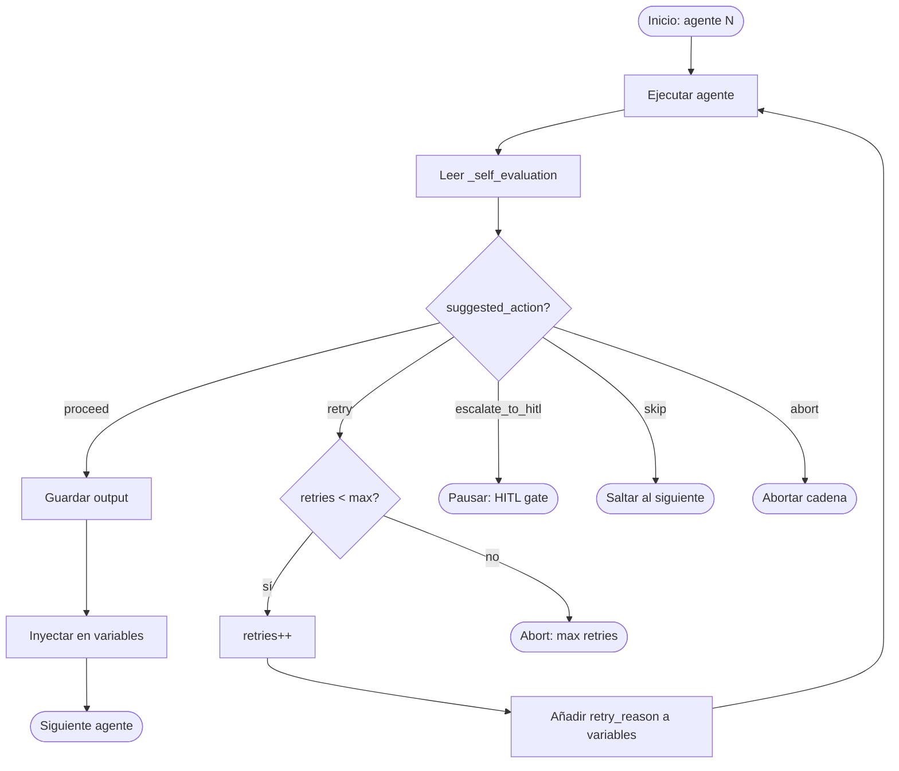

# 7 — Micro-Orchestrators & Self-Reflective Outputs

> **Status:** Diseño (no implementado)
> **Fecha:** 2026-06-21
> **Propósito:** Definir el sistema de outputs autorreflexivos y micro-orquestadores de cadena que permiten routing automático entre agentes sin intervención humana constante.

---

## Índice

1. [Campos autorreflexivos en JSON outputs](#parte-1-campos-autorreflexivos-en-json-outputs)
2. [Micro-orquestador de cadena](#parte-2-micro-orquestador-de-cadena)
3. [Cadenas que necesitan micro-orquestadores](#parte-3-dónde-se-necesitan-micro-orquestadores)
4. [Plan de rollout de `_self_evaluation`](#parte-4-plan-para-agregar-_self_evaluation-a-los-schemas-existentes)
5. [Flujo completo con micro-orquestador](#parte-5-pseudocódigo-del-flujo-completo-con-micro-orquestador)
6. [Consideraciones de diseño](#consideraciones-de-diseño)

---

## PARTE 1: Campos autorreflexivos en JSON outputs

Cada agente del sistema debe incluir en su schema de output un campo `_self_evaluation`. El underscore indica que es **metadata**, no contenido sustantivo. Este campo es leído por los micro-orquestadores para tomar decisiones de routing.

### Schema estándar

```json
{
  "_self_evaluation": {
    "type": "object",
    "description": "Self-reflective metadata. The agent evaluates its own output quality. Read by micro-orchestrators for routing decisions.",
    "properties": {
      "confidence": {
        "type": "number",
        "minimum": 0,
        "maximum": 1,
        "description": "How confident is the agent in this output? 0.0 = pure guess, 1.0 = certain."
      },
      "needs_retry": {
        "type": "boolean",
        "description": "True if the agent believes its output is incomplete or low-quality and should be regenerated."
      },
      "retry_reason": {
        "type": "string",
        "description": "If needs_retry is true, what specific aspect needs improvement? Used as feedback in the retry prompt."
      },
      "quality_flags": {
        "type": "array",
        "items": { "type": "string" },
        "description": "Self-assessed quality indicators: well_grounded, sufficient_evidence, internally_consistent, complete_coverage, unambiguous"
      },
      "missing_information": {
        "type": "array",
        "items": { "type": "string" },
        "description": "What information would improve this output? E.g., 'more baseline_data segments', 'population context', 'operational question clarification'"
      },
      "suggested_action": {
        "type": "string",
        "enum": ["proceed", "retry", "escalate_to_hitl", "skip", "abort"],
        "description": "What the agent recommends as next step."
      }
    },
    "required": ["confidence", "suggested_action"]
  }
}
```

### Semántica de cada campo

| Campo | Quién lo escribe | Quién lo lee | Propósito |
|---|---|---|---|
| `confidence` | Agente (LLM) | Orquestador | Threshold para decisiones automáticas |
| `needs_retry` | Agente (LLM) | Orquestador | Disparador rápido de retry sin analizar toda la salida |
| `retry_reason` | Agente (LLM) | Orquestador → mismo agente (feedback loop) | Instrucción concreta de qué mejorar en el reintento |
| `quality_flags` | Agente (LLM) | Orquestador, HITL, logs | Trazabilidad de calidad para debugging |
| `missing_information` | Agente (LLM) | Orquestador, sistema de KB | Puede disparar búsquedas adicionales en la base de conocimiento |
| `suggested_action` | Agente (LLM) | Orquestador | Decisión principal de routing |

### Valores de `suggested_action`

| Valor | Significado | Comportamiento del orquestador |
|---|---|---|
| `proceed` | Output aceptable, continuar | Ejecuta siguiente agente en la cadena |
| `retry` | Output deficiente, reintentar | Re-ejecuta el mismo agente con `retry_reason` como feedback (máx 3) |
| `escalate_to_hitl` | Necesita juicio humano | Pausa la cadena, notifica al operador |
| `skip` | Agente opcional, omitir | Salta este agente (ej. `config_critic` cuando no hay config) |
| `abort` | Error irrecuperable | Detiene toda la cadena, transiciona el proyecto a `error` |

---

## PARTE 2: Micro-orquestador de cadena

El `ChainOrchestrator` es una clase que ejecuta una lista ordenada de agentes, leyendo `_self_evaluation` de cada output para decidir el siguiente paso.

### Responsabilidades

1. Recibe una lista de agentes en orden (la cadena)
2. Ejecuta el primer agente con las variables iniciales
3. Lee `_self_evaluation` del output
4. Decide la acción según `suggested_action`
5. Inyecta el output de cada agente como variable para el siguiente
6. Mantiene trazabilidad completa de decisiones en `self.history`

### Implementación de referencia (Python)

```python
class ChainOrchestrator:
    """
    Micro-orchestrator that executes a chain of agents with
    self-reflective routing decisions.

    Each agent's output MUST include a `_self_evaluation` field
    with at least `confidence` and `suggested_action`.
    """

    def __init__(self, agents: list[str], max_retries: int = 3):
        self.agents = agents
        self.max_retries = max_retries
        self.history = []  # trazabilidad de decisiones

    def run(self, initial_variables: dict, llm_client) -> dict:
        """
        Ejecuta la cadena completa con routing autorreflexivo.

        Args:
            initial_variables: Variables iniciales para el primer agente
                               (project_id, object_of_study, operational_question, etc.)
            llm_client: Cliente LLM con método run_agent(agent_id, variables)

        Returns:
            dict con status, outputs, y history
        """
        variables = dict(initial_variables)
        chain_outputs = {}

        for i, agent_id in enumerate(self.agents):
            retries = 0

            while retries <= self.max_retries:
                output = llm.run_agent(agent_id, variables=variables)
                self_eval = output.get("_self_evaluation", {})

                action = self_eval.get("suggested_action", "proceed")

                if action == "proceed":
                    chain_outputs[agent_id] = output
                    # Inyectar output como variable para el siguiente agente
                    variables[f"{agent_id}_output"] = output
                    self.history.append({
                        "agent": agent_id,
                        "action": "proceed",
                        "confidence": self_eval.get("confidence"),
                        "attempt": retries + 1
                    })
                    break

                elif action == "retry" and retries < self.max_retries:
                    retries += 1
                    variables["retry_feedback"] = self_eval.get("retry_reason", "")
                    self.history.append({
                        "agent": agent_id,
                        "action": "retry",
                        "attempt": retries,
                        "reason": self_eval.get("retry_reason")
                    })
                    # El loop continúa — re-ejecuta el mismo agente

                elif action == "escalate_to_hitl":
                    self.history.append({
                        "agent": agent_id,
                        "action": "escalate_to_hitl",
                        "reason": self_eval
                    })
                    return {
                        "status": "paused",
                        "agent": agent_id,
                        "reason": self_eval,
                        "history": self.history
                    }

                elif action == "skip":
                    self.history.append({
                        "agent": agent_id,
                        "action": "skipped"
                    })
                    break  # Salta al siguiente agente

                elif action == "abort":
                    self.history.append({
                        "agent": agent_id,
                        "action": "abort",
                        "reason": self_eval
                    })
                    return {
                        "status": "aborted",
                        "agent": agent_id,
                        "reason": self_eval,
                        "history": self.history
                    }

                else:
                    # Fallback: acción desconocida → proceed
                    chain_outputs[agent_id] = output
                    variables[f"{agent_id}_output"] = output
                    break

            # Si se agotaron los retries sin proceed → abort
            if retries > self.max_retries and action == "retry":
                return {
                    "status": "aborted",
                    "agent": agent_id,
                    "reason": f"Max retries ({self.max_retries}) exceeded",
                    "history": self.history
                }

        return {
            "status": "completed",
            "outputs": chain_outputs,
            "history": self.history
        }
```

### Diagrama de flujo de decisión



### Contrato con los agentes

Para que `ChainOrchestrator` funcione, cada agente debe cumplir:

1. Su output **debe** incluir el campo `_self_evaluation`
2. `_self_evaluation` **debe** contener al menos `confidence` y `suggested_action`
3. Si `suggested_action` es `retry`, **debe** incluir `retry_reason` con una instrucción accionable
4. El agente debe leer `retry_feedback` de las variables de entrada cuando esté presente y usarlo para mejorar su output

---

## PARTE 3: Dónde se necesitan micro-orquestadores

### 3.1 Cadena `data_management`

**Agentes:** `punctuator` → `glaser` → `segmenter` → `prime_mover`

| Condición | Acción | Razón |
|---|---|---|
| `glaser` produjo `baseline_data` vacío | `abort` o `retry` | Sin baseline_data no se puede segmentar ni extraer |
| `prime_mover` tiene `confidence < 0.5` | `retry` | Extracción de propiedades dudosa |
| `segmenter` no encontró ningún segmento | `abort` | Documento posiblemente corrupto o vacío |

```python
data_orch = ChainOrchestrator(
    agents=["fb_punctuator", "fb_glaser", "fb_segmenter", "fb_prime_mover"],
    max_retries=3
)
```

### 3.2 Cadena `open_coding` (línea principal)

**Agentes:** `incident_grouper` → `code_generator` → `label_critic` → `category_synthesizer`

| Condición | Acción | Razón |
|---|---|---|
| `label_critic` rechazó **todas** las etiquetas | `retry` sobre `code_generator` | El generador no produjo nada útil |
| `category_synthesizer` encontró >30% de categorías duplicadas | `retry` o `escalate_to_hitl` | Posible sobre-generación o criterios mal calibrados |
| `code_generator` produjo 0 códigos | `retry` con feedback del `incident_grouper` | Los incidentes no eran codificables |
| `incident_grouper` tiene `confidence < 0.4` | `retry` | Agrupación inicial débil contamina toda la cadena |

```python
open_coding_orch = ChainOrchestrator(
    agents=[
        "fb_incident_grouper",
        "fb_code_generator",
        "fb_label_critic",
        "fd_category_synthesizer"
    ],
    max_retries=3
)
```

### 3.3 Cadena `open_coding` (línea hipótesis)

**Agentes:** `hypothesis_generator` → `evidence_classifier` → `hypothesis_synthesizer`

| Condición | Acción | Razón |
|---|---|---|
| `evidence_classifier` encontró **0** `REVEALS_NEW_PROPERTY` | `skip` (saturación teórica) | No hay propiedades nuevas que hipotetizar |
| `hypothesis_synthesizer` detecta divergencias internas | `escalate_to_hitl` | Posible contradicción teórica — necesita juicio humano |
| `hypothesis_generator` tiene `confidence < 0.3` | `retry` con más evidencia | Base empírica insuficiente |

```python
hypothesis_orch = ChainOrchestrator(
    agents=[
        "fc_hypothesis_generator",
        "fc_evidence_classifier",
        "fc_hypothesis_synthesizer"
    ],
    max_retries=2
)
```

### 3.4 Cadena `selective_coding` (cada acto)

**Agentes:** `proposer` → `critic` → `HITL`

| Condición | Acción | Razón |
|---|---|---|
| `critic` rechaza la propuesta (`verdict: reject`) | `retry` sobre `proposer` | Refinar propuesta con feedback del critic |
| `critic` acepta (`verdict: accept`) | `proceed` a HITL | Confirmación humana final |
| Después de 3 retries sin accept | `escalate_to_hitl` | El loop proposer↔critic no converge |

> **Nota:** El patrón `proposer → critic → HITL` ya existe en el sistema, pero sin `_self_evaluation` no hay routing automático. Agregar el campo permitiría automatizar el loop de refinamiento sin intervención humana en cada iteración.

```python
selective_orch = ChainOrchestrator(
    agents=["fe_proposer", "fe_critic"],
    max_retries=3
)
# El HITL se maneja externamente después de que el orquestador complete
```

### 3.5 Cadena `memo_writing`

**Agentes:** `memo_drafter` → `memo_critic` → `memo_finalizer`

| Condición | Acción | Razón |
|---|---|---|
| `memo_critic` encuentra el memo "incompleto" | `retry` sobre `memo_drafter` | Agregar secciones faltantes |
| `memo_drafter` tiene `confidence < 0.5` | `retry` | Memo débil, sin suficiente grounding |

---

## PARTE 4: Plan para agregar `_self_evaluation` a los schemas existentes

No es necesario modificar todos los schemas de una vez. Se prioriza por criticidad.

### Fase 1: Agentes críticos (semana 1)

Agentes donde la decisión de `retry`/`proceed` es determinante para la calidad de toda la cadena:

| Agente | Archivo de schema | Qué agregar |
|---|---|---|
| `fb_code_generator` | `backend/agents/fb_code_generator/schema.py` | `_self_evaluation` completo |
| `fb_incident_grouper` | `backend/agents/fb_incident_grouper/schema.py` | `_self_evaluation` completo |
| `fc_hypothesis_generator` | `backend/agents/fc_hypothesis_generator/schema.py` | `_self_evaluation` completo |

### Fase 2: Agentes con riesgo de output vacío (semana 2)

Agentes donde el output puede ser vacío o incompleto:

| Agente | Archivo de schema | Qué agregar |
|---|---|---|
| `fb_glaser_classifier` | `backend/agents/fb_glaser_classifier/schema.py` | `_self_evaluation` + lógica de `abort` si baseline_data vacío |
| `fb_prime_mover_extractor` | `backend/agents/fb_prime_mover_extractor/schema.py` | `_self_evaluation` con `confidence` |
| `fb_segmenter` | `backend/agents/fb_segmenter/schema.py` | `_self_evaluation` mínimo (`confidence` + `suggested_action`) |

### Fase 3: Agentes critic (semana 3)

Los critics **ya tienen** un campo `verdict`. Solo necesitan agregar `confidence` y `suggested_action`:

| Agente | Ya tiene | Agregar |
|---|---|---|
| `fb_label_critic` | `verdict` (accept/reject/revise) + `feedback` | `_self_evaluation.confidence` + `_self_evaluation.suggested_action` |
| `fc_evidence_classifier` | `classification` + `verdict` | `_self_evaluation` mapeando clasificación → suggested_action |
| `fe_main_concern_critic` | `verdict` + `critique` | `_self_evaluation.confidence` + `_self_evaluation.suggested_action` |
| `memo_critic` | `verdict` + `feedback` | `_self_evaluation` completo |

### Fase 4: Resto (progresivo)

| Agente | Prioridad | Notas |
|---|---|---|
| `fb_punctuator` | Baja | Output raramente falla |
| `fd_category_synthesizer` | Media | Ya tiene lógica de duplicados |
| `fc_hypothesis_synthesizer` | Media | Ya detecta divergencias |
| `fe_proposer` | Media | Integrado con critic |
| `memo_drafter` | Baja | El critic ya cubre la validación |

### Estrategia de migración

Para no romper agentes existentes, el `ChainOrchestrator` debe ser tolerante:

```python
# En ChainOrchestrator.run():
self_eval = output.get("_self_evaluation", {})

# Si no hay _self_evaluation, asumir proceed con confidence 0.5
if not self_eval:
    self_eval = {
        "confidence": 0.5,
        "suggested_action": "proceed"
    }
    self.history.append({
        "agent": agent_id,
        "action": "proceed",
        "note": "no _self_evaluation in output — defaulting to proceed"
    })
```

Esto permite desplegar el `ChainOrchestrator` **antes** de que todos los agentes tengan el campo, y agregarlo progresivamente.

---

## PARTE 5: Pseudocódigo del flujo completo con micro-orquestador

### Cómo se vería `process_synthesis_agents_b` con `ChainOrchestrator`

```python
def process_synthesis_agents_b(project_id: str, llm_client) -> dict:
    """
    Reemplazo de la función actual que ejecuta la cadena open_coding.
    Usa ChainOrchestrator para routing autorreflexivo en lugar de
    ejecución lineal con checkpoints manuales.
    """

    # 1. Inicializar orquestador para la cadena principal
    orch = ChainOrchestrator(
        agents=[
            "fb_incident_grouper",
            "fb_code_generator",
            "fb_label_critic",
            "fd_category_synthesizer"
        ],
        max_retries=3
    )

    # 2. Preparar variables iniciales
    result = orch.run(
        initial_variables={
            "project_id": project_id,
            "object_of_study": get_object_of_study(project_id),
            "operational_question": get_operational_question(project_id),
            "context_window_budget": get_cwm_remaining(project_id),
            "baseline_segments": get_baseline_segments(project_id),  # del glaser
        },
        llm_client=llm_client
    )

    # 3. Manejar resultado del orquestador
    if result["status"] == "paused":
        # Escalar a HITL — el agente pidió intervención humana
        transition_project_state(project_id, "awaiting_hitl")
        hitl_gate(
            project_id=project_id,
            agent=result["agent"],
            reason=result["reason"],
            history=result["history"]
        )
        return {"status": "paused", "project_id": project_id}

    elif result["status"] == "aborted":
        # Error irrecuperable — la cadena no puede continuar
        log_error(
            project_id=project_id,
            agent=result["agent"],
            reason=result["reason"],
            history=result["history"]
        )
        transition_project_state(project_id, "error")
        notify_admin(f"Chain aborted for {project_id}: {result['reason']}")
        return {"status": "error", "project_id": project_id}

    elif result["status"] == "completed":
        # Éxito — guardar outputs y continuar
        save_outputs(project_id, result["outputs"])
        log_chain_history(project_id, result["history"])

        # Continuar con la cadena de hipótesis si hay categorías
        if result["outputs"].get("fd_category_synthesizer"):
            return process_hypothesis_chain(project_id, llm_client)

        return {"status": "completed", "project_id": project_id}
```

### Flujo de hipótesis (segunda cadena)

```python
def process_hypothesis_chain(project_id: str, llm_client) -> dict:
    """
    Ejecuta la cadena de hipótesis después del open coding exitoso.
    """

    orch = ChainOrchestrator(
        agents=[
            "fc_hypothesis_generator",
            "fc_evidence_classifier",
            "fc_hypothesis_synthesizer"
        ],
        max_retries=2  # Menos retries: si no hay propiedades nuevas, skip
    )

    result = orch.run(
        initial_variables={
            "project_id": project_id,
            "categories": get_categories(project_id),
            "codes": get_codes(project_id),
            "operational_question": get_operational_question(project_id),
        },
        llm_client=llm_client
    )

    if result["status"] == "completed":
        save_hypotheses(project_id, result["outputs"])
        transition_project_state(project_id, "selective_coding_ready")
    elif result["status"] == "paused":
        hitl_gate(project_id, result["agent"], result["reason"])
    # Si fue skipped por saturación teórica, es normal — no es error

    return result
```

### Flujo de selective coding (por acto)

```python
def process_selective_coding_act(
    project_id: str,
    act_number: int,
    main_concern: str,
    llm_client
) -> dict:
    """
    Ejecuta el loop proposer→critic para un acto de selective coding.
    """

    orch = ChainOrchestrator(
        agents=["fe_proposer", "fe_critic"],
        max_retries=3
    )

    result = orch.run(
        initial_variables={
            "project_id": project_id,
            "act_number": act_number,
            "main_concern": main_concern,
            "previous_acts": get_previous_acts(project_id),
            "categories": get_categories(project_id),
            "hypotheses": get_hypotheses(project_id),
        },
        llm_client=llm_client
    )

    if result["status"] == "completed":
        # Proposer→Critic convergió, ahora HITL confirma
        proposal = result["outputs"].get("fe_proposer", {})
        critique = result["outputs"].get("fe_critic", {})

        hitl_confirm(
            project_id=project_id,
            act_number=act_number,
            proposal=proposal,
            critique=critique,
            history=result["history"]
        )
    elif result["status"] == "paused":
        # El critic escaló — revisión humana del loop
        hitl_review_loop(project_id, result)

    return result
```

---

## Consideraciones de diseño

### ¿Por qué `_self_evaluation` en vez de evaluación externa?

| Enfoque | Ventaja | Desventaja |
|---|---|---|
| **Auto-evaluación** (`_self_evaluation`) | El agente conoce su propio razonamiento; es inmediato (no requiere otra llamada LLM); barato | El agente puede sobreestimar o subestimar su calidad |
| **Evaluación externa** (otro agente evaluador) | Más objetivo; puede detectar errores que el agente no ve | Requiere otra llamada LLM (costo ×2); añade latencia |
| **Híbrido** (este diseño) | Auto-evaluación para decisiones rápidas (retry/proceed); critic externo para validación profunda (label_critic, evidence_classifier) | Complejidad moderada |

La auto-evaluación es suficiente para decisiones de **routing** (¿reintento o sigo?). Los critics ya existen para validación **semántica** profunda.

### Límites del auto-conocimiento del agente

El agente **no puede** autoevaluar ciertos aspectos:
- No sabe si su output es **novedoso** (requiere comparación con outputs previos)
- No sabe si es **consistente con otros agentes** (requiere vista global)
- Puede tener **puntos ciegos** (el problema clásico de "no sabes lo que no sabes")

Por eso:
- `confidence` es una **heurística**, no una garantía
- Los **critics** externos siguen siendo necesarios para validación cruzada
- `escalate_to_hitl` existe como válvula de escape cuando el agente detecta ambigüedad

### Trazabilidad y debugging

Cada ejecución del `ChainOrchestrator` produce `self.history`:

```json
[
  {
    "agent": "fb_incident_grouper",
    "action": "proceed",
    "confidence": 0.85,
    "attempt": 1
  },
  {
    "agent": "fb_code_generator",
    "action": "retry",
    "attempt": 1,
    "reason": "Generated only 2 codes from 15 incidents — likely missed patterns"
  },
  {
    "agent": "fb_code_generator",
    "action": "proceed",
    "confidence": 0.72,
    "attempt": 2
  },
  {
    "agent": "fb_label_critic",
    "action": "proceed",
    "confidence": 0.90,
    "attempt": 1
  },
  {
    "agent": "fd_category_synthesizer",
    "action": "escalate_to_hitl",
    "reason": {
      "confidence": 0.45,
      "suggested_action": "escalate_to_hitl",
      "retry_reason": "35% of categories are near-duplicates — need human to decide merge vs. split criteria"
    }
  }
]
```

Este historial permite:
- **Debugging:** Ver exactamente qué agente falló y por qué
- **Auditoría:** Trazabilidad completa para papers/publicaciones
- **Métricas:** Agregar datos de confidence/retries por tipo de agente para identificar cuellos de botella
- **Reanudación:** Si la cadena se pausa en HITL, el estado puede serializarse y reanudarse

### Extensión futura: orquestador con feedback loop multi-agente

El diseño actual es **lineal** (cadena secuencial). Una extensión futura podría soportar:

```
┌─────────────┐     ┌─────────────┐
│  Proposer   │────▶│   Critic    │
└─────────────┘     └─────────────┘
       ▲                    │
       │     retry          │
       └────────────────────┘
```

Donde el critic no solo decide `accept`/`reject`, sino que genera **feedback estructurado** que el proposer usa para refinar. Esto ya está parcialmente implementado en `selective_coding` con el par `proposer→critic`, pero sin orquestador automático.

### Integración con ContextWindowManager

El `ChainOrchestrator` debe ser consciente del presupuesto de contexto:

```python
def run(self, initial_variables, llm_client):
    # Antes de cada agente, verificar presupuesto
    for agent_id in self.agents:
        budget = initial_variables.get("context_window_budget", 200_000)
        estimated_tokens = estimate_agent_tokens(agent_id, initial_variables)
        
        if estimated_tokens > budget * 0.8:  # 80% del presupuesto
            # Activar spillover o compresión antes de ejecutar
            initial_variables = trigger_context_management(agent_id, initial_variables)
```

Esto evita que una cadena larga exceda la ventana de contexto del LLM.

---

## Resumen

| Componente | Estado | Archivo |
|---|---|---|
| Schema `_self_evaluation` | Diseñado | Este documento |
| `ChainOrchestrator` | Diseñado (pseudocódigo) | Este documento |
| Integración en `data_management` | Pendiente implementación | — |
| Integración en `open_coding` | Pendiente implementación | — |
| Integración en `hypothesis` | Pendiente implementación | — |
| Integración en `selective_coding` | Pendiente implementación | — |
| Rollout de `_self_evaluation` en schemas | Planificado (4 fases) | Este documento |

### Próximos pasos

1. Implementar `_self_evaluation` en los 3 agentes de Fase 1
2. Implementar `ChainOrchestrator` en `backend/orchestration/chain_orchestrator.py`
3. Escribir tests unitarios con outputs mock (sin LLM real)
4. Integrar en `data_management` como prueba piloto (cadena más corta, 4 agentes)
5. Monitorear `self.history` para calibrar thresholds de `confidence`
