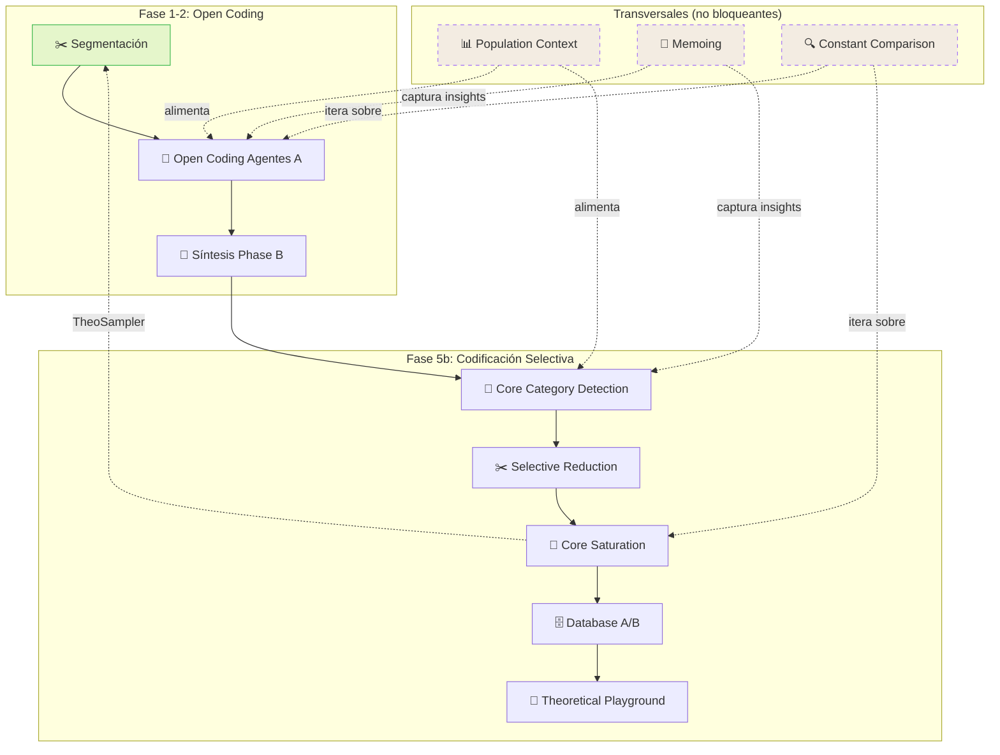

# Plan de Refactorización — Pipeline Flow Panel

> **Autor:** Especialista Frontend + Classic Grounded Theory (Glaser)  
> **Fecha:** 2026-06-16  
> **Estado:** En progreso  
> **Depende de:** `Patron_Desarrollo_Maestro.md`, `proceso-cgt.puml`

---

## ✅ Checklist

### Layout & Panel Derecho
- [x] Layout 2 columnas: docs (2/3) + pipeline panel (1/3)
- [x] Panel derecho sticky, scroll independiente
- [x] Toggle 📋 Logs ↔ 📊 Diagrama
- [x] Pipeline message con color condicional (rojo error, gris info)
- [x] Botón principal dinámico (▶ Continuar / 🔄 Re-ejecutar / 🧠 Ejecutar)
- [x] Botón 🔄 Forzar todo
- [x] Botón ⏹ Detener Pipeline (durante ejecución)

### Panel de Memos (Historial de Agentes)
- [ ] Sección de memos en panel izquierdo (2/3)
- [ ] Cards por cada resultado de agente (population context, process, prime mover, sense making)
- [ ] Color-coded por stage: ✂️ verde, 🧠 azul, 🔗 púrpura, 🎯 naranja
- [ ] Click expande card → parseo visual de JSON jerárquico key-value
- [ ] Agrupación por documento + stage
- [ ] Tags visuales por stage
- [ ] Scroll infinito / paginación
- [ ] Filtro por stage
- [ ] Orden cronológico inverso (más reciente primero)

### Nodos del Flujo (Diagrama)
- [x] 8 stages definidos en `PIPELINE_STAGES`
- [x] Estados visuales: pending (gris), running (violeta pulse), done (verde ✓), error (rojo ✕)
- [x] Nodos clickeables: done y error (no running ni pending)
- [x] Click en último done → reiniciar desde ese stage
- [x] Click en done anterior → advertir pérdida datos + reiniciar
- [x] Click en error → reintentar desde ese stage
- [x] `restartFromStage()` implementado
- [ ] Separar Population Context como nodo paralelo (no bloqueante)
- [ ] Visualizar dependencias entre stages (líneas de conexión no lineales)
- [ ] TheoSampler loop: saturate → segment (flecha de retorno)

### Logs en Vivo
- [x] Panel de logs con scroll, altura máxima 400px
- [x] 3 colores: 🔴 error, 🔵 stage activo, ⚪ info
- [x] Regex para detectar stage activo (`A1:`, `B2:`, `[COREF]`, etc.)
- [ ] "{Stage} iniciado" en cada log de inicio de etapa
- [ ] Auto-scroll al último log
- [ ] Limpiar logs al iniciar nuevo pipeline

### Lógica de Stages
- [x] `resetStages()` dinámico desde `PIPELINE_STAGES`
- [x] `updateStage()` genérico para cualquier key
- [x] `findLastCompletedIdx()` para detectar último nodo completado
- [x] `restartFromStage()` resetea stages posteriores
- [ ] Orquestador: despachar solo la etapa solicitada (no todo el pipeline)
- [ ] `runPipelineFromStage(stageKey)` — pipeline parcial

### Integración Backend
- [x] Pipeline log endpoint con `failed_tasks`
- [x] `on_failure` en `AbortableTask` actualiza `pipeline_tasks.status`
- [x] `stopProjectPipeline` purga colas Redis
- [ ] Endpoint para ejecutar pipeline desde stage específico
- [ ] Pipeline log incluye `current_stage` para el frontend

### HITL (Human-in-the-Loop)
- [ ] Modal HITL integrado en el panel derecho
- [ ] Gates visuales en el flujo (🛑)
- [ ] Estados de proyecto (`finding_cc`, `reducing`, `saturating`, etc.)
- [ ] Botones Aprobar / Modificar / Rechazar en el panel

### CGT — Classic Grounded Theory (Glaser)
- [ ] Flujo refleja emergencia natural (no forzada)
- [ ] TheoSampler es demand-driven, no pre-emptive
- [ ] Constant comparison visible en el flujo
- [ ] Memoing integrado como actividad transversal
- [ ] Core category emerge, no se fuerza

### Overlay Legacy
- [x] Panel derecho reemplaza al overlay (ya no es modal)
- [ ] Eliminar código del overlay antiguo (position:fixed modal)
- [ ] Migrar "Reintentar fallidas" al panel derecho

---

## 📐 Arquitectura del Panel Derecho

```
┌──────────────────────────────────────────┐
│  🔄 Flujo del Pipeline    [📋 Logs]      │  ← header + toggle
├──────────────────────────────────────────┤
│  ┌──────────────────────────────────┐    │
│  │ ❌ Falló: informe.pdf            │    │  ← pipelineMsg (condicional)
│  └──────────────────────────────────┘    │
│                                          │
│  ┌─ Flow Diagram ────────────────────┐   │
│  │                                   │   │
│  │  ●─── ✂️ Segmentación      ✓     │   │  ← done (clickeable)
│  │  │                                │   │
│  │  ●─── 🧠 Open Coding       …     │   │  ← running (animado)
│  │  │                                │   │
│  │  ●─── 🔗 Síntesis Phase B  ○     │   │  ← pending
│  │  │                                │   │
│  │  ●─── 🎯 Core Category     ○     │   │
│  │  │                                │   │
│  │  ●─── ✂️ Selective Reduction ○   │   │
│  │  │                                │   │
│  │  ●─── 🔄 Core Saturation    ○     │   │
│  │  │         │                      │   │
│  │  │         └── TheoSampler ──┐    │   │  ← flecha de retorno
│  │  │                           │    │   │
│  │  ●─── 🗄️ Database A/B   ○   │    │   │
│  │  │                           │    │   │
│  │  ●─── 🎨 Playground     ○    │    │   │
│  │                              │    │   │
│  │  ┌──────────────────────┐    │    │   │
│  │  │ 📊 Population Context│    │    │   │  ← nodo paralelo
│  │  │   (transversal)      │    │    │   │
│  │  └──────────────────────┘    │    │   │
│  └──────────────────────────────┘   │    │
│                                          │
│  ┌─ Actions ───────────────────────┐    │
│  │ [▶ Continuar]                    │    │
│  │ [🔄 Forzar todo]                 │    │
│  └──────────────────────────────────┘    │
└──────────────────────────────────────────┘
```

---

## 📝 Panel de Memos — Historial de Agentes

### Objetivo

Mostrar los resultados de cada agente como **cards interactivas** en el panel izquierdo,
agrupadas por documento y stage. Esto materializa el principio CGT de "todo es dato"
y permite **comparación constante** entre los outputs de distintos stages.

### Arquitectura

```
┌─ Panel Izquierdo (2/3) ──────────────────────────────────────┐
│ ┌─ Navbar ──────────────────────────────────────────────────┐ │
│ │ ← Proyectos    Proyecto X    [3 docs · 6 cats]            │ │
│ └──────────────────────────────────────────────────────────┘ │
│                                                               │
│ ┌─ Document List ───────────────────────────────────────────┐ │
│ │ 📄 informe.pdf          ✂️ Segmentado   [13 segs]         │ │
│ │ 📄 entrevista.txt       🧠 Con códigos  [8 codes]         │ │
│ └──────────────────────────────────────────────────────────┘ │
│                                                               │
│ ┌─ Memo History ────────────────────────────────────────────┐ │
│ │ 📝 Historial de Memos    [🧠 Agents] [🔗 Synthesis] [All] │ │  ← filtros
│ │                                                             │ │
│ │ ┌─ 🧠 A1 · informe.pdf ──────────────────────────────┐    │ │
│ │ │ surprising_details: "Los participantes..."           │    │ │  ← collapsed
│ │ │ language_patterns: "Uso recurrente de..."           │    │ │
│ │ │ ▼ Expandir                                          │    │ │
│ │ └────────────────────────────────────────────────────┘    │ │
│ │                                                             │ │
│ │ ┌─ 🧠 A2 · informe.pdf (expandido) ──────────────────┐    │ │
│ │ │ {                                                   │    │ │
│ │ │   "process_description": "Gestionando el conflicto  │    │ │  ← expanded
│ │ │     entre necesidad material y autocuidado...",      │    │ │
│ │ │   "is_first_document": false,                       │    │ │
│ │ │   "has_comparison": true                            │    │ │
│ │ │ }                                                   │    │ │
│ │ │ ▲ Colapsar                                          │    │ │
│ │ └────────────────────────────────────────────────────┘    │ │
│ └──────────────────────────────────────────────────────────┘ │
└───────────────────────────────────────────────────────────────┘
```

### Color por Stage

| Stage | Color | CSS |
|-------|-------|-----|
| ✂️ Segmentación | Verde | `#3FB950` |
| 🧠 Open Coding (A1-A3) | Azul | `#58A6FF` |
| 🔗 Síntesis (B1-B3) | Púrpura | `#A371F7` |
| 🎯 Core Category | Naranja | `#D29922` |
| ✂️ Selective Reduction | Rojo suave | `#F85149` |
| 🔄 Core Saturation | Cyan | `#79C0FF` |
| 🗄️ Database A/B | Verde oscuro | `#56D364` |
| 🎨 Playground | Rosa | `#F778BA` |

### JSON Visual Parser

Cada card expandida parsea el JSON jerárquico:
- **Strings largos** (>100 chars): bloque de texto con fuente monospace
- **Strings cortos**: inline con comillas
- **Booleanos**: badge verde/rojo (`true` / `false`)
- **Números**: monoespaciado
- **Arrays**: lista con bullets
- **Objetos anidados**: indentación progresiva con línea vertical
- **Null/undefined**: `—` en gris

### Fuente de Datos

Los memos vienen de la DB:
- `population_contexts` → A1 results
- `document_processes` → A2 results  
- `prime_mover` field en `document_processes` → C06 results
- `sense_making` (via A3) → project-level
- `categorias` → B2 open coding results
- `codigos_segmento` → B2.5 grounding results
- `memos` table → memoing explícito

---

## 🔗 Grafo de Dependencias (CGT)

Basado en `proceso-cgt.puml` y `Patron_Desarrollo_Maestro.md §0.1`:



### Secuenciales (deben ejecutarse en orden)
| Orden | Stage | Depende de | Output |
|-------|-------|-----------|--------|
| 1 | `segment` | Documentos subidos | Segmentos |
| 2 | `agents` | Segmentos | Códigos abiertos, population context |
| 3 | `synthesis` | ≥3 docs `listo` | Códigos cross-documento, grounding |
| 4 | `find_cc` | Todos los códigos, memos | Main concern, core category |
| 5 | `reduce` | Core category | Sistema de códigos reducido |
| 6 | `saturate` | Códigos reducidos | Categorías saturadas |
| 7 | `build_db` | Categorías saturadas | Nodos + relaciones |
| 8 | `playground` | DB completo | Theoretical playground |

### Paralelos / Transversales (no bloquean el flujo principal)
| Stage | Se actualiza durante | Nota CGT |
|-------|---------------------|----------|
| Population Context | `agents`, `find_cc` | Emerge de los datos, no se fuerza |
| Memoing | `agents`, `synthesis`, `saturate` | Captura inmediata de insights (Glaser: "stop everything, write memo") |
| Constant Comparison | `agents`, `saturate` | Comparación constante de incidentes |
| TheoSampler | `saturate` | Muestreo teórico demand-driven |

---

## 🎯 Próximos Pasos (priorizados)

### Fase 1 — Completar Panel Derecho (AHORA)
1. [ ] `runPipelineFromStage(stageKey)` — ejecutar solo una etapa
2. [ ] Orquestador soporta `stage` parameter
3. [ ] Eliminar overlay modal antiguo
4. [ ] "{Stage} iniciado" en logs de worker
5. [ ] Auto-scroll en panel de logs

### Fase 2 — Stages No Secuenciales
6. [ ] Nodo Population Context (paralelo, dashed border)
7. [ ] Flecha TheoSampler: saturate → segment
8. [ ] Líneas de dependencia visuales (no solo secuenciales)
9. [ ] Tooltips con descripción de cada stage

### Fase 3 — HITL Gates
10. [ ] Gates visuales en el flujo (🛑)
11. [ ] HITLModal embebido en panel derecho
12. [ ] Estados de proyecto en el pipeline log

### Fase 4 — CGT Completo
13. [ ] Panel de Memoing integrado
14. [ ] Indicador de Constant Comparison activo
15. [ ] Visualización de saturación teórica por categoría

---

## 🧠 Notas CGT (Glaser)

### Principios que el frontend debe reflejar:

1. **Emergencia, no forzamiento** — El pipeline no debe imponer un orden rígido. Las etapas paralelas (Population Context, Memoing) deben ser visibles como actividades transversales.

2. **Todo es dato** — Cada log, cada memo, cada código es dato. El panel debe permitir navegar entre ellos sin perder contexto.

3. **Comparación constante** — El flujo debe sugerir visualmente que la comparación es continua, no un paso discreto.

4. **Muestreo teórico** — TheoSampler no es "recolectar más datos", es "buscar datos que resuelvan preguntas teóricas específicas". La flecha de retorno `saturate → segment` debe etiquetarse como "Demanda teórica".

5. **Core category emerge** — No se "elige" la core category. El stage `find_cc` debe reflejar que es un proceso de detección, no de selección.

6. **Memoing inmediato** — Glaser insiste: "stop everything and write the memo". El botón de memo debe ser accesible en cualquier momento, desde cualquier stage.

---

## 📊 Estados de Stage

```typescript
type StageStatus = "pending" | "running" | "done" | "error";

interface StageNode {
  key: string;
  icon: string;
  label: string;
  status: StageStatus;
  dependsOn: string[];      // keys de stages que deben estar "done"
  isParallel: boolean;       // true si es transversal/no bloqueante
  description: string;       // tooltip
}
```

### Ejemplo:
```typescript
const PIPELINE_STAGES: StageNode[] = [
  { key: "segment",    icon: "✂️", label: "Segmentación",              dependsOn: [],        isParallel: false },
  { key: "agents",     icon: "🧠", label: "Open Coding (Agentes A)",   dependsOn: ["segment"], isParallel: false },
  { key: "pop_context",icon: "📊", label: "Population Context",        dependsOn: [],        isParallel: true  },
  { key: "synthesis",  icon: "🔗", label: "Síntesis Cross-Doc",       dependsOn: ["agents"], isParallel: false },
  { key: "find_cc",    icon: "🎯", label: "Core Category Detection",   dependsOn: ["synthesis"], isParallel: false },
  { key: "reduce",     icon: "✂️", label: "Selective Reduction",       dependsOn: ["find_cc"], isParallel: false },
  { key: "saturate",   icon: "🔄", label: "Core Saturation",           dependsOn: ["reduce"], isParallel: false },
  { key: "build_db",   icon: "🗄️", label: "Database A/B",             dependsOn: ["saturate"], isParallel: false },
  { key: "playground", icon: "🎨", label: "Theoretical Playground",    dependsOn: ["build_db"], isParallel: false },
];
```

---

## 🔄 Flujo de Interacción

```
Usuario ve panel derecho
  │
  ├─ Pipeline no iniciado
  │   └─ Click [▶ Ejecutar Pipeline IA]
  │       └─ runPipeline(false) → orchestrator → polling → stages update
  │
  ├─ Pipeline en progreso
  │   ├─ Nodos running: animación pulse violeta
  │   ├─ Logs: toggle para ver progreso detallado
  │   └─ Click [⏹ Detener]
  │       └─ abortRef = true → stopProjectPipeline → resetStages
  │
  ├─ Pipeline completado (todos done)
  │   ├─ Click en último nodo done → restartFromStage
  │   ├─ Click en nodo done anterior → confirm → restartFromStage
  │   └─ Click [🔄 Forzar todo] → runPipeline(true)
  │
  └─ Error detectado
      ├─ Nodos error: rojo ✕
      ├─ PipelineMsg: "❌ Falló: doc.pdf"
      └─ Click en nodo error → restartFromStage
```
