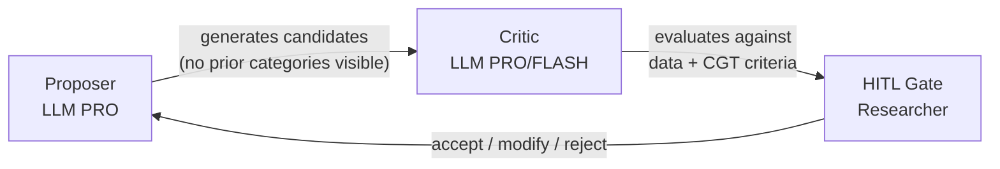
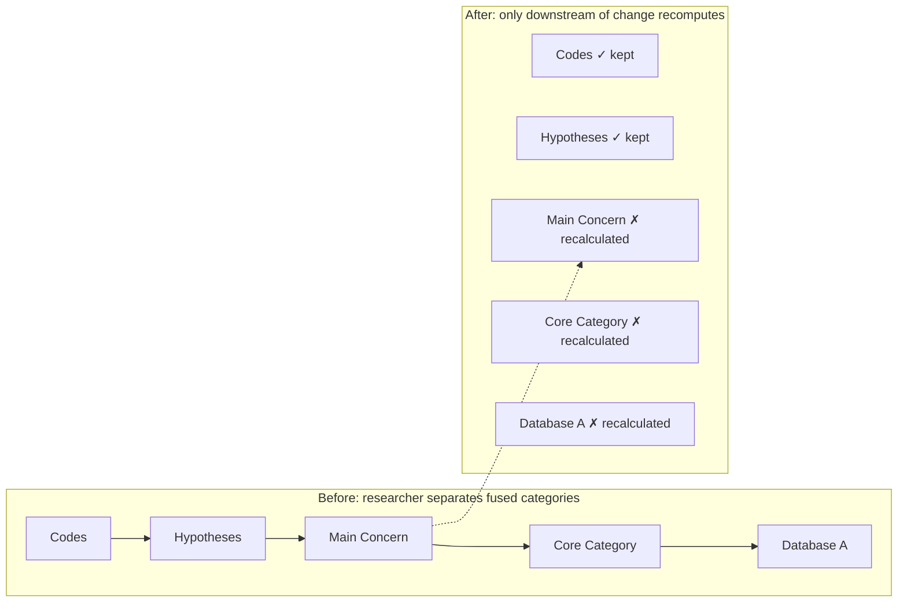

# Automating Classic Grounded Theory: When Automation Enforces the Method Better Than Humans Can

---

## Abstract

Classic Grounded Theory (CGT) demands cognitive resources that often exceed human capacity. This paper presents a computational system that operationalizes CGT through a multi-agent architecture, demonstrating that principled automation can achieve greater methodological fidelity than manual practice alone. The system implements a Proposer→Critic→Human-in-the-Loop pattern that mirrors Glaser's constant comparative method while resolving five critiques he leveled against qualitative software: forcing, code-and-retrieve limitations, degraded theoretical pacing, memo marginalization, and the shift from discovery to justification logic. Computational isolation of proposing from criticizing mitigates confirmation bias. Foreign-key provenance replaces semantic similarity searches. Deliberate pauses restore the reflective space that manual methods require but often shortcut. The paper argues that automation, designed from CGT's epistemological commitments rather than retrofitted from generic qualitative software, does not replace theoretical sensitivity — it creates the conditions for it to flourish.

---

## 1. Introduction

Paucar Villacorta (2020) studied recycling families in Lima. To survive, these families engage in *recurseo de relaciones personales* — a constant search for an ideal productive family type through requesting favors, depending on others, and, in critical cases, deploying child labor. The theory names a defined population's central concern and explains how it is continuously resolved. It fits its reality. It produces actionable knowledge: recyclers, though appearing unsanitary, divide their homes and health protocols efficiently, since illness or accident means lost income. They do not need health policies. They need labor security, cooperative facilitation, and family support.

Contrast this with Gonzáles and "Carrera del Estigma Territorial," which claims to explain how 65,000 residents of La Perla, Callao, navigate capitalist encroachment through spatial strategies — from fifteen interviews. A CGT practitioner would identify it as *a priori* theorizing and note the risk of misguided policy derived from systematically biased information.

The contrast exposes CGT's predicament. Done rigorously, the method produces theories of striking precision. But rigor demands a parallel zig-zag of collection and analysis, theoretical sampling until the theory stabilizes, and an uninterrupted cognitive rhythm that most researchers — facing deadlines, fatigue, and institutional pressure — cannot sustain. Practitioners distrust qualitative analysis software (CAQDAS), and with reason: programs like ATLAS.ti exhibit hallucinations, over-coding, and a striking absence of tools for synthesis. The founders themselves distrusted methodological variation. Yet Glaser insisted, in essays from 1995 and 2010 and in personal communication (Paucar, 2016), that grounded theory is a general method where the main concern must emerge, not be preconceived.

This paper presents a system that operationalizes CGT through a multi-agent computational architecture. We argue that principled automation — designed from CGT's epistemological commitments rather than retrofitted from generic qualitative software — can enforce the method's discipline more consistently than manual practice alone.

---

## 2. Background

### 2.1 Classic Grounded Theory

CGT is an inductive methodology developed by Glaser and Strauss (1967) whose purpose is to generate theory from data, not to verify existing hypotheses. The researcher enters the field without preconceived theories and allows concepts, categories, and their relationships to emerge through systematic comparison. Despite its apparently clear definition, grounded theory has divided into several variants, the most popular being the Straussian approach focused on actions, causes, and consequences (Paucar, 2016). CGT proper is a process of progressive abstraction: from concrete incidents toward behavioral patterns that explain how participants continuously resolve their concerns.

The researcher begins with a general area of interest, not a closed question. Initial sampling is deliberately open — anyone who can illuminate what is happening. Existing literature is reserved for later, when the theory has emerged and can engage it as data for constant comparison.

When reading a participant's account, the researcher asks four questions: What is this incident about? What category does it indicate? What is actually happening here? What is the participant's main concern? Coding is agile — rapid annotations of one or two words, preferably gerunds capturing process: "avoiding," "negotiating," "credentialing." If an incident reveals no clear pattern, it is noted and the researcher moves on, trusting that preconscious processing will detect recurrence as dozens of incidents accumulate.

Coding is not an end. As soon as a pattern emerges, mechanical coding stops and an analytical memo begins. The memo transforms observation — "these three interviewees mention feeling threatened by AI" — into a tentative theoretical idea — "perceiving professional obsolescence triggers adaptation strategies." When a later interviewee feels threatened yet does not adapt, the memo sharpens: "Perceived threat triggers adaptation — unless the professional lacks maneuvering room within the organization."

It is crucial to distinguish this from Strauss and Corbin's (1990) "axial coding," a paradigm that deductively forces the search for causal conditions, contexts, and consequences. CGT rejects this prior categorization. Categories earn their relevance by emerging organically from iterative incident comparison.

From all emerged categories, the researcher identifies which one processes or resolves participants' recurrent central concern. This core category must be central, frequent, and possess high explanatory power. Categories unrelated to it are set aside. The rest must pass through property saturation: for each property of the core category, the researcher seeks variant incidents in extreme cases. When an incident of "gratitude" appears alongside others of "contempt," the concept is not split — it is elevated. The category is renamed "Feeling the Weight" and its definition now encompasses both poles.

Once no further variations are found, the researcher takes all accumulated memos and physically organizes them into piles, testing different theoretical codes — drawn from the twelve coding families (Holton & Walsh, 2016) such as "spiral," "strategy," "stages," or "contradiction" — that act as the cement binding the theoretical edifice. Memos that fit no group signal gaps where conceptualization remains weak. Finally, the theory is written in present tense, about concepts not people, at a level of abstraction that makes it transferable to other contexts where the same behavioral pattern occurs. CGT publications are evaluated on four criteria: fit, work, relevance, and modifiability.

### 2.2 CAQDAS and Straussian Grounded Theory

Early qualitative software was viewed with skepticism — statistical calculators, not analytical partners. The advent of CAQDAS changed this by providing systematic environments for textual management and coding. Software such as ATLAS.ti and NVivo explicitly mirrored the Straussian coding paradigm: open coding (tagging text), axial coding (network views of relationships), and selective coding (core storyline). As Wiedemann (2016) notes, "data representations and analysis functions in ATLAS.ti for example were mainly replicating concepts known from Grounded Theory Methodology" (p. 44, citing Mühlmeyer-Mentzel, 2011).

In this era, the computer's role was strictly supportive. Kelle (1997) observed that "none of these steps can be conducted with an algorithm alone […] the analysis itself is always done by a human interpreter" (as cited in Wiedemann, 2016, p. 43). The computer's role remained restricted to "intelligent archiving." CAQDAS provided an audit trail — code families, digital memos linked to quotes, visual code co-occurrence maps — that elevated the transparency of Straussian grounded theory. But it never crossed the line from archivist to analyst.

### 2.3 AI-Assisted Qualitative Analysis

Large Language Models have shifted software's role from passive archive to active analytical partner. Gupta (2024) notes that AI coding in ATLAS.ti 23 "saves researchers time on data analysis and coding" by analyzing data and retrieving results "in a multifaceted format" (p. viii). Goyanes et al. (2025) identify four roles ChatGPT fulfills in thematic analysis: standardizing coding, minimizing individual biases, enhancing efficiency through rapid processing, and identifying emerging themes (p. 5492).

Despite these advances, AI remains a heuristic tool rather than a definitive interpreter. Goyanes et al. conclude that ChatGPT "is unable to substitute the contextual insights and subtle metaphorical nuances associated with human qualitative analysis, interpretation and reflexivity" (p. 5491). The software has crossed from archive to analytical partner, but the researcher still bears the burden of theoretical synthesis.

### 2.4 AI-Assisted Grounded Theory and Abductive Analysis

Nelson (2020) conceptualized "Computational Grounded Theory" — a framework merging deep, inductive human analysis with machine learning pattern recognition. Modern approaches increasingly rely on abductive logic: identifying anomalous empirical observations and generating provisional hypotheses to explain them.

Applying AI to Grounded Theory poses unique challenges. Machine learning models find statistical regularities, making them ill-equipped to spot the qualitative anomalies that drive abductive theory building. Vila-Henninger et al. (2024) articulate this clearly: "both grounded theory coding schemes and machine learning algorithms might have serious issues identifying anomalies in the data: the former for epistemological reasons as without preexisting theories, empirical observations cannot be deemed surprising; the latter for practical reasons. Anomalous cases are by definition unforeseen and their detection often warrants substantial expert knowledge" (p. 13). To address this, researchers propose combining human-driven abductive codebooks with AI scaling: once human researchers identify anomalous patterns and create an established codebook, they train supervised algorithms to analyze the remainder of a massive corpus (Vila-Henninger et al., 2024).

### 2.5 Glaser's Critique of CAQDAS

Glaser's opposition to CAQDAS is epistemological, not technical. He viewed software as facilitating the "forcing" of data rather than its "emergence." The "Strauss line," he maintained, departed from original orthodoxy precisely through its reliance on computer-assisted verification and description (Andréu Abela et al., 2007, p. 2). Software, in his view, extends the Straussian move toward a "logic of justification," prioritizing systematic rules over the circumstantial, non-rational process of discovery.

Glaser argued that software creates a "distancing" effect — fragmenting the researcher's focus, keeping the analyst at the level of data description rather than propelling them toward conceptual leaps. The mind must remain the "primary instrument," engaged in a fluid, unmediated relationship with raw data. By automating code linking, CAQDAS removes the "theoretical pacing" necessary for deep reflection. Memos — the "heart" of the method — are reduced to secondary attachments, losing their integrative power. The shift from discovery logic to justification logic transforms the researcher from theorist to verifier.

Central to this defense is *theoretical sensitivity* — "the acuity of the researcher" and the capacity for "learning to think theoretically" (Gibson & Hartman, 2014, p. 63). Manual rigor, Glaser insisted, protects this acuity from being stifled by software's rigid structures. When the analyst's purpose becomes the specifying of discrete data units, software "stifles his chances for generating to a greater degree than with any other use of comparative analysis" (Glaser & Strauss, 1967, as cited in Gibson & Hartman, 2014, p. 14).

**Table 1: CGT, CAQDAS, and the Proposed System Compared**

| Dimension | Manual CGT | CAQDAS | Our System |
|-----------|-----------|--------|------------|
| Theoretical Pacing | Intentional immersion; cognitive synthesis through physical memo manipulation | High-speed processing; risks skipping reflective phases | Deliberate pauses every 3 documents; cascade propagates corrections cheaply, making iteration affordable |
| Conceptualization | Moves from incidents to high-level categories through constant comparison | Stifles generation; traps analyst in description via predefined code lists | Proposer generates concepts without seeing prior categories; Critic evaluates against data; researcher decides |
| Memo Integration | Memos are central; manually sorted into piles to test theoretical codes | Memos reduced to secondary attachments linked to specific quotes | Ghost-blobs: draggable visual entities absorbable into categories, expanding definitions and triggering rename suggestions |
| Analyst's Role | Acuity is primary instrument; discovery is fluid and circumstantial | Software as epistemological barrier; verification logic dominates | HITL gates: system proposes groupings, labels, relations, and renames, presents evidence with provenance, then yields for human decision |
| Forcing | Researcher must vigilantly avoid imposing prior categories | Software facilitates forcing through predefined code lists and drop-down menus | Extractor and grouper agents are architecturally isolated from prior categories; each document processed without access to existing codebook |
| Evidence | Implicit in researcher's memory; traced through accumulated memos | Code-quote links; embedding-based semantic similarity search | Foreign-key provenance: any proposition traces to exact source text with document ID and segment index |

### 2.6 Why This System Is Different

The system we present crosses the line that CAQDAS never could. Kelle's (1997) assessment that the computer remains restricted to "intelligent archiving" no longer describes what is possible. Our architecture proposes groupings, labels, relationships, and concerns — then critiques its own proposals, surfacing evidence for and against each suggestion before yielding to the researcher. It is an interlocutor, not an archivist.

This posture rests on the Proposer→Critic→Human-in-the-Loop pattern, which operates as an architectural antidote to forcing. The proposing agent reads raw text without access to the existing codebook. The critic evaluates the proposal against explicit CGT criteria. Only then does the human decide. The cycle does not claim to eliminate bias; it surfaces it and makes it contestable. Because the proposer is isolated from prior categories, each document gets a fresh inductive reading — the opposite of the drop-down code menu Glaser deplored.

The pipeline restores theoretical pacing through deliberate pauses every three documents. These are not inefficiencies; they are the method functioning. The researcher must review, reject, or refine before the system proceeds. A cascade mechanism ensures that changing a label or splitting a merged category recalculates only dependent components, making a decision at document twenty as cheap as one at document three. This removes the cost gradient that drives researchers to defer difficult judgments until recovery is impossible.

The system also rescues memos from secondary status. Ghost-blobs — draggable visual entities on a theoretical playground — can be absorbed into categories, expanding their definitions and potentially triggering rename suggestions. When a category accumulates three definition versions, doubles its properties, or triples its incident count, the rename suggester proposes names at three levels of abstraction: conservative, moderate, and transformative. Renaming becomes theoretical elevation, not a database operation, with full version history preserving traceability. This reverses the CAQDAS relationship: categories grow by consuming memos, rather than memos being notes attached to categories.

A further contribution is the treatment of divergence. When an incident does not fit an existing relationship, the system does not hide or discard it. It exhibits the misfit as a golden fissure — an expansion opportunity the researcher can inspect. No CAQDAS possesses the semantic comprehension to recognize that a misfit is theoretically significant rather than merely unlabeled.

These advances do not mean AI resolves every problem Glaser identified. Some it may worsen. The most seductive is the objectivity illusion. Goyanes et al. (2025) claim ChatGPT can "minimize individual biases" (p. 5492). From a CGT standpoint, this is profoundly anti-Glaserian. The researcher's unique perspective is not noise to be eliminated; it is an analytical instrument. Pretending an LLM eliminates bias is positivism disguised as innovation, and worse, the LLM introduces opaque, training-distribution biases the researcher cannot interrogate.

A second persistent problem is the invisible anomaly. LLMs are pattern completers trained to find statistical regularities. Grounded theory builds on the anomalous — the incident of "contempt" that refuses to fit "gratitude" and transforms the category into "Feeling the Weight." As Vila-Henninger et al. (2024) note, anomalous cases "are by definition unforeseen." The system can detect divergence relative to known properties, but a genuinely novel anomaly outside the model's training distribution may be forced into an existing category or ignored. An Anomaly Preservation Module is designed but not yet implemented.

A third concern is the role of literature. Most AI-assisted qualitative applications integrate literature from the start as an authoritative framework, inverting CGT's deliberate sequencing. Our system enforces the correct order architecturally: literature review is gated behind core category emergence and treated as further incidents for constant comparison.

Throughout, the researcher remains at the center. Where the AI-assisted literature measures success in time saved and volume processed (Gupta, 2024; Goyanes et al., 2025), our system measures it in conceptual density and traceability of every theoretical decision. The pause is not an inefficiency; the cascade is not a convenience. Both are commitments to the method's epistemology. Three limitations remain unresolved: the preconscious processing of physical memo manipulation — the "drugless trip" of sorting paper on a table — has no digital equivalent; detection of genuinely novel anomalies outside the training distribution remains a structural vulnerability; and autonomous theoretical sampling requires the empathic field engagement that only a human researcher can exercise.

---

## 3. System Architecture

> This chapter follows a single example throughout: ten interviews with journalists who cover technology. The system knows nothing about journalism. It knows only what the researcher tells it: "find this group's recurrent concern."

### 3.1 Design Principles

Three principles govern every decision the architecture makes.

**Isolate proposing from criticizing.** The proposer never sees existing categories. A different model critiques, and only against the data. The human decides. Three roles, never blurred. This prevents the confirmation bias that manual researchers face: the tendency to read new data through categories already in mind.

**Follow evidence; never search for it.** Every theoretical proposition traces by foreign key to the exact segment that generated it. There is no semantic similarity search in the central pipeline. Evidence is provenance, not proximity. Two segments can be semantically similar without being conceptually equivalent; two can be conceptually equivalent using entirely different words. The embedding sees words. The foreign key sees origin.

**Decelerate deliberately.** The system pauses every three documents and waits for the researcher's decision. This is not inefficiency. It restores the theoretical pacing that manual practitioners sacrifice when deadlines press, and it ensures the researcher stays present in the analysis rather than receiving a finished product weeks later.

### 3.2 The Core Rhythm

Every theoretical decision, from the smallest incident assignment to the naming of the core category, follows the same three-part cycle.

```
LLM PROPONES (without seeing what already exists)
  → LLM CRITIQUES (against data, not opinions)
    → RESEARCHER DECIDES
```

Why this rhythm? Qualitative research has an oldest problem: once a researcher holds provisional categories, new data gets forced into them. It is not carelessness. It is how cognition works. The system resolves it with a brutal rule: the proposer sees nothing that already exists. When extracting incidents from a new interview, the extractor receives no categories discovered in previous interviews. Each transcript is read fresh. If the extractor saw existing categories, it would force new incidents to fit them — exactly what a human researcher does without noticing.



Three roles, always separate. The one who proposes never critiques. The one who critiques never decides. The decision is the researcher's.

### 3.3 Phase One: Per-Document Processing

Back to the journalists. You upload ten transcripts. Before the system reads a single line, it asks three questions. Only three.

First: your population. "Journalists covering technology in Spanish-language digital media." That is all. No hypotheses, no theoretical framework, no variables. The system wants to know who you are studying. An agent generalizes your description so the resulting theory becomes transferable — "Information professionals operating in media environments with high technological mediation" — and asks if you agree. If not, you edit it.

Second: the pattern type. Five options: concern, emotion, behavior, discourse, identity. You choose *concern*. This tells the system its role is layman — an observer without preconceptions — and that its codes will be gerunds: "Negotiating," "Avoiding," "Scanning." Had you chosen *emotion*, it would code with nouns: "Anxiety," "Frustration," "Relief."

Third: optional help. You can offer hints about your population. The system works without them.

These three questions are not administrative formalities. They anchor the lens through which the system will read your data. And once answered, the system falls silent. Glaser insisted the researcher must not interfere during open coding. The system complies: it works, and it does not speak again until it has something to show.

Then, for each document, two steps.

**Step 1: Glaser Data Classification.** An agent reads the complete interview and classifies every segment into four categories drawn directly from Glaser. *Baseline data* — gold: what the journalist says spontaneously, actual experience. "Every morning I log in and the algorithm has already assigned me forty stories. I can't reject them." *Properline data* — silver: normative discourse, what they believe they should say. "Well, as a journalist one must be objective, right?" *Interpreted data* — bronze: opinion forced by the interviewer's question. "What do I think of AI? It's a complex topic..." *Vague data*: evasion. "I don't know, I honestly don't have a formed opinion."

Only baseline advances. This is not quality control; it is a methodological decision. If you code properline data believing it is experience, your theory will describe social norms, not behavior. If you code interpreted data, you will describe what the interviewer wants to hear.

**Step 2: Unified Extraction.** With the gold segments identified, the system makes a single call to the PRO model. In that call, it simultaneously extracts incidents — one- or two-word gerund jots, each linked to its exact source segment — and detects the individual pattern for this particular journalist. "For this journalist, the recurring pattern appears to be *Monitoring Technical Obsolescence*," it reports, with supporting quotations and a confidence level.

Previously, extraction and pattern detection ran as separate agents. The problem was that the second agent worked with incidents extracted by the first through a different lens. Unifying them into a single call ensures the same model that identifies incidents also detects what unites them. It is more coherent, faster, and methodologically sounder.

The researcher does not intervene during this phase. The system repeats the process for each interview, in parallel where it can. At the end, ten individual patterns and hundreds of incidents exist. But no shared categories. Not yet.

### 3.4 Phase Two: Cross-Document Synthesis

Now the system gathers every incident from all ten interviews and places them on the table. Literally: it loads them into a single PRO model call and asks the model to group them.

This is where the architecture diverges most radically from both traditional CAQDAS and contemporary AI coding tools.

**Single-pass grouping.** The instruction is simple: group these incidents by behavioral pattern. Two incidents with different words can evidence the same pattern. Two incidents with similar words can evidence different patterns. There is no pre-filtering by embedding similarity. No pairwise comparison. No clustering algorithm. The model sees patterns *across* documents — an incident in interview three can illuminate one in interview seven in ways that pairwise comparison structurally cannot. It returns groups: "Scanning the Threat Horizon," fourteen incidents from seven different journalists. "Negotiating with the Algorithm," eleven incidents from five. "Hiding Technical Dependence," eight from four. And so on.

**Labeler-critic conversation.** Groups exist but need names, definitions, and internal structure. A Labeler — another PRO agent — proposes, for each group, a gerund-form label, writes an initial definition, and identifies variations. "This group concerns how journalists monitor technological changes that threaten their skills. Proposed label: *Scanning the Threat Horizon*. Variations include short-term versus long-term threats, technical versus professional threats."

Then a Critic enters — a FLASH model, faster and cheaper. It does not issue verdicts. It gives observations. "The label captures monitoring but misses the anxiety present in incidents three, seven, and nine. Could you incorporate the emotional dimension?"

The Labeler receives the feedback and refines. The Critic evaluates again. Up to three rounds. This is a generative conversation, not a tribunal. The critic never halts the pipeline; labels are saved as they are, with their full refinement history, for the researcher to review later. The critic suggests. It does not decide.

**Isolation.** Neither the Grouper nor the Labeler sees existing categories from previous batches. They see only the incidents of the current batch. If they saw what already exists, they would force new incidents into old molds — exactly what a human researcher would do. Isolation is the system's defense against its own bias.

### 3.5 The Pause

Every three documents, the system stops.

It displays four panels simultaneously. Unified categories — the ones just discovered, compared against those from earlier batches, merged where they describe the same phenomenon. Accumulated hypotheses — everything the system believes so far about how categories relate. "*Scanning the Horizon* consistently precedes *Negotiating with the Algorithm* in seven of ten interviews." Candidate concerns — given the emerging patterns, what appears to be this group's central worry? Configuration review — is the population well-defined? Are there subgroups? Is the coding style producing useful codes?

Then the system goes quiet and waits. The pipeline does not advance until the researcher decides.

This pause is not a limitation. It is a methodological device. Three documents is the sweet spot: enough material has accumulated for informed intervention, not so much that intervention becomes overwhelming. The researcher stays present in the analysis rather than receiving a finished product weeks later with no memory of how it got there.

### 3.6 The Cascade

Imagine you are in the pause after batch two. The system has fused "Scanning the Horizon" with "Monitoring Technical Change." You believe they are distinct. You separate them.

The system does not simply save your edit. It identifies every component that depends on the fusion and recalculates only those. Categories that never referenced either label remain intact. Hypotheses that involved neither remain intact. But everything built on the fusion — hypotheses that mentioned it, conceptual relationships that crossed it — is erased and recomputed.

Twenty seconds later, a consequence appears that you did not anticipate: a hypothesis that relied on the fusion now collapses. In its place, a new relationship between the separated categories emerges.



This matters because manual CGT makes correction punishingly expensive. When you change your mind about a category, you must manually recode everything that category touched. The cost is so high that researchers often accept mediocre categories rather than redo weeks of work. The cascade makes correction cheap. When correction is cheap, researchers correct more. Theory improves.

### 3.7 Evidence by Provenance

In most AI-assisted qualitative tools, asking "what evidence supports this category" triggers a semantic similarity search. The system finds segments whose embeddings are close to the category's embedding. Fast, but fragile. Similar embeddings do not guarantee conceptual equivalence. Two segments can be semantically similar without meaning the same thing. Two segments can mean the same thing using entirely different vocabulary. The embedding sees words; it does not see concepts.

This system does not search for evidence. It follows it.

Every incident, from the moment of extraction, carries a database foreign key to its exact source segment. The chain is explicit: Category → Incident Group → Individual Incidents → Source Segments → Verbatim Quotes. Any theoretical proposition traces down to the citation that generated it. No embeddings. No similarity queries. Evidence is provenance, not proximity. The data that generated the concept is the evidence — not the data that looks like it.

### 3.8 What the System Deliberately Does Not Do

Three absences define the architecture as much as its positive features.

The system does not search literature during analysis. Literature enters only at the end, when the theory is complete. Papers become new interviews: incidents are extracted, coded against the theory's categories, and evaluated for whether they extend, modify, integrate, or transcend. The system never says "Foucault already said this" during coding. That would treat literature as authority, and in CGT the authority is the data.

The system does not use semantic search in the central pipeline. Retrieval endpoints exist in the backend. The coding pipeline never invokes them. Evidence follows foreign keys, not embedding proximity. Introducing semantic search would inject the very ambiguity the architecture exists to eliminate.

The system does not decide. At seven human-in-the-loop gates, the pipeline halts and presents a proposal alongside a critique. The accept button belongs to the researcher. CGT cannot be automated because theoretical judgment is human. The system proposes, critiques, and shows evidence. The theory is yours.

Beneath these absences runs a discipline of precision. Ninety-six agents produce structured JSON against explicit schemas — contracts that declare exactly which fields each agent will produce, of what type, and which are required. The consuming agent knows precisely what to expect. No ambiguity. No interpretation. The system operates in four languages; every schema exists in Spanish, English, German, and Portuguese. The structure is identical; only the descriptions change. A journalist in Madrid and one in Berlin run through the same pipeline.

This discipline extends to the models themselves. PRO — DeepSeek V4 Pro, generating 8192 tokens at temperature 0.3 — handles creation: proposing concerns, grouping incidents, writing theoretical sections. FLASH — Nemotron 550B, generating 4096 tokens at temperature 0.1 — handles verification: evaluating labels, checking saturation, catching gaps. The expensive model generates. The cheap model verifies. It is a cost optimization in service of methodological viability; without it, the system could not exist at scale.

---

## 4. Implementation

### 4.1 Methodological Foundations

Classic grounded theory (CGT) carries an ambiguity of origin. The formula that the method "studies how a population resolves its main concern" does not appear in Glaser and Strauss (1967). It consolidated later and encloses the method in a corset Glaser himself did not consistently maintain. Across decades his position was broader: grounded theory is a general method applicable to any data (Glaser, 2010); the main concern must emerge, not be preconceived (personal communication, 2016); and the core operation is constant comparison toward latent pattern discovery (Glaser, 1995).

The system adopts this broader formulation. The researcher describes the population and selects a pattern type — concern, emotion, behavior, discourse, or identity. From these two decisions, the system constructs the operational question. The defaults are intentional: how a population processes its central concern. But they are modifiable. This formulation draws on Booth et al. (2016), who define a research question as the sum of a population, a category within that population, and a question type, and on Abbott (2016), whose work on digital literacy informs how computational systems should handle qualitative inquiry.

The system also incorporates Glaser's five data types (1995) as a mandatory preprocessing layer. An agent classifies every segment as baseline (spontaneous participant experience), properline (what the participant believes they ought to say), interpreted (opinion forced by the interviewer's question), vague (evasion that may signal taboo topics), or conceptual (metaphors and jargon that encode more than they appear to). Only baseline data advances to coding; the rest is archived as context. This is a methodological decision that prevents the resulting theory from describing social norms as if they were behavior.

### 4.2 Development Trajectory

The system began as an N8N prototype — a deliberate experiment to discover which parts of CGT were hardest to automate. Two bottlenecks emerged immediately.

First, iterative incident extraction was slow, expensive, and inconsistent. Processing each segment with a separate LLM call produced different labels for the same phenomenon depending on where it appeared in the transcript. A participant seeking validation in one segment became a participant needing approval in the next — noise that corroded the constant comparison that follows extraction. The solution was to unify extraction and individual pattern detection into a single PRO call per document. One model sees the entire interview, identifies all incidents, and detects the pattern that connects them, in one pass.

Second, constant comparison scaled quadratically. One hundred incidents require 4,950 pairwise comparisons; five hundred require over 124,000. A naive pairwise approach was computationally and economically inviable. The solution was to replace pairwise comparison with single-pass conceptual grouping: all incidents go to the model together, with no pre-filter and no clustering algorithm. The model groups them in one pass, perceiving patterns across documents in ways pairwise comparison could not.

These two discoveries — unify extraction, group in one pass — defined the production architecture that followed.

### 4.3 Technical Architecture

The production system runs on four computational profiles, isolated to prevent CPU-intensive NLP tasks from blocking I/O-bound LLM calls:

| Container | Profile | Concurrency | Rationale |
|-----------|---------|-------------|-----------|
| worker-heavy | I/O-bound (LLM APIs) | Prefork | No memory limits; API calls only |
| worker-nlp | CPU+RAM-bound | 1 | spaCy (~600 MB) + Stanza (~2 GB); not thread-safe |
| worker-fast | Algorithmic | Default | Statistics, SQL checks, lightweight verifications |
| tei | Embeddings inference | N/A (HTTP) | Isolated GPU/CPU memory for voyage-4-nano-ONNX |

Two model tiers serve distinct roles. PRO (DeepSeek V4 Pro, 8192 tokens, temperature 0.3) handles generation — extracting incidents, proposing categories, drafting theory sections. FLASH (Nemotron 550B, 4096 tokens, temperature 0.1) handles verification — critiquing labels, checking saturation conditions, detecting unsupported claims. The temperature difference reflects task profiles: generation needs enough openness to perceive non-obvious patterns; verification needs consistency across repeated checks. The economic rationale is equally structural: PRO costs approximately ten times more per token than FLASH. The tier system is cost optimization in service of methodological viability — running the expensive model on every per-document check would make the system economically unusable for sustained research.

State management pairs PostgreSQL with pgvector — 46 tables with foreign-key provenance chains that allow every theoretical proposition to trace back to its source quote — with Redis for Celery message brokering and real-time log streaming to the frontend via pub/sub. Agent orchestration uses LangGraph state graphs, enabling reasoning loops, human-in-the-loop interruption handling, and conditional transitions based on project state. The React frontend communicates with the FastAPI backend via REST; pipeline progress streams through Redis pub/sub so the researcher watches the system work without refreshing.

### 4.4 Researcher Journey

From account creation to finished theory, the researcher moves through six stages.

**Setup.** The researcher creates a project and answers three questions: what population to study, what pattern type to look for, and whether to enable optional assistance. That is all. No theoretical framework. No hypotheses. The system verifies that NLP models are downloaded; on a first run, it displays a progress bar while spaCy and Stanza models download. This happens once.

**Upload and silent processing.** Transcripts are uploaded singly or in batch. Each document passes through virus scanning (ClamAV), Glaser data-type classification, NLP segmentation via a moving window of coreferences (Stanza), and unified extraction — incident extraction and individual pattern detection in a single PRO call. The system works in silence. Glaser insisted the researcher should not interfere during open coding; the system enforces this. The researcher watches progress but does not intervene.

**Batch pauses.** Every three documents, the system stops. Four panels appear: unified categories, accumulated hypotheses, candidate patterns of interest, and a configuration review. The researcher inspects each — merging categories, rejecting weak hypotheses, confirming or redirecting the emerging pattern. When the researcher modifies something, the cascade recalculates only what depends on that change. The system resumes with the next batch. The cycle repeats until all documents are processed.

**Selective coding.** When sufficient mass exists — a maturity gate requiring at least three saturated categories and two documented hypotheses — the pipeline advances automatically. The system proposes a central concern, a core category, and a reduced category system. Each proposal arrives with a critique: the system flags what the proposal may be missing, what alternative the evidence could support, and what the researcher should verify before confirming. The researcher confirms or modifies at each gate.

**Playground and writing.** Saturated categories become blobs on an interactive canvas. Relationships become connecting tendrils. Orphan memos become ghosts — draggable entities the researcher can absorb into categories. The researcher arranges the theoretical structure visually, testing family configurations and dragging concepts into place. From memo stacks, the system drafts theory sections. The researcher edits directly on the marked text. A background gap feeler continuously detects claims that lack evidential support, flagging thin zones in the emerging theory.

**Literature and closure.** Only at the end does the system integrate the literature. It treats each paper as a new interview — extracts incidents, codes them against the emergent theory, and evaluates whether the literature extends, modifies, integrates, or transcends the findings. Citations appear as footnotes, preserving the theory's own voice. The researcher reviews the dialogue table, and if everything closes, presses "Complete study." The system delivers a theory where every proposition traces down to its source quote.

### 4.5 Agent Chains

The system's 96 agents organize into eight chains, each following the proposer→critic→HITL rhythm with phase-specific variations:

| Chain | Phase | Key Agents | Tier Pattern |
|-------|-------|-----------|--------------|
| A | Data Preparation | Glaser classifier → NLP segmenter → Unified extractor → Population context | PRO → NLP → PRO → PRO |
| B | Cross-Document Synthesis | Incident grouper → Labeler ↔ Critic → Code generator → Hypothesis generator → Unification → 🛑 HITL | PRO → PRO↔FLASH → PRO → PRO → PRO |
| C | Core Emergence | Main concern proposer → Main concern critic → 🛑 HITL → Maturity gate → Core category proposer → Core emergence critic → 🛑 HITL | PRO → PRO → SQL → PRO → FLASH |
| D | Selective Reduction | Reduction proposer → Reduction critic → 🛑 HITL | PRO → PRO |
| E | Saturation (loop) | Saturation proposer → Saturation critic → Paradigm integrator → Memo generator → 🛑 HITL → [if unsaturated] Property sampler | PRO → FLASH → PRO → PRO → PRO |
| F | Database A/B | Database A proposer → Database A critic → 🛑 HITL → Database B proposer → Database B critic → 🛑 HITL → Global check | PRO → PRO → PRO → PRO |
| G | Playground & Writing | Ghost mapper → Memo tagger → Conceptual elaborator → Natural writer → Writing critic → Gap feeler → 🛑 HITL per section | PRO → FLASH → PRO → PRO → PRO → FLASH |
| H | Literature & Applicability | Literature comparer → Literature critic → 🛑 HITL → Applicability engine → Applicability critic → 🛑 HITL | PRO → PRO → PRO → PRO |

Chain A prepares each document in silence — classifying segments, extracting incidents, detecting the participant's individual pattern — before any cross-document work begins. Chain B groups all incidents from a batch in a single pass, generates codes and hypotheses, and presents the unified results for researcher review. Chain C senses the latent central concern and proposes a core category, with the researcher confirming each gate. Chain D reduces the category system to what matters for the core category, subject to researcher approval. Chain E iterates over each relevant category, expanding properties until saturation and generating memos along the way. Chain F constructs the formal node-and-edge structure of the theory — first nodes, then relations — with global closure checks. Chain G maps orphan memos onto categories, tags memos by theoretical family, drafts theory sections, and runs a background gap feeler that flags unsupported claims on every paragraph. Chain H integrates the literature at the end, treating papers as data and evaluating emergent fit.

The tier assignments follow a consistent principle: FLASH evaluates, PRO generates. The saturation critic uses FLASH because it checks a simple condition — did the paradigm state genuinely expand? The main concern critic uses PRO because it must distinguish between latent participant experience and surface discourse. This is cost optimization in service of methodological rigor.

---

## 5. Discussion

### 5.1 Resolving Glaser's Five CAQDAS Critiques

Glaser's most persistent objection to computer-assisted qualitative analysis was that software inevitably forces data into pre-existing categories, transforming induction into a disguised form of deduction. Our system addresses this structurally rather than procedurally. The incident extractor operates without visibility into any prior category scheme; the grouper receives only raw incidents, never previously assigned labels. When an LLM responds to Glaser's four incident questions — what is this data a study of, what category does this incident indicate, what property of which category does it indicate, and what is the participant's main concern — it proposes inductive patterns from the text alone, without consulting a codebook. No dropdown menu exists because no predetermined list exists to populate one. This design decision does not eliminate the risk of forcing entirely, since any language model carries distributional biases from its training corpus, but it prevents the specific mechanism Glaser identified: the software interface itself functioning as an epistemological barrier that channels the researcher toward pre-labeled bins.

Kelle (1997) rendered what became the definitive verdict on first-generation qualitative software: the computer remained "restricted to an intelligent archiving system," while "the analysis itself is always done by a human interpreter." The proposer–critic–HITL rhythm crosses that line decisively. The system does more than retrieve coded segments; it proposes incident groupings, generates candidate labels, hypothesizes relationships between categories, infers the main concern, and recommends renames across three levels of abstraction. It then critiques its own proposals through a separate agent that evaluates each against explicit criteria. This is not archiving — it is interlocution. The distinction matters because it shifts the computer from a passive repository the researcher interrogates to an active participant that the researcher engages, challenges, and overrules.

A subtler danger Glaser identified was that software accelerates the analytical process past the reflective space where theoretical insight germinates. Our system's pauses work in the opposite direction. Every three documents, the system stops processing entirely, presents four simultaneous views of the emerging analysis, and refuses to advance until the researcher makes deliberate decisions. These checkpoints are not efficiency losses to be optimized away; they are methodological phases that restore the temporal structure Glaser considered essential. The cascade mechanism further reinforces this pacing by making correction cheap: when the researcher modifies a grouping, renames a category, or separates fused concepts, only the dependent computations are recalculated, and the results appear within seconds. Cheap correction incentivizes iteration, and iteration is the behavioral substrate of theoretical pacing.

In traditional CAQDAS environments, memos become secondary attachments — textual annotations appended to codes, rarely revisited after creation. Our system treats memos as ghost-blobs, draggable visual entities on the EcosystemCanvas that the researcher can absorb into categories to densify them. Absorption triggers definition expansion in the target category and can prompt the system to propose a rename, making the memo an active participant in conceptual development rather than a passive annotation. The theoretical tagger agent classifies each memo against Glaser's twelve families of theoretical codes (Holton & Walsh, 2016), revealing latent theoretical dimensions the researcher may not have consciously encoded. A memo classified as "Process" that also scores highly in "Causal" invites reconsideration of the phenomenon's temporal structure.

Glaser's final critique concerned what he called the logic of justification: software environments, he argued, shift researchers from discovery to verification, from exploration to proof. Our golden fissures mechanism inverts this tendency. When an incident does not fit an established relationship — when it contradicts a hypothesized property dimension or sits uneasily within a category boundary — the system does not hide or smooth over the discrepancy. It exhibits the non-fitting incident as an expansion opportunity, marking it visually and conceptually as a site where theoretical work remains to be done. The system seeks divergence rather than confirmation, making what conventional software would treat as noise into the engine of theoretical advance.

### 5.2 Resolving Contemporary AI Limitations

The claim that artificial intelligence "minimizes individual biases that may inadvertently shape research outcomes" (Goyanes et al., 2025, p. 5492) exemplifies a form of epistemic naivety that is directly anti-Glaserian. In Classic Grounded Theory, the researcher's bias is not contamination to be eliminated; it is an analytical instrument whose exercise constitutes theoretical sensitivity. Our system does not pretend to eliminate bias. It tells the researcher: this is what I propose, this is what the critic found wrong with my proposal, this is the evidence on which both proposal and critique rest. You decide. The HITL pauses exist precisely because the system acknowledges that the LLM introduces biases — often in ways more opaque than those of human coders — and that only the researcher can exercise judgment over proposals whose provenance is both statistical and textual. This is epistemological honesty of a kind the "AI eliminates bias" discourse does not offer.

Vila-Henninger et al. (2024) observe that large language models are pattern completers that find regularities but miss surprises, and that anomalous cases "are by definition unforeseen and their detection often warrants substantial expert knowledge." Our system does not claim to solve this fundamental limitation. What it does is create conditions under which the human researcher can detect anomalies that would otherwise be buried in the model's homogenizing output. The incident elaborator flags divergence when an incident does not fit existing property dimensions. Golden fissures render these non-fitting incidents visually prominent rather than statistically smoothed. And the cascade propagates the consequences of accommodating an anomaly: if the researcher adjusts a category to absorb a divergent incident, the system recalculates all downstream hypotheses and relationships, making visible what changes and what breaks. The infrastructure for anomaly detection is built; the detection itself remains human work.

Many contemporary AI applications in qualitative research integrate literature from the project's inception, treating published theory as a source of initial codes or guiding frameworks. Our system treats literature as data that enters at the end of the analytical process. During Phase 5, the literature comparer extracts incidents from academic papers, codes them against the categories that have already emerged from the researcher's primary data, and evaluates whether the literature extends, modifies, integrates with, or is transcended by the emergent theory. This is rigorously Glaserian: the theory emerges from the data first; published work enters later as a comparative case, not as an authority that pre-structures the analysis.

Where other tools measure success in time saved (Gupta, 2024) or volume of data processed (Goyanes et al., 2025), our system measures success in conceptual density and evidentiary traceability. The HITL pauses are not inefficiencies to be engineered away; they are the method functioning as designed. The researcher is not a reviewer of automated output but an active participant in a discovery loop: modify a grouping, observe the cascade of consequences, modify again. This preserves the role Glaser insisted the researcher must occupy — not spectator, but central analytical agent.

Applications that delegate interpretive work to language models treat theoretical sensitivity as an externality the software can absorb. Our system proposes, critiques, and shows evidence — then falls silent. Every HITL decision, every acceptance or rejection of a proposed grouping, every rename approved or overridden, exercises precisely the skill Glaser considered the defining competence of the grounded theorist. The architecture is designed to develop theoretical sensitivity through repeated exercise, not to replace it through automation.

### 5.3 Cognitive Capabilities: What Automation Achieves and What It Cannot

Assessing what this system contributes requires distinguishing what it automates from what it merely supports, and what it supports from what it cannot touch. Classic Grounded Theory demands an intensive mobilization of cognitive resources that extends far beyond information processing: the researcher must function as a precision analytical instrument, managing the tension between creative association and logical structure. We evaluate the system against five capabilities this methodology demands.

Rational control — the systematic, disciplined application of the constant comparative method — is the capability the system most fully embodies. Each of its 96 agents produces structured JSON against an explicit schema with strict type enforcement and no additional properties permitted. The proposer–critic–HITL rhythm externalizes rational control as architectural form rather than applied technique: an agent generates output, a separate agent evaluates it against explicit criteria, and the human decides. No alternative path exists through the system. Chain-of-thought reasoning is constrained by the provider's suppression of reasoning tokens when `response_format` is set to `json_object`, but the architecture compensates by structuring reasoning within the output schemas themselves — the main concern proposer, for example, must answer three sequential questions within its JSON output rather than a single prompt. Rational control is not something the system uses; it is something the system is.

At the opposite cognitive pole lies what Glaser described as irrational free play — the relaxed, associative mental state in which unexpected connections surface. The system does not attempt this capability. PRO temperature is set to 0.3; FLASH temperature is 0.1. No mechanism exists for high-temperature free association, divergent variation, or the deliberate suspension of logical constraints that characterizes creative incubation. The "drugless trip" documented in early architecture diagrams — a low-power reflection mode where the system would "allow connections to form naturally" — remains an aspiration, not an implementation. The architecture is fundamentally systematic rather than playful. This is not a failure of engineering but a recognition of limits: in Classic Grounded Theory, creativity comes from the researcher, not the instrument. The system provides disciplined structure; the researcher provides the associative leaps that no temperature parameter can generate.

Incubation — the preconscious processing that produces sudden theoretical insights — is something language models do not perform. They do not have background cognition; they only process when invoked. Yet the system achieves something functionally analogous through its cascade mechanism. When the researcher modifies a decision — separating two categories the system had merged, for instance — selective recomputation reveals consequences the researcher did not anticipate. A hypothesis that depended on the original grouping collapses; a relationship that was previously obscured becomes visible. The researcher experiences not incubation but its functional equivalent: the sudden appearance of an insight produced by architectural propagation rather than unconscious processing. The ReSpec agent complements this mechanism by monitoring five signal types — ambiguous incidents, rejected labels, unresolved divergences, orphan memos, and empty axes — and alerting the researcher when accumulated signals suggest revisiting earlier analytical levels. These alerts are vigilance, not incubation, but for the researcher receiving them they can function as assisted discovery moments, directing attention to latent patterns that systematic processing alone might overlook.

Abductive reasoning — the inference of the best explanation for a set of observations, the conceptual leap from concrete incidents to abstract categories — is the capability the system most explicitly performs. Every proposer agent generates abductive hypotheses. The grouper receives hundreds of incidents from multiple participants and proposes that fourteen specific incidents from seven different people evidence a single underlying pattern. The main concern proposer synthesizes accumulated codes, memos, and individual patterns to infer a central concern. Each labeling agent proposes names, definitions, and property dimensions for raw groupings. The critic agents then evaluate whether these abductions are sound, creating the generator–critic feedback loop that the AI Co-Scientist literature identifies as best practice. The fundamental limitation is real: language models recombine existing concepts rather than generating genuinely new knowledge, and their capacity for innovation is bounded by their training distribution. The system mitigates this through two architectural defenses. Context isolation — the extractor never sees prior categories, the grouper never sees existing labels — reduces the risk of recombination with what the system already contains. Foreign-key provenance chains ground every abstraction in traceable textual evidence, exposing abductions that lack empirical grounding. These mitigations do not resolve the out-of-distribution limitation; they contain it.

The fifth capability — managing the cognitive overload and confusion Glaser called regression — is addressed through mechanisms that deliberately exclude the solution most AI systems would reach for. The system does not use retrieval-augmented generation in its central analytical pipeline. RAG endpoints exist but the coding agents do not consult them. This is a methodological choice: in Classic Grounded Theory, evidence is provenance, not semantic similarity, and retrieving "similar" segments risks surfacing material that is semantically proximal but conceptually distinct. Instead, the system manages cognitive load through context isolation, which gives each agent only the information it needs for its specific task. It marks ambiguous incidents with a "keep moving" flag rather than paralyzing the pipeline, and the ReSpec agent alerts the researcher only when accumulated ambiguity crosses a threshold. The cascade eliminates the fear of being wrong — because correction propagates only through dependent computations and completes within seconds, the researcher can make decisions with incomplete information, knowing refinement is cheap. Memo generation exists as cognitive extension, storing theoretical reflections for later retrieval, though the full editing interface with integrated search remains under development.

### 5.4 What the System Does Not Overcome

Three limitations deserve acknowledgment, not as defects to be excused but as boundaries the architecture cannot cross. The system cannot replicate the preconscious processing that Glaser considered essential to physical memo manipulation — the serendipity of cards falling next to each other on a table, the unexpected connections that emerge when the researcher's hands, not a pointing device, arrange conceptual fragments in space. The theoretical playground with its draggable ghost-blobs approximates this experience but cannot reproduce it; a flat screen is not a table covered with fifty paper memos, and the preconscious pattern recognition that manual sorting triggers has no computational equivalent. The Preservation of Anomalies Module, which would systematically catalogue and periodically re-present non-fitting incidents for theoretical reconsideration, is specified in the design documents but remains unimplemented. The system therefore cannot detect genuinely novel anomalies outside its training distribution — it can only build infrastructure that helps the human researcher do so, through golden fissures that make divergence visible and cascade propagation that reveals the cost of accommodation. Finally, the system cannot conduct theoretical sampling autonomously. Determining where to sample next, which population to extend toward, which emerging category requires densification — these decisions require the empathic, first-hand engagement with human participants and their social worlds that only field researchers possess. The machine can process what the researcher collects; it cannot tell the researcher where to go next.

---

## 6. Conclusion

This paper has argued that principled automation can enforce Classic Grounded Theory's methodological discipline more consistently than manual practice alone. The argument is counterintuitive: software, which Glaser spent decades criticizing as a threat to grounded theory's inductive integrity, proves capable of embodying the very commitments that manual researchers, unaided by computational structure, routinely compromise. This is not because software is smarter than the researcher; it is because software, when designed around methodological constraints rather than user convenience, does not forget what it promised.

The five critiques Glaser leveled at CAQDAS are addressed in our system not through added features but through architectural commitments that make the violation of a methodological principle structurally impossible or immediately visible. Forcing is prevented because no agent that proposes inductive patterns can see what was proposed before. The code-and-retrieve limitation is crossed because the system proposes, critiques, renames, and relates — it is an interlocutor, not a filing cabinet. Theoretical pacing is restored through mandatory pauses that refuse to advance until the researcher deliberates. Memos are elevated from attachments to draggable conceptual entities that actively densify categories. And the logic of justification is inverted through golden fissures that exhibit non-fitting incidents as opportunities rather than smoothing them into the emerging pattern. These are not conveniences; they are enforcements.

The core claim is not that artificial intelligence replaces the grounded theorist. It is that well-designed automation creates conditions under which the method's promises are kept — conditions human cognitive limitations cause even the most disciplined researchers to break. Working memory cannot hold fifty incidents in simultaneous comparison. Preconscious processing cannot be summoned on schedule. The discipline of constant comparison erodes under fatigue. Software designed around these facts does not substitute for the researcher's theoretical sensitivity; it protects the space in which that sensitivity operates.

The system cannot replicate the serendipity of physical memo sorting, cannot autonomously detect novel anomalies, and cannot conduct theoretical sampling. These are not temporary gaps awaiting a better model; they are category boundaries between what computation can structure and what only human engagement with social worlds can generate. Acknowledging them is not a concession — it is what distinguishes a methodological instrument from a fantasy of methodological replacement.

The most recent development iterations have been testing how far architectural enforcement can be pushed. Extracting incidents, detecting individual patterns, and identifying the prime mover now occur in a single model call rather than three separate invocations, eliminating inconsistencies between agents and allowing the same model that identifies incidents to detect what unites them. Grouping happens in a single conceptual pass rather than through three-step pairwise comparison with cosine pre-filtering, letting the model perceive cross-document patterns that atomized comparison obscured. Evidence is grounded in foreign-key provenance chains tracing every abstraction back to source segments, replacing embedding similarity with traceability. The cascade mechanism propagates selective recomputation so that modifying one decision reveals its consequences without recomputing the entire analysis. A vigilance agent monitors five signal types — ambiguous incidents, rejected labels, unresolved divergences, orphan memos, and empty axes — and suggests revisiting earlier analytical levels. Glaser classification shifted from per-segment to per-document batch processing, providing the model with sufficient context to distinguish baseline from properline data with precision. NLP and LLM workloads were isolated into separate computational profiles with dedicated task queues so that CPU-intensive language processing never blocks I/O-bound model calls. The same pipeline now serves studies in Spanish, English, German, and Portuguese through a five-language typed schema system that requires no code changes — only the injection of the target language's schema into each agent's prompt. And the N8N prototype orchestrator was replaced with LangGraph state graphs that enable complex reasoning loops, conditional transitions based on project state, and structured handling of HITL interruptions. These are not finished features; they are active experiments in how far architectural enforcement of methodological commitments can be pushed before the system oversteps into replacing rather than supporting theoretical judgment.

The broader implication extends beyond grounded theory. If one of the most demanding qualitative methodologies — one whose founder insisted for decades that software was inherently hostile to its core commitments — can be made more faithful through computational enforcement, then the same approach may apply to other rigorous qualitative traditions. The question is not whether software replaces the qualitative researcher. It is whether software can help the researcher keep the promises their methodology makes — promises that human cognitive architecture, unaided, causes even the most disciplined to break.

---

## References

Abbott, A. (2016). *Digital literacy*. Chicago Press.

Andréu Abela, J., García-Nieto, A., & Pérez Corbacho, A. M. (2007). *Evolución de la Teoría Fundamentada como técnica de análisis cualitativo*. Centro de Investigaciones Sociológicas.

Booth, W. C., Colomb, G. G., Williams, J. M., Bizup, J., & Fitzgerald, W. T. (2016). *The craft of research* (4th ed.). University of Chicago Press.

Creswell, J. W. (2013). *Research design: Qualitative, quantitative, and mixed methods approaches* (4th ed.). SAGE Publications.

Gibson, B., & Hartman, J. (2014). *Rediscovering grounded theory*. SAGE.

Glaser, B. G. (1978). *Theoretical sensitivity: Advances in the methodology of grounded theory*. Sociology Press.

Glaser, B. G. (1995). *Grounded theory 1984-1994*. Sociology Press.

Glaser, B. G. (2010). The future of grounded theory. *Grounded Theory Review*, *9*(2), 1–14.

Glaser, B. G., & Strauss, A. L. (1967). *The discovery of grounded theory: Strategies for qualitative research*. Aldine.

Goyanes, M., Lopezosa, C., & Jordá, B. (2025). Thematic analysis of interview data with ChatGPT: Designing and testing a reliable research protocol for qualitative research. *Quality & Quantity*, *59*, 5491–5510.

Gupta, A. (2024). *Qualitative methods and data analysis using ATLAS.ti: A comprehensive researchers' manual*. Springer.

Hesse-Biber, S. N. (2010). *Mixed methods research: Merging theory with practice*. Guilford Press.

Holton, J. A., & Walsh, I. (2016). *Classic grounded theory: Applications with qualitative and quantitative data*. SAGE.

Kelle, U. (1997). Theory building in qualitative research and computer programs for the management of textual data. *Sociological Research Online*, *2*(2).

Nelson, L. K. (2020). Computational grounded theory: A methodological framework. *Sociological Methods & Research*, *49*(1), 3–42.

Paucar Villacorta, D. M. (2016). *Sobre una manera de crear teoría sociológica. La Teoría Fundamentada Clásica: una introducción comentada* [Unpublished manuscript].

Paucar Villacorta, D. M. (2020). How do waste-picker families endure? Resolving pains and managing support systems as close relationship "resourcing:" A CGT with readily available data. *Grounded Theory Review*, *19*(2), 88–106.

Strauss, A., & Corbin, J. (1990). *Basics of qualitative research: Grounded theory procedures and techniques*. SAGE.

Vila-Henninger, L., Dupuy, C., Van Ingelgom, V., Caprioli, M., Teuber, F., Pennetreau, D., Bussi, M., & Le Gall, C. (2024). Abductive coding: Theory building and qualitative (re)analysis. *Sociological Methods & Research*, *53*(2), 968–1001.

Wiedemann, G. (2016). *Text mining for qualitative data analysis in the social sciences*. Springer.
