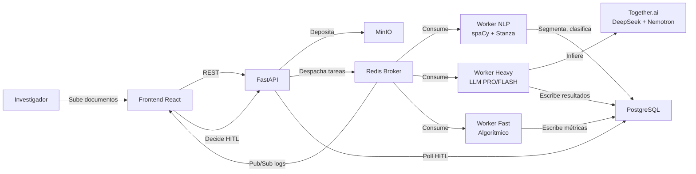

# 5. Implementación

> Este capítulo cuenta cómo se construyó el sistema. No es una crónica de desarrollo — es la historia de las decisiones metodológicas que se volvieron arquitectura, y de la arquitectura que se volvió un sistema en funcionamiento.

---

## 5.1 Los cimientos metodológicos

### El problema de partida: Glaser fue ambiguo

La teoría fundamentada clásica arrastra una ambigüedad de origen. Sus seguidores repiten que "la teoría fundamentada es el estudio de cómo una población resuelve su preocupación principal." Pero esta definición no está en Glaser y Strauss (1965). Es una fórmula que se consolidó después y que encierra el método en un corsé que ni el propio Glaser sostuvo de forma consistente.

La definición original es más amplia y más honesta: un método general para generar inductivamente un conjunto integrado de hipótesis conceptuales —una teoría— mediante el descubrimiento sistemático de patrones latentes y de la categoría central que los articula, usando la comparación constante de cualquier tipo de datos. La diferencia es crucial: el objetivo deja de estar atado de antemano a un *main concern* compartido, y pasa a ser el hallazgo de la estructura de patrón que da cuenta de lo que ocurre en el área sustantiva.

Glaser mismo lo confirmó en distintas épocas. En 2010: *"Grounded theory is a general method. It can be used on any data or combination of data."* En 1967, con Strauss: *"There is no fundamental clash between the purposes and capacities of qualitative and quantitative methods or data."* En 1995: *"The latent structural pattern of the substantive theory emerges […] one of the categories seems to be consistently related to many other categories […] this core category becomes the latent structure of the theory."* Y en 2016, en comunicación personal con el primer autor: *"The main concern emerges as a pattern, as well as how it is continually resolved. Do not preconceive the main concern. Let it emerge."*

El *main concern* no es un punto de partida obligatorio. Es un posible resultado del análisis. Imponerlo como meta confunde a los noveles justo en la etapa en que más necesitan una guía inductiva.

### La propuesta: una tríada inicial flexible

Frente a esa ambigüedad, el sistema parte de una tríada simple: **una población, un patrón humano generalizable, y un verbo.** No un *main concern*. No una hipótesis. Tres anclas mínimas que respetan la lógica auténtica de la comparación constante: partir del dato, dejar que los patrones emerjan, y construir teoría sin obligar a que toda dinámica social tome la forma de una preocupación.

Esta formulación tiene una deuda con dos lecturas pedagógicas: *The Craft of Research* (Booth et al.) y *Digital Literacy* (Abbott, 2026). De ellas tomamos la idea de que una pregunta de investigación es la suma de una población, una categoría de esa población, y un tipo de pregunta. Por ejemplo: *"¿Cuáles son los factores que causan sentimientos de abandono en madres gestantes?"* — donde "madres gestantes" es la población, "sentimientos de abandono" es la categoría, y "factores que causan" es el tipo de pregunta.

Traducido a nuestro sistema, esto se convierte en una configuración inicial mínima. El investigador describe su población, elige el tipo de patrón que busca (preocupación, emoción, conducta, discurso, identidad), y el sistema construye la pregunta operacional. Los defaults son intencionales: cómo una población procesa su preocupación central. Pero el investigador puede cambiarlos. La teoría fundamentada vuelve a ser lo que sus raíces lazarsfeldianas prometían: un método para inducir *what's going on* (Glaser, 1995) en cualquier área sustantiva, sin preconceptos.

### Los tipos de dato que Glaser imaginó y nadie implementó

Glaser (1995) propuso cinco tipos de datos, pero esta clasificación rara vez se implementa sistemáticamente en la práctica manual. El sistema la incorpora como capa de preprocesamiento obligatoria:

- **Baseline data**: la experiencia espontánea del participante. El oro.
- **Properline data**: lo que el participante cree que debe decir. Discurso normativo.
- **Interpreted data**: opinión forzada por la pregunta del entrevistador.
- **Vague data**: evasión, ambigüedad. Puede señalar temas tabú.
- **Conceptual data**: albures, metáforas, jergas que encierran más de lo que parecen.

En el sistema, un agente PRO (`fa_glaser_data_classifier`) clasifica cada segmento. Solo el *baseline data* avanza al pipeline de codificación. El resto se archiva como contexto. Esto no es un filtro de calidad: es una decisión metodológica que evita que la teoría describa normas sociales en vez de comportamiento real.

---

## 5.2 Del prototipo a la arquitectura

### La primera iteración: N8N y el descubrimiento de lo difícil

El sistema empezó como un prototipo en N8N, un automatizador visual de flujos de trabajo. Esta primera experiencia fue deliberadamente modesta: el objetivo no era construir el sistema final, sino **descubrir qué partes del proceso de TFC eran las más difíciles de automatizar**.

El prototipo reveló dos cuellos de botella fundamentales:

1. **La extracción iterativa de incidentes**: procesar cada segmento individualmente con llamadas separadas al LLM era lento, caro, y producía incidentes inconsistentes — el mismo fenómeno recibía nombres distintos según el segmento.

2. **La comparación constante**: comparar cada incidente con cada otro incidente (el corazón del método de Glaser) escalaba cuadráticamente. Con 100 incidentes, hacían falta 4.950 comparaciones. Con 500, más de 124.000. Un abordaje pairwise ingenuo era inviable.

Estos dos descubrimientos definieron la arquitectura posterior. La extracción se unificó en una sola llamada PRO por documento. La comparación constante se reformuló como agrupación conceptual en una sola pasada — todos los incidentes juntos, sin pre-filtro, sin comparación de a pares.

### La arquitectura de producción

Con las lecciones del prototipo, se diseñó la arquitectura definitiva sobre cuatro pilares:

**a) Procesamiento privado con Together.ai.** Para mantener la seguridad de los datos de investigación, todas las llamadas a LLMs pasan por la API de Together.ai con endpoints dedicados. Se definieron dos tiers de modelos: FLASH (Nemotron 550B) para tareas de verificación cortas y focalizadas, y PRO (DeepSeek V4 Pro) para tareas de razonamiento y generación conceptual. Esta diferenciación no es por calidad sino por costo y perfil de tarea.

**b) Base de datos de dos velocidades.** PostgreSQL + pgvector como memoria de largo plazo — autoritativa, relacional, con trazabilidad completa desde la cita textual hasta la proposición teórica. Redis como memoria de corto plazo — colas de mensajería Celery, streaming de logs en tiempo real al frontend vía pub/sub, y caché de estado del pipeline.

**c) Frontend React + backend FastAPI.** La interfaz expone tres páginas principales: `Projects` (listado y creación de proyectos), `Project` (panel de pipeline, documentos, categorías, memos, decisiones HITL), y `Playground` (lienzo interactivo para theoretical coding con blobs, tendriles y ghosts). La comunicación en tiempo real entre backend y frontend usa Redis pub/sub para que el investigador vea el progreso del pipeline sin refrescar.

**d) Orquestación multi-agente con LangGraph.** En vez de automatizadores genéricos como N8N, el sistema usa grafos de estado especializados que permiten bucles de razonamiento complejos y manejo de interrupciones. Cada fase del pipeline es un grafo de estados donde los agentes son nodos y las transiciones dependen de condiciones (¿hay suficientes documentos? ¿el investigador ya decidió en el HITL gate? ¿la categoría está saturada?).

---

## 5.3 Infraestructura: lo que corre bajo el capó

El sistema se despliega como un conjunto de contenedores Docker orquestados con `docker-compose`. La arquitectura actual tiene **cuatro perfiles de cómputo diferenciados**, no tres como en versiones anteriores:

| Contenedor | Perfil | Queue Celery | Concurrencia | Justificación |
|-----------|--------|-------------|-------------|---------------|
| **worker-heavy** | I/O-bound | `heavy` | Prefork (default) | Sin límite de memoria. Solo llama APIs de LLM. |
| **worker-nlp** | CPU+RAM-bound | `nlp` | `--concurrency=1` | 6 GB de RAM. spaCy (~600 MB), Stanza (~2 GB). No es thread-safe. |
| **worker-fast** | Algorítmico | `fast` | Default | Tareas livianas: estadísticas, verificaciones, chequeos SQL. |
| **tei** | GPU/CPU-bound | N/A (servicio HTTP) | N/A | Text Embeddings Inference. Corre `voyage-4-nano-ONNX` en memoria aislada. |

La separación es crítica: las tareas de NLP (segmentación, correferencias, embeddings) consumen CPU y RAM de forma intensiva. Si compartieran proceso con las tareas de LLM (que son I/O-bound, esperando respuestas de API), las segundas bloquearían a las primeras. El aislamiento en workers separados permite que ambos perfiles operen simultáneamente sin degradación.

**Servicios de infraestructura:**

| Servicio | Rol |
|----------|-----|
| **PostgreSQL + pgvector** | Estado autoritativo. 46 tablas con trazabilidad FK completa. Índices HNSW para búsqueda de vectores. |
| **pgBouncer** | Connection pooling. Modo transacción, 200 conexiones máximas. Crítico porque el modelo prefork de Celery abre muchas conexiones. |
| **Redis** | Doble rol: broker de mensajería Celery + bus de eventos pub/sub para streaming de logs y notificaciones HITL al frontend. |
| **MinIO** | Almacenamiento S3-compatible para documentos crudos (PDFs, transcripciones, audios). |
| **ClamAV** | Escaneo antivirus de documentos subidos. |
| **TEI** | Servidor local de embeddings. Evita enviar texto de investigación a APIs externas de embedding. |

**Flujo de datos resumido:**



---

## 5.4 El viaje del investigador: de la cuenta a la teoría

¿Qué hace un investigador desde que crea su cuenta hasta que obtiene una teoría? Esta secuencia no es un tutorial — es la estructura de decisiones que el sistema impone.

### Paso 1: Registro y primer proyecto

El investigador crea una cuenta (username + contraseña). El sistema lo lleva a la pantalla de proyectos, donde crea uno nuevo. En ese momento, el sistema pide **solo tres cosas** (§3.1): la población, el tipo de patrón que busca, y si quiere ayuda opcional. Nada más. Sin marco teórico. Sin hipótesis.

El sistema verifica que los modelos de NLP (spaCy, Stanza) estén descargados. Si es la primera ejecución, muestra una barra de progreso mientras descarga los modelos necesarios (`GET /setup/progress`). Esto solo ocurre una vez.

### Paso 2: Subir documentos

El investigador sube sus transcripciones — una por una o en lote. Cada documento pasa por ClamAV, se almacena en MinIO, y se registra en PostgreSQL con estado `crudo`.

Cuando el investigador decide empezar, presiona "Iniciar pipeline." El sistema ejecuta, para cada documento, en paralelo donde puede:

1. **Puntuación** (opcional): un agente PRO normaliza problemas gramaticales y morfológicos que podrían confundir al segmentador.
2. **Clasificación Glaser**: un agente PRO clasifica todos los segmentos del documento en baseline/properline/interpreted/vague en una sola pasada.
3. **Segmentación**: el worker NLP divide el texto en segmentos usando una ventana móvil de correferencias con Stanza. Solo los segmentos *baseline* avanzan.
4. **Extracción unificada**: un agente PRO extrae incidentes (jots en gerundio) y detecta el patrón individual del entrevistado en una sola llamada.

El investigador **no interviene** durante esta fase. El sistema trabaja en silencio. Glaser insistía en que el investigador no debe interferir durante la codificación abierta.

### Paso 3: Las pausas — donde el investigador decide

Cada 3 documentos (aproximadamente), el sistema se detiene. Muestra al investigador cuatro paneles simultáneos:

1. **Categorías unificadas**: las viejas y las nuevas, fusionadas donde corresponde.
2. **Hipótesis acumuladas**: relaciones entre categorías, con evidencia.
3. **Preocupaciones candidatas**: qué patrón de interés está emergiendo.
4. **Revisión de configuración**: ¿la población está bien? ¿El estilo de codificación funciona?

El investigador revisa, ajusta, rechaza, modifica. El sistema recalcula solo lo afectado (el cascade, §3.6) y continúa con el siguiente lote.

### Paso 4: De la codificación abierta a la selectiva

Cuando todos los documentos están procesados, el sistema evalúa si hay suficiente masa crítica para buscar la categoría central (maturity gate: al menos 3 categorías saturadas y 2 hipótesis documentadas). Si la hay, el pipeline avanza automáticamente a *selective coding*.

En esta fase, el sistema busca la preocupación central, propone una categoría central, reduce el sistema de categorías a las relevantes, y ejecuta el loop de saturación. En cada decisión, el pipeline se detiene y le pregunta al investigador. El investigador ve una propuesta, una crítica, y decide.

### Paso 5: El Playground y la redacción

Cuando el sistema de categorías está saturado, el proyecto pasa a estado `playground_ready`. El investigador entra al Playground: un lienzo interactivo donde las categorías son *blobs*, las relaciones son *tendriles*, y los memos huérfanos son *ghosts* que flotan buscando un lugar. Aquí el investigador prueba familias teóricas, arrastra conceptos, absorbe ghosts, y deja que la estructura teórica emerja visualmente.

De cada pila de memos en el Playground, el sistema redacta una sección de la teoría. El investigador edita sobre el texto. El gap feeler detecta afirmaciones sin respaldo. El ciclo se repite hasta que el índice de ajuste global es satisfactorio.

### Paso 6: Literatura y cierre

Solo al final, con la teoría ya escrita, el sistema integra la literatura. Trata los papers como nuevas entrevistas: extrae incidentes, los codifica con las categorías de la teoría, y evalúa si la literatura extiende, modifica, integra o trasciende los hallazgos. Las referencias eruditas van en notas al pie — no interrumpen la voz de la teoría.

El investigador revisa la tabla de diálogo con la literatura, acepta o edita las notas sugeridas, y — si todo cierra — presiona "Cerrar estudio." El sistema entrega una teoría trazable: de cada proposición teórica se puede bajar hasta la cita textual que la originó.

---

## 5.5 Cadenas de agentes por etapa

El sistema organiza sus 96 agentes en cadenas que corresponden a las fases del método CGT. Cada cadena sigue el ritmo proposer→critic→HITL, pero con variaciones según la fase.

### Cadena A: Preparación de datos (por documento)

```
Documento crudo
  → fa_glaser_data_classifier (PRO)     — clasifica segmentos (oro/plata/bronce/anomalía)
  → segmentar_documento (NLP, Stanza)   — divide en segmentos por correferencias
  → fa_document_pattern_extractor (PRO) — extrae incidentes + patrón individual unificados
  → fa_population_context (PRO)         — actualiza el contexto poblacional acumulado
```

### Cadena B: Síntesis cross-document (por lote, cada 3 documentos)

```
Incidentes del lote
  → fb_incident_grouper (PRO)           — agrupa TODOS los incidentes en una sola pasada
  → fb_pattern_labeler (PRO)            — etiqueta grupo por grupo
  → fb_label_critic (FLASH)             — critica cada etiqueta (loop generativo ×3)
  → fb_code_generator (PRO)             — genera códigos formales desde grupos etiquetados
  → fb_hypothesis_generator (PRO)       — propone hipótesis entre categorías
  → fb_evidence_classifier (FLASH)      — clasifica evidencia para cada hipótesis
  → fd_category_synthesizer (PRO)       — unifica categorías nuevas con previas
  → fd_hypothesis_synthesizer (PRO)     — unifica hipótesis acumuladas
  → fd_config_critic (PRO)              — revisa configuración del proyecto
  → 🛑 HITL: pausa de 4 decisiones      — el investigador revisa todo
```

### Cadena C: Emergencia del patrón de interés y categoría central

```
Categorías + hipótesis acumuladas
  → fc_main_concern_proposer (PRO)      — sensa la preocupación central latente
  → fc_main_concern_critic (PRO)        — evalúa los candidatos
  → 🛑 HITL: pattern_of_interest        — el investigador confirma UNA preocupación
  → [maturity gate: SQL]                — verifica masa crítica
  → fc_core_category_proposer (PRO)     — rankea categorías por centralidad
  → fc_core_emergence_critic (FLASH)    — test de intercambiabilidad
  → 🛑 HITL: core_category              — el investigador elige UNA categoría central
```

### Cadena D: Reducción selectiva

```
Categorías con puntaje de relevancia
  → fd_selective_reduction_proposer (PRO) — propone fusiones y descartes
  → fd_selective_reduction_critic (PRO)   — evalúa cada fusión y descarte
  → 🛑 HITL: selective_reduction         — el investigador confirma el sistema reducido
```

### Cadena E: Saturación (loop por categoría × documento)

```
Por cada categoría relevante (puntaje ≥ 4 documentos):
  → fe_core_saturation_proposer (PRO)   — propone expansiones de propiedades
  → fe_core_saturation_critic (FLASH)  — verifica si la expansión es genuina
  → loop hasta 3 iteraciones sin did_state_expand
  → fe_paradigm_integrator (PRO)        — integra el paradigma acumulado
  → memo_generator (PRO)                — genera memos: Generate → Simplificar → Correlacionar
  → 🛑 HITL: core_saturation            — el investigador confirma saturación por categoría
  → [si no satura] fe_property_sampler  — muestreo teórico guiado por gaps
```

### Cadena F: Database A/B

```
Categorías saturadas
  → ff_database_a_proposer (PRO)        — construye nodos planos (entity_type, propiedades)
  → ff_database_a_critic (PRO)          — evalúa cada nodo
  → 🛑 HITL: database_a                 — el investigador confirma el sistema de nodos
  → ff_database_b_proposer (PRO)        — construye edges con relationship_type libre
  → ff_database_b_critic (PRO)          — evalúa cada edge
  → 🛑 HITL: database_b                 — el investigador confirma las relaciones
  → task_global_saturation_check (SQL)  — verifica 3 condiciones de cierre
  → 🛑 HITL: global_saturation          — cierre de codificación selectiva
```

### Cadena G: Theoretical Playground y redacción

```
Nodos + edges + memos
  → f6b_ghost_blob_mapper (PRO)         — propone absorciones de memos huérfanos
  → f6b_memo_theoretical_tagger (FLASH) — clasifica memos en 12 familias teóricas
  → f6b_conceptual_elaborator (PRO)     — elabora relaciones conceptuales
  → f6b_definition_writer (PRO)         — escribe definiciones versionadas
  → f6b_rename_suggester (PRO)          — sugiere renombres cuando una categoría crece
  → f6b_ecosystem_gap_detector (PRO)    — detecta zonas finas en la teoría
  → f6a_natural_writer (PRO)            — redacta secciones desde pilas de memos
  → f6a_writing_critic (PRO)            — evalúa borradores (presente conceptual, gerundios, fidelidad)
  → f6a_gap_feeler (FLASH, background)  — detecta afirmaciones sin respaldo
  → 🛑 HITL por sección                 — el investigador edita sobre el texto
```

### Cadena H: Literatura y aplicabilidad

```
Teoría completa
  → f6c_literature_comparer (PRO)       — codifica literatura como incidentes
  → f6c_literature_critic (PRO)         — evalúa emergent fit (Extiende/Modifica/Integra/Trasciende)
  → 🛑 HITL: tabla de diálogo           — el investigador decide qué integrar
  → f6d_applicability_engine (PRO)      — identifica variables de control y acceso
  → f6d_applicability_critic (PRO)      — evalúa si las directrices son genuinas
  → 🛑 HITL: aplicabilidad              — el investigador confirma directrices
```

### Agentes transversales

| Agente | Cuándo se ejecuta | Qué hace |
|--------|-------------------|----------|
| `hitl_evidence_collector` | Antes de cada HITL gate | Recolecta evidencia textual para la propuesta |
| `hitl_modification_planner` | Cuando el investigador modifica | Planifica el cascade: qué tablas limpiar |
| `hitl_modification_evaluator` | Después de cada modificación | Evalúa si la modificación es metodológicamente válida |
| `hitl_modification_filter` | Durante el cascade | Filtra qué dependencias necesitan recomputarse |
| `util_punctuator` | Preprocesamiento opcional | Normaliza puntuación y gramática |
| `util_code_critic` / `util_code_namer` | Durante la codificación | Verifica y nombra códigos |
| `util_recategorization_decider` | Cuando categorías divergen | Decide si divergencia es real o aparente |

---

## 5.6 Lo que las últimas etapas añadieron

El sistema no se diseñó de una vez. Las iteraciones más recientes incorporaron mejoras que surgieron de la experiencia de uso y de la profundización metodológica:

**Unificación de la extracción.** En la versión inicial, extraer incidentes, detectar el patrón individual, y extraer el *prime mover* eran tres llamadas separadas. La versión actual unifica las tres en una sola llamada PRO (`fa_document_pattern_extractor`). Esto redujo el costo, eliminó inconsistencias entre agentes, y — críticamente — permitió que el mismo modelo que identifica los incidentes detecte qué los une.

**Agrupación en una pasada.** El `comparator.py` original hacía tres pasos (cosine pre-filter → pairwise LLM → Union-Find). La versión actual manda todos los incidentes juntos en una sola llamada PRO. Sin pre-filtro. Sin comparación de a pares. Esto no solo es más rápido — permitió que el modelo vea patrones *a través* de documentos, algo imposible con el enfoque pairwise.

**Grounding por foreign keys.** La versión original usaba similitud de embeddings para buscar evidencia. La actual sigue vínculos FK desde incidentes hasta segmentos. La evidencia es procedencia, no similitud.

**El cascade.** Cuando el investigador modifica algo, el sistema solo recalcula lo que depende de ese cambio. Esto hace que la iteración sea barata, lo que hace que el investigador itere más. La teoría mejora.

**ReSpec agent.** Un agente de vigilancia que monitorea cinco señales de que algo necesita revisión (incidentes ambiguos, etiquetas rechazadas, divergencias sin resolver, memos huérfanos, ejes vacíos) y sugiere bajar de nivel. No decide — sugiere.

**Clasificación Glaser en batch.** La versión inicial clasificaba segmentos uno por uno. La actual procesa el documento completo en una sola pasada PRO, dándole al modelo contexto suficiente para distinguir baseline de properline con precisión.

**Memoria de trabajo aislada por perfil de cómputo.** El worker NLP se separó del worker Heavy para evitar que las tareas CPU-intensivas (spaCy, Stanza) bloqueen las tareas I/O-bound (llamadas a APIs de LLM). La arquitectura actual tiene cuatro perfiles de cómputo diferenciados, cada uno con su queue de Celery y sus restricciones de memoria.

**i18n con schemas tipados.** Cada uno de los 96 agentes tiene su schema de output en cuatro idiomas. El mismo pipeline funciona para un estudio en español, inglés, alemán o portugués sin cambiar una línea de código — solo cambia el idioma del schema que se inyecta en el prompt.

**LangGraph para orquestación con estado.** La versión inicial usaba N8N. La actual usa grafos de estado especializados que permiten bucles de razonamiento, manejo de interrupciones HITL, y transiciones condicionales basadas en el estado del proyecto (¿hay suficientes documentos? ¿el investigador ya decidió?).

---

| Sección | Contenido |
|---------|-----------|
| 5.1 | Bases metodológicas: la ambigüedad de Glaser, la tríada población+patrón+verbo, los tipos de dato |
| 5.2 | Del prototipo N8N a la arquitectura de producción: lecciones aprendidas |
| 5.3 | Infraestructura actual: 4 perfiles de worker, servicios, flujo de datos |
| 5.4 | El viaje del investigador: 6 pasos desde la cuenta hasta la teoría |
| 5.5 | Cadenas de agentes por etapa: 8 cadenas + agentes transversales |
| 5.6 | Lo que las últimas etapas añadieron: 10 mejoras arquitectónicas |
