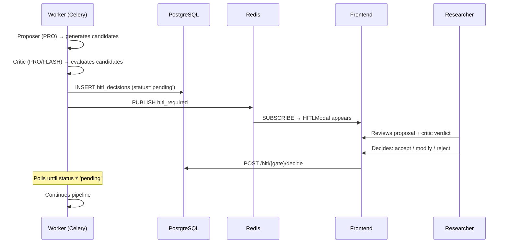
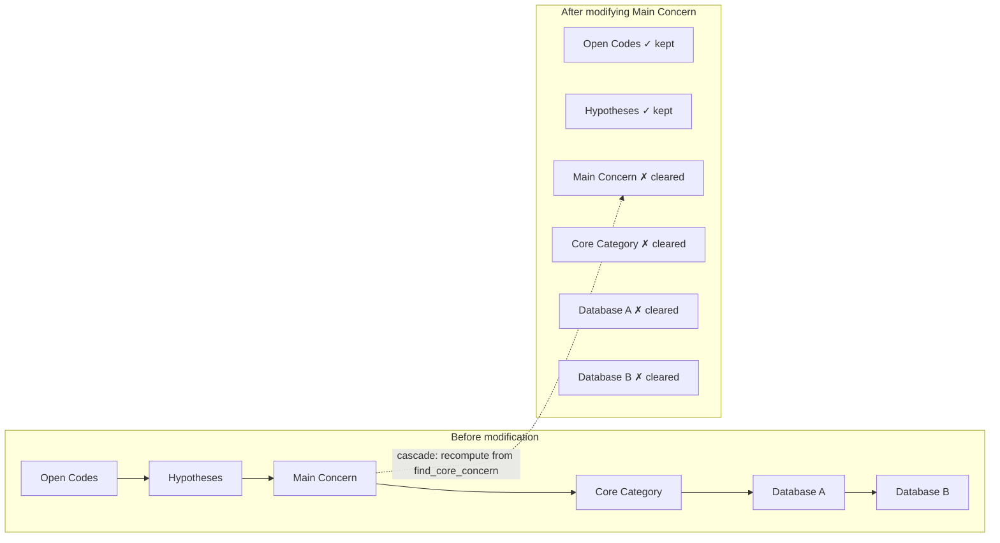

# 3. System Architecture

> The system does not *support* Classic Grounded Theory — its architecture *is* a theory of CGT. The patterns described below are not implementation details. They are methodological commitments expressed as software.

---

## 3.1 The Proposer → Critic → HITL Rhythm

### The pattern

At every level of abstraction — from raw incidents to the integrated theory — the system applies the same rhythm (`kb.md` §1, L43–55):

```
Alguien PROPONE (sin ver lo que ya existe, para no sesgarse)
  → Alguien CRITICA (comparando contra los datos)
    → VOS DECIDÍS (HITL: confirmás, modificás o rechazás)
```

This is the *latido del sistema*. It is not a convenience — it is the architectural translation of what Glaser called *theoretical sensitivity*: the ability to generate concepts from data and relate them according to normal models of theory (*Theoretical Sensitivity*, 1978, p. 2). The system delegates pattern recognition to LLMs; it reserves theoretical judgment for the human researcher.

### Concrete implementation

Seven HITL gates govern the pipeline. Each gate is a row in the `hitl_decisions` table (`backend/app/agents/transitions.py:445–510`) with a `gate_name` that distinguishes phases, a `proposal` JSONB, a `critic_verdict` JSONB, and a `status` (`pending` → `accepted`/`modified`/`rejected`). When a gate fires, the pipeline **pauses** — the Celery coordinator polls `hitl_decisions` and does not advance until the researcher decides via `POST /projects/{id}/hitl/{gate}/decide`.

The frontend is notified in real time through Redis pub/sub (`transitions.py:489–503`):

```python
r.publish(f"project:{project_id}:events",
    {"type": "hitl_required", "gate": gate_name, ...})
```



### Gate-by-gate: tier assignments and rationale

The Critic tier varies by gate — FLASH for quick interchangeability checks, PRO for deeper qualitative evaluation:

| Gate | Proposer | Critic | Rationale |
|------|----------|--------|-----------|
| `pattern_of_interest` | `fc_main_concern_proposer` (PRO) | `fc_main_concern_critic` (PRO) | Deep qualitative judgment needed to distinguish latent concern from surface pattern |
| `core_category` | `fc_core_category_proposer` (PRO) | `fc_core_emergence_critic` (FLASH) | Interchangeability testing is a structured verification task — FLASH is sufficient |
| `selective_reduction` | `fd_selective_reduction_proposer` (PRO) | `fd_selective_reduction_critic` (PRO) | Merging/descarte decisions require qualitative evaluation of each category's theoretical role |
| `core_saturation` | `fe_core_saturation_proposer` (PRO) | `fe_core_saturation_critic` (FLASH) | Per-document check: did state expand genuinely? Structured diff, not generation |
| `database_a` | `ff_database_a_proposer` (PRO) | `ff_database_a_critic` (PRO) | Conceptual integration of nodes requires deep reasoning |
| `database_b` | `ff_database_b_proposer` (PRO) | `ff_database_b_critic` (PRO) | Free-theory relationship types demand qualitative judgment |
| `global_saturation` | SQL-only | SQL-only | Three deterministic conditions; no LLM needed |

All implementations live in `workers/heavy/tasks.py` (lines 2653–4393).

### Beyond the gates: the rhythm in open coding

The proposer→critic→HITL pattern is not confined to the selective coding gates. During open coding, every 3 documents (`kb.md` §4.5, L147–157), the system presents four simultaneous decisions: unified categories, accumulated hypotheses, population variants, and coding style recommendations. The batch pause is a HITL gate without a formal `gate_name` — the researcher decides, and the system continues with that feedback incorporated.

The *critic without HITL* also appears: during cross-document synthesis (`kb.md` §5, L167–177), the label critic (B3, FLASH) evaluates each label from the labeler (B2, PRO) in a generative loop — up to three iterations — but emits only feedback, never verdicts. The HITL comes later, during the batch pause.

---

## 3.2 Context Isolation as Anti-Confirmation-Bias

### The problem it solves

The most pervasive error in manual qualitative coding is confirmation bias: seeing what you expect to see. Once a researcher has developed provisional categories, new data tends to be forced into those pre-existing molds. Glaser called this *forcing* and considered it the gravest methodological sin.

### Architectural enforcement

The system prevents forcing not through exhortation but through **information flow control**. Each agent sees only what it needs — and critically, *does not see* what would bias it:

| Agent | Sees | Does NOT see | Source |
|-------|------|-------------|--------|
| Incident Extractor (A1) | Current document's gold segments only | Existing categories, other documents, previous patterns | `kb.md` §4, L139 |
| Pattern Extractor (A2) | Current document only | Cross-document patterns | `1-Refaccion.md` §12, L944–948 |
| Incident Grouper (B1) | Raw incidents from current batch | Existing categories, previous labels, confirmed concerns | `kb.md` §5, L167 |
| Pattern Labeler (B2) | Raw incident groups | Labels from other groups | `1-Refaccion.md` §12 |
| Main Concern Proposer | All codes, memos, prime movers | External theory, researcher expectations | `fc_main_concern_proposer/prompt.md` constraints |

The refactoring document (`1-Refaccion open coding.md` §12, L935–937) states the principle explicitly: *"En CGT hay una tensión fundamental entre emergencia (requiere aislamiento) y síntesis (requiere contexto)."* The corrected design enforces isolation at every level where emergence matters, and only provides full context at synthesis points — and even then, only after the human has reviewed.

### The incident grouper: a case study in radical simplification

The original `comparator.py` used a three-step pipeline: cosine similarity pre-filter → pairwise LLM comparison → Union-Find clustering. Each step accumulated error. The pre-filter could miss conceptually identical incidents with different vocabulary; the pairwise comparison scaled quadratically; the Union-Find imposed algorithmic structure on what should be emergent.

The current `comparator.py` (`workers/heavy/comparator.py:44–246`) replaces all three steps with **one PRO call**. The function `b1_group_incidents()` sends *all* incidents from the current batch — with document provenance tags — to a single LLM call. No cosine pre-filter. No pairwise comparison. No Union-Find.

```python
# workers/heavy/comparator.py:44-50
def b1_group_incidents(proyecto_id: str, incremental: bool = False) -> dict:
    """Group incidents by behavioral patterns. One PRO call per batch of documents.

    Groups incidents WITH document provenance so the AI can identify
    cross-document variations. Each incident includes its source document.
    Previous categories (with variation summaries) are included as context.
    """
```

The AI does all the grouping. The prompt explicitly instructs: *"Group by PATTERN, not by similarity of wording. Two incidents with different wording can evidence the same pattern."* (`fb_incident_grouper/prompt.md` constraints).

---

## 3.3 The Cascade: HITL as Conversation, Not Obstacle

### The problem with HITL in most systems

Human-in-the-loop is usually an obstacle: the pipeline stops, the researcher decides, everything recomputes from scratch. This discourages the very iterative refinement that CGT demands. If modifying a category means waiting 20 minutes for recomputation, the researcher learns not to modify.

### How the cascade works

When the researcher modifies an output — renames a category, rewrites a hypothesis, adjusts the pattern of interest — the system **does not recompute everything**. It clears only the tables that depend on that output and restarts the pipeline from the correct node (`kb.md` §15.1, L626–640):

| Researcher modified | Pipeline restarts from |
|---------------------|----------------------|
| An open code | `batch_code` |
| A hypothesis | `generate_hypotheses` |
| The pattern of interest | `find_core_concern` |
| A category definition | `batch_code` |
| Database A node | `prepare_playground` |
| A conceptual relationship | `prepare_playground` |



Each modification is recorded in `output_modifications` (who, what, when, the critic's original verdict). While recomputation runs, the frontend receives live updates via Redis pub/sub — the researcher sees progress in real time without refreshing.

This turns HITL from an obstacle into a conversation: modify, watch the system adapt, modify again. The cascade makes iterative refinement *cheap*, which makes it *frequent*, which is exactly what CGT's constant comparison demands.

### State machine support

The document-level state machine (`backend/app/agents/transitions.py:35–56`) uses optimistic locking (`WHERE estado = from_state`) to prevent race conditions:

```python
NEXT: dict[str, tuple[str, str | None, str | None]] = {
    "crudo": ("segmentando", "segmentar_documento", "nlp"),
    "segmentado": ("extrayendo", "extract_patterns_and_incidents", "heavy"),
    "incidentes_extraidos": (None, None, None),  # waits for batch trigger
    "codificando": ("codificado", None, None),
    ...
}
```

The project-level state machine (`transitions.py:72–80`) gates the transition from open coding to selective coding through a maturity check:

```
collecting → coding → checking_maturity → finding_cc → reducing →
saturating → building_db → playground_ready → completed
```

And the per-document pipeline supports abort and resume via `AbortableTask` (`workers/heavy/tasks.py:793–837`): if a task is cancelled mid-document, completed steps are preserved as checkpoints, and the next run continues from the first uncompleted step.

---

## 3.4 Grounding via Foreign Keys, Not Embeddings

### The problem with semantic similarity for evidence

Many AI-assisted research tools use embedding similarity to find "supporting evidence" for a claim — retrieve the top-k most similar segments by cosine distance. This is fast but methodologically dangerous: semantic similarity ≠ conceptual equivalence. Two segments can have high embedding similarity but represent different categories; two segments can have low similarity but represent the same conceptual property.

### The FK solution

The system avoids this entirely. During incident extraction, every incident is linked to its source segment via a foreign key. The chain is:

```
extracted_incidents.segmento_id → segmentos.id
extracted_incidents.documento_id → documentos.id
```

When the system needs evidence for a category, it does not query by embedding. It follows the existing FK chain from `incident_groups.incident_ids_json` → `extracted_incidents` → `segmentos` and collects the exact source text (`kb.md` §5, L179–183):

> *"Cada incidente sabe exactamente de qué segmento de qué documento proviene. El sistema simplemente recorre esos vínculos y recolecta las citas textuales. Esto es más preciso, más rápido, y no introduce falsos positivos por similitud semántica superficial."*

This design choice is a methodological commitment: **evidence is provenance, not similarity.** You can trace any theoretical proposition down to the exact quote that originated it.

---

## 3.5 Typed Inter-Phase Contracts

### The problem with unstructured agent outputs

In most multi-agent LLM systems, agents produce free-text or loosely structured JSON. Downstream agents receive this output as context and must interpret it — introducing ambiguity at every handoff. In a research methodology where precision matters, this is unacceptable.

### JSON Schema as contract

Every agent in the system produces output conforming to a **language-specific JSON Schema**. The contract is explicit: the schema declares `required` fields, `additionalProperties: false`, and typed constraints. A downstream agent that receives `fc_main_concern_proposer`'s output knows exactly what fields exist, their types, and what they mean.

Each agent directory contains:

```
prompts/agents/fc_main_concern_proposer/
├── prompt.md           # YAML frontmatter + System/User sections
├── schema.es.json      # Spanish output schema
├── schema.en.json      # English output schema
├── schema.de.json      # German output schema
└── schema.pt.json      # Portuguese output schema
```

The YAML frontmatter declares the contract explicitly:

```yaml
# prompts/agents/fc_main_concern_proposer/prompt.md
---
agent: fc_main_concern_proposer
tier: PRO
input_state: all_codes, all_memos, prime_movers_per_document, object_of_study, researcher_feedback
constraints:
  - NO inventes patrones sin respaldo en codigos o memos.
  - NO uses conocimiento externo.
  - Cada candidato debe citar al menos 3 codigos como evidencia.
---
```

The `input_state` field names the artifacts this agent consumes — establishing a **data dependency contract** between phases. A phase transition is valid only if the required input state exists in the database.

The output schema (`schema.es.json`) defines the exact shape:

```json
{
  "type": "object",
  "additionalProperties": false,
  "required": ["candidates", "rationale"],
  "properties": {
    "candidates": {
      "type": "array",
      "items": {
        "required": ["statement", "supporting_codes", "orphan_codes", "rationale"],
        "properties": {
          "statement": { "type": "string" },
          "supporting_codes": { "type": "array", "items": { "type": "string" } },
          ...
        }
      }
    }
  }
}
```

The LLM client (`workers/heavy/llm_client.py`) extracts the schema from the prompt directory and appends it to the Together.ai API call with `response_format={"type": "json_object"}`. The result is guaranteed to match the schema — or the call is retried with the schema as an error hint.

### i18n as first-class concern

CGT is language-dependent. A gerund in Spanish (`-ando`/`-iendo`) does not map cleanly to an English gerund (`-ing`), and coding styles vary by object of study (`concern` → gerund, `emotion` → noun, `behavior` → verb). The system supports this through:

1. **Per-language schemas**: each agent has `schema.{es,en,de,pt}.json`
2. **Coding style injection**: `llm_client.py:151–159` imports `get_style_tokens()` from `app.core.coding_styles`, which maps `object_of_study × language` to the appropriate label format
3. **Runtime language detection**: `_set_language_from_project()` (`tasks.py:41–53`) reads the project's language and sets it for the current Celery worker

This means the same agent pipeline produces gerund codes for a Spanish concern study, noun codes for an English emotion study, and verb codes for a Portuguese behavior study — without changing a single line of agent code.

---

## 3.6 The Agent System: 96 Prompts in 6 Families

### Organizational structure

The system currently has **96 agent prompts** (`backend/app/prompts/agents/`), organized in a naming convention that encodes both phase and function:

| Family | Phase | Examples | Count |
|--------|-------|----------|-------|
| `fa_*` | Data preparation | `fa_glaser_data_classifier`, `fa_population_context`, `fa_process_identifier`, `fa_sense_maker`, `fa_document_pattern_extractor` | 7 |
| `fb_*` | Cross-document synthesis | `fb_incident_grouper`, `fb_code_generator`, `fb_label_critic`, `fb_hypothesis_generator`, `fb_evidence_classifier`, `fb_context_synthesizer` | 10 |
| `fc_*` | Core emergence | `fc_main_concern_proposer`, `fc_main_concern_critic`, `fc_core_category_proposer`, `fc_core_emergence_critic`, `fc_research_question_builder`, `fc_synthesizer` | 7 |
| `fd_*` | Selective reduction / synthesis | `fd_category_synthesizer`, `fd_config_critic`, `fd_hypothesis_synthesizer`, `fd_selective_reduction_proposer`, `fd_selective_reduction_critic` | 5 |
| `fe_*` | Saturation | `fe_core_saturation_proposer`, `fe_core_saturation_critic`, `fe_paradigm_integrator`, `fe_property_sampler`, `fe_corpus_scanner` | 5 |
| `ff_*` | Database | `ff_database_a_proposer`, `ff_database_a_critic`, `ff_database_b_proposer`, `ff_database_b_critic`, `ff_interchangeability_tester` | 5 |
| `f6a_*` | Writing | `f6a_natural_writer`, `f6a_writing_critic`, `f6a_gap_feeler`, `f6a_final_report` | 4 |
| `f6b_*` | Theoretical elaboration | `f6b_ghost_blob_mapper`, `f6b_memo_theoretical_tagger`, `f6b_conceptual_elaborator`, `f6b_definition_writer`, `f6b_rename_suggester`, `f6b_ecosystem_gap_detector`, `f6b_incident_elaborator` | 7 |
| `f6c_*` | Literature | `f6c_literature_comparer`, `f6c_literature_critic` | 2 |
| `f6d_*` | Applicability | `f6d_applicability_engine`, `f6d_applicability_critic` | 2 |
| `util_*` | Utilities | `util_punctuator`, `util_code_critic`, `util_code_namer`, `util_entity_extraction`, `util_map_synthesis`, `util_theme_grouper`, `util_recategorization_decider`, `util_reduce_synthesis`, `util_react_hypothesis` | 9 |
| `hitl_*` | HITL support | `hitl_evidence_collector`, `hitl_modification_evaluator`, `hitl_modification_filter`, `hitl_modification_planner` | 4 |
| Legacy | Deprecated | `b2a`, `b2b`, `b1`, `b2`, `b3`, `d1`, `d2`, `a1`, `a2`, `a3`, `a16`, `main_concern_proposer`, `main_concern_critic`, `prime_mover_extractor`, `incident_extractor`, `pattern_labeler`, `agrupador`, `selective_reduction_proposer`, `selective_reduction_critic`, `population_generalizer`, `memo_generator`, `memo_simplifier`, `memo_correlator` | ~25 |

> **Note on legacy agents**: The deprecated directory entries remain as historical reference. The active pipeline uses the `fa_*` through `f6d_*` families. The `tasks.py` file retains backward-compatible shims (e.g., `task_b1_distill_sampling` at line 1064) but the actual execution path uses the new unified agents.

### Agent lifecycle and self-evaluation

Each agent call produces a structured `AgentOutput` (`workers/heavy/llm_client.py:50–63`) containing:

```python
@dataclass
class AgentOutput:
    success: bool
    data: dict           # Parsed JSON matching the schema
    tokens_used: int
    conversation: list   # Full message history
    self_eval: SelfEval  # Parsed _self_evaluation from data
    error: str | None
    iterations: int
```

The `_self_evaluation` mechanism (`llm_client.py:33–46`) provides a structured retry signal embedded in every agent output:

```python
@dataclass
class SelfEval:
    needs_retry: bool
    retry_reason: str | None
    suggested_action: str  # "proceed" | "retry" | "escalate_to_hitl" | "skip" | "abort"
```

This allows agents to self-diagnose when their output is incomplete, contradictory, or methodologically questionable — and request escalation to the researcher when needed.

---

## 4.2 Prompt Library & Tier Differentiation

### Two model tiers, one architecture

The system distinguishes between two computational profiles, not two quality levels:

```python
# workers/heavy/llm_client.py:127–147

_MODEL_FLASH = get_config_value("MODEL_FLASH",
    default="nvidia/nemotron-3-ultra-550b-a55b")
_MODEL_PRO   = get_config_value("MODEL_PRO",
    default="deepseek-ai/DeepSeek-V4-Pro")

_TIER_MODELS: dict[ModelTier, str] = {
    "FLASH": _MODEL_FLASH,
    "PRO": _MODEL_PRO,
}

_TIER_MAX_TOKENS: dict[ModelTier, int] = {
    "FLASH": int(get_config_value("MODEL_FLASH_MAX_TOKENS", default="4096")),
    "PRO":   int(get_config_value("MODEL_PRO_MAX_TOKENS",   default="8192")),
}

_TIER_TEMPERATURE: dict[ModelTier, float] = {
    "FLASH": float(get_config_value("MODEL_FLASH_TEMPERATURE", default="0.1")),
    "PRO":   float(get_config_value("MODEL_PRO_TEMPERATURE",   default="0.3")),
}
```

All values are configurable via `runtime_config` or environment variables — no model name, token limit, or temperature is hardcoded.

### When to use which tier

The tier is not about "importance." It is about **task profile**:

| Profile | Tier | Characteristics | Examples |
|---------|------|-----------------|----------|
| **Generation** | PRO | Produces novel concepts, requires deep reasoning, high token budget (8192) | Main concern proposer, natural writer, incident grouper, pattern labeler |
| **Evaluation** | FLASH | Verifies existing output against structured criteria, low token budget (4096) | Label critic, saturation critic, gap feeler, evidence classifier |
| **Background** | FLASH | Non-blocking, runs asynchronously | Gap feeler (during writing), ghost blob mapper |

Temperature is 0.3 for PRO (some creativity needed for conceptual generation) and 0.1 for FLASH (deterministic verification). This is not arbitrary — in CGT, generation demands openness to emergent patterns; evaluation demands consistency.

### Prompt file format

Every prompt file uses the same structure (`llm_client.py:1–11`):

```markdown
---
agent: fc_main_concern_proposer
tier: PRO
description: ...
notes: ...
constraints:
  - constraint 1
  - constraint 2
input_state: ...
---

## System
You are a CGT researcher...

## User
{operational_question}
{codes_summary}
{memos_summary}
...

## Output Schema
```json
{...schema injected from schema.{lang}.json...}
```
```

The YAML frontmatter is machine-readable. The LLM client (`llm_client.py`) parses it to determine tier, injects the appropriate schema file for the current language, formats `{variable}` placeholders with Python `.format()`, and constructs the Together.ai API call.

### The 5-language schema system

The `translate_schemas.py` script in the prompts directory is not documentation — it is an **automated i18n pipeline**. When a schema changes in one language, the script propagates structural changes to the other four language files while preserving their translated `description` and `enum` values.

This ensures that the JSON contract is structurally identical across languages, while field descriptions and enum labels are culturally appropriate. A Spanish-speaking researcher working with `object_of_study = "concern"` sees gerundio labels; an English-speaking researcher sees gerunds. The pipeline is identical.

### Cost as a feature

The tier system is explicitly a **cost optimization** strategy, not a quality optimization. The saturation critic uses FLASH because it checks a simple condition (did the paradigm state expand?); the main concern critic uses PRO because it evaluates whether a candidate truly captures latent participant experience vs. surface discourse.

The 4-signal saturation panel (`workers/heavy/tasks.py:3301–3446`) invokes the LLM **only when all four pre-computed signals suggest stability** (`_check_all_signals_stable()` at line 3439). If any signal says "unstable," the expensive PRO call is skipped entirely — the cheap SQL/algorithmic signals act as a cost-saving pre-filter.

This is not a theoretical position. It is an engineering reality: running DeepSeek V4 Pro on every document-segment pair would be economically prohibitive. The tier system makes the methodology *viable* at scale.

---

| Section | Key files |
|---------|-----------|
| 3.1 Proposer→Critic→HITL | `workers/heavy/tasks.py:2653–4393`, `backend/app/agents/transitions.py:445–510`, `kb.md` §1 L43–55, §15 L578–624 |
| 3.2 Context Isolation | `workers/heavy/comparator.py:44–246`, `kb.md` §4 L139, §5 L167, `1-Refaccion.md` §12 L935–991 |
| 3.3 The Cascade | `kb.md` §15.1 L626–640, `backend/app/agents/transitions.py:35–80`, `workers/heavy/tasks.py:793–837` |
| 3.4 FK Grounding | `kb.md` §5 L179–183 |
| 3.5 Typed Contracts | `backend/app/prompts/agents/*/prompt.md`, `backend/app/prompts/agents/*/schema.{lang}.json`, `workers/heavy/llm_client.py:1–11,149–159` |
| 3.6 Agent System | `backend/app/prompts/agents/` (96 directories), `workers/heavy/llm_client.py:50–63` |
| 4.2 Prompt Library | `workers/heavy/llm_client.py:127–147`, `workers/heavy/tasks.py:3301–3446` |
