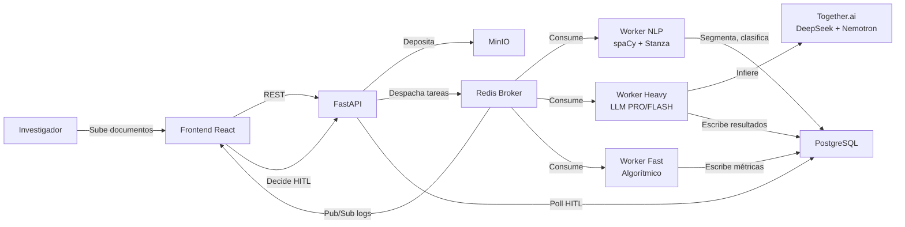

Título: "Automating Classic Grounded Theory: Why Computational Fidelity
        May Surpass Manual Practice"

1. Introduction

- En una tesis contemporánea, César Junior Gonzáles ha propuesto una teoría que denomina "Carrera del Estigma Territorial". Esta teoría explica cómo los residentes del área marginal de La Perla en Callao actúan frente al avance del capitalismo, adoptando estrategias espaciales para evitar la discriminación fuera del barrio, y enfrentandola con ironía y resistencia. Esta podría ser considerada una teoría fundamentada. 
- Sin embargo, desde una perspectiva de teoría fundamentada, es difícil afirmar que esta conceptualización, basada en 15 entrevistas, sea la preocupación central de los 65 mil habitantes de La Perla. De hecho, un teórico fundamentado diría que esta es una teoría basada en a prioris. Y eso podría llevar a hacerse preguntas sobre las posibles malas decisiones de política o negocio basadas en información sesgada.
- Compárese esto con la teoría fundamentada de Paucar Villacorta (2020): para sobrevivir a diario, las familias que se dedican al reciclaje en Lima realizan un "recurseo de relaciones personales". Este consiste en buscar un tipo ideal de familia productiva a través de pedir favores, depender de otros, y -en casos críticios- disponer del trabajo infantil. Las familias más estables pueden gestionar mejor el dolor causado por el trabajo, mientras las viudas y parejas menos funcioonales caen en el estigma.
- Esta teoría tiene una población definida, un interés central de la población, y una explicación de cómo esta población lo resuelve. Es concreta y se ajusta a una realidad que, aunque no intenta ser generalizable al nivel de un distrito, sí puede serlo al nivel de familias que mantienen negocios, familias agricultoras, bandas de música y otra clase de grupos humanos.
- Además, se trata de un conocimiento accionable. Sabemos que los recicladores, aunque aparentan ser insalubres, dividen sus casas y protocolos de salud de forma eficiente -pues, de enfermarse o accidentarse un miembro de la familia, pierden ingresos-. Por lo tanto, no requieren políticas de salud. Piden, en cambio, seguridad laboral, facilidades para hacer cooperativas y apoyo familiar. Eso explica por qué las cooperativas de recicladores abundan en América Latina.
- Aunque la teoría fundamentada clásica es un método poderoso, enfrenta varios problemas. El primero es que, a pesar de su potencial, es un método difícil de implementar ("painstaking"). No solo por promover un proceso paralelo de recolección y análisis en "zig-zag", ni tampoco porque necesite de ampliar la población de interés a nuevos grupos y casos hasta antes del final de la teoría (muestreo teórico). SIno porque además sus miembros desconfían profundamente del software de análisis cualitativo (CAQDAS, por sus siglas en inglés).
- Aunque la IA está logrando superar algunas de las limitaciones que los proponentes de la teoría fundamentada actualmente ven en los CAQDAS, lo cierto es que programas como Atlas.ti aún muestran diversas limitaciones en sus aplicaciones de la inteligencia artificial. Esto incluye halucinaciones, sobre-codificación, y la falta de herramientas para sintetizar las ideas generadas, lo que va en contra del espíritu de sintetización constante de la TFC.
- Un último problmema es la desconfianza que guardan sus fundadores hacia variaciones del métodos de investigación, tal como se suele practicar hoy en día. Parece crucial ampliar las formas de hacer teoría fundamentada para facilitar la creación de teoría en contextos de limitación de datos, un interés que se encuentra en el centro de la TFC original. Como demostraré en esta exposición, algunas de las partes críticas de la TFC actual son adiciones posteriores que pueden adaptarse siempre que no se vulnere con el centro de la metodología.

# 2. Antecedentes

## 2.1 La Teoría Fundamentada Clásica

La Teoría Fundamentada Clásica (Classic Grounded Theory, CGT) es una **metodología de investigación inductiva** desarrollada por Barney Glaser y Anselm Strauss en 1967, cuyo propósito no es describir la realidad ni verificar hipótesis, sino generar teoría, entendida como sistema de conceptos, definiciones y relaciones entre conceptos, que explique patrones de comportamiento humano a partir de datos empíricos.

A diferencia de la investigación que se realiza en áreas donde se verifican "grandes teorías" generalmente postuladas por teóricos de contextos alejados al estudiado, en la investigador entra al campo sin teorías preconcebidas y permite que los conceptos, las categorías y las relaciones entre ellas sugieran patrones íntimamente correlacionados a través de la comparación sistemática de los datos. 

A pesar de su aparente definición clara, la teoría fundamentada se divide en varias familias, siendo la más popular la vertiente straussiana enfocada en acciones, causas y consecuencias. En Paucar (2016) ya se han detallado las diferencias históricas y metodológicas de las dos ramas principales de teoría fundamentada.

La Teoría Fundamentada Clásica, en cambio, es un proceso de abstracción progresiva y focalizada mediante el cual el investigador asciende desde los incidentes concretos hacia patrones de comportamiento que explican cómo los participantes resuelven continuamente sus preocupaciones. Cada nuevo incidente no se "testea" contra una hipótesis previa para verificar su verdad empírica, sino que se escriben fichas o memos donde se registran y re-definen conceptos emergentes con sus implicancias e hipótesis nuevas.

El investigador entra al campo con un área de interés general, no con una pregunta cerrada que demande verificación. El muestreo inicial es deliberadamente abierto: cualquier persona que pueda iluminar lo que está sucediendo. La literatura existente no se revisa como marco previo sino que se reserva para después, cuando la teoría ya haya emergido y pueda dialogar con ella como "más datos" para la comparación constante. Lo que el investigador sí debe suspender son sus preconcepciones sobre qué es lo más importante para la población, qué variables importan, y qué muestra es la correcta. 

El investigador registra en notas las preocupaciones de sus participantes así como qué las indican. Al leer algo relatado por un participante, se pregunta: "¿de qué trata este hecho?", "¿qué categoría indica?", "¿qué está sucediendo realmente aquí?" y "¿cuál es la preocupación principal del participante?". La codificación es ágil: anotaciones rápidas de una o dos palabras, preferiblemente gerundios que capturan proceso y acción —"evitando", "negociando", "credencializando"—. La directriz es no estancarse y evitar la duplicidad de información: si un incidente no revela un patrón claro, se anota y se avanza, confiando en que el procesamiento preconsciente detectará la recurrencia a medida que se acumulan docenas de incidentes.

Pero la codificación no es un fin en sí mismo. Apenas el investigador percibe un patrón emergente, interrumpe la codificación mecánica y escribe un memo analítico. El memo es el primer acto de conceptualización: transforma la observación —"estos tres entrevistados mencionan sentirse amenazados por la IA"— en una idea teórica tentativa —"percibir amenaza de obsolescencia profesional parece desencadenar estrategias de adaptación"—. Cuando llega un entrevistado que también se siente amenazado pero no se adapta, el memo se reescribe: "percibir amenaza desencadena adaptación, excepto cuando el profesional carece de margen de maniobra organizacional". 

Es crucial distinguir esta práctica de la versión de Strauss y Corbin, que introdujo la "codificación axial": un paradigma que obliga deductivamente a buscar condiciones causales, contextos y consecuencias. La CGT rechaza este encasillamiento previo. Las categorías deben "ganarse" su relevancia emergiendo orgánicamente de la comparación iterativa de incidentes, no de un esquema predefinido.

De entre todas las categorías que emergieron, el investigador identifica cuál es la que procesa o resuelve la preocupación central recurrente de los participantes. Esta categoría —la core category— debe ser central (conecta con la mayoría de las otras categorías), frecuente (aparece en la mayoría de los documentos) y tener alto poder explicativo (explica la mayor variación en el comportamiento). Las categorías que no se relacionan con ella se ignoran; el resto debe pasar por la saturación de propiedades. Para cada propiedad de la core category, el investigador busca incidentes variantes en casos extremos en su data o nueva data de campo. Cuando un incidente de "gratitud" aparece junto a otros de "desprecio", el concepto no se parte en dos: se eleva. La categoría se renombra —"sintiendo el peso"— y su definición ahora abarca ambos polos.

Una vez que la saturación máxima se ha alcanzado y no se hallan más variaciones, el investigador toma todos los memos acumulados y los organiza físicamente en pilas  preguntándose: "¿estos memos van juntos? ¿Por qué?". El investigador prueba diferentes códigos teóricos que actúan como el cemento que une todo el edificio de memos saturados - categorías como "espiral", "estrategia", "contradicción", "etapas", etc. Estas han sido sugeridas por Glaser en diferentes obras, y una sola tiene el potencial para ajustar toda la teoría en base a los datos. Los memos que no encajan en ningún grupo son tan informativos como los que sí: señalan brechas en la teoría, zonas donde la conceptualización aún es débil.

Finalmente, la teoría se escribe en tiempo presente, porque describe procesos en curso, no eventos pasados. Se escribe sobre conceptos, no sobre personas. El nivel de abstracción debe ser tal que la teoría sea transferible a otros contextos donde el mismo patrón de comportamiento ocurra. Las conexiones entre secciones del manuscrito deben surgir de los memos, no de la lógica externa del investigador. Asimismo, la Grounded Theory Review evalúa la publicación de teorías fundamentadas basada en cuatro criterios: 

- ¿Es la preocupación central más relevante para los participantes, no una curiosidad académica del investigador? 
- ¿la teoría se ajusta a los datos o fueron forzadas? 
- ¿La teoría funciona, o sea, explica y predice el comportamiento de los participantes? 
- Y ¿es modificable, es decir, puede adaptarse cuando nuevos datos la desafían, o es rígida?

## CAQDAS and Its Relationship to Straussian Grounded Theory

The relationship between qualitative researchers and computer software was initially characterized by skepticism, as early programs were viewed merely as statistical calculators. However, the advent of CAQDAS revolutionized the qualitative paradigm by providing systematic environments designed specifically for textual management and coding.

Developed by Anselm Strauss and Juliet Corbin, their version of grounded theory provides rigorous guidelines to generate inductive theory from empirical data. The process fundamentally relies on a three-stage coding cycle:
1. **Open Coding:** Segmenting information and forming initial categories.
2. **Axial Coding:** Assembling data in new ways to identify relationships between categories, often mapped out in a conditional matrix or logic diagram.
3. **Selective Coding:** Developing a core "story line" or proposition that connects all categories to formulate a substantive-level theory (Creswell, 2013).

**Contributions of CAQDAS Innovations to Grounded Theory**
The architecture of early CAQDAS packages was intimately tied to this grounded theory method. Software such as ATLAS.ti and NVivo was explicitly engineered to mirror the GT coding paradigm. 

CAQDAS programs translated abstract GT concepts into digital interfaces. As noted in the literature, *"Data representations and analysis functions in ATLAS.ti for example were mainly replicating concepts known from Grounded Theory Methodology (GTM)"* (Mühlmeyer-Mentzel, 2011, as cited in Wiedemann, 2016, p. 44). The software allowed researchers to move effortlessly between open codes (tagging text) and axial codes (creating network views of relationships).
*   **Intelligent Archiving over Automated Analysis:** In this era, the computer's role was strictly supportive rather than interpretative. Innovation was found in the speed of retrieval and data management. As Kelle (1997) observed regarding CAQDAS: *"none of these steps can be conducted with an algorithm alone. In other words, at each step the role of the computer remains restricted to an intelligent archiving (‘code-and-retrieve’) system, the analysis itself is always done by a human interpreter"* (as cited in Wiedemann, 2016, p. 43).
*   **Systematic Rigor:** By forcing users to define code families, write digital memos linked to specific quotes, and visually map code co-occurrences, CAQDAS provided an audit trail that elevated the rigor and transparency of Straussian Grounded Theory.

## B) AI-Assisted Qualitative Analysis

While CAQDAS historically relied on the human researcher for interpretation, the advent of Artificial Intelligence—specifically Natural Language Processing (NLP), text mining, and generative LLMs like ChatGPT—has shifted the software's role from a passive archive to an active analytical partner.

**The Core Methodology: Thematic and Content Analysis**
Qualitative analysis often involves familiarization with data, identifying recurrent patterns, and synthesizing these into meaningful themes. Traditionally, this is highly manual, labor-intensive, and subject to individual researcher bias. 

**Contributions of AI Innovations to Qualitative Analysis**
AI integrations bring computational scale and interpretative assistance to qualitative researchers. Modern software like ATLAS.ti 23 now natively integrates AI coding, fundamentally altering the time-to-insight ratio.

*   **Efficiency and Multifaceted Retrieval:** Automation accelerates the primary coding cycles. Gupta (2024) notes: *"When compared to manual coding, the introduction of AI coding in ATLAS.ti 23 saves researchers time on data analysis and coding. Using artificial intelligence, ATLAS.ti analyzes data and retrieves the results of the researcher’s instruction in a multifaceted format"* (p. viii). 
*   **Standardization and Bias Reduction:** LLMs like ChatGPT are increasingly tested for thematic extraction. Goyanes, Lopezosa, and Jordá (2025) highlight four specific roles ChatGPT fulfills to innovate thematic analysis:
    > *"First, it can standardize the coding process by reducing the variability introduced by manual coding performed by human teams... Second, it can minimize individual biases that may inadvertently shape research outcomes... Third, it can enhance efficiency by rapidly processing large volumes of textual data... Finally, ChatGPT can identify emerging themes that might not be immediately apparent, uncovering latent patterns that enrich the analytical process"* (p. 5492).
*   **The Limits of AI in Reflexivity:** Despite these innovations, AI operates as a heuristic tool rather than a definitive interpreter. Goyanes et al. (2025) conclude that *"despite its vast power, the ChatGPT model in its current state is unable to substitute the contextual insights and subtle metaphorical nuances associated with human qualitative analysis, interpretation and reflexivity"* (p. 5491).

## AI-Assisted Grounded Theory and Abductive Analysis

The integration of AI into Grounded Theory gives rise to what Nelson (2017) conceptualized as "Computational Grounded Theory"—a methodological framework that merges deep, inductive human analysis with the pattern-recognition capabilities of machine learning.

Modern approaches to grounded theory increasingly rely on *abductive* logic—the process of identifying anomalous or surprising empirical observations and generating provisional hypotheses to explain them.

Applying AI to Grounded Theory poses unique challenges, particularly because true GT requires the detection of the "unforeseen," a task that machines currently struggle with. However, human-AI teaming offers profound innovations for data reduction and theoretical scaling.

Machine learning models are trained to find statistical regularities, making them ill-equipped to spot the qualitative anomalies that drive abductive theory building. Vila-Henninger et al. (2022) articulate this limitation: 
    > *"In our view, both grounded theory coding schemes and machine learning algorithms might have serious issues identifying anomalies in the data: the former for epistemological reasons as without preexisting theories, empirical observations cannot be deemed surprising; the latter for practical reasons. Anomalous cases are by definition unforeseen and their detection often warrants substantial expert knowledge"* (p. 13).
To innovate beyond this limitation, researchers propose combining human-driven abductive codebooks with AI scaling. Once human researchers identify anomalous patterns and create an established codebook, they can train a supervised machine learning algorithm to analyze the remainder of a massive corpus (Vila-Henninger et al., 2022). Furthermore, researchers can use query tools to build "code equations" (e.g., combining codes using Boolean operators) to operationalize complex theoretical phenomena that span multiple individual codes, allowing AI to test if these grounded theories hold true across large datasets.

arlier expert systems and contemporary AI tools allow researchers to generate "if–then" propositions. As Hesse-Biber (2010) summarizes: *"With growing technological advancements in qualitative data analysis programs, researchers are increasingly able to utilize new methods to develop theories and test them on qualitative materials. Knowledge-based systems, such as artificial intelligence programs, are particularly useful"* (p. 79).

TFC sobre el uso de software

The Digital Dilemma: Barney Glaser’s Stance on CAQDAS and the Primacy of the Researcher’s Mind
1. Introduction: The Strategic Importance of Methodological Purity
In the rigorous landscape of qualitative methodology, the tension between manual inductive analysis and Computer-Assisted Qualitative Data Analysis Software (CAQDAS) is not merely a technical dispute but a fundamental struggle for the soul of the method. Barney Glaser’s polemical refutation of digital intermediation represents a radical and polemical break from the "grand theorists" and "theoretical capitalists," such as Parsons and Merton, who dominated the mid-century sociological landscape (Gibson & Hartman, 2014, p. 11). For the Classical Grounded Theorist, methodological purity is a vital defense against the mechanistic pitfalls of modern research, which often prioritize technological efficiency over the deep intellectual immersion required to discover genuine theory.
Central to this defense is the cornerstone concept of "Theoretical Sensitivity." Aligning with Glaser’s original dictates, this is not a mere descriptive tool but represents the "acuity of the researcher" and the developed capacity for "learning to think theoretically" (Gibson & Hartman, 2014, p. 63). It is the researcher’s cognitive readiness to perceive variables and their relationships, moving beyond descriptive cataloging toward high-level conceptual abstraction. Glaser’s insistence on manual rigor serves to protect this acuity from being stifled by the rigid, bureaucratic structures of software, marking a profound historical friction between inductive discovery and a technological "advance" that he perceived as a move toward verification and the logic of justification.
2. The Great Divide: Glaser’s Critique of Software Intermediation
Glaser’s unyielding opposition to CAQDAS is rooted in the preservation of "Methodological Orthodoxy." He viewed the adoption of programs like ATLAS.ti or NVivo as an epistemological barrier that facilitates the "forcing" of data rather than its "emergence." According to the historical analysis of the Glaser-Strauss split, Glaser maintained that the "Strauss line" of Grounded Theory departed from original orthodoxy precisely because of its reliance on computer-assisted verification and description (Andréu Abela et al., 2006, p. 2). In Glaser’s view, software acts as an extension of the Straussian move toward a "logic of justification," which prioritizes routine and systematic rules over the circumstantial, non-rational process of discovery.
The use of software creates a "distancing" effect that fragments the researcher’s focus, keeping the analyst at the level of data description rather than propelling them toward conceptual leaps. Glaser argued that the mind of the analyst must remain the "primary instrument," engaged in a fluid, unmediated relationship with the raw data—a process that digital algorithms are fundamentally incapable of replicating.
The Logic of Distancing
Glaser posited that software programs create a significant barrier to the constant comparative method. By automating the linking of codes, CAQDAS removes the requisite "theoretical pacing," preventing the researcher from engaging in the deep reflection necessary to achieve "fit" and "work." This distancing prevents the analyst from transcending simple description, resulting in a mere summary of data rather than a conceptual explanation of the participants' core concerns.
3. Bibliographic Analysis: Critical Works and Citations
The following core texts define the Classical Grounded Theory stance against technological intermediation and the preservation of the analyst’s cognitive primacy.

Illustrative Quotes from the Source Context

    "Glaser se manifiesta en contra de la línea de Strauss por entender que se aparta de la ortodoxia de la Teoría Fundamentada y en concreto... por el uso de programas de ordenador" (Andréu Abela et al., 2006, p. 2).
    "The very idea of discovering theory was not new; rather, this idea was part of a broader debate at the time" (Gibson & Hartman, 2014, p. 11).
    When the analyst's purpose is only the specifying of a unit of analysis, software use "stifles his chances for generating to a greater degree than with any other use of comparative analysis" (Glaser & Strauss, 1967, as cited in Gibson & Hartman, 2014, p. 14).

These citations provide the grounded evidence for Glaser’s polemical position, reinforcing the premise that theory generation is an intellectual building process requiring human intuition over digital logic.
4. Evaluating the Impact: "Forcing" vs. "Emerging" in the CAQDAS Era
The reliance on software shifts the researcher from the "logic of discovery"—an exploratory and creative synthesis—to a "logic of justification" focused on proving hypotheses (Gibson & Hartman, 2014, p. 13). Glaser’s resistance is a defense of "Theoretical Pacing," the intentional immersion that allows for the "play of ideas" (Gibson & Hartman, 2014, p. 14). When this pacing is bypassed by high-speed digital processing, the resulting categories often fail to "fit" or explain the latent patterns of social life.
Software effectively traps the analyst at the "level of data," preventing the generation of higher-level conceptual categories. By automating the integration of memos and codes, it removes the necessary reflective phases of analysis.


## CGT vs. CAQDAS

Aspect
	
Classical Grounded Theory (Manual)
	
CAQDAS (Digital)
Theoretical Pacing
	
Intentional immersion; prioritizes the "play of ideas" and cognitive synthesis.
	
High-speed processing; risks skipping the reflective, non-rational phases of discovery.
Conceptualization
	
Moves rapidly from descriptive incidents to high-level conceptual categories.
	
Stifles chances for generating higher-level categories by trapping the analyst in "description."
Integration of Memos
	
Memos are the "heart" of the method, manually integrated to build theoretical frameworks.
	
Memos are often reduced to secondary notes or attachments, losing their integrative power.
Role of the Analyst
	
The analyst’s acuity is the primary instrument; discovery is Circumstantial and fluid.
	
Software acts as an epistemological barrier; prioritizes routine and systematic verification rules.
As mandated by the source context, software stifles the generation of theory because common general properties are "carefully unattended" in favor of the systematic labeling of discrete data units (Glaser & Strauss, 1967).
5. Conclusion: The Enduring Legacy of the Human Analyst
Barney Glaser’s stance on CAQDAS is ultimately a commitment to the "sociological imagination"—a concept famously championed by C. Wright Mills (Andréu Abela et al., 2006, p. 55). For the Classical Grounded Theorist, theory is not a commodity to be "produced" by an algorithm; it is an intellectual craft that must be "built" through the rigorous, lived experience of the researcher. The "mind of the analyst" possesses a unique repository of theoretical sensitivity and acuity that cannot be outsourced to digital systems without sacrificing the essence of the method: the ability to discover latent social patterns. By resisting the digital dilemma, Glaser preserved Grounded Theory as a human-centric endeavor, ensuring that theory remains a practical, grounded explanation of human behavior rather than a technological artifact.

Theoretical sensitivity is a cognitive skill that software stifles by prioritizing data management over conceptual "play."
    Discovery vs. Justification: Manual analysis facilitates the "logic of discovery," while digital tools inevitably steer the researcher toward the "logic of justification" and verification.
    The Barrier of Distancing: Software acts as an epistemological barrier that "forces" data into pre-existing labels, departing from the methodological orthodoxy of unmediated emergence.

## Por qué este sistema es diferente.

Pregunta 1: ¿Cómo la IA resuelve los problemas que Glaser ve en los CAQDAS, y qué nuevos problemas añade o no resuelve?

#### Lo que la IA SÍ resuelve (que los CAQDAS no podían)

**a) El problema del "forcing" por pre-codificación se mitiga, no se elimina**

Los CAQDAS (ATLAS.ti, NVivo) son esencialmente sistemas de "code-and-retrieve": el investigador DEBE crear un esquema de códigos antes de usarlos. Glaser denunciaba que esto fuerza los datos hacia categorías pre-existentes. La IA generativa permite un abordaje radicalmente distinto: el `IncidentExtractor` de nuestro sistema **lee segmentos crudos y propone patrones inductivos sin un codebook previo**. No hay menú desplegable de códigos — hay un LLM que responde a las 4 preguntas de Glaser sobre cada incidente. Esto es un avance real sobre el paradigma CAQDAS, donde el software es estructuralmente incapaz de proponer.

**b) Del "intelligent archiving" al "intelligent proposing"**

Kelle (1997) sentenció que en CAQDAS *"the role of the computer remains restricted to an intelligent archiving system, the analysis itself is always done by a human interpreter"*. Esto ya no es cierto. Nuestro `conceptual_elaborator` **propone** relaciones entre categorías con evidencia convergente y divergente. Nuestro `rename_suggester` **propone** nombres a 3 niveles de abstracción. La IA cruza la línea que los CAQDAS nunca pudieron: de archivar a proponer.

**c) La divergencia como motor de expansión, no como error a ocultar**

Los CAQDAS no tienen concepto de "dato divergente". Un código que no encaja simplemente no se asigna. Nuestro sistema trata la divergencia como **el mecanismo central de densificación teórica**. Las fisuras doradas en los tendriles no son bugs — son el feature más importante. Esto es algo que ningún CAQDAS puede hacer porque requiere comprensión semántica del contenido, no solo gestión de etiquetas.

#### Lo que la IA NO resuelve (y posiblemente empeora)

**a) El problema de las anomalías: la IA es estructuralmente mala detectando lo imprevisto**

Vila-Henninger et al. (2022) lo expresan con precisión: *"Anomalous cases are by definition unforeseen and their detection often warrants substantial expert knowledge"*. Los LLM son **completadores de patrones** — fueron entrenados para encontrar regularidades estadísticas en cantidades masivas de texto. La Teoría Fundamentada Clásica, en cambio, se construye precisamente sobre lo ANÓMALO: ese incidente de "desprecio" que no encaja en "agradecimiento" y que termina TRANSFORMANDO la categoría en "sintiendo el peso". 

Nuestro `incident_elaborator` detecta divergencia cuando un incidente no encaja en propiedades existentes. Pero solo puede detectar divergencia **respecto a lo que ya conoce**. Si un incidente es genuinamente novedoso de una manera que no tiene anclaje en los datos de entrenamiento del LLM, el modelo puede simplemente forzarlo a encajar en una categoría existente o ignorarlo. El `Módulo de Preservación de Anomalías` (documentado en C3 pero no implementado) está diseñado para contrarrestar esto, pero es una carrera armamentista: el LLM tiende a homogeneizar, nosotros intentamos preservar la heterogeneidad.

**b) El procesamiento preconsciente sigue sin tener equivalente digital**

Glaser insiste en el "hand-eye-brain" process — el viaje sin drogas ("drugless trip") de manipular físicamente memos, ordenarlos en pilas, y dejar que el preconsciente detecte patrones que la mente consciente no ve. Nuestro EcosystemCanvas con blobs arrastrables y física simulada es un **intento honesto** de recrear esta experiencia. Pero:

- La pantalla es plana. Una mesa con 50 memos de papel permite verlos todos simultáneamente y percibir agrupaciones espaciales que el cerebro procesa de manera pre-atencional.
- El acto físico de escribir un memo a mano, subrayar, dibujar flechas — todo esto activa circuitos cognitivos distintos a hacer clic y arrastrar.
- La "serendipia" del sorting físico — encontrar dos memos que terminaron juntos por accidente y darse cuenta de que REVELAN algo — es difícil de replicar en un algoritmo de layout automático.

**c) La sensibilidad teórica no se puede delegar**

Glaser define "Theoretical Sensitivity" como la capacidad de *"learning to think theoretically"* (Gibson & Hartman, 2014, p. 63). Es una habilidad que se desarrolla con años de práctica. El LLM puede proponer patrones, pero no puede **enseñar** al investigador a pensar teóricamente. Peor aún: puede crear la **ilusión** de que el investigador está teorizando cuando en realidad está aceptando propuestas del LLM sin el trabajo cognitivo que produce verdadera comprensión. El riesgo no es que el sistema falle — es que **funcione demasiado bien** y el investigador nunca desarrolle su propia sensibilidad.

**d) La ilusión de objetividad**

Goyanes et al. (2025) argumentan que ChatGPT puede *"minimize individual biases that may inadvertently shape research outcomes"*. Esta es una afirmación **profundamente anti-Glaseriana**. En CGT, el sesgo del investigador no es un problema a eliminar — es un **instrumento analítico**. La perspectiva única del investigador, su historia personal, su formación disciplinar, incluso sus prejuicios, son lo que le permite VER patrones que otro no vería. Pretender que un LLM "elimina sesgos" es pretender que existe una posición objetiva desde la cual analizar datos cualitativos — y eso es positivismo disfrazado de innovación tecnológica.

---

### Pregunta 2: ¿Cómo contribuye nuestro nuevo sistema a resolverlos?

#### Contribución 1: Proposer→Critic→HITL como antídoto al forcing

A diferencia de un CAQDAS (que es pasivo) y a diferencia de un "AI coder" (que automatiza), nuestro sistema implementa el patrón **Proposer→Critic→HITL**:

```
LLM PROPONE (Proposer) → LLM EVALÚA (Critic) → INVESTIGADOR DECIDE (HITL)
```

Esto es cualitativamente distinto a ambos paradigmas anteriores. El LLM no es ni un archivero mudo (CAQDAS) ni un reemplazo del investigador (AI coding). Es un **interlocutor** que propone, evalúa su propia propuesta con criterios CGT, y luego **se calla** para que el investigador decida. Las pausas HITL no son una limitación técnica — son un **dispositivo metodológico** que preserva la agencia del investigador.

#### Contribución 2: La divergencia visible como mecanismo de densificación

Ningún CAQDAS y ninguna herramienta de "AI coding" tiene un concepto análogo a nuestras **fisuras doradas**. Cuando un incidente no encaja en una relación, el sistema no lo oculta ni lo descarta — lo **exhibe** como una oportunidad de expansión. Esto es directamente Anti-Glaseriano en el mejor sentido: transforma lo que el software normalmente suavizaría en el motor mismo del avance teórico.

#### Contribución 3: Ghost-blobs como memos activos

Glaser dice que los memos son el "corazón" del método y que los CAQDAS los reducen a "notas secundarias". En nuestro sistema, los memos son **ghost-blobs**: entidades visuales arrastrables que el investigador puede **absorber** en categorías para densificarlas. Un memo no es un attachment — es un **actor en el ecosistema conceptual**. Cuando se absorbe, la categoría expande su definición y potencialmente sugiere renombre. Esto es cualitativamente más cercano a la integración manual de memos que cualquier CAQDAS.

#### Contribución 4: Renombres como elevación teórica

Los CAQDAS permiten renombrar códigos (es una operación de base de datos). Pero nuestro sistema trata el renombre como un **evento teórico**: el `rename_detector` monitorea el crecimiento de la definición (≥3 versiones, ≥2x propiedades, ≥3x incidentes), el `rename_suggester` propone nombres a 3 niveles de abstracción (conservador, moderado, transformador), y el investigador elige. El renombre no es "cambiar etiqueta" — es **elevar el concepto**. El historial completo de definiciones (`CategoryDefinitionVersion`) preserva la trazabilidad.

#### Contribución 5: El investigador en el centro, no la eficiencia

La literatura de "AI-assisted qualitative analysis" (Gupta 2024, Goyanes et al. 2025) mide el éxito en **tiempo ahorrado** y **volumen procesado**. Nuestro sistema mide el éxito en **densidad conceptual alcanzada** y **trazabilidad de decisiones**. El botón "Sync gaps" no acelera el análisis — lo **profundiza** mostrando dónde la teoría es débil. Las pausas HITL no son ineficiencias — son **el método funcionando**.

#### Lo que nuestro sistema todavía no resuelve

1. **El problema de las anomalías genuinas**: El `Módulo de Preservación de Anomalías` necesita ser implementado. Sin él, el LLM homogeneizará hacia la tendencia central.

2. **El "drugless trip"**: Por más sofisticado que sea el EcosystemCanvas, no reemplaza la manipulación física de memos. Podríamos explorar exportación a PDF para impresión y sorting físico como complemento.

3. **La sensibilidad teórica del investigador**: El sistema puede guiar, proponer, y verificar — pero no puede enseñar a "pensar teóricamente". Esto requeriría un módulo de formación metodológica que no está en el alcance actual.

4. **La ilusión de objetividad**: Debemos ser explícitos en la documentación y en la UI: el LLM no elimina sesgos. Los introduce de maneras nuevas y opacas. La reflexividad del investigador sigue siendo la única garantía de rigor.

5. La IA no puede (por ahora) entender con un conocimiento empático y de primera mano de las emociones, límites, distanciamientos y acciones morales humanas. El proceso de inmersión en el campo es un trabajo -y una fuente de conocimientos- propios del autor. Por esa razón también el muestreo teórico está limitado por la incapacidad del sistema de relacionarse con personas desconocidas, tal como un ser humano lo haría.

---

# 3. Cómo funciona por dentro

> No vamos a explicar cada línea de código. Vamos a contar qué hace el sistema cuando le das entrevistas, y por qué cada decisión de diseño existe. Para eso, vamos a seguir un solo ejemplo: **entrevistas con periodistas que cubren tecnología**. Diez entrevistas. El sistema no sabe nada de periodismo. Solo sabe lo que vos le dijiste: "buscá la preocupación recurrente de este grupo."

---

## 3.1 Antes de tocar los datos: lo que el sistema te pregunta

Antes de procesar una sola línea, el sistema necesita tres cosas. Solo tres:

**Primero: tu población.** *"Periodistas que cubren tecnología en medios digitales de habla hispana."* Eso es todo. El sistema no te pide hipótesis, no te pide marco teórico, no te pide variables. Solo quiere saber a quiénes estás estudiando. Con eso, un agente generaliza tu descripción para que la teoría resultante sea transferible — *"Profesionales de la información que operan en entornos mediáticos con alta mediación tecnológica"* — y te pregunta si estás de acuerdo. Si no, lo editás.

**Segundo: qué tipo de patrón buscás.** Hay cinco opciones: preocupación, emoción, conducta, discurso, identidad. Elegís *preocupación*. Esto le dice al sistema que su rol es "layman" — un observador sin preconceptos — y que sus códigos van en gerundio: "Negociando", "Evitando", "Escaneando". Si hubieras elegido *emoción*, codificaría con sustantivos: "Ansiedad", "Frustración", "Alivio".

**Tercero: si querés ayuda opcional.** Podés darle pistas sobre tu población, pero no es obligatorio. El sistema funciona igual sin ellas.

Estas tres preguntas no son un formulario administrativo. Son el ancla metodológica: definen el *lente* con el que el sistema va a mirar tus datos. Y una vez que las respondiste, el sistema **no te vuelve a preguntar nada hasta que tenga algo que mostrarte**. Ese silencio es deliberado. Glaser insistía en que el investigador no debe interferir durante la codificación abierta. El sistema se calla y trabaja.

---

## 3.2 El ritmo que se repite en todos lados

Antes de entrar en fases, necesitás entender un patrón. El sistema lo aplica en **cada** decisión teórica, desde la más chica (¿este incidente pertenece a esta categoría?) hasta la más grande (¿esta es la categoría central del estudio?). Es el *latido*:

```
Alguien PROPONE (sin ver lo que ya existe, para no sesgarse)
  → Alguien CRITICA (comparando contra los datos, no contra opiniones)
    → VOS DECIDÍS (confirmás, modificás o rechazás)
```

Tres roles, siempre separados. El que propone nunca es el que critica. El que critica nunca decide. La decisión es tuya.

¿Por qué existe este ritmo? Porque resuelve el problema más antiguo de la investigación cualitativa: **el sesgo de confirmación**. Un investigador humano, cuando ya tiene categorías provisionales en la cabeza, tiende a ver los nuevos datos a través de esas categorías. Es inevitable. Lo llamamos *forcing*: forzar lo nuevo a encajar en lo viejo.

El sistema lo resuelve con una regla brutal: **el que propone no ve lo que ya existe**. Punto.

En la práctica, esto significa que cuando el sistema va a extraer incidentes de una entrevista nueva, **no le muestra las categorías que ya descubrió en las entrevistas anteriores**. Ve la entrevista fresca, como si fuera la primera. Esto es contraintuitivo — ¿no sería más eficiente mostrarle todo? — pero es metodológicamente necesario. Si el extractor viera las categorías existentes, forzaría los nuevos incidentes a encajar en ellas. Es exactamente lo que haría un investigador humano sin darse cuenta.

---

## 3.3 Fase 1: Lo que pasa cuando el sistema lee una entrevista

Volvamos a los periodistas. Subiste diez transcripciones. El sistema empieza con la primera.

### Paso 1: Clasificar cada segmento

Lo primero que hace es leer la entrevista entera — no segmento por segmento, sino completa — y clasificar cada fragmento en cuatro categorías que vienen directo de Glaser:

- **Oro**: lo que el periodista dice espontáneamente. Su experiencia real. *"Todos los días entro y el algoritmo ya me asignó 40 notas. No puedo rechazarlas."*
- **Plata**: lo que cree que debe decir. Discurso normativo. *"Bueno, uno como periodista debe ser objetivo, ¿no?"*
- **Bronce**: opinión forzada por la pregunta del entrevistador. *"¿Qué opino de la IA? Es un tema complejo..."*
- **Anomalía**: evasión. *"No sé, la verdad no tengo una opinión formada."*

Solo el **oro** avanza. El resto se archiva. Esto no es un filtro de calidad — es una decisión metodológica. Si codificás *properline data* (plata) creyendo que es experiencia real, tu teoría va a describir normas sociales, no comportamiento. Y si codificás *interpreted data* (bronce), vas a describir lo que el entrevistador quiere oír.

### Paso 2: Extraer incidentes y detectar el patrón individual

Con los segmentos de oro identificados, el sistema hace una sola llamada al modelo PRO (el más potente). En esa llamada, **simultáneamente**:

1. **Extrae incidentes**: para cada segmento de oro, produce un *jot* — una anotación de una o dos palabras, un gerundio. "Evitando". "Negociando". "Resistiendo". Con su vínculo al segmento exacto de origen.
2. **Detecta el patrón individual**: identifica cuál parece ser el patrón recurrente de *este* periodista en particular, usando solo sus datos. Te dice: *"Para esta persona, el patrón recurrente parece ser Monitoreando la obsolescencia técnica"*, con citas y un nivel de confianza.

Antes, estos dos pasos estaban separados: un agente extraía incidentes, otro detectaba el patrón. El problema era que el segundo agente trabajaba con incidentes extraídos por el primero usando *otro* lente. Al unificarlos en una sola llamada, el mismo modelo que identifica los incidentes también detecta qué los une. Es más coherente, más rápido, y metodológicamente más sólido.

Todo esto pasa para **una** entrevista. El sistema repite el proceso para cada una de las diez, en paralelo donde puede. Al final de esta fase, tenés diez patrones individuales y cientos de incidentes. Pero todavía no hay categorías compartidas.

---

## 3.4 Fase 2: Cuando los incidentes se encuentran

Ahora el sistema pone todos los incidentes de las diez entrevistas sobre la mesa. Literalmente: los carga en una sola llamada al modelo PRO y le pide que los agrupe.

Este es quizás el momento más importante del pipeline, y donde el diseño actual difiere radicalmente de la versión anterior. La versión vieja hacía tres pasos: primero filtraba incidentes por similitud de embeddings, después comparaba pares con llamadas al LLM, y finalmente aplicaba un algoritmo de clustering (Union-Find). Tres pasos, cada uno acumulando error. El pre-filtro por embedding podía descartar incidentes conceptualmente idénticos solo porque usaban vocabulario distinto. El algoritmo de clustering imponía estructura matemática a algo que debía emerger.

La versión actual (`workers/heavy/comparator.py`) hace **una sola cosa**: manda todos los incidentes juntos al modelo PRO y le dice: *"Agrupalos por patrón de comportamiento. Dos incidentes con palabras distintas pueden evidenciar el mismo patrón. Dos incidentes con palabras parecidas pueden evidenciar patrones distintos."* Sin pre-filtro. Sin comparación de a pares. Sin algoritmo.

El modelo responde con grupos. Por ejemplo:

- Grupo A: "Escaneando el horizonte de amenazas" — 14 incidentes de 7 periodistas distintos
- Grupo B: "Negociando con el algoritmo" — 11 incidentes de 5 periodistas
- Grupo C: "Ocultando la dependencia técnica" — 8 incidentes de 4 periodistas

Y así.

**Esto no es un truco de eficiencia. Es una decisión metodológica.** Al darle todos los incidentes juntos, el modelo puede ver patrones *a través* de documentos — algo que el enfoque pairwise no permitía. Un incidente en la entrevista 3 puede iluminar un incidente en la entrevista 7 de una manera que la comparación de a pares nunca capturaría.

### La conversación que afina las etiquetas

Los grupos existen, pero necesitan nombres y definiciones. Entra el Etiquetador: un agente PRO que, grupo por grupo, propone una etiqueta en gerundio, escribe una definición inicial, e identifica las variaciones internas. "Este grupo parece tratar sobre cómo los periodistas monitorean cambios tecnológicos que amenazan sus habilidades. La etiqueta propuesta es 'Escaneando el horizonte de amenazas'. Las variaciones incluyen: amenazas a corto plazo vs. largo plazo, amenazas técnicas vs. amenazas profesionales."

Después entra el Crítico: un agente FLASH (más rápido, más barato) que evalúa la etiqueta. No emite un veredicto de "aprobado" o "rechazado". Solo da feedback: *"La etiqueta captura el monitoreo pero no la ansiedad que aparece en los incidentes 3, 7 y 9. ¿Podrías incorporar la dimensión emocional?"*

El Etiquetador recibe el feedback y refina. El Crítico evalúa de nuevo. Hasta tres rondas. Es una **conversación generativa**, no un tribunal. Y es importante notar que este crítico **no detiene el pipeline** — las etiquetas se guardan como están, con su historia de refinamiento, para que vos las revises después. El crítico sugiere, no decide.

### Lo que el agrupador y el etiquetador NO ven

Hay algo crucial que ni el Agrupador ni el Etiquetador reciben: las categorías que ya existen de lotes anteriores, las etiquetas que ya se pusieron, las preocupaciones que ya se confirmaron. **Están aislados.** Solo ven los incidentes del lote actual.

Si vieran lo que ya existe, forzarían los nuevos incidentes a encajar en moldes viejos. Es exactamente lo que haría un investigador humano. El aislamiento es la defensa del sistema contra su propio sesgo.

---

## 3.5 La pausa: cada tres documentos, el sistema te habla

El sistema no avanza de golpe. Cada tres documentos — aproximadamente, porque el último lote puede ser más chico — hace una pausa. No es un bug, es una fase.

En esa pausa, el sistema te muestra **cuatro cosas a la vez**:

1. **Categorías unificadas**: las que acaba de descubrir, comparadas con las que ya venían de lotes anteriores. Si dos categorías describen lo mismo con distinto nombre, se unifican. Si una es nueva, se incorpora.
2. **Hipótesis acumuladas**: todo lo que el sistema cree saber hasta ahora sobre cómo las categorías se relacionan. *"Escaneando el horizonte aparece siempre antes que Negociando con el algoritmo en 7 de 10 entrevistas."*
3. **Preocupaciones candidatas**: según los patrones que están emergiendo, ¿cuál parece ser la preocupación central de estos periodistas?
4. **Revisión de configuración**: ¿la población está bien definida? ¿Hay subgrupos? ¿El estilo de codificación está funcionando?

Y entonces el sistema **se calla y espera**. No avanza hasta que vos decidas. Podés aceptar, modificar, rechazar. Cuando decidís, el sistema continúa con el siguiente lote, ahora con tu feedback incorporado.

Esta pausa es deliberada. Es el primer momento en que el sistema te pide que intervengas, y no es casualidad que sea después de procesar varios documentos — hay suficiente material para que la intervención sea informada, pero no tanto como para que sea abrumadora.

---

## 3.6 Lo que pasa cuando modificás algo

Imaginá que en la pausa del lote 2, ves que el sistema fusionó "Escaneando el horizonte de amenazas" con "Monitoreando cambios técnicos", pero vos creés que son dos cosas distintas. Las separás. El sistema no solo guarda tu cambio. Hace algo más inteligente.

**Borra solo lo que depende de ese cambio.** Las categorías que no dependen de la fusión se mantienen intactas. Las hipótesis que no involucraban a esas categorías se mantienen intactas. Pero todo lo que estaba construido sobre la fusión — hipótesis que la mencionaban, relaciones conceptuales que la atravesaban — se borra y se recalcula.

Esto es el **cascade**. No es un recompute total. Es una propagación selectiva: el sistema sabe exactamente qué depende de qué, y solo toca lo necesario.

¿Por qué importa? Porque en la CGT manual, cuando cambiás de opinión sobre una categoría, tenés que re-codificar manualmente todo lo que tocaba esa categoría. Es tan costoso que los investigadores tienden a no hacerlo — aceptan categorías mediocres porque corregirlas implica rehacer semanas de trabajo. El cascade hace que corregir sea barato. Y cuando corregir es barato, **corregís más**. La teoría mejora.

---

## 3.7 La evidencia no se busca: se sigue

En muchas herramientas de análisis cualitativo asistido por IA, cuando querés ver "qué evidencia respalda esta categoría", el sistema hace una búsqueda por similitud semántica: encuentra los segmentos cuyo embedding es más parecido al embedding de la categoría. Es rápido, pero es frágil. Dos cosas pueden ser semánticamente similares sin ser conceptualmente equivalentes. Y dos cosas pueden ser conceptualmente equivalentes usando vocabulario completamente distinto.

Este sistema no busca evidencia. **La sigue.**

Cada incidente, desde el momento en que se extrajo, sabe exactamente de qué segmento de qué documento proviene. Es un vínculo de base de datos — una foreign key. Cuando necesitás evidencia para una categoría, el sistema recorre la cadena:

```
Categoría → Grupo de incidentes → Incidentes → Segmentos → Citas textuales
```

No hay similitud semántica. No hay embeddings. Hay **procedencia**. Podés trazar cualquier proposición teórica hasta la cita exacta que la originó. Esto es trazabilidad, no search. Y es una decisión de diseño que refleja un principio metodológico: la evidencia es el dato que generó el concepto, no el dato que se le parece.

---

## 3.8 Contratos entre fases: lo que cada agente promete entregar

El sistema tiene 96 agentes. Cada uno lee datos, piensa, y produce algo. Pero lo crucial no es cuántos son — es **cómo se pasan la información entre ellos**.

En la mayoría de los sistemas multi-agente, los agentes producen texto libre o JSON sin estructura fija. El agente que recibe ese output tiene que *interpretarlo*. Y en esa interpretación se pierde precisión.

Acá no. Cada agente tiene un **schema**: un contrato escrito en JSON Schema que declara exactamente qué campos va a producir, de qué tipo, y cuáles son obligatorios. El agente que consume ese output sabe exactamente qué esperar.

Por ejemplo, el agente que propone la preocupación central (`fc_main_concern_proposer`) tiene este schema:

```json
{
  "required": ["candidates", "rationale"],
  "properties": {
    "candidates": {
      "type": "array",
      "items": {
        "required": ["statement", "supporting_codes", "rationale"]
      }
    }
  }
}
```

El agente que critica esa propuesta (`fc_main_concern_critic`) recibe algo que **sabe** que tiene `candidates`, que es un array, que cada elemento tiene `statement` y `supporting_codes`. No hay ambigüedad. No hay interpretación. Hay un contrato.

Y como el sistema existe en cuatro idiomas, cada agente tiene su schema traducido: español, inglés, alemán, portugués. La estructura es idéntica; cambian las descripciones. Un periodista en Madrid y uno en Berlín pueden usar el mismo pipeline sin cambiar una línea de código — solo cambia el idioma del schema que se inyecta en el prompt.

---

## 3.9 PRO y FLASH: por qué el sistema usa dos modelos distintos

El sistema no usa un solo modelo de lenguaje. Usa dos, y no es por capricho.

**PRO** es el modelo pesado: DeepSeek V4 Pro. Genera 8192 tokens por llamada, con temperatura 0.3. Se usa cuando el agente tiene que **crear** algo nuevo: proponer una preocupación central, agrupar incidentes, escribir una sección de la teoría.

**FLASH** es el modelo liviano: Nemotron 550B. Genera 4096 tokens, con temperatura 0.1. Se usa cuando el agente tiene que **evaluar** algo que ya existe: ¿esta etiqueta es precisa? ¿esta expansión de categoría es genuina? ¿hay gaps en esta sección?

La diferencia de temperatura no es arbitraria. PRO necesita 0.3 porque la generación conceptual requiere cierta apertura — un poco de creatividad para ver patrones donde no los hay obvios. FLASH usa 0.1 porque la verificación requiere consistencia — ante la misma etiqueta, el crítico debería dar el mismo feedback.

Pero la razón real de tener dos tiers es **económica**. DeepSeek V4 Pro cuesta aproximadamente 10 veces más que Nemotron 550B por token. Si el sistema usara PRO para cada verificación — cada chequeo de etiqueta, cada evaluación de saturación — el costo sería prohibitivo. FLASH hace que el sistema sea viable.

El principio es: **el modelo caro genera, el modelo barato verifica**. Es un patrón de AI engineering, no de CGT, pero sin él el sistema no podría existir.

---

## 3.10 Lo que el sistema NO hace

Tan importante como lo que hace es lo que **no** hace.

**No busca literatura por vos durante el análisis.** La literatura entra al final, cuando tu teoría ya está escrita. En ese momento, el sistema trata los papers como si fueran nuevas entrevistas: extrae incidentes, los codifica con tus categorías, y evalúa si la literatura extiende, modifica, integra o trasciende tu teoría. Pero nunca te dice "esto ya lo dijo Foucault" mientras estás codificando. Eso sería tratar la literatura como autoridad, y en CGT la autoridad son los datos.

**No usa RAG durante el pipeline central.** Los endpoints de búsqueda semántica existen en el backend, pero el pipeline de codificación no los toca. La evidencia se sigue por foreign keys, no se busca por embeddings.

**No decide por vos.** En siete momentos del pipeline, el sistema se detiene y te muestra una propuesta y una crítica. Pero el botón de "aceptar" lo apretás vos. Esto no es una cortesía. Es un requisito metodológico. La CGT no puede ser automatizada porque el juicio teórico es humano. El sistema propone, critica, muestra evidencia. Pero la teoría es tuya.

---

| Sección | Lo que explica |
|---------|---------------|
| 3.1 | Las tres preguntas iniciales y por qué importan |
| 3.2 | El ritmo proposer→critic→HITL como defensa contra el sesgo |
| 3.3 | Fase 1: clasificación de segmentos + extracción unificada |
| 3.4 | Fase 2: agrupación cross-document + conversación etiquetador-crítico |
| 3.5 | La pausa cada 3 documentos con 4 decisiones simultáneas |
| 3.6 | El cascade: modificar sin rehacer todo |
| 3.7 | Evidencia por foreign keys, no por embeddings |
| 3.8 | Schemas tipados como contratos entre fases + i18n |
| 3.9 | PRO vs FLASH: dos modelos, dos trabajos |
| 3.10 | Lo que el sistema deliberadamente no hace |


# 4. Implementación

## 4.1 Los cimientos metodológicos

### El problema de partida: Glaser fue ambiguo

La teoría fundamentada clásica arrastra una ambigüedad de origen. Sus seguidores repiten que "la teoría fundamentada es el estudio de cómo una población resuelve su preocupación principal." Pero esta definición no está en Glaser y Strauss (1965). Es una fórmula que se consolidó después y que encierra el método en un corsé que ni el propio Glaser sostuvo de forma consistente.

En sus ensayos de 1995 y 2010, Glaser deja claro que la teoría fundamentada es un método general aplicable a cualquier dato, cuantitativo o cualitativo, y que su objetivo no es verificar una preocupación preconcebida sino hacer emerger “patrones latentes” y una categoría central mediante la comparación constante (Glaser, 1995). Él mismo advierte: “no preconcebas la preocupación principal; deja que emerja” (comunicación personal, 2016).

La definición original es más amplia y más honesta: un método general para generar inductivamente un conjunto integrado de hipótesis conceptuales —una teoría— mediante el descubrimiento sistemático de patrones latentes y de la categoría central que los articula, usando la comparación constante de cualquier tipo de datos. La diferencia es crucial: el objetivo deja de estar atado de antemano a un *main concern* compartido, y pasa a ser el hallazgo de la estructura de patrón que da cuenta de lo que ocurre en el área sustantiva.

Glaser mismo lo confirmó en distintas épocas. En 2010: *"Grounded theory is a general method. It can be used on any data or combination of data."* En 1967, con Strauss: *"There is no fundamental clash between the purposes and capacities of qualitative and quantitative methods or data."* En 1995: *"The latent structural pattern of the substantive theory emerges […] one of the categories seems to be consistently related to many other categories […] this core category becomes the latent structure of the theory."* Por ello, la meta de la teoría fundamentada clásica no puede reducirse a “explicar cómo se resuelve una preocupación principal”. La herencia lazarsfeldiana —análisis factorial exploratorio, cluster analysis, modelos de senderos tratados como exploratorios— muestra que el método busca estructuras latentes que organizan la variación, independientemente de que los datos provengan de entrevistas o de encuestas que jamás capturan preocupaciones cotidianas (Holton & Walsh, 2016).

Propongo entonces una definición más fiel a esa lógica emergente y generalizable: el objetivo de la teoría fundamentada es descubrir qué clase de experiencia humana compartida (patrón) resulta más significativa para un grupo de personas y de qué manera actúan sobre ella, generando así una teoría integrada de hipótesis conceptuales. Esta reformulación devuelve el foco al corazón autopoiético del método —cómo los seres humanos producen su propia existencia— y reemplaza la noción restrictiva de “preocupación” por la idea de un patrón (que puede ser una preocupación, pero también una práctica, una contradicción estructural o una forma de vida) que se delimita al elegir una población, un verbo que denota acción y una propiedad que conecta lo local con lo generalizable. 

 Así, la pregunta inicial no fuerza al investigador a encontrar una única “preocupación principal”, sino a identificar el patrón que, mediante la comparación constante, se revela como el núcleo que integra las categorías, tal como Glaser (1995) describe al hablar de la categoría central que emerge al relacionar repetidamente unas categorías con otras, y no porque los participantes la enuncien como su preocupación diaria. Esta visión, además, resuelve la ambigüedad que el mismo Glaser arrastraba entre “población” y “área sustantiva”, pues el punto de partida ya no es una preocupación hipotética sino un ámbito de interés donde se espera que emerja un patrón latente de acción humana. 

### La propuesta: una tríada inicial flexible

Frente a esa ambigüedad, el sistema parte de una tríada simple: **una población, un patrón humano generalizable, y un verbo.** No un *main concern*. No una hipótesis. Tres anclas mínimas que respetan la lógica auténtica de la comparación constante: partir del dato, dejar que los patrones emerjan, y construir teoría sin obligar a que toda dinámica social tome la forma de una preocupación.

Esta formulación tiene una deuda con dos lecturas pedagógicas: *The Craft of Research* (Booth et al.) y *Digital Literacy* (Abbott, 2026). De ellas tomamos la idea de que una pregunta de investigación es la suma de una población, una categoría de esa población, y un tipo de pregunta. Por ejemplo: *"¿Cuáles son los factores que causan sentimientos de abandono en madres gestantes?"* — donde "madres gestantes" es la población, "sentimientos de abandono" es la categoría, y "factores que causan" es el tipo de pregunta.

Traducido a nuestro sistema, esto se convierte en una configuración inicial mínima. El investigador describe su población, elige el tipo de patrón que busca (preocupación, emoción, conducta, discurso, identidad), y el sistema construye la pregunta operacional. Los defaults son intencionales: cómo una población procesa su preocupación central. Pero el investigador puede cambiarlos. La teoría fundamentada vuelve a ser lo que sus raíces lazarsfeldianas prometían: un método para inducir *what's going on* (Glaser, 1995) en cualquier área sustantiva, sin preconceptos.

### Los tipos de dato que Glaser imaginó y nadie implementó

Glaser (1995) propuso cinco tipos de datos, pero esta clasificación rara vez se implementa sistemáticamente en la práctica manual. El sistema la incorpora como capa de preprocesamiento obligatoria:

- **Baseline data**: la experiencia espontánea del participante. El oro.
- **Properline data**: lo que el participante cree que debe decir. Discurso normativo.
- **Interpreted data**: opinión forzada por la pregunta del entrevistador.
- **Vague data**: evasión, ambigüedad. Puede señalar temas tabú.
- **Conceptual data**: albures, metáforas, jergas que encierran más de lo que parecen.

En el sistema, un agente PRO (`fa_glaser_data_classifier`) clasifica cada segmento. Solo el *baseline data* avanza al pipeline de codificación. El resto se archiva como contexto. Esto no es un filtro de calidad: es una decisión metodológica que evita que la teoría describa normas sociales en vez de comportamiento real.

---

## 4.2 Del prototipo a la arquitectura

### La primera iteración: N8N y el descubrimiento de lo difícil

El sistema empezó como un prototipo en N8N, un automatizador visual de flujos de trabajo. Esta primera experiencia fue deliberadamente modesta: el objetivo no era construir el sistema final, sino **descubrir qué partes del proceso de TFC eran las más difíciles de automatizar**.

El prototipo reveló dos cuellos de botella fundamentales:

1. **La extracción iterativa de incidentes**: procesar cada segmento individualmente con llamadas separadas al LLM era lento, caro, y producía incidentes inconsistentes — el mismo fenómeno recibía nombres distintos según el segmento.

2. **La comparación constante**: comparar cada incidente con cada otro incidente (el corazón del método de Glaser) escalaba cuadráticamente. Con 100 incidentes, hacían falta 4.950 comparaciones. Con 500, más de 124.000. Un abordaje pairwise ingenuo era inviable.

Estos dos descubrimientos definieron la arquitectura posterior. La extracción se unificó en una sola llamada PRO por documento. La comparación constante se reformuló como agrupación conceptual en una sola pasada — todos los incidentes juntos, sin pre-filtro, sin comparación de a pares.

### La arquitectura de producción

Con las lecciones del prototipo, se diseñó la arquitectura definitiva sobre cuatro pilares:

**a) Procesamiento privado con Together.ai.** Para mantener la seguridad de los datos de investigación, todas las llamadas a LLMs pasan por la API de Together.ai con endpoints dedicados. Se definieron dos tiers de modelos: FLASH (Nemotron 550B) para tareas de verificación cortas y focalizadas, y PRO (DeepSeek V4 Pro) para tareas de razonamiento y generación conceptual. Esta diferenciación no es por calidad sino por costo y perfil de tarea.

**b) Base de datos de dos velocidades.** PostgreSQL + pgvector como memoria de largo plazo — autoritativa, relacional, con trazabilidad completa desde la cita textual hasta la proposición teórica. Redis como memoria de corto plazo — colas de mensajería Celery, streaming de logs en tiempo real al frontend vía pub/sub, y caché de estado del pipeline.

**c) Frontend React + backend FastAPI.** La interfaz expone tres páginas principales: `Projects` (listado y creación de proyectos), `Project` (panel de pipeline, documentos, categorías, memos, decisiones HITL), y `Playground` (lienzo interactivo para theoretical coding con blobs, tendriles y ghosts). La comunicación en tiempo real entre backend y frontend usa Redis pub/sub para que el investigador vea el progreso del pipeline sin refrescar.

**d) Orquestación multi-agente con LangGraph.** En vez de automatizadores genéricos como N8N, el sistema usa grafos de estado especializados que permiten bucles de razonamiento complejos y manejo de interrupciones. Cada fase del pipeline es un grafo de estados donde los agentes son nodos y las transiciones dependen de condiciones (¿hay suficientes documentos? ¿el investigador ya decidió en el HITL gate? ¿la categoría está saturada?).

---

## 4.3 Infraestructura: lo que corre bajo el capó

El sistema se despliega como un conjunto de contenedores Docker orquestados con `docker-compose`. La arquitectura actual tiene **cuatro perfiles de cómputo diferenciados**, no tres como en versiones anteriores:

| Contenedor | Perfil | Queue Celery | Concurrencia | Justificación |
|-----------|--------|-------------|-------------|---------------|
| **worker-heavy** | I/O-bound | `heavy` | Prefork (default) | Sin límite de memoria. Solo llama APIs de LLM. |
| **worker-nlp** | CPU+RAM-bound | `nlp` | `--concurrency=1` | 6 GB de RAM. spaCy (~600 MB), Stanza (~2 GB). No es thread-safe. |
| **worker-fast** | Algorítmico | `fast` | Default | Tareas livianas: estadísticas, verificaciones, chequeos SQL. |
| **tei** | GPU/CPU-bound | N/A (servicio HTTP) | N/A | Text Embeddings Inference. Corre `voyage-4-nano-ONNX` en memoria aislada. |

La separación es crítica: las tareas de NLP (segmentación, correferencias, embeddings) consumen CPU y RAM de forma intensiva. Si compartieran proceso con las tareas de LLM (que son I/O-bound, esperando respuestas de API), las segundas bloquearían a las primeras. El aislamiento en workers separados permite que ambos perfiles operen simultáneamente sin degradación.

**Servicios de infraestructura:**

| Servicio | Rol |
|----------|-----|
| **PostgreSQL + pgvector** | Estado autoritativo. 46 tablas con trazabilidad FK completa. Índices HNSW para búsqueda de vectores. |
| **pgBouncer** | Connection pooling. Modo transacción, 200 conexiones máximas. Crítico porque el modelo prefork de Celery abre muchas conexiones. |
| **Redis** | Doble rol: broker de mensajería Celery + bus de eventos pub/sub para streaming de logs y notificaciones HITL al frontend. |
| **MinIO** | Almacenamiento S3-compatible para documentos crudos (PDFs, transcripciones, audios). |
| **ClamAV** | Escaneo antivirus de documentos subidos. |
| **TEI** | Servidor local de embeddings. Evita enviar texto de investigación a APIs externas de embedding. |

**Flujo de datos resumido:**



---

## 4.4 El viaje del investigador: de la cuenta a la teoría

¿Qué hace un investigador desde que crea su cuenta hasta que obtiene una teoría? Esta secuencia no es un tutorial — es la estructura de decisiones que el sistema impone.

### Paso 1: Registro y primer proyecto

El investigador crea una cuenta (username + contraseña). El sistema lo lleva a la pantalla de proyectos, donde crea uno nuevo. En ese momento, el sistema pide **solo tres cosas** (§3.1): la población, el tipo de patrón que busca, y si quiere ayuda opcional. Nada más. Sin marco teórico. Sin hipótesis.

El sistema verifica que los modelos de NLP (spaCy, Stanza) estén descargados. Si es la primera ejecución, muestra una barra de progreso mientras descarga los modelos necesarios (`GET /setup/progress`). Esto solo ocurre una vez.

### Paso 2: Subir documentos

El investigador sube sus transcripciones — una por una o en lote. Cada documento pasa por ClamAV, se almacena en MinIO, y se registra en PostgreSQL con estado `crudo`.

Cuando el investigador decide empezar, presiona "Iniciar pipeline." El sistema ejecuta, para cada documento, en paralelo donde puede:

1. **Puntuación** (opcional): un agente PRO normaliza problemas gramaticales y morfológicos que podrían confundir al segmentador.
2. **Clasificación Glaser**: un agente PRO clasifica todos los segmentos del documento en baseline/properline/interpreted/vague en una sola pasada.
3. **Segmentación**: el worker NLP divide el texto en segmentos usando una ventana móvil de correferencias con Stanza. Solo los segmentos *baseline* avanzan.
4. **Extracción unificada**: un agente PRO extrae incidentes (jots en gerundio) y detecta el patrón individual del entrevistado en una sola llamada.

El investigador **no interviene** durante esta fase. El sistema trabaja en silencio. Glaser insistía en que el investigador no debe interferir durante la codificación abierta.

### Paso 3: Las pausas — donde el investigador decide

Cada 3 documentos (aproximadamente), el sistema se detiene. Muestra al investigador cuatro paneles simultáneos:

1. **Categorías unificadas**: las viejas y las nuevas, fusionadas donde corresponde.
2. **Hipótesis acumuladas**: relaciones entre categorías, con evidencia.
3. **Preocupaciones candidatas**: qué patrón de interés está emergiendo.
4. **Revisión de configuración**: ¿la población está bien? ¿El estilo de codificación funciona?

El investigador revisa, ajusta, rechaza, modifica. El sistema recalcula solo lo afectado (el cascade, §3.6) y continúa con el siguiente lote.

### Paso 4: De la codificación abierta a la selectiva

Cuando todos los documentos están procesados, el sistema evalúa si hay suficiente masa crítica para buscar la categoría central (maturity gate: al menos 3 categorías saturadas y 2 hipótesis documentadas). Si la hay, el pipeline avanza automáticamente a *selective coding*.

En esta fase, el sistema busca la preocupación central, propone una categoría central, reduce el sistema de categorías a las relevantes, y ejecuta el loop de saturación. En cada decisión, el pipeline se detiene y le pregunta al investigador. El investigador ve una propuesta, una crítica, y decide.

### Paso 5: El Playground y la redacción

Cuando el sistema de categorías está saturado, el proyecto pasa a estado `playground_ready`. El investigador entra al Playground: un lienzo interactivo donde las categorías son *blobs*, las relaciones son *tendriles*, y los memos huérfanos son *ghosts* que flotan buscando un lugar. Aquí el investigador prueba familias teóricas, arrastra conceptos, absorbe ghosts, y deja que la estructura teórica emerja visualmente.

De cada pila de memos en el Playground, el sistema redacta una sección de la teoría. El investigador edita sobre el texto. El gap feeler detecta afirmaciones sin respaldo. El ciclo se repite hasta que el índice de ajuste global es satisfactorio.

### Paso 6: Literatura y cierre

Solo al final, con la teoría ya escrita, el sistema integra la literatura. Trata los papers como nuevas entrevistas: extrae incidentes, los codifica con las categorías de la teoría, y evalúa si la literatura extiende, modifica, integra o trasciende los hallazgos. Las referencias eruditas van en notas al pie — no interrumpen la voz de la teoría.

El investigador revisa la tabla de diálogo con la literatura, acepta o edita las notas sugeridas, y — si todo cierra — presiona "Cerrar estudio." El sistema entrega una teoría trazable: de cada proposición teórica se puede bajar hasta la cita textual que la originó.

---

## 5.5 Cadenas de agentes por etapa

El sistema organiza sus 96 agentes en cadenas que corresponden a las fases del método CGT. Cada cadena sigue el ritmo proposer→critic→HITL, pero con variaciones según la fase.

### Cadena A: Preparación de datos (por documento)

```
Documento crudo
  → fa_glaser_data_classifier (PRO)     — clasifica segmentos (oro/plata/bronce/anomalía)
  → segmentar_documento (NLP, Stanza)   — divide en segmentos por correferencias
  → fa_document_pattern_extractor (PRO) — extrae incidentes + patrón individual unificados
  → fa_population_context (PRO)         — actualiza el contexto poblacional acumulado
```

### Cadena B: Síntesis cross-document (por lote, cada 3 documentos)

```
Incidentes del lote
  → fb_incident_grouper (PRO)           — agrupa TODOS los incidentes en una sola pasada
  → fb_pattern_labeler (PRO)            — etiqueta grupo por grupo
  → fb_label_critic (FLASH)             — critica cada etiqueta (loop generativo ×3)
  → fb_code_generator (PRO)             — genera códigos formales desde grupos etiquetados
  → fb_hypothesis_generator (PRO)       — propone hipótesis entre categorías
  → fb_evidence_classifier (FLASH)      — clasifica evidencia para cada hipótesis
  → fd_category_synthesizer (PRO)       — unifica categorías nuevas con previas
  → fd_hypothesis_synthesizer (PRO)     — unifica hipótesis acumuladas
  → fd_config_critic (PRO)              — revisa configuración del proyecto
  → 🛑 HITL: pausa de 4 decisiones      — el investigador revisa todo
```

### Cadena C: Emergencia del patrón de interés y categoría central

```
Categorías + hipótesis acumuladas
  → fc_main_concern_proposer (PRO)      — sensa la preocupación central latente
  → fc_main_concern_critic (PRO)        — evalúa los candidatos
  → 🛑 HITL: pattern_of_interest        — el investigador confirma UNA preocupación
  → [maturity gate: SQL]                — verifica masa crítica
  → fc_core_category_proposer (PRO)     — rankea categorías por centralidad
  → fc_core_emergence_critic (FLASH)    — test de intercambiabilidad
  → 🛑 HITL: core_category              — el investigador elige UNA categoría central
```

### Cadena D: Reducción selectiva

```
Categorías con puntaje de relevancia
  → fd_selective_reduction_proposer (PRO) — propone fusiones y descartes
  → fd_selective_reduction_critic (PRO)   — evalúa cada fusión y descarte
  → 🛑 HITL: selective_reduction         — el investigador confirma el sistema reducido
```

### Cadena E: Saturación (loop por categoría × documento)

```
Por cada categoría relevante (puntaje ≥ 4 documentos):
  → fe_core_saturation_proposer (PRO)   — propone expansiones de propiedades
  → fe_core_saturation_critic (FLASH)  — verifica si la expansión es genuina
  → loop hasta 3 iteraciones sin did_state_expand
  → fe_paradigm_integrator (PRO)        — integra el paradigma acumulado
  → memo_generator (PRO)                — genera memos: Generate → Simplificar → Correlacionar
  → 🛑 HITL: core_saturation            — el investigador confirma saturación por categoría
  → [si no satura] fe_property_sampler  — muestreo teórico guiado por gaps
```

### Cadena F: Database A/B

```
Categorías saturadas
  → ff_database_a_proposer (PRO)        — construye nodos planos (entity_type, propiedades)
  → ff_database_a_critic (PRO)          — evalúa cada nodo
  → 🛑 HITL: database_a                 — el investigador confirma el sistema de nodos
  → ff_database_b_proposer (PRO)        — construye edges con relationship_type libre
  → ff_database_b_critic (PRO)          — evalúa cada edge
  → 🛑 HITL: database_b                 — el investigador confirma las relaciones
  → task_global_saturation_check (SQL)  — verifica 3 condiciones de cierre
  → 🛑 HITL: global_saturation          — cierre de codificación selectiva
```

### Cadena G: Theoretical Playground y redacción

```
Nodos + edges + memos
  → f6b_ghost_blob_mapper (PRO)         — propone absorciones de memos huérfanos
  → f6b_memo_theoretical_tagger (FLASH) — clasifica memos en 12 familias teóricas
  → f6b_conceptual_elaborator (PRO)     — elabora relaciones conceptuales
  → f6b_definition_writer (PRO)         — escribe definiciones versionadas
  → f6b_rename_suggester (PRO)          — sugiere renombres cuando una categoría crece
  → f6b_ecosystem_gap_detector (PRO)    — detecta zonas finas en la teoría
  → f6a_natural_writer (PRO)            — redacta secciones desde pilas de memos
  → f6a_writing_critic (PRO)            — evalúa borradores (presente conceptual, gerundios, fidelidad)
  → f6a_gap_feeler (FLASH, background)  — detecta afirmaciones sin respaldo
  → 🛑 HITL por sección                 — el investigador edita sobre el texto
```

### Cadena H: Literatura y aplicabilidad

```
Teoría completa
  → f6c_literature_comparer (PRO)       — codifica literatura como incidentes
  → f6c_literature_critic (PRO)         — evalúa emergent fit (Extiende/Modifica/Integra/Trasciende)
  → 🛑 HITL: tabla de diálogo           — el investigador decide qué integrar
  → f6d_applicability_engine (PRO)      — identifica variables de control y acceso
  → f6d_applicability_critic (PRO)      — evalúa si las directrices son genuinas
  → 🛑 HITL: aplicabilidad              — el investigador confirma directrices
```

### Agentes transversales

| Agente | Cuándo se ejecuta | Qué hace |
|--------|-------------------|----------|
| `hitl_evidence_collector` | Antes de cada HITL gate | Recolecta evidencia textual para la propuesta |
| `hitl_modification_planner` | Cuando el investigador modifica | Planifica el cascade: qué tablas limpiar |
| `hitl_modification_evaluator` | Después de cada modificación | Evalúa si la modificación es metodológicamente válida |
| `hitl_modification_filter` | Durante el cascade | Filtra qué dependencias necesitan recomputarse |
| `util_punctuator` | Preprocesamiento opcional | Normaliza puntuación y gramática |
| `util_code_critic` / `util_code_namer` | Durante la codificación | Verifica y nombra códigos |
| `util_recategorization_decider` | Cuando categorías divergen | Decide si divergencia es real o aparente |

---

## 5.4 Lo que las últimas etapas añadieron

El sistema no se diseñó de una vez. Las iteraciones más recientes incorporaron mejoras que surgieron de la experiencia de uso y de la profundización metodológica:

**Unificación de la extracción.** En la versión inicial, extraer incidentes, detectar el patrón individual, y extraer el *prime mover* eran tres llamadas separadas. La versión actual unifica las tres en una sola llamada PRO (`fa_document_pattern_extractor`). Esto redujo el costo, eliminó inconsistencias entre agentes, y — críticamente — permitió que el mismo modelo que identifica los incidentes detecte qué los une.

**Agrupación en una pasada.** El `comparator.py` original hacía tres pasos (cosine pre-filter → pairwise LLM → Union-Find). La versión actual manda todos los incidentes juntos en una sola llamada PRO. Sin pre-filtro. Sin comparación de a pares. Esto no solo es más rápido — permitió que el modelo vea patrones *a través* de documentos, algo imposible con el enfoque pairwise.

**Grounding por foreign keys.** La versión original usaba similitud de embeddings para buscar evidencia. La actual sigue vínculos FK desde incidentes hasta segmentos. La evidencia es procedencia, no similitud.

**El cascade.** Cuando el investigador modifica algo, el sistema solo recalcula lo que depende de ese cambio. Esto hace que la iteración sea barata, lo que hace que el investigador itere más. La teoría mejora.

**ReSpec agent.** Un agente de vigilancia que monitorea cinco señales de que algo necesita revisión (incidentes ambiguos, etiquetas rechazadas, divergencias sin resolver, memos huérfanos, ejes vacíos) y sugiere bajar de nivel. No decide — sugiere.

**Clasificación Glaser en batch.** La versión inicial clasificaba segmentos uno por uno. La actual procesa el documento completo en una sola pasada PRO, dándole al modelo contexto suficiente para distinguir baseline de properline con precisión.

**Memoria de trabajo aislada por perfil de cómputo.** El worker NLP se separó del worker Heavy para evitar que las tareas CPU-intensivas (spaCy, Stanza) bloqueen las tareas I/O-bound (llamadas a APIs de LLM). La arquitectura actual tiene cuatro perfiles de cómputo diferenciados, cada uno con su queue de Celery y sus restricciones de memoria.

**i18n con schemas tipados.** Cada uno de los 96 agentes tiene su schema de output en cuatro idiomas. El mismo pipeline funciona para un estudio en español, inglés, alemán o portugués sin cambiar una línea de código — solo cambia el idioma del schema que se inyecta en el prompt.

**LangGraph para orquestación con estado.** La versión inicial usaba N8N. La actual usa grafos de estado especializados que permiten bucles de razonamiento, manejo de interrupciones HITL, y transiciones condicionales basadas en el estado del proyecto (¿hay suficientes documentos? ¿el investigador ya decidió?).


# 5. Discusión

## ¿Qué hace mejor el sistema?

Pregunta 1: ¿Qué limitaciones de los CAQDAS que Glaser señaló logra superar nuestro sistema?

Glaser tenía cinco críticas concretas. Las trato una por una.

### 1. "Forcing": el software fuerza los datos a categorías pre-existentes

**Lo que Glaser dijo**: El investigador DEBE crear un esquema de códigos antes de usarlo. El software actúa como "barrera epistemológica" que facilita el forcing (Andréu Abela et al., 2006, p. 2).

**Lo que nuestro sistema hace**: El extractor no ve categorías previas. El agrupador no ve etiquetas viejas. El que propone está **aislado** de lo que ya existe. No hay menú desplegable de códigos — hay un LLM que responde a las 4 preguntas de Glaser sobre cada incidente y propone patrones inductivos sin codebook previo. Esto no elimina el riesgo de forcing (el LLM tiene sus propios sesgos de entrenamiento), pero lo mitiga de una manera que ningún CAQDAS puede: el software mismo **propone desde cero** en vez de pedirte que elijas de una lista.

### 2. "Code-and-retrieve": el software solo archiva, no analiza

**Lo que Kelle (1997) sentenció**: *"The role of the computer remains restricted to an intelligent archiving system, the analysis itself is always done by a human interpreter."*

**Lo que nuestro sistema hace**: El patrón proposer→critic→HITL cruza la línea que los CAQDAS nunca pudieron. El sistema **propone** agrupaciones de incidentes, **propone** etiquetas, **propone** relaciones entre categorías, **propone** la preocupación central, **propone** renombres a tres niveles de abstracción. Y después **critica** sus propias propuestas. No es un archivero mudo — es un interlocutor. Esto es cualitativamente distinto al paradigma CAQDAS.

### 3. "Theoretical pacing": el software acelera artificialmente y elimina la reflexión

**Lo que Glaser dijo**: El software "removes the requisite theoretical pacing" — automatiza el linking de códigos y saltea las fases reflexivas no-racionales del descubrimiento (Gibson & Hartman, 2014, p. 14).

**Lo que nuestro sistema hace**: Las pausas cada 3 documentos **no son un bug, son una fase**. El sistema se detiene, te muestra cuatro cosas a la vez, y no avanza hasta que vos decidas. El cascade hace que corregir sea barato — lo cual incentiva la reflexión iterativa en vez de castigarla. Esto es lo opuesto a la aceleración que Glaser temía: el sistema deliberadamente *frena* para que el investigador tenga espacio de reflexión.

### 4. "Memos degradados": el software reduce los memos a notas secundarias

**Lo que Glaser dijo**: Los memos son el "corazón" del método. Los CAQDAS los reducen a "secondary notes or attachments, losing their integrative power."

**Lo que nuestro sistema hace**: Los memos son **ghost-blobs**: entidades visuales arrastrables que el investigador puede absorber en categorías para densificarlas. Cuando un memo se absorbe, la categoría expande su definición y potencialmente sugiere renombre. Un memo no es un attachment — es un **actor en el ecosistema conceptual**. El memo_theoretical_tagger los clasifica contra las 12 familias de códigos teóricos de Glaser. Esto está más cerca de la integración manual de memos que cualquier CAQDAS.

### 5. "Lógica de justificación": el software te lleva a verificar, no a descubrir

**Lo que Glaser dijo**: El software desplaza al investigador de la "lógica del descubrimiento" a la "lógica de la justificación" — de explorar a probar (Gibson & Hartman, 2014, p. 13).

**Lo que nuestro sistema hace**: Las **fisuras doradas** son el mecanismo opuesto a la verificación. Cuando un incidente no encaja en una relación, el sistema no lo oculta ni lo descarta — lo **exhibe** como oportunidad de expansión. Esto transforma lo que el software normalmente suavizaría en el motor mismo del avance teórico. Es anti-justificación: en vez de buscar confirmación, el sistema busca divergencia.

### Lo que NO supera

Glaser decía que el "hand-eye-brain process" — manipular físicamente memos, ordenarlos en una mesa, dejar que el preconsciente detecte patrones — es irremplazable. El EcosystemCanvas con blobs arrastrables es un intento honesto, pero una pantalla plana no es una mesa con 50 memos de papel. La serendipia del sorting físico — encontrar dos memos que terminaron juntos por accidente — es difícil de replicar. Esto sigue siendo una limitación.

---

## Pregunta 2: ¿Qué limitaciones de las aplicaciones modernas de IA en codificación y teoría fundamentada logra superar?

### 1. La ilusión de objetividad

**Lo que dice la literatura**: Goyanes et al. (2025) afirman que ChatGPT puede *"minimize individual biases that may inadvertently shape research outcomes"* (p. 5492). Esto es positivismo disfrazado de innovación.

**Lo que nuestro sistema hace**: No pretende eliminar sesgos. Las pausas HITL existen precisamente porque el sistema reconoce que el LLM **introduce** sesgos — de maneras nuevas y opacas — y que solo el investigador puede ejercer juicio sobre las propuestas. El sistema no dice "esto es objetivo." Dice: "esto es lo que propongo, esto es lo que el crítico encontró, esta es la evidencia. Vos decidís." Es epistemológicamente honesto de una manera que el discurso de "AI eliminates bias" no lo es.

### 2. La anomalía invisible

**Lo que dice la literatura**: Vila-Henninger et al. (2022): *"Anomalous cases are by definition unforeseen and their detection often warrants substantial expert knowledge"* (p. 13). Los LLMs son completadores de patrones — encuentran regularidades, no sorpresas.

**Lo que nuestro sistema hace**: El `incident_elaborator` detecta divergencia cuando un incidente no encaja en propiedades existentes. Pero más importante: el sistema **no oculta** lo que no encaja. Las fisuras doradas hacen visible la divergencia para el investigador. El cascade propaga los efectos de modificar una categoría para acomodar una anomalía. El sistema no resuelve el problema de fondo (los LLMs son estructuralmente malos para detectar lo imprevisto), pero crea las condiciones para que el **investigador** detecte anomalías que de otra forma quedarían enterradas en la homogeneización del modelo.

### 3. La literatura como autoridad

**Lo que hacen otras aplicaciones**: Integran literatura desde el inicio. "AI Co-Scientist" explora literatura y propone explicaciones. Herramientas de "AI coding" sugieren códigos basados en literatura existente.

**Lo que nuestro sistema hace**: La literatura entra **al final**, en la Fase 5. Y cuando entra, no se trata como autoridad — se trata como **datos**. El literature_comparer extrae incidentes de los papers, los codifica con las categorías que ya emergieron de tus datos, y evalúa si la literatura extiende, modifica, integra o trasciende tu teoría. Esto es rigurosamente glaseriano: la teoría emerge de los datos primero; la literatura dialoga después.

### 4. El investigador como espectador

**Lo que hacen otras aplicaciones**: Automatizan la codificación y devuelven resultados. El investigador revisa y acepta. La métrica de éxito es "tiempo ahorrado" (Gupta, 2024) o "volumen procesado" (Goyanes et al., 2025).

**Lo que nuestro sistema hace**: La métrica no es velocidad. Es **densidad conceptual** y **trazabilidad**. Las pausas HITL no son ineficiencias — son el método funcionando. El cascade hace que el investigador **participe activamente** en la iteración: modificás algo, ves las consecuencias, modificás de nuevo. No sos un revisor de output — sos parte del loop de descubrimiento.

### 5. La sensibilidad teórica como externalidad

**Lo que hacen otras aplicaciones**: Asumen que el LLM puede hacer el trabajo teórico. Delegan la interpretación.

**Lo que nuestro sistema hace**: No delega. Propone, critica, muestra evidencia — y se calla. El botón de "aceptar" lo apretás vos. Esto no es una limitación técnica, es un **dispositivo metodológico**. El sistema está diseñado para que el investigador **desarrolle** sensibilidad teórica, no para que la reemplace. Cada vez que ves una propuesta, una crítica, y evidencia, y decidís — estás ejercitando exactamente la habilidad que Glaser consideraba central.

## ¿Qué capacidades cognitivas usadas en la TFC puede replicar nuestro sistema.


Como un conocedor de la arquitectura, filosofía y escalabilidad de nuestro sistema, deberás evaluar crítica y conscientemente cuaĺes de los siguientes retos el sistema logra ayudar a automatizar o al menos facilitar.

## La psicología artificial de nuestro sistema.

La construcción de una Teoría Fundamentada Clásica (TFC) exige una movilización intensiva de recursos psico-cognitivos que van mucho más allá del simple procesamiento de información. En términos pragmáticos, la metodología requiere que el investigador funcione como un instrumento analítico de alta precisión, gestionando la tensión entre la creatividad y la estructura lógica.
A continuación, se destilan los recursos cognitivos esenciales requeridos, traduciendo conceptos académicos abstractos en habilidades directamente accionables:
1. Pensamiento Dual: Control Racional vs. Juego Libre El investigador debe equilibrar dos modos cognitivos opuestos pero complementarios.

    El Control Racional: Implica la disciplina mental y la atención focalizada necesarias para ejecutar el método comparativo constante, codificando línea por línea y estructurando datos sistemáticamente.
    El Juego Libre Irracional: Requiere relajar la mente para permitir el pensamiento asociativo, la ensoñación y la contemplación espontánea. Soltar el control lógico es esencial para que la mente genere conexiones creativas e inesperadas que trasciendan la simple descripción.

2. Razonamiento Abductivo (Saltos Conceptuales) A diferencia de la inducción básica (que solo agrupa similitudes descriptivas), la construcción teórica exige abducción. Esto es un "salto mental" o acto intelectual en el cual el cerebro propone hipótesis y explicaciones conceptuales novedosas ante hallazgos sorprendentes o patrones latentes en los datos. Requiere imaginación activa para abstraer un incidente particular hacia un concepto general.
3. Tolerancia a la Regresión Cognitiva y la Confusión Uno de los recursos psicológicos más críticos y difíciles de sostener es la capacidad para tolerar la ambigüedad prolongada. Al inicio del análisis, el investigador experimentará una sobrecarga que lo hará sentirse abrumado, confundido e incluso incapaz (lo que Glaser llama "regresión").

    Acción práctica: En lugar de aliviar esta ansiedad forzando conclusiones prematuras o aplicando marcos teóricos preexistentes (un error metodológico fatal), el investigador debe utilizar la confusión como una herramienta de aprendizaje, confiando en que el patrón emergerá.

4. Procesamiento Preconsciente (Incubación) La generación de teoría es un fenómeno de "acción retardada". Intentar forzar el análisis de forma totalmente consciente a menudo ralentiza el proceso.

    Acción práctica: El cerebro necesita tiempo para incubar y procesar la información en segundo plano. Las revelaciones teóricas y los "momentos Eureka" suelen ocurrir súbitamente mientras el investigador realiza actividades no relacionadas (caminar, cocinar, despertar). La tarea del investigador es estar preparado para capturar estos chispazos preconscientes inmediatamente escribiendo memos libres.

5. Inteligencia Triárquica Para conceptualizar eficazmente, el investigador moviliza tres dimensiones de la inteligencia:

    Analítica: Se usa para fracturar los datos, escudriñarlos minuciosamente y hacerse preguntas operativas (¿de qué trata este incidente?).
    Creativa: Se aplica para abstraerse más allá de los datos empíricos, sintetizar información compleja y proponer códigos teóricos inéditos.
    Práctica: Asegura que los conceptos abstractos mantengan relevancia, poder explicativo ("agarre") y funcionen para resolver el problema real que los participantes enfrentan.

6. Gestión de la Memoria de Trabajo y a Largo Plazo La TFC somete a la memoria de trabajo humana a una carga extrema, ya que exige mantener, comparar e integrar decenas de incidentes y códigos simultáneamente. A su vez, requiere acceder rápidamente a la memoria a largo plazo (sensibilidad teórica) para buscar constructos sociológicos aplicables.

    Acción práctica: Dado que la mente humana sin asistencia es incapaz de procesar toda esta información a la vez, el sistema de la TFC utiliza la escritura continua de memos analíticos como una extensión cognitiva (un "disco duro" externo). Escribir memos libera espacio en la memoria de trabajo, permitiendo al cerebro avanzar hacia niveles de abstracción más complejos.

---

1. El Control Racional (Codificación y estructuración sistemática)

La IA es inherentemente buena en el procesamiento sistemático y estructurado de datos. En el ámbito cualitativo, los LLMs ya se integran en arquitecturas que realizan tareas de codificación deductiva e inductiva, segmentación por tópicos e identificación de patrones léxicos. Para simular el "enfoque disciplinado", se utilizan técnicas como Chain-of-Thought (CoT) (Cadena de Pensamiento), que obliga a la IA a externalizar su proceso lógico paso a paso antes de dar una respuesta, dividiendo problemas complejos en subtareas manejables y garantizando un control racional del flujo de información. Además, al solicitar que la IA responda en formatos estructurados (como JSON), se garantiza que el modelo clasifique y estructure los datos con rigor sistemático.

2. El Juego Libre Irracional (Relajación para asociaciones creativas)
En los LLMs, la creatividad y la imprevisibilidad no surgen de "relajar la mente", sino de alterar hiperparámetros matemáticos como la Temperatura o el Top-p durante la fase de generación (decodificación). Una temperatura alta introduce mayor aleatoriedad, permitiendo que el modelo seleccione "tokens" (palabras) menos probables. Esto favorece salidas muy diversas, asociaciones inesperadas y resultados creativos que simulan la lluvia de ideas o el pensamiento lateral.

3. Incubación / Acción Práctica ("Momentos Eureka")

Un LLM no tiene una mente inconsciente que procese información en "segundo plano" mientras hace otras cosas; solo "piensa" cuando se le invoca para procesar un prompt. Sin embargo, a nivel de sistema agencial, esto se simula mediante procesos asíncronos y arquitecturas multi-agente. Por ejemplo, herramientas como Deep Research operan en segundo plano de manera autónoma, realizando búsquedas exhaustivas, evaluando hipótesis, descartando errores y volviendo al usuario horas después con un reporte estructurado y nuevas revelaciones. El agente de "Reflexión" dentro de estos ecosistemas revisa el trabajo pasado y puede generar una síntesis iterativa que a ojos del usuario parece un "momento Eureka".

4. Razonamiento Abductivo (Saltos Conceptuales novedosos)

La abducción implica inferir la mejor o más plausible explicación para un conjunto de observaciones. Al integrar modelos con bases de datos inmensas y pedirles que encuentren conexiones latentes, los LLMs pueden actuar como generadores de hipótesis. Existen sistemas (como AI Co-Scientist) donde un agente "generador" explora la literatura y propone nuevas explicaciones para un fenómeno, mientras otro agente las "critica" o debate. Esta es una de las vulnerabilidades fundamentales de los LLMs. Debido a que son modelos predictivos basados en estadística y reconocimiento de patrones, están limitados por su distribución de datos de entrenamiento. Les cuesta generar abstracciones puras o conocimiento genuinamente nuevo frente a situaciones fuera de su dominio (Out-of-Distribution). Su capacidad de innovar suele derivar de recombinar conceptos existentes, y a menudo carecen de la intuición científica causal necesaria para hacer saltos conceptuales verdaderamente fundados.

5. Tolerancia a la Regresión Cognitiva y la Confusión (Ambigüedad y uso de "Memos")

Los sistemas de IA no experimentan estrés emocional o confusión psicológica, pero sufren su propia versión de la sobrecarga cognitiva: el desplazamiento del contexto (contextual drift) y la incapacidad de procesar eficientemente cuando se les inunda con demasiada información (fenómeno de lost in the middle). La solución técnica es exactamente análoga a la recomendación humana de "escribir memos analíticos como extensión cognitiva":
Memoria de Largo Plazo (RAG - Retrieval-Augmented Generation): Funciona literalmente como ese "disco duro externo". En lugar de forzar a la IA a mantener todos los documentos en su memoria de trabajo activa (ventana de contexto), el sistema almacena la información externamente en una base de datos vectorial y solo recupera y "lee" los fragmentos estrictamente relevantes para la tarea en curso.
Uso de "Scratchpads" o "Pensar en voz alta" (CoT): Se le permite a la IA un espacio para escribir sus razonamientos intermedios (como un memo libre) antes de dar la respuesta final. Esto "libera" su carga de procesamiento y evita que los errores iniciales se amplifiquen.
Nivel de dificultad: Medio. Resolver este problema requiere ingeniería de software más allá del modelo de lenguaje en sí (construir bases de datos, herramientas de orquestación, indexación semántica), pero es un patrón de diseño ya estandarizado en la industria.

1. Control Racional (Codificación sistemática)

**¿El sistema lo automatiza? Sí. Es su punto más fuerte.**

El sistema fue diseñado exactamente para esto. Cada uno de los 96 agentes produce JSON estructurado contra un schema explícito (`schema.{lang}.json`). El contrato es férreo: `additionalProperties: false`, `required` fields, tipos estrictos. Un agente que recibe output de otro no tiene que *interpretar* nada — sabe exactamente qué campos existen y de qué tipo son.

El ritmo proposer→critic→HITL **es** control racional externalizado. No es que el sistema "piense ordenadamente" — es que la arquitectura *obliga* el orden: generás, evaluás contra criterios explícitos, el humano decide. No hay camino alternativo.

CoT está presente pero con una limitación honesta: `response_format=json_object` en `llm_client.py:880` suprime los reasoning tokens del proveedor. El sistema lo compensa estructurando el razonamiento *dentro* del JSON de output (el main concern proposer responde tres preguntas secuenciales en su schema, no una sola). Y el `_self_evaluation` (`llm_client.py:33-46`) fuerza al agente a declarar si su output necesita retry, con acción sugerida.

**Veredicto**: El sistema no solo *usa* control racional — **lo encarna arquitectónicamente**. La estructura no es una técnica que se aplica; es la forma del sistema.

---

## 2. Juego Libre Irracional (Asociaciones creativas)

**¿El sistema lo automatiza? No. No lo intenta.**

El sistema usa temperatura 0.3 para PRO y 0.1 para FLASH (`llm_client.py:144-147`). Eso es apenas un susurro de creatividad. No hay ningún mecanismo para "sesiones de asociación libre" con temperatura alta, ni para generar variaciones divergentes y después converger.

El "drugless trip" del diagrama PUML — *"System in low-power reflection mode. Allow connections to form naturally"* — es una aspiración documentada que **no existe en el código**. La pausa cada 3 documentos no es incubación: es un checkpoint donde el sistema sintetiza, unifica, y te muestra resultados. Es系统性, no creativo.

Lo más cercano es el `memo_theoretical_tagger` (`theoretical.py:23-69`): clasifica memos contra las 12 familias de códigos teóricos de Glaser. Eso podría revelar conexiones inesperadas ("este memo que creías de Proceso también encaja en Causal"). Pero es clasificación, no generación libre.

**Veredicto**: El sistema es fundamentalmente **sistemático, no lúdico**. No tiene mecanismos de asociación libre. Esto no es un bug — es una decisión de diseño. Pero para tu paper, si vas a argumentar que el sistema cubre las cinco fases del pensamiento creativo, este es tu eslabón más débil. O lo reconocés como limitación, o construís el argumento de que *no hace falta* porque la creatividad en CGT viene del investigador, no de la máquina.

---

## 3. Incubación / Momentos Eureka

**¿El sistema lo automatiza? Parcialmente, y de una manera inesperada.**

Un LLM no incuba. Solo "piensa" cuando se lo invoca. Pero el sistema logra algo análogo por una vía indirecta: **el cascade**.

Imaginá el flujo: el sistema procesa 3 documentos. Te muestra categorías unificadas, hipótesis, preocupaciones candidatas. Vos separás dos categorías que el sistema había fusionado. El sistema recalcula — pero **solo lo que depende de tu cambio**. Las hipótesis intactas se mantienen. Las relaciones no afectadas se mantienen. Veinte segundos después, ves el resultado.

Eso no es un "momento eureka" en el sentido de incubación inconsciente. Pero para el investigador, **se siente como uno**: modificaste algo, y el sistema te devuelve consecuencias que no habías anticipado. *"Ah, si separo estas dos categorías, entonces esta hipótesis ya no se sostiene, y esta otra relación emerge."* Es insight por recomputación selectiva.

El ReSpec agent (`respect_agent.py:30-182`) monitorea señales de que algo necesita revisión — incidentes ambiguos, etiquetas rechazadas, divergencias sin resolver — y sugiere bajar de nivel. No es incubación, es vigilancia. Pero para el investigador que recibe la sugerencia, puede funcionar como un "momento eureka" asistido: *"El sistema detectó que hay 15 incidentes con baja confianza. ¿Habrá un patrón que me perdí?"*

**Lo que NO hay**: procesos autónomos en segundo plano que sigan "pensando" mientras el investigador hace otra cosa. Deep Research explora, evalúa hipótesis, descarta errores, y vuelve con un reporte. Este sistema no hace eso. Procesa por lotes, hace pausas, y espera al humano.

**Veredicto**: El sistema no incuba. Pero el cascade + ReSpec producen un efecto análogo: **revelan conexiones que el investigador no había visto**, no porque el sistema las "descubrió" en segundo plano, sino porque la recomputación selectiva y la vigilancia de señales hacen visible lo que estaba latente. Es un mecanismo distinto con un efecto parecido.

---

## 4. Razonamiento Abductivo (Saltos conceptuales)

**¿El sistema lo automatiza? Sí, pero con una limitación estructural que el sistema conoce y mitiga.**

La abducción — inferir la mejor explicación para un conjunto de observaciones — **es exactamente lo que hace el sistema**. Cada proposer es un generador de hipótesis abductivas:

- El incident grouper (`comparator.py:44-246`) recibe cientos de incidentes y propone: *"Estos 14 incidentes de 7 personas distintas evidencian el mismo patrón subyacente: Escaneando el horizonte de amenazas."* Eso es abducción pura — de observaciones concretas a concepto abstracto.
- El main concern proposer (`tasks.py:2653-2831`) recibe códigos, memos, y patrones individuales, y propone: *"La preocupación central de este grupo es la obsolescencia técnica percibida."* Eso es abducción.
- El pattern labeler (`labeler.py`) recibe grupos crudos y propone etiquetas, definiciones, y variaciones. Abducción.

Y cada crítico evalúa si la abducción es sólida. El critic no genera — verifica. *"La etiqueta captura el monitoreo pero no la ansiedad en los incidentes 3, 7 y 9."* Esto es exactamente el patrón "generador → crítico" que menciona el texto sobre AI Co-Scientist.

**La limitación**: Como bien dice el texto, los LLMs recombinan conceptos existentes. No generan conocimiento genuinamente nuevo fuera de su distribución de entrenamiento. El sistema **sabe esto** y lo mitiga de dos maneras:

1. **Aislamiento de contexto**: el extractor no ve categorías previas, el agrupador no ve etiquetas viejas. Esto reduce el riesgo de recombinar lo ya conocido.
2. **Grounding por FK, no por similitud**: cada concepto está anclado a citas textuales. Si el sistema propone un concepto que suena innovador pero no tiene respaldo en los datos, el investigador lo ve inmediatamente — porque el vínculo es trazable, no inferido.

**Veredicto**: El sistema **es** una máquina de abducción asistida. La limitación de los LLMs (recombinación, no creación) es real, pero el sistema la enfrenta con dos defensas arquitectónicas: aislamiento para evitar el sesgo de lo conocido, y trazabilidad para exponer las abducciones sin fundamento. No resuelve el problema de fondo de los LLMs, pero lo contiene.

---

## 5. Tolerancia a la Regresión Cognitiva (Ambigüedad y Memos)

**¿El sistema lo automatiza? Sí, pero por una vía inesperada: no usa RAG en el pipeline central.**

El texto dice que la solución técnica es RAG — memoria externa, recuperar solo lo relevante. El sistema **deliberadamente no hace eso** durante la codificación.

Los endpoints de RAG existen (`GET /rag/search`, `GET /rag/context/{code_id}`). Pero el pipeline de codificación no los toca. Esto no es un bug. Es una decisión metodológica: en CGT, la evidencia es procedencia, no similitud semántica. Buscar "segmentos parecidos a esta categoría" introduce el riesgo de recuperar cosas semánticamente similares pero conceptualmente distintas.

En vez de RAG, el sistema maneja la sobrecarga cognitiva con **tres mecanismos distintos**:

**a) Aislamiento de contexto como prevención de sobrecarga**

Cada agente solo ve lo que necesita. El extractor ve una entrevista. El agrupador ve los incidentes del lote actual. Nunca enfrentan "todos los documentos a la vez." Esto es más efectivo que RAG porque no hay riesgo de recuperar información irrelevante o engañosa — simplemente no se la mostrás.

**b) Keep Moving y umbrales de ambigüedad**

El sistema no se detiene ante la ambigüedad. Si un incidente es dudoso, lo marca `keep_moving=true` y avanza (`kb.md` §4, L143). El ReSpec agent monitorea cuántos incidentes ambiguos hay y solo alerta cuando la acumulación supera un umbral (10, `respect_agent.py:24`). Esto evita el "análisis parálisis" — el equivalente humano a sobre-analizar un dato dudoso en vez de seguir.

**c) El cascade como "undo" barato**

La regresión cognitiva en humanos viene del miedo a equivocarse: si corrijo esto, tengo que rehacer todo. El cascade elimina ese miedo. Corregir es barato, así que no hay presión por hacerlo perfecto la primera vez. Podés tomar decisiones con información incompleta sabiendo que refinar después no es costoso.

**d) Memos como extensión cognitiva (estado actual: parcial)**

El sistema genera memos. El `memo_maker` existe. Los memos tienen versionado, fuente (system/user_modified/user_created), y campos estructurados (`linked_category_ids`, `linked_incident_ids`, `evidence_quotes`). El @ MentionSearch está documentado con colores jerárquicos.

Pero el estado actual es **parcial**: el memo system está implementado en backend, pero la UI para edición rica de memos con búsqueda integrada no está completamente desplegada en el frontend. Es una de las features documentadas pero no totalmente construidas.

**Veredicto**: El sistema maneja la sobrecarga cognitiva **mejor que RAG** para este caso de uso, porque el problema no es "mucha información" — es "información que sesga." El aislamiento de contexto es más efectivo que la recuperación semántica para CGT. El cascade elimina el miedo a la regresión. Los memos existen pero la experiencia de usuario completa está pendiente.


6. Conclusion
   - La automatización como fidelidad metodológica
   - Trabajo futuro: validación con datos reales


***

### References (APA Format)

*   Creswell, J. W. (2013). *Research Design: Qualitative, Quantitative, and Mixed Methods Approaches*. SAGE Publications.
*   Goyanes, M., Lopezosa, C., & Jordá, B. (2025). Thematic analysis of interview data with ChatGPT: designing and testing a reliable research protocol for qualitative research. *Quality & Quantity*, 59, 5491–5510. https://doi.org/10.1007/s11135-025-02199-3
*   Gupta, A. (2024). *Qualitative Methods and Data Analysis Using ATLAS.ti: A Comprehensive Researchers’ Manual*. Springer Texts in Social Sciences.
*   Hesse-Biber, S. N. (2010). *Mixed Methods Research: Merging Theory with Practice*. Guilford Press.
*   Kelle, U. (1997). Theory building in qualitative research and computer programs for the management of textual data. *Sociological Research Online*, 2(2).
*   Mühlmeyer-Mentzel, A. (2011). Das Datenkonzept von ATLAS.ti und sein Gewinn für Grounded-Theory-Forschungsarbeiten. *Forum Qualitative Sozialforschung / Forum: Qualitative Social Research*, 12(1).
*   Nelson, L. K. (2017). Computational Grounded Theory: A Methodological Framework. *Sociological Methods and Research*, 49(1), 3-42.
*   Strauss, A., & Corbin, J. (1990). *Basics of qualitative research: Grounded theory procedures and techniques*. Newbury Park, CA: SAGE.
*   Vila-Henninger, L., Dupuy, C., Van Ingelgom, V., Caprioli, M., Teuber, F., Pennetreau, D., Bussi, M., & Le Gall, C. (2022). Abductive Coding: Theory Building and Qualitative (Re)Analysis. *Sociological Methods & Research*, 1-34. https://doi.org/10.1177/00491241211067508
*   Wiedemann, G. (2016). *Text Mining for Qualitative Data Analysis in the Social Sciences: A Study on Democratic Discourse in Germany*. Springer Fachmedien Wiesbaden.

### BibTeX Details

```bibtex
@book{creswell2013research,
  title={Research Design: Qualitative, Quantitative, and Mixed Methods Approaches},
  author={Creswell, John W},
  year={2013},
  publisher={SAGE Publications}
}

@article{goyanes2025thematic,
  title={Thematic analysis of interview data with ChatGPT: designing and testing a reliable research protocol for qualitative research},
  author={Goyanes, Manuel and Lopezosa, Carlos and Jord{\'a}, Beatriz},
  journal={Quality \& Quantity},
  volume={59},
  pages={5491--5510},
  year={2025},
  publisher={Springer},
  doi={10.1007/s11135-025-02199-3}
}

@book{gupta2024qualitative,
  title={Qualitative Methods and Data Analysis Using ATLAS.ti: A Comprehensive Researchers’ Manual},
  author={Gupta, Ajay},
  year={2024},
  publisher={Springer Nature Switzerland AG},
  series={Springer Texts in Social Sciences}
}

@book{hesse2010mixed,
  title={Mixed Methods Research: Merging Theory with Practice},
  author={Hesse-Biber, Sharlene Nagy},
  year={2010},
  publisher={Guilford Press}
}

@article{kelle1997theory,
  title={Theory building in qualitative research and computer programs for the management of textual data},
  author={Kelle, Udo},
  journal={Sociological Research Online},
  volume={2},
  number={2},
  year={1997}
}

@article{muhlmeyer2011datenkonzept,
  title={Das Datenkonzept von ATLAS.ti und sein Gewinn f{\"u}r Grounded-Theory-Forschungsarbeiten},
  author={M{\"u}hlmeyer-Mentzel, Agnes},
  journal={Forum Qualitative Sozialforschung / Forum: Qualitative Social Research},
  volume={12},
  number={1},
  year={2011}
}

@article{nelson2017computational,
  title={Computational Grounded Theory: A Methodological Framework},
  author={Nelson, Laura K},
  journal={Sociological Methods and Research},
  volume={49},
  number={1},
  pages={3--42},
  year={2017}
}

@book{strauss1990basics,
  title={Basics of qualitative research: Grounded theory procedures and techniques},
  author={Strauss, Anselm and Corbin, Juliet},
  year={1990},
  publisher={SAGE Publications}
}

@article{vila2022abductive,
  title={Abductive Coding: Theory Building and Qualitative (Re)Analysis},
  author={Vila-Henninger, Luis and Dupuy, Claire and Van Ingelgom, Virginie and Caprioli, Mauro and Teuber, Ferdinand and Pennetreau, Damien and Bussi, Margherita and Le Gall, Cal},
  journal={Sociological Methods \& Research},
  pages={1--34},
  year={2022},
  publisher={SAGE Publications},
  doi={10.1177/00491241211067508}
}

@book{wiedemann2016text,
  title={Text Mining for Qualitative Data Analysis in the Social Sciences: A Study on Democratic Discourse in Germany},
  author={Wiedemann, Gregor},
  year={2016},
  publisher={Springer Fachmedien Wiesbaden}
}
```

@book{glaser1967discovery,
  title={The Discovery of Grounded Theory: Strategies for Qualitative Research},
  author={Glaser, Barney G. and Strauss, Anselm L.},
  year={1967},
  publisher={Aldine}
}

@book{glaser1978theoretical,
  title={Theoretical Sensitivity: Advances in the Methodology of Grounded Theory},
  author={Glaser, Barney G.},
  year={1978},
  publisher={Sociology Press}
}

@book{abela2006evolucion,
  title={Evolución de la Teoría Fundamentada como técnica de análisis cualitativo},
  author={Andréu Abela, Jaime and García-Nieto, Antonio and Pérez Corbacho, Ana M.},
  year={2006},
  publisher={Centro de Investigaciones Sociológicas}
}

@book{gibson2014rediscovering,
  title={Rediscovering Grounded Theory},
  author={Gibson, Barry and Hartman, Jan},
  year={2014},
  publisher={SAGE}
}
