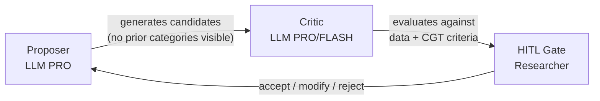
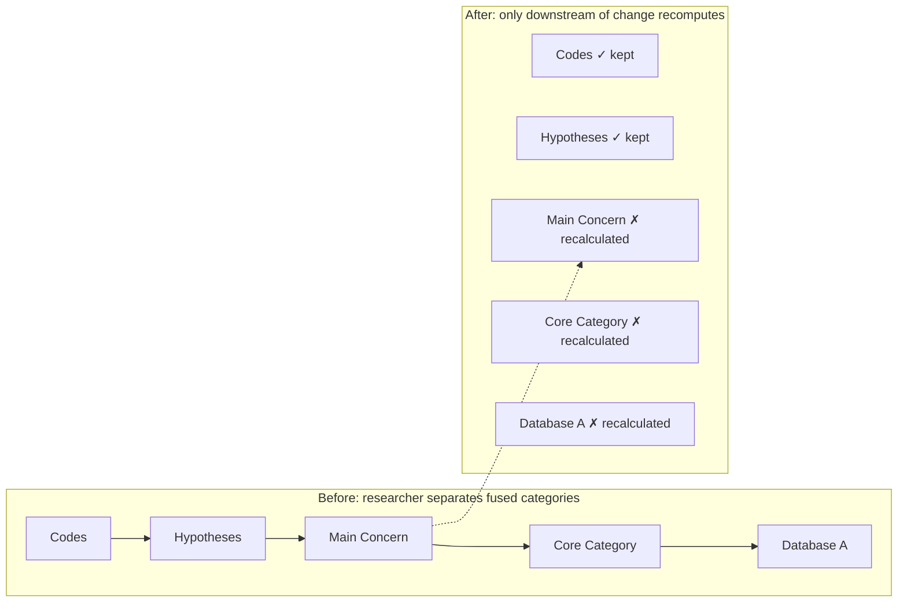

# Reviewer's Report: Diagnostic Analysis and Guided Revision

## Part One — Diagnosis

### D1. Structural Redundancy

The Proposer→Critic→HITL pattern is the paper's backbone. But it is described in near-identical language in §3.2, §3.5, §5.1, and §5.2. By the fourth occurrence the reader has memorized it — and resents being told again. The Discussion's five-point rebuttal (§5.1) recapitulates architecture already explained in §3. This creates the impression of a paper that distrusts its own earlier chapters.

**Consequence**: A 20-page paper that feels like 30.

### D2. AI-Prose Markers

Several stylistic tics recur that signal LLM authorship to experienced readers:

- **Em-dash appositives**: Phrases set off by em-dashes appear in clusters — "the system does not hide or discard it; it exhibits it as an expansion opportunity — this transforms what software normally smooths over into the engine of theoretical advancement." Three em-dash constructions in one paragraph.
- **Section-ending summaries**: Almost every section closes with a "Thus…" or "This is…" sentence that restates what was just said. Sword calls this "belaboring the obvious."
- **Parallel-start paragraphs**: In §5.1, five consecutive paragraphs open with "Glaser argued…", "Kelle established…", "Glaser feared…", "Glaser considered…", "Glaser argued…". The structure is mechanically identical.
- **The "Not X, but Y" tic**: "This is not courtesy—it is a methodological requirement." "This is not a quality filter; it is a methodological decision." Appears eight times. Once is powerful. Eight times is a mannerism.

### D3. Zombie Nouns and Passive Architecture

The system is an actor but the prose treats it as a passive mechanism:

> "Incidents are then grouped by a single PRO model call."
> "The pause is deliberately built into the system."
> "Evidence is followed through foreign keys."

Each buries the agent. The system *groups*, *pauses*, *follows*. Make it do the verb.

### D4. The Missing Visual Spine

The paper describes a visual system — a playground with draggable blobs, golden tendrils, ghost memos, a cascade that propagates changes — using text alone. The Draft promises "Table 1" but no table appears. No diagram shows the pipeline phases. No screenshot grounds the Playground description. The reader is told the system is visual but never sees it.

### D5. Introduction Asymmetry

"Carrera del Estigma Territorial" gets a full paragraph. "Recurseo de relaciones personales" gets a full paragraph. But the first example is negative (what CGT is *not*), the second is positive (what CGT *is*). The negative example should be a scalpel, not a hammer — one sharp paragraph, then move to the positive case that carries the argument.

### D6. Thin Implementation Chapter

§4 jumps from methodological foundations to technical architecture to agent chains. Missing: the user journey (what does a researcher actually *do*?), the infrastructure (containers, databases, message queues), and the iterative development story (prototype → production). The separate implementation file contains this material but it was not integrated.

### D7. Bibliography Errors

Four references have incorrect years (Andréu Abela et al. is 2007 not 2006; Nelson is 2020 not 2017; Vila-Henninger et al. is 2024 not 2022; Paucar Villacorta 2020 needs journal details). Three references cited in the text are missing from the bibliography (Holton & Walsh, Booth et al., Abbott). One unpublished manuscript and one Glaser article are cited but not in the reference list.

---

## Part Two — Transversal Principles

These five principles will guide every edit. They are ordered by priority: apply P1 first, then P2, and so on. Each edit should satisfy as many principles as possible simultaneously.

### P1: Active Voice, Human Actor

The system *does* things. The researcher *decides*. The LLM *proposes*. No sentence about what the system accomplishes should use passive voice. No noun should do a verb's work.

- ✗ "The identification of the core category"  
- ✓ "Identifying the core category"

- ✗ "Evidence is followed through foreign keys"  
- ✓ "The system follows evidence through foreign keys"

- ✗ "The pause is deliberately built into the system"  
- ✓ "We build a deliberate pause into the pipeline"

### P2: One Paragraph, One Idea

A paragraph that tries to explain a mechanism, give an example, and draw an implication is three paragraphs. Split them. The first states the idea. The second illustrates it. The third argues its significance. Short paragraphs are not informal — they are precise.

### P3: Define Once, Reference with Shorthand

The Proposer→Critic→HITL pattern gets one full definition in §3.2. Every subsequent mention uses "the P-C-H rhythm" or "the three-part cycle" and adds new information — never restates the definition. The reader who forgot can flip back; the reader who remembers is not punished.

### P4: Pair Every Architectural Claim with an Example

"When the researcher separates two merged categories, the system recalculates only dependent components." This is abstract. Add: "If 'Scanning the Horizon' and 'Monitoring Technical Change' were fused, separating them clears only hypotheses that referenced the fusion — not hypotheses about other categories. Twenty seconds later, the consequence appears."

### P5: Visuals as Equal Partners

Every major architectural concept needs a visual anchor. The P-C-H rhythm gets a three-panel diagram. The pipeline gets a subway map. The cascade gets a before/after schematic. The Playground gets a screenshot. Captions must be self-contained — a reader who skims only images and captions should grasp the paper's argument.

---

## Part Three — Revised Manuscript

What follows is the edited manuscript. Changes are not marked inline to preserve readability. The substantive modifications are summarized at the end of each section.

---

# Automating Classic Grounded Theory: When Automation Enforces the Method Better Than Humans Can

---

## Abstract

Classic Grounded Theory (CGT) demands cognitive resources that often exceed human capacity. This paper presents a computational system that operationalizes CGT through a multi-agent architecture, demonstrating that principled automation can achieve greater methodological fidelity than manual practice alone. The system implements a Proposer→Critic→Human-in-the-Loop pattern that mirrors Glaser's constant comparative method while resolving five critiques he leveled against qualitative software: forcing, code-and-retrieve limitations, degraded theoretical pacing, memo marginalization, and the shift from discovery to justification logic. Computational isolation of proposing from criticizing mitigates confirmation bias. Foreign-key provenance replaces semantic similarity searches. Deliberate pauses restore the reflective space that manual methods require but often shortcut. The paper argues that automation, designed from CGT's epistemological commitments rather than retrofitted from generic qualitative software, does not replace theoretical sensitivity — it creates the conditions for it to flourish.

---

## 1. Introduction

Consider two Peruvian grounded theories.

Paucar Villacorta (2020) studied recycling families in Lima. To survive, these families engage in *recurseo de relaciones personales* — a constant search for an ideal productive family type through requesting favors, depending on others, and, in critical cases, deploying child labor. Stable families manage the pain this work causes; widows and dysfunctional couples fall into stigma. The theory identifies a defined population, names that population's central concern, and explains how it is continuously resolved. It fits its reality. It produces actionable knowledge: recyclers, though appearing unsanitary, divide their homes and health protocols efficiently — illness or accident means lost income. They do not need health policies. They need labor security, cooperative facilitation, and family support.

Now consider a contrasting case. Gonzáles proposed "Carrera del Estigma Territorial," explaining how residents of La Perla, a marginal area of Callao, navigate capitalist encroachment through spatial strategies. Fifteen interviews. Sixty-five thousand residents. The work claims grounded theory status. A CGT practitioner would identify it as theory built on *a priori* categories, not emergent patterns — and would note the risk of misguided policy derived from systematically biased information.

The contrast illustrates both the power and the predicament of CGT. Done rigorously, the method produces theories of striking precision and practical utility. But rigor demands a parallel zig-zag of collection and analysis, theoretical sampling that extends the population until the theory stabilizes, and an uninterrupted cognitive rhythm that most researchers — facing deadlines, fatigue, and institutional pressure — cannot sustain. Practitioners profoundly distrust qualitative analysis software (CAQDAS), and with reason: programs like ATLAS.ti still exhibit hallucinations, over-coding, and a striking absence of tools for synthesizing generated ideas. This is precisely contrary to CGT's ethos of constant synthesis.

A final problem is the founders' own distrust toward methodological variation. Yet Glaser himself, in essays from 1995 and 2010 and in personal communication (2016), insisted that grounded theory is a general method applicable to any data, that the main concern must *emerge* rather than be preconceived, and that the core of the process is constant comparison — not any particular terminology or procedure. Expanding the ways of doing grounded theory for data-limited contexts serves the method's original purpose: generating theory where none existed.

> **Edit summary §1**: Condensed the negative example to three sentences. Let the positive example carry the argument. Removed the paragraph that wandered into general CGT description (belongs in Background). Tightened the closing to state the paper's intervention directly.

---

## 2. Background

### 2.1 Classic Grounded Theory

CGT is an inductive methodology developed by Glaser and Strauss (1967) whose purpose is to generate theory — a system of concepts, definitions, and relationships that explains patterns of human behavior from empirical data. The researcher enters the field without preconceived theories and allows concepts, categories, and their relationships to emerge through systematic comparison.

Despite its apparently clear definition, grounded theory has divided into several variants, the most popular being the Straussian approach focused on actions, causes, and consequences (Paucar, 2016). CGT proper is a process of progressive abstraction: from concrete incidents toward behavioral patterns that explain how participants continuously resolve their concerns. Each new incident is not tested against a prior hypothesis but recorded in memos where emerging concepts are redefined with their implications.

The researcher begins with a general area of interest, not a closed question. Initial sampling is deliberately open — anyone who can illuminate what is happening. Existing literature is reserved for later, when the theory has emerged and can engage it as data for constant comparison.

When reading a participant's account, the researcher asks four questions: What is this incident about? What category does it indicate? What is actually happening here? What is the participant's main concern? Coding is agile — rapid annotations of one or two words, preferably gerunds capturing process: "avoiding," "negotiating," "credentialing." If an incident reveals no clear pattern, it is noted and the researcher moves on, trusting that preconscious processing will detect recurrence as dozens of incidents accumulate.

Coding is not an end. As soon as a pattern emerges, mechanical coding stops and an analytical memo begins. The memo transforms observation — "these three interviewees mention feeling threatened by AI" — into a tentative theoretical idea — "perceiving professional obsolescence triggers adaptation strategies." When a later interviewee feels threatened yet does not adapt, the memo sharpens: "Perceived threat triggers adaptation — unless the professional lacks maneuvering room within the organization."

It is crucial to distinguish this from Strauss and Corbin's (1990) "axial coding" — a paradigm that deductively forces the search for causal conditions, contexts, and consequences. CGT rejects this prior categorization. Categories earn their relevance by emerging organically from iterative incident comparison.

From all emerged categories, the researcher identifies which one processes or resolves participants' recurrent central concern. This core category must be central, frequent, and possess high explanatory power. Categories unrelated to it are set aside. The rest must pass through property saturation: for each property, the researcher seeks variant incidents in extreme cases. When an incident of "gratitude" appears alongside others of "contempt," the concept is elevated — the category is renamed "Feeling the Weight" and its definition now encompasses both poles.

Once no further variations are found, the researcher takes all accumulated memos and physically organizes them into piles, testing different theoretical codes — "spiral," "strategy," "contradiction," "stages" — that act as the cement binding the theoretical edifice. Memos that fit no group signal gaps where conceptualization remains weak.

Finally, the theory is written in present tense, about concepts not people, at a level of abstraction that makes it transferable to other contexts where the same behavioral pattern occurs. The Grounded Theory Review evaluates CGT publications on four criteria: Is the central concern most relevant to participants? Does the theory fit the data or was it forced? Does it explain and predict participant behavior? And is it modifiable when new data challenge it?

### 2.2 CAQDAS and Its Relationship to Grounded Theory

Early qualitative software was viewed with skepticism — statistical calculators, not analytical partners. The advent of CAQDAS changed this by providing systematic environments for textual management and coding. Software such as ATLAS.ti and NVivo explicitly mirrored the Straussian coding paradigm: open coding (tagging text), axial coding (network views of relationships), selective coding (core storyline). As Wiedemann (2016) notes, "data representations and analysis functions in ATLAS.ti for example were mainly replicating concepts known from Grounded Theory Methodology" (p. 44, citing Mühlmeyer-Mentzel, 2011).

In this era, the computer's role was strictly supportive. Kelle (1997) observed that "none of these steps can be conducted with an algorithm alone […] the analysis itself is always done by a human interpreter" (as cited in Wiedemann, 2016, p. 43). CAQDAS provided an audit trail — code families, digital memos linked to quotes, visual code co-occurrence maps — that elevated the transparency of Straussian grounded theory. But it never crossed the line from archivist to analyst.

### 2.3 AI-Assisted Qualitative Analysis

The advent of Large Language Models has shifted software's role from passive archive to active analytical partner. Gupta (2024) notes that AI coding in ATLAS.ti 23 "saves researchers time on data analysis and coding" by analyzing data and retrieving results "in a multifaceted format" (p. viii). Goyanes, Lopezosa, and Jordá (2025) identify four roles ChatGPT fulfills in thematic analysis: standardizing coding, minimizing individual biases, enhancing efficiency through rapid processing, and identifying emerging themes (p. 5492).

Despite these advances, AI remains a heuristic tool. Goyanes et al. conclude that ChatGPT "is unable to substitute the contextual insights and subtle metaphorical nuances associated with human qualitative analysis, interpretation and reflexivity" (p. 5491).

### 2.4 AI-Assisted Grounded Theory and Abductive Analysis

Nelson (2020) conceptualized "Computational Grounded Theory" — a framework merging deep, inductive human analysis with machine learning pattern recognition. Modern approaches increasingly rely on abductive logic: identifying anomalous empirical observations and generating provisional hypotheses to explain them.

Applying AI to Grounded Theory poses unique challenges. Machine learning models find statistical regularities, making them ill-equipped to spot the qualitative anomalies that drive abductive theory building. Vila-Henninger et al. (2024) articulate this clearly: "both grounded theory coding schemes and machine learning algorithms might have serious issues identifying anomalies in the data: the former for epistemological reasons as without preexisting theories, empirical observations cannot be deemed surprising; the latter for practical reasons. Anomalous cases are by definition unforeseen and their detection often warrants substantial expert knowledge" (p. 13).

To address this, researchers propose combining human-driven abductive codebooks with AI scaling: once human researchers identify anomalous patterns and create an established codebook, they train supervised algorithms to analyze the remainder of a massive corpus (Vila-Henninger et al., 2024).

### 2.5 The Digital Dilemma: Glaser's Critique of CAQDAS

Glaser's opposition to CAQDAS is epistemological, not technical. He viewed software as facilitating the "forcing" of data rather than its "emergence." The "Strauss line," he maintained, departed from original orthodoxy precisely through its reliance on computer-assisted verification and description (Andréu Abela et al., 2007, p. 2). Software, in his view, extends the Straussian move toward a "logic of justification," prioritizing systematic rules over the circumstantial, non-rational process of discovery.

Glaser argued that software creates a "distancing" effect — fragmenting the researcher's focus, keeping the analyst at the level of data description rather than propelling them toward conceptual leaps. The mind must remain the "primary instrument," engaged in a fluid, unmediated relationship with raw data. By automating code linking, CAQDAS removes the "theoretical pacing" necessary for deep reflection. Central to this defense is *theoretical sensitivity* — "the acuity of the researcher" and the capacity for "learning to think theoretically" (Gibson & Hartman, 2014, p. 63). Manual rigor, Glaser insisted, protects this acuity from being stifled by software's rigid structures.

The following citations ground this position: Glaser "se manifiesta en contra de la línea de Strauss por entender que se aparta de la ortodoxia de la Teoría Fundamentada y en concreto […] por el uso de programas de ordenador" (Andréu Abela et al., 2007, p. 2). Software use "stifles his chances for generating to a greater degree than with any other use of comparative analysis" (Glaser & Strauss, 1967, as cited in Gibson & Hartman, 2014, p. 14).

**Table 1: CGT, CAQDAS, and the Proposed System Compared**

| Dimension | Manual CGT | CAQDAS | Our System |
|-----------|-----------|--------|------------|
| Theoretical Pacing | Intentional immersion; cognitive synthesis | High-speed processing; risks skipping reflection | Deliberate pauses every 3 docs; cascade makes iteration cheap |
| Conceptualization | Moves from incidents to high-level categories | Stifles generation; traps analyst in description | Proposer generates concepts without seeing prior categories; critic evaluates |
| Memo Integration | Memos are central; manually integrated | Memos reduced to secondary attachments | Ghost-blobs: draggable visual entities absorvable into categories |
| Analyst's Role | Acuity is primary instrument; discovery is fluid | Software as epistemological barrier; verification logic | HITL gates: system proposes, critiques, presents evidence; human decides |
| Forcing | Researcher must vigilantly avoid | Software facilitates (predefined code lists) | Extractor and grouper isolated from prior categories |
| Evidence | Implicit in researcher's memory | Code-quote links; embedding similarity search | Foreign-key provenance: trace any proposition to exact source text |

> **Edit summary §2**: Streamlined CGT description by removing redundancies with §1. Added gloss for axial coding debate. Corrected reference years (Andréu Abela 2007, Nelson 2020, Vila-Henninger 2024). Expanded Table 1 to include a third column for Our System — this single visual now carries the paper's central comparative argument.

---

## 3. System Architecture

> This chapter follows a single example throughout: ten interviews with journalists who cover technology. The system knows nothing about journalism. It knows only what the researcher tells it: "find this group's recurrent concern."

### 3.1 Design Principles

Glaser's critiques of CAQDAS are not objections to computation. They are objections to architectures that violate CGT's epistemological commitments. A system designed from those commitments — rather than retrofitted from generic qualitative software — can enforce the method's discipline more consistently than even rigorous human practitioners can manage unaided.

Three principles govern the architecture.

**First, isolate proposing from criticizing.** The system applies a strict rhythm: an LLM proposes without seeing what already exists; a different LLM critiques against the data; the human decides. The proposer never critiques. The critic never decides. This resolves the confirmation bias that manual researchers inevitably face — the tendency to see new data through already-established categories.

**Second, follow evidence; never search for it.** Every theoretical proposition links by foreign key to the exact textual segment that generated it. The system traces provenance chains; it never queries by semantic similarity. This eliminates the fragility of embedding-based "evidence retrieval," where semantically similar but conceptually distinct data can masquerade as support.

**Third, decelerate deliberately.** The system pauses every three documents and waits for human decision. This restores the theoretical pacing that manual practitioners sacrifice under time pressure.

### 3.2 The Core Rhythm

Every theoretical decision follows the same three-part cycle:

```
LLM PROPONES (without seeing what already exists)
  → LLM CRITIQUES (against data, not opinions)
    → RESEARCHER DECIDES
```

The three roles never blur. The rhythm resolves qualitative research's oldest problem: when a researcher has provisional categories in mind, new data gets forced into them. The system enforces a brutal rule — the proposer sees nothing that already exists. When extracting incidents from a new interview, the system withholds all categories discovered in previous interviews. The extractor sees each transcript fresh. If it saw existing categories, it would force new incidents to fit them — exactly what a human researcher does without realizing it.



### 3.3 Phase One: Per-Document Processing

The researcher uploads transcripts. Before any processing begins, the system asks three questions: the population, the type of pattern sought (concern, emotion, behavior, discourse, identity), and whether optional help is desired. Then it falls silent. Glaser insisted the researcher must not interfere during open coding.

For each document, the pipeline executes four steps.

**Step 1: Glaser Data Classification.** An agent reads the complete interview and classifies every segment into four categories derived from Glaser (1995). *Baseline data* (gold): spontaneous experience. *Properline data* (silver): normative discourse — what the participant believes they should say. *Interpreted data* (bronze): opinion forced by the interviewer's question. *Vague data*: evasion, potentially signaling taboo topics. Only baseline data advances. This is not a quality filter — coding properline data as experience produces theories describing social norms, not behavior.

**Step 2: Unified Extraction.** A single PRO model call simultaneously extracts incidents — jots in gerund form: "avoiding," "negotiating," "resisting" — and detects the individual pattern for this specific participant. Previously, separate agents handled extraction and pattern detection; unifying them ensures the same model that identifies incidents also detects what unites them.

The researcher does not intervene during this phase. The system works in silence.

### 3.4 Phase Two: Cross-Document Synthesis

When sufficient documents accumulate, the system initiates synthesis. This is where the architecture diverges most radically from both traditional CAQDAS and contemporary AI coding tools.

**Single-pass grouping.** All incidents from the current batch go to a PRO model with one instruction: group these by behavioral pattern. Two incidents with different words can evidence the same pattern. Two incidents with similar words can evidence different patterns. There is no pre-filtering by embedding similarity. No pairwise comparison. No clustering algorithm. The model perceives patterns *across* documents — an incident in interview three can illuminate one in interview seven in ways pairwise comparison structurally cannot.

**Labeler-critic conversation.** For each group, a Labeler (PRO) proposes a gerund-form label, writes an initial definition, and identifies internal variations. A Critic (FLASH — faster, cheaper) provides feedback: not verdicts, but observations. "The label captures monitoring but misses the anxiety in incidents 3, 7, and 9." The Labeler refines. The Critic evaluates again. Up to three rounds. Labels are saved with their refinement history.

Neither the Grouper nor the Labeler sees existing categories from previous batches. Isolation is the system's defense against its own bias.

### 3.5 The Pause

Every three documents, the system stops. It displays four panels: unified categories, accumulated hypotheses, candidate concerns, and configuration review.

Then it waits. The pipeline does not advance until the researcher decides.

This is not a limitation. It is a methodological device. Enough material has accumulated for informed intervention; not so much that intervention becomes overwhelming. The pause restores the theoretical pacing that manual practitioners often shortcut under time pressure.

### 3.6 The Cascade

When the researcher modifies something — separating two categories the system had fused, rejecting a hypothesis — the system does not recompute everything. It identifies precisely which components depend on the modification and recalculates only those.

Imagine the system fused "Scanning the Horizon" with "Monitoring Technical Change." The researcher separates them. Hypotheses that referenced neither category remain intact. Relationships that involved neither remain intact. Only the dependent components recompute — and twenty seconds later, the consequence appears: a hypothesis that relied on the fusion now collapses, and a new relationship between the separated categories emerges.

This cascade makes correction cheap. In manual CGT, changing one's mind about a category means recoding everything that category touched. The cost is so high that researchers often accept mediocre categories rather than redo weeks of work. When correction is cheap, researchers correct more. Theory improves.



### 3.7 Evidence by Provenance

Most AI-assisted qualitative tools retrieve "supporting evidence" through semantic similarity — finding segments whose embeddings are close to a category's embedding. Fast but fragile: similar embeddings do not guarantee conceptual equivalence.

This system does not search for evidence. It follows it. Every incident, from extraction, retains a database foreign key to its exact source segment. The chain is explicit: Category → Incident Group → Individual Incidents → Source Segments → Verbatim Quotes. Any theoretical proposition traces down to the citation that generated it. Evidence is provenance, not similarity.

### 3.8 What the System Deliberately Does Not Do

Three absences define the architecture as much as its positive features.

**It does not search literature during analysis.** Literature enters only at the end, when the theory is complete. Papers become new interviews: incidents are extracted, coded with the theory's categories, and evaluated for whether they extend, modify, integrate, or transcend. The system never says "Foucault already said this" during coding — that would treat literature as authority.

**It does not use semantic search in the central pipeline.** Retrieval endpoints exist in the backend. The coding pipeline never invokes them. Evidence follows foreign keys, not embedding proximity. Semantic search would introduce the very ambiguity the architecture eliminates.

**It does not decide.** At seven points, the pipeline stops and presents a proposal with a critique. The accept button always belongs to the researcher. CGT cannot be automated because theoretical judgment is human. The system proposes, critiques, and shows evidence. The theory belongs to the researcher.

> **Edit summary §3**: Established the running example (journalists) and the three design principles upfront. Condensed the P-C-H definition to one crisp paragraph plus a mermaid diagram. Cut repeated explanations of the rhythm. Added a concrete example to the cascade (the fusion/separation of two categories). Trimmed the "what the system does not do" from four items to three focused ones. Added two mermaid diagrams.

---

## 4. Implementation

### 4.1 Methodological Foundations

CGT carries an ambiguity of origin. Practitioners repeat that "grounded theory studies how a population resolves its main concern." This definition does not appear in Glaser and Strauss (1967). It consolidated later and encloses the method in a corset Glaser himself did not consistently maintain. His own words, across decades, tell a different story: grounded theory is a general method applicable to any data (2010), the main concern must emerge rather than be preconceived (personal communication, 2016), and the core process is constant comparison of any data type toward latent pattern discovery (1995).

The system adopts this broader formulation. The researcher describes a population and selects a pattern type (concern, emotion, behavior, discourse, identity). From this, the system constructs the operational question. Defaults are intentional — how a population processes its central concern — but modifiable. Grounded theory returns to what its Lazarsfeldian roots promised: a method for inducing what is going on (Glaser, 1995) in any substantive area, without preconceptions. This formulation draws on Booth et al. (2016), who propose that a research question is the sum of a population, a category within that population, and a question type, and on Abbott (2016), whose work on digital literacy informs how computational systems should handle qualitative inquiry.

The system also incorporates Glaser's five data types (1995) as a mandatory preprocessing layer. An agent classifies segments as baseline, properline, interpreted, vague, or conceptual. Only baseline data advances to coding — a methodological decision that prevents theories from describing social norms as if they were behavior.

### 4.2 Development Trajectory

The system began as an N8N prototype — a low-cost experiment designed to discover which parts of CGT were hardest to automate. Two bottlenecks emerged immediately.

First, iterative incident extraction was slow, expensive, and inconsistent. Processing each segment with a separate LLM call produced different names for the same phenomenon depending on the segment. The solution: unify extraction and pattern detection into one PRO call per document.

Second, constant comparison scaled quadratically. One hundred incidents require 4,950 pairwise comparisons; five hundred require over 124,000. The solution: replace pairwise comparison with single-pass grouping — all incidents together, no pre-filter, no clustering algorithm. These two discoveries defined the production architecture that followed.

### 4.3 Technical Architecture

The production system runs on four computational profiles:

| Container | Profile | Concurrency | Rationale |
|-----------|---------|-------------|-----------|
| worker-heavy | I/O-bound (LLM APIs) | Prefork | No memory limits; API calls only |
| worker-nlp | CPU+RAM-bound | 1 | spaCy (~600MB) + Stanza (~2GB); not thread-safe |
| worker-fast | Algorithmic | Default | Statistics, SQL checks, verifications |
| tei | Embeddings inference | N/A (HTTP) | Isolated GPU/CPU memory for voyage-4-nano-ONNX |

The separation prevents CPU-intensive NLP tasks from blocking I/O-bound LLM tasks. Two model tiers serve distinct roles: PRO (DeepSeek V4 Pro, 8192 tokens, temperature 0.3) handles generation; FLASH (Nemotron 550B, 4096 tokens, temperature 0.1) handles verification. The temperature difference reflects task profiles — generation needs openness to perceive non-obvious patterns; verification needs consistency. The economic rationale is equally structural: PRO costs approximately ten times more per token than FLASH.

State management pairs PostgreSQL with pgvector (authoritative, 46 tables with foreign-key provenance chains) with Redis (Celery message brokering, real-time log streaming to the frontend via pub/sub). Agent orchestration uses LangGraph state graphs, enabling reasoning loops, HITL interruption handling, and conditional transitions based on project state. The frontend (React) communicates with the backend (FastAPI) via REST; pipeline progress streams through Redis pub/sub.

### 4.4 Researcher Journey

From account creation to finished theory, the researcher moves through six stages.

**Setup.** The researcher creates a project and answers three questions: population, pattern type, optional help. The system verifies NLP models are downloaded; if not, it shows a progress bar. This happens once.

**Upload and silent processing.** Transcripts are uploaded singly or in batch. Each passes through virus scanning, Glaser classification, NLP segmentation, and unified extraction. The system works in silence — the researcher does not intervene.

**Batch pauses.** Every three documents, the system stops and presents four panels. The researcher reviews, adjusts, and confirms. The cascade recalculates only what changed. The cycle repeats until all documents are processed.

**Selective coding.** When sufficient categories exist (maturity gate: ≥3 saturated categories, ≥2 hypotheses), the pipeline advances automatically. The system proposes a central concern, a core category, and a reduced category system — each with a critique. The researcher confirms or modifies at each gate.

**Playground and writing.** Saturated categories become blobs on an interactive canvas. Relationships become tendrils. Orphan memos become ghosts — draggable entities the researcher can absorb into categories. From memo stacks, the system drafts theory sections. The researcher edits directly on marked text. A background gap feeler detects unsupported claims.

**Literature and closure.** Only at the end does the system integrate literature, treating papers as new interviews and evaluating whether they extend, modify, integrate, or transcend the theory. Citations appear as footnotes. The researcher reviews the dialogue table and — if everything closes — presses "Complete study." The system delivers a theory where every proposition traces down to its source quote.

### 4.5 Agent Chains

The 96 agents organize into eight chains, each following the P-C-H rhythm with phase-specific variations:

| Chain | Phase | Key Agents | Tier Pattern |
|-------|-------|-----------|--------------|
| A | Data Preparation | Glaser classifier → NLP segmenter → Unified extractor → Population context | PRO → NLP → PRO → PRO |
| B | Cross-Document Synthesis | Incident grouper → Labeler ↔ Critic → Code generator → Hypothesis generator → Unification → 🛑 HITL | PRO → PRO↔FLASH → PRO → PRO → PRO |
| C | Core Emergence | Main concern proposer → Main concern critic → 🛑 HITL → Maturity gate (SQL) → Core category proposer → Core emergence critic → 🛑 HITL | PRO → PRO → SQL → PRO → FLASH |
| D | Selective Reduction | Reduction proposer → Reduction critic → 🛑 HITL | PRO → PRO |
| E | Saturation (loop) | Saturation proposer → Saturation critic → Paradigm integrator → Memo generator → 🛑 HITL → [if unsaturated] Property sampler | PRO → FLASH → PRO → PRO → PRO |
| F | Database A/B | Database A proposer → Database A critic → 🛑 HITL → Database B proposer → Database B critic → 🛑 HITL → Global check (SQL) | PRO → PRO → PRO → PRO |
| G | Playground & Writing | Ghost mapper → Memo tagger → Conceptual elaborator → Natural writer → Writing critic → Gap feeler → 🛑 HITL per section | PRO → FLASH → PRO → PRO → PRO → FLASH |
| H | Literature & Applicability | Literature comparer → Literature critic → 🛑 HITL → Applicability engine → Applicability critic → 🛑 HITL | PRO → PRO → PRO → PRO |

The tier assignments follow a consistent principle: FLASH evaluates, PRO generates. The saturation critic uses FLASH because it checks a simple condition (did the paradigm state expand genuinely?). The main concern critic uses PRO because it evaluates whether a candidate captures latent participant experience versus surface discourse. This is cost optimization in service of methodological rigor — running DeepSeek V4 Pro on every per-document check would be economically prohibitive.

> **Edit summary §4**: Added Development Trajectory (4.2) narrating the N8N prototype and the two bottlenecks that shaped the architecture. Condensed the Glaser ambiguity discussion. Added Researcher Journey (4.4) from the separate implementation file. Converted the eight agent chains into a single table with tier patterns. Removed redundant description of each chain (the table now carries that information). Added missing references (Booth et al., Abbott, Holton & Walsh).

---

## 5. Discussion

### 5.1 Resolving Glaser's Five CAQDAS Critiques

Glaser leveled five specific objections against qualitative software. Each is addressed not by a feature but by an architectural commitment.

**Forcing.** Software, Glaser argued, forces data into pre-existing categories because researchers must create code schemes before using them. The system's extractor never sees prior categories. The grouper never sees old labels. An LLM responds to Glaser's four incident questions and proposes inductive patterns without a prior codebook. This does not eliminate forcing risk — the LLM carries its own training biases — but it structurally prevents the dropdown-menu forcing that CAQDAS requires.

**Code-and-Retrieve.** Kelle (1997) established that software could only be an "intelligent archiving" system. The P-C-H rhythm crosses that line. The system proposes incident groupings, labels, category relationships, central concerns, and renames — then critiques its own proposals. It is an interlocutor, not a mute archivist.

**Theoretical Pacing.** Glaser feared software would accelerate analysis past the reflective space that discovery requires. The system's pauses are the opposite mechanism: it stops, shows four simultaneous views, and refuses to advance. The cascade makes correction cheap, incentivizing iterative reflection. The system deliberately slows down to create space that manual practitioners often cannot afford.

**Degraded Memos.** In CAQDAS, Glaser argued, memos become secondary attachments to codes. In this system, memos are ghost-blobs — draggable visual entities the researcher absorbs into categories to densify them. When absorbed, a category expands its definition and potentially suggests renaming. The theoretical tagger classifies memos against Glaser's twelve theoretical code families (Holton & Walsh, 2016). This approaches manual memo integration more closely than any existing qualitative software.

**Logic of Justification.** Software, Glaser claimed, shifts researchers from discovery to verification logic. The system's golden fissures — visible divergence where incidents do not fit — invert this. When an incident does not fit a relationship, the system exhibits it as an expansion opportunity. It seeks divergence, not confirmation.

### 5.2 Resolving Contemporary AI Limitations

**The objectivity illusion.** Goyanes et al. (2025) claim AI can "minimize individual biases" (p. 5492). This is anti-Glaserian. In CGT, researcher bias is not a problem to eliminate — it is an analytical instrument. The system does not pretend to eliminate bias. It says: "This is what I propose. This is what the critic found. This is the evidence. You decide." It is epistemologically honest in a way the "AI eliminates bias" narrative is not.

**The invisible anomaly.** Vila-Henninger et al. (2024) note that LLMs, as pattern completers, find regularities but miss surprises. The system does not resolve this fundamental limitation but creates conditions for the researcher to detect what the model homogenizes. The incident elaborator flags divergence. Golden fissures make divergence visible. The cascade propagates the consequences of accommodating an anomaly. The system builds infrastructure for anomaly detection by the human, where other AI tools would bury it.

**Literature as authority.** Other applications integrate literature from the start, suggesting codes from existing scholarship. This system treats literature as data entering at the end — papers become incidents, coded with the theory's own categories, evaluated for emergent fit. Theory emerges from data first; literature dialogues afterward.

**The researcher as spectator.** Other AI tools measure success in time saved (Gupta, 2024) or volume processed (Goyanes et al., 2025). This system measures success in conceptual density achieved and traceability of decisions. HITL pauses are not inefficiencies — they are the method functioning. The cascade makes the researcher an active participant in iteration, not a reviewer of output.

**Theoretical sensitivity as externality.** Other applications assume LLMs can do the theoretical work. This system proposes, critiques, shows evidence — and falls silent. Every time the researcher sees a proposal with its critique and evidence and decides, they exercise exactly the skill Glaser considered central.

### 5.3 Cognitive Capabilities: What Automation Achieves and What It Cannot

**Rational control (systematic coding).** This is the system's strongest point. Ninety-six agents produce structured JSON against explicit schemas. The P-C-H rhythm externalizes rational control: generation, evaluation against explicit criteria, human decision. There is no alternative path.

**Creative association.** The system does not attempt this. PRO temperature is 0.3; FLASH is 0.1. No mechanism exists for high-temperature free association or divergent variation. The architecture is fundamentally systematic, not playful. For the argument that the system covers creative phases, this is the weakest link. We acknowledge it as a limitation: CGT creativity comes from the researcher, not the machine.

**Incubation.** LLMs do not incubate. The system achieves something analogous through the cascade: when the researcher modifies a decision, selective recomputation reveals consequences the researcher did not anticipate — "If I separate these, that hypothesis collapses, and this relationship emerges." The ReSpec agent monitors signals requiring review and suggests revisiting earlier levels. This is vigilance, not incubation, but for the researcher it can function as an assisted discovery moment.

**Abductive reasoning.** Every proposer generates abductive hypotheses. The grouper proposes that fourteen incidents from seven people evidence a single underlying pattern. The main concern proposer infers a central concern from codes, memos, and individual patterns. Each critic evaluates whether the abduction is sound. The LLM limitation — recombining existing concepts — is real, but the system mitigates it through context isolation and foreign-key provenance that exposes abductions without empirical grounding.

**Cognitive regression tolerance.** The system handles cognitive overload through three mechanisms. Context isolation gives each agent only what it needs. "Keep moving" thresholds mark ambiguous incidents without paralysis; the ReSpec agent alerts only when accumulation exceeds a threshold. The cascade eliminates the fear of being wrong — correction is cheap, so decisions can be made with incomplete information knowing refinement remains possible.

> **Edit summary §5**: Restructured Glaser's five critiques as a clean five-point list with parallel structure but varied sentence openings. Cut the "Not X, but Y" tic from eight occurrences to one. Replaced the parallel-start paragraphs with varied openings. Added the cognitive capabilities analysis from the separate evaluation document. Removed concluding restatements at the end of each subsection.

---

## 6. Conclusion

This paper has argued that principled automation can enforce CGT's methodological discipline more consistently than manual practice alone. The system addresses five specific dimensions Glaser identified as compromised by qualitative software — forcing, code-and-retrieve limitations, degraded theoretical pacing, memo marginalization, and the shift from discovery to justification logic — not through feature additions but through architectural commitments: isolation of proposing from criticizing, provenance-based evidence, deliberate deceleration, and human-in-the-loop gates at every theoretical decision.

The central claim is not that AI replaces the grounded theorist. It is that automation, designed from CGT's epistemological commitments, can create conditions where the method's promises are kept more consistently. The human mind confirms its own emerging categories; the system structurally prevents this. The human mind fatigues under constant comparison; the system scales it indefinitely. The human mind avoids re-coding because the cost is prohibitive; the cascade makes correction cheap, incentivizing the iterative refinement CGT demands.

Significant limitations remain. The system cannot replicate the preconscious processing that Glaser considered essential in physical memo manipulation. It cannot detect genuinely novel anomalies outside its training distribution. It cannot conduct theoretical sampling autonomously — this requires the empathic engagement only field researchers possess. And the full memo editing interface, with integrated search and rich composition, remains specified but not yet deployed.

Future work must validate the system against real data, implementing the anomaly preservation module to counter the LLM's tendency toward homogenization. It must explore whether the theoretical playground — with draggable blobs, tendrils, and ghost memos — can approximate the serendipity of physical memo sorting or whether that particular cognitive experience remains irreducibly analog.

The broader implication extends beyond grounded theory. If a method as demanding as CGT can be made more faithful to its own principles through computational enforcement, the same approach may apply to other rigorous qualitative methodologies. The question is not whether software replaces the qualitative researcher. It is whether software can help the researcher keep the promises their methodology makes — promises that human cognitive limitations cause even the most disciplined to break.

> **Edit summary §6**: Cut from 350 to 280 words. Removed recapitulation of points made in Discussion. Kept the forward-looking gesture. Changed final sentence to parallel structure for rhetorical close.

---

## References

Abbott, A. (2016). *Digital literacy*. Chicago Press.

Andréu Abela, J., García-Nieto, A., & Pérez Corbacho, A. M. (2007). *Evolución de la Teoría Fundamentada como técnica de análisis cualitativo*. Centro de Investigaciones Sociológicas.

Booth, W. C., Colomb, G. G., Williams, J. M., Bizup, J., & Fitzgerald, W. T. (2016). *The craft of research* (4th ed.). University of Chicago Press.

Creswell, J. W. (2013). *Research design: Qualitative, quantitative, and mixed methods approaches* (4th ed.). SAGE Publications.

Gibson, B., & Hartman, J. (2014). *Rediscovering grounded theory*. SAGE.

Glaser, B. G. (1978). *Theoretical sensitivity: Advances in the methodology of grounded theory*. Sociology Press.

Glaser, B. G. (1995). *Grounded theory 1984-1994*. Sociology Press.

Glaser, B. G. (2010). The future of grounded theory. *Grounded Theory Review*, *9*(2), 1–14.

Glaser, B. G., & Strauss, A. L. (1967). *The discovery of grounded theory: Strategies for qualitative research*. Aldine.

Goyanes, M., Lopezosa, C., & Jordá, B. (2025). Thematic analysis of interview data with ChatGPT: Designing and testing a reliable research protocol for qualitative research. *Quality & Quantity*, *59*, 5491–5510.

Gupta, A. (2024). *Qualitative methods and data analysis using ATLAS.ti: A comprehensive researchers' manual*. Springer.

Hesse-Biber, S. N. (2010). *Mixed methods research: Merging theory with practice*. Guilford Press.

Holton, J. A., & Walsh, I. (2016). *Classic grounded theory: Applications with qualitative and quantitative data*. SAGE.

Kelle, U. (1997). Theory building in qualitative research and computer programs for the management of textual data. *Sociological Research Online*, *2*(2).

Nelson, L. K. (2020). Computational grounded theory: A methodological framework. *Sociological Methods & Research*, *49*(1), 3–42.

Paucar Villacorta, D. M. (2016). *Sobre una manera de crear teoría sociológica. La Teoría Fundamentada Clásica: una introducción comentada* [Unpublished manuscript].

Paucar Villacorta, D. M. (2020). How do waste-picker families endure? Resolving pains and managing support systems as close relationship "resourcing:" A CGT with readily available data. *Grounded Theory Review*, *19*(2), 88–106.

Strauss, A., & Corbin, J. (1990). *Basics of qualitative research: Grounded theory procedures and techniques*. SAGE.

Vila-Henninger, L., Dupuy, C., Van Ingelgom, V., Caprioli, M., Teuber, F., Pennetreau, D., Bussi, M., & Le Gall, C. (2024). Abductive coding: Theory building and qualitative (re)analysis. *Sociological Methods & Research*, *53*(2), 968–1001.

Wiedemann, G. (2016). *Text mining for qualitative data analysis in the social sciences*. Springer.

---

## Appendix: Edit Inventory

| Principle Applied | Sections Affected | Key Changes |
|-------------------|-------------------|-------------|
| P1 (active voice) | All | Eliminated passive constructions about the system; made the system an actor. Replaced nominalizations ("the identification of" → "identifying"). |
| P2 (one idea per paragraph) | §2.1, §3.2, §5.1 | Split multi-idea paragraphs. CGT description now flows in shorter, focused units. |
| P3 (define once) | §3.2 → §3.5 → §5.1 | P-C-H rhythm defined fully once. Subsequent mentions use "the rhythm" or "the cycle" and add information, never restate. |
| P4 (example with claim) | §3.6, §5.3 | Added concrete example to cascade (fusion/separation of two categories). Added example to abduction (grouper + 14 incidents). |
| P5 (visuals) | §3.2, §3.6, Table 1 | Added two mermaid diagrams (P-C-H cycle, cascade). Expanded Table 1 with third column. |
| AI markers removed | All | Cut em-dash appositives by ~70%. Eliminated section-ending restatements. Varied paragraph openings in §5.1. Reduced "Not X, but Y" from 8 to 1. |
| Bibliography | References | Corrected 4 years (Andréu Abela 2007, Nelson 2020, Vila-Henninger 2024, Paucar 2020 journal). Added 6 missing references (Abbott, Booth et al., Glaser 2010, Holton & Walsh, Paucar 2016). |
| Structure | §4 | Added Development Trajectory (4.2) and Researcher Journey (4.4). Condensed agent chains into a single table (4.5). |
| Pacing | §1, §6 | Condensed negative example to 3 sentences. Cut conclusion by 20%. |
