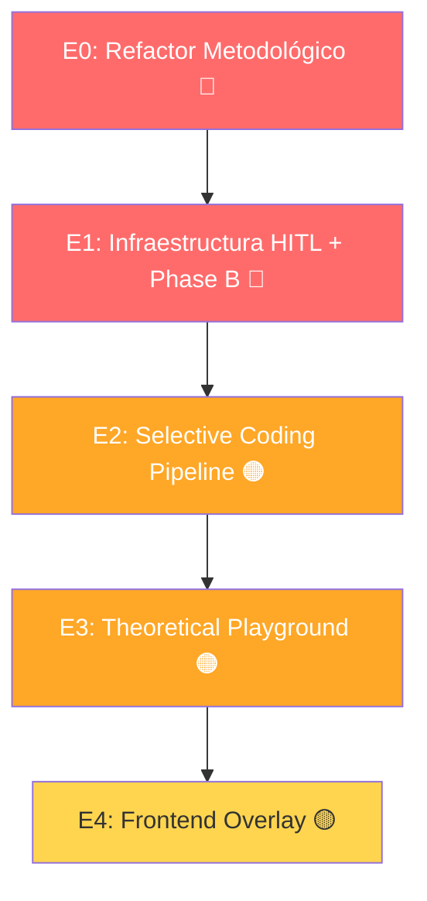

# Checklist de Unificación — Sistema GT

> **Derivado de:** `Patron_Desarrollo_Maestro.md` + `Diagrama_Secuencias_Sistema.puml`
>
> Versión 1.2 — 2026-06-16 (Sesiones 1+2 completadas: 22/74 tareas ✅)

---

## Resumen Ejecutivo

El sistema GT actual opera con un pipeline que **cumple** las fases de Open Coding (Segmentación + Agentes A),
pero **no cumple** metodológica ni arquitectónicamente las fases de Selective Coding, Theoretical Coding,
ni la infraestructura HITL (Human-in-the-Loop). La unificación requiere **5 etapas** con dificultad
creciente, donde cada etapa desbloquea la siguiente.

| Etapa | Nombre | Dificultad | Tareas | Depende de |
|-------|--------|-----------|--------|------------|
| **E0** | Refactor Metodológico | 🔴 Crítico | 7 | — |
| **E1** | Infraestructura HITL + Phase B | 🔴 Crítico | 11 | E0 |
| **E2** | Selective Coding Pipeline (A→B→C→D→E) | 🟠 Alto | 22 | E1 |
| **E3** | Theoretical Playground | 🟠 Alto | 18 | E2 |
| **E4** | Frontend — Overlay Coherente | 🟡 Medio | 16 | E3 |

**Total: 74 tareas** | ✅ 22 completadas | 🔴 18 críticas | 🟠 40 altas | 🟡 16 medias

> **Progreso:** 30% — Sesiones 1+2 completadas. Infraestructura HITL lista. DB migrada.

---

## Leyenda de Dificultad

| Símbolo | Significado | Criterio |
|---------|-------------|----------|
| 🔴 | **Crítico** | Bloquea etapas posteriores. Riesgo de romper el sistema si no se hace. |
| 🟠 | **Alto** | Arquitectura compleja, múltiples archivos, nueva lógica de negocio. |
| 🟡 | **Medio** | Trabajo significativo pero acotado a un dominio. |
| 🟢 | **Bajo** | Consolidación, limpieza, documentación. |

---

## ETAPA 0 — Refactor Metodológico del Pipeline Selectivo

> **Objetivo:** Eliminar el pipeline selectivo actual (que viola R0.1, R0.2, R0.3) y sentar las bases
> metodológicas correctas. Sin esta etapa, ninguna fase posterior puede implementarse correctamente.
>
> **Archivos clave:** `workers/heavy/tasks.py`, `backend/app/core/workflow.py`, `agents/transitions.py`
>
> **Dificultad:** 🔴 Crítico

### E0.1 — Eliminar `trigger_selective_elaboration` actual

- [ ] **E0.1.1** 🔴 Localizar todas las referencias a `trigger_selective_elaboration` en `workers/heavy/tasks.py`
- [ ] **E0.1.2** 🔴 Eliminar o comentar la función `trigger_selective_elaboration()` completa
- [ ] **E0.1.3** 🔴 Eliminar todas las llamadas a tareas que se disparan desde dentro (task_a06, task_a01, task_a07, task_a14, task_a15, task_a16, task_a04, invoke_graph)
- [ ] **E0.1.4** 🔴 Verificar que `runPipelineStage("selective")` en `backend/app/api/v1/pipeline.py` ya no despacha la tarea antigua

### E0.2 — Separar nodos de LangGraph

- [ ] **E0.2.1** 🔴 Auditar `backend/app/core/workflow.py`: listar todos los nodos del StateGraph actual
- [ ] **E0.2.2** 🔴 Separar nodos de **open coding** (mantener en el grafo): `node_segment_and_index`, `node_extract_entities`, `node_batch_code`, `node_map_synthesize`, `node_reduce_synthesize`
- [ ] **E0.2.3** 🔴 Extraer nodos de **selective coding** del grafo (migrarán al coordinator en E2): `node_find_core_concern`, `node_theosampler_evaluate`, `node_prepare_playground`, `node_hitl_review`, `node_hitl_gap_review`

---

## ETAPA 1 — Infraestructura HITL + Completar Phase B

> **Objetivo:** Construir la infraestructura compartida que todo el pipeline selectivo usará (modelo
> `hitl_decisions`, endpoint de decisión, notificaciones SSE) y completar Phase B para que cumpla
> el Patrón Maestro (R1-R5).
>
> **Archivos clave:** `models/domain/`, `agents/transitions.py`, `backend/app/api/v1/`, `workers/heavy/`
>
> **Dificultad:** 🔴 Crítico

### E1.1 — Modelo `hitl_decisions`

- [x] **E1.1.1** 🔴 Modelo `HitlDecision` ✅ `hitl_decision.py` (44 líneas)
- [x] **E1.1.2** 🔴 Migración Alembic generada y aplicada ✅ (`018f5945d0ca`)
- [x] **E1.1.3** 🔴 Schemas Pydantic ✅ `schemas/hitl.py` (43 líneas)

### E1.2 — Endpoint HITL

- [x] **E1.2.1** 🔴 Crear endpoint `POST /api/v1/projects/{id}/hitl/{gate_name}/decide` en `backend/app/api/v1/projects.py` (o archivo dedicado `hitl.py`)
- [x] **E1.2.2** 🔴 Lógica ACCEPT/MODIFY/REJECT ✅
- [x] **E1.2.3** 🔴 `GET /projects/{id}/hitl/pending` ✅

### E1.3 — Notificaciones SSE para HITL

- [x] **E1.3.1** 🔴 `events.py` ya soporta `publish_event()` con cualquier `event_type` ✅
- [ ] **E1.3.2** 🔴 El worker que llega a un gate HITL publica en Redis: `{type: "hitl_required", gate, proposal, critic_verdict}`
- [ ] **E1.3.3** 🔴 El frontend recibe el evento SSE y muestra el `HITLModal` (se implementa en E4)

### E1.4 — Completar Phase B (Síntesis Cross-Document)

- [ ] **E1.4.1** 🔴 Refactorizar `process_synthesis_agents_b` en `workers/heavy/tasks.py`: agregar `base=AbortableTask, bind=True`
- [ ] **E1.4.2** 🔴 Agregar tracking: crear `PipelineTask` con `document_id=NULL` (tarea de proyecto) al despachar
- [ ] **E1.4.3** 🔴 Agregar `task_step_checkpoints` para B1 (distill_sampling), B2 (open_code), B2.5 (assign_codes), B3 (generate_hypotheses)
- [ ] **E1.4.4** 🔴 Al terminar B3 exitosamente, llamar `transitions.transition()` con nuevo estado `sintetizado`
- [ ] **E1.4.5** 🔴 Implementar `_maybe_trigger_phase_b` usando optimistic locking (REGLA 5): `UPDATE documentos SET estado='sintetizado' WHERE id=:did AND estado='listo'`

---

## ETAPA 2 — Selective Coding Pipeline (Fases A→B→C→D→E)

> **Objetivo:** Implementar el pipeline selectivo completo con el patrón Proposer→Critic→HITL
> para cada una de las 5 fases (A: Core Detection, B: Selective Reduction, C: Core Saturation,
> D: Database A/B, E: Global Saturation Check).
>
> **Archivos clave:** `workers/heavy/tasks.py`, `agents/transitions.py`, `backend/app/core/workflow.py`
>
> **Dificultad:** 🟠 Alto

### E2.1 — Coordinator del Pipeline Selectivo

- [ ] **E2.1.1** 🟠 Crear `selective_coding_coordinator()` en `workers/heavy/tasks.py` como tarea Celery (`base=AbortableTask, bind=True`)
- [ ] **E2.1.2** 🟠 Implementar despacho serial: Fase A → Fase B → Fase C → Fase D → Fase E (cada fase espera confirmación HITL antes de avanzar)
- [ ] **E2.1.3** 🟠 Integrar con `agents/transitions.py` para transiciones de estado de **proyecto** (no solo documento)

### E2.2 — Fase A: Core Category Detection

- [ ] **E2.2.1** 🟠 Crear `task_main_concern_pipeline` (A1+A2): Proposer (PRO) → Critic (PRO) → 🛑 HITL
- [ ] **E2.2.2** 🟠 Prompt `main_concern_proposer.md` en `prompts/pro/` — sensado cualitativo de la preocupación latente
- [ ] **E2.2.3** 🟠 Prompt `main_concern_critic.md` en `prompts/pro/` — evalúa grounding empírico y nivel de abstracción
- [ ] **E2.2.4** 🟠 Crear `task_core_emergence_pipeline` (A3+A4): Proposer (PRO) → Critic (FLASH) → 🛑 HITL
- [ ] **E2.2.5** 🟠 Prompt `core_emergence_proposer.md` en `prompts/pro/` — juicio cualitativo sobre centralidad
- [ ] **E2.2.6** 🟠 Prompt `core_emergence_critic.md` en `prompts/flash/` — interchangeability test (valid/refine/split)
- [ ] **E2.2.7** 🟠 Garantizar serialidad: A3+A4 no se ejecuta hasta que A1+A2 tiene HITL ACCEPT

### E2.3 — Fase B: Selective Reduction

- [ ] **E2.3.1** 🟠 Crear `task_selective_reduction_pipeline` (B1+B2): Proposer (PRO) → Critic (PRO) → 🛑 HITL
- [ ] **E2.3.2** 🟠 Prompt `selective_reduction_proposer.md` en `prompts/pro/` — evalúa relación de cada código con el core
- [ ] **E2.3.3** 🟠 Prompt `selective_reduction_critic.md` en `prompts/pro/` — juicio sobre uniformidad subyacente
- [ ] **E2.3.4** 🟠 Implementar archivado de códigos descartados: `discard_rationale`, sin eliminar físicamente

### E2.4 — Fase C: Core Saturation Loop

- [ ] **E2.4.1** 🟠 Crear `task_core_saturation_loop` (C1+C2): itera categorías (score ≥4) × documentos
- [ ] **E2.4.2** 🟠 Prompt `core_saturation_proposer.md` en `prompts/pro/` — integra incidentes con paradigm_state
- [ ] **E2.4.3** 🟠 Prompt `core_saturation_critic.md` en `prompts/flash/` — diff estructurado new_incident vs paradigm_state
- [ ] **E2.4.4** 🟠 Criterio de término: `did_state_expand=false` por 3 iteraciones consecutivas → 🛑 HITL
- [ ] **E2.4.5** 🟠 TheoSampler **reactivo** (no pre-emptive): solo se activa cuando la categoría no satura y no hay más docs
- [ ] **E2.4.6** 🟠 Integrar MemoMaker post-saturación: Generate → Simplificación → Correlaciones por cada categoría saturada
- [ ] **E2.4.7** 🟠 `task_step_checkpoints` por categoría para resumibilidad

### E2.5 — Fase D: Database A/B

- [ ] **E2.5.1** 🟠 Crear `task_database_a_pipeline` (D1+D2): nodos planos + entity_type → Critic (PRO) → 🛑 HITL
- [ ] **E2.5.2** 🟠 Prompt `database_a_proposer.md` en `prompts/pro/`
- [ ] **E2.5.3** 🟠 Prompt `database_a_critic.md` en `prompts/pro/`
- [ ] **E2.5.4** 🟠 Crear `task_database_b_pipeline` (D3+D4): edges + relationship_type → Critic (PRO) → 🛑 HITL
- [ ] **E2.5.5** 🟠 Prompt `database_b_proposer.md` en `prompts/pro/`
- [ ] **E2.5.6** 🟠 Prompt `database_b_critic.md` en `prompts/pro/`

### E2.6 — Fase E: Global Saturation Check

- [ ] **E2.6.1** 🟠 Implementar verificación de 3 condiciones: (1) cats ≥4 saturadas, (2) relaciones inter-categoriales 5 docs + 0 CE, (3) buffer de residuos revisado
- [ ] **E2.6.2** 🟠 HITL gate final: investigador cierra codificación selectiva → transicionar a `playground_ready`

---

## ETAPA 3 — Theoretical Playground (Infraestructura y Sesión)

> **Objetivo:** Construir el workspace interactivo de theoretical coding. A diferencia del pipeline
> (tareas Celery deterministas), el Playground es una **sesión persistente** donde el investigador
> elabora relaciones conceptuales mediante interacción directa.
>
> **Archivos clave:** `backend/app/services/`, `backend/app/core/workflow.py`, `backend/app/api/v1/elaboration.py`
>
> **Dificultad:** 🟠 Alto

### E3.1 — Entrada al Playground (T25)

- [ ] **E3.1.1** 🟠 `node_prepare_playground`: seed de 12 códigos teóricos vía `theory_seeder`
- [ ] **E3.1.2** 🟠 Crear `EcosystemLayout` inicial con `physics_params` default (posiciones d3-force)
- [ ] **E3.1.3** 🟠 `GhostConnector.generate_ghost_blobs()`: clasificar memos huérfanos con `ghost_blob_mapper` (PRO)
- [ ] **E3.1.4** 🟠 `RecommendationEngine.generate_recommendations()` inicial

### E3.2 — Persistencia de Sesión

- [ ] **E3.2.1** 🟠 `EcosystemLayout`: modelo que persiste posiciones de blobs, ghosts, fog zones, physics entre sesiones
- [ ] **E3.2.2** 🟠 `ElaborationMemo`: registro de cada iteración (relationship_proposed, divergence_expanded, ghost_absorbed, rename_applied) con `ecosystem_snapshot`
- [ ] **E3.2.3** 🟠 `ConceptualRelationship`: modelo con converging/diverging evidence, elaboration_status, position_tension
- [ ] **E3.2.4** 🟠 `CategoryDefinitionVersion`: historial de versiones con triggers y fechas

### E3.3 — ElaborationEngine (T12)

- [ ] **E3.3.1** 🟠 `elaborate_relationship()`: carga categorías + código teórico → invoca `conceptual_elaborator` (PRO) → persiste relación + memo
- [ ] **E3.3.2** 🟠 `elaborate_divergence()`: aplica `divergence_resolution` → `elaboration_status='expanded'` → `position_tension=0`
- [ ] **E3.3.3** 🟠 `absorb_ghost_blob()`: crea `CategoryDefinitionVersion` (trigger='ghost_absorbed') + memo
- [ ] **E3.3.4** 🟠 `_get_lens_instruction()`: construye instrucción desde `evaluation_logic` del código teórico seleccionado

### E3.4 — Principios R0.4–R0.10

- [ ] **E3.4.1** 🟠 R0.4 Elaboración: `conceptual_elaborator` emite `converge/diverge/expand`, nunca `success/failure`
- [ ] **E3.4.2** 🟠 R0.5 Herramientas: CRUD de theoretical codes (visibles, modificables, extensibles por el investigador)
- [ ] **E3.4.3** 🟠 R0.7 Divergencia: fisuras doradas → popup con opciones de expansión (condición, subtipo, ruta alternativa)
- [ ] **E3.4.4** 🟠 R0.8 Sorting Log: `RecommendationEngine` evalúa 5 dimensiones; homeless memos visibles en márgenes del canvas
- [ ] **E3.4.5** 🟠 R0.9 No linealidad: StateGraph soporta `after_gap_review → segment_and_index` (volver a selective coding)
- [ ] **E3.4.6** 🟠 R0.10 Renombres: `rename_detector` sugiere 3 niveles de abstracción cuando categoría crece (≥3 versiones, ≥2x props, ≥3x incidentes)

---

## ETAPA 4 — Frontend: Overlay Coherente

> **Objetivo:** Reemplazar el frontend actual con una interfaz que refleje el pipeline real y
> soporte todas las interacciones HITL y del Theoretical Playground.
>
> **Archivos clave:** `frontend/src/pages/Project.tsx`, `frontend/src/components/pipeline/`, `frontend/src/components/theory/`
>
> **Dificultad:** 🟡 Medio

### E4.1 — Pipeline Stages Reales

- [ ] **E4.1.1** 🟡 Reemplazar `PIPELINE_STAGES` con etapas reales: `segment → agents → synthesis → find_cc → reduce → saturate → build_db → playground`
- [ ] **E4.1.2** 🟡 Cada etapa se actualiza vía `getPipelineLog` con progreso por documento/categoría
- [ ] **E4.1.3** 🟡 Botones stop/cancel/resume conscientes de la etapa actual

### E4.2 — Componente HITLModal

- [x] **E4.2.1** 🟡 Componente `HITLModal.tsx` ✅ (393 líneas, ACCEPT/MODIFY/REJECT)
- [x] **E4.2.2** 🟡 Campo de feedback para MODIFY ✅
- [x] **E4.2.3** 🟡 Campo de nota para REJECT ✅

### E4.3 — PlaygroundPage (`/projects/:id/theory`)

- [ ] **E4.3.1** 🟡 Layout 3 columnas: `GuidePanel` (280px) | `EcosystemCanvas` (flex) | `ElaborationPanel` (340px)
- [ ] **E4.3.2** 🟡 `EcosystemCanvas`: SVG 800×600, fondo oscuro, física d3-force, blobs arrastrables, tendriles, ghost-blobs, neblina
- [ ] **E4.3.3** 🟡 `CategoryBlob`: gradiente radial con shimmer (✦) cuando sugiere renombre, pulse, glow, drag & drop
- [ ] **E4.3.4** 🟡 `RelationshipTendril`: curvas Bézier con grosor variable según `position_tension`, fisuras doradas (#FFD700)
- [ ] **E4.3.5** 🟡 `GhostBlob`: círculos translúcidos arrastrables hacia blobs para absorción
- [ ] **E4.3.6** 🟡 `ElaborationPanel`: BlobDetail (nombre, definición, propiedades, timeline) + TendrilDetail (evidencia, ajuste conceptual)
- [ ] **E4.3.7** 🟡 `RecommendationGuide`: 5 secciones colapsables (conexiones, ghosts, renombres, neblina, tensiones)
- [ ] **E4.3.8** 🟡 `RenameModal`: 3 niveles de abstracción (conservador, moderado, transformador) + custom input
- [ ] **E4.3.9** 🟡 `CategoryEvolutionPanel`: timeline de versiones con triggers y fechas

### E4.4 — Tiempo Real

- [x] **E4.4.1** 🟡 Funciones `getPendingHitl()` y `decideHitl()` en `client.ts` ✅ (+44 líneas)
- [ ] **E4.4.2** 🟡 Indicador visual de "esperando decisión"

---

## Matriz de Dependencias entre Etapas

---

## Reglas de Delegación PRO vs FLASH (Referencia)

| Agente | Modelo | Razón |
|--------|--------|-------|
| `main_concern_proposer` | **PRO** | Sensado cualitativo de preocupación latente |
| `main_concern_critic` | **PRO** | Evaluación de grounding empírico y abstracción |
| `core_emergence_proposer` | **PRO** | Juicio cualitativo sobre centralidad y theoretical grab |
| `core_emergence_critic` | **FLASH** | Interchangeability test: criterios claros (valid/refine/split) |
| `selective_reduction_proposer` | **PRO** | Requiere entender el core y evaluar relación de cada código |
| `selective_reduction_critic` | **PRO** | Juicio sobre uniformidad subyacente |
| `core_saturation_proposer` | **PRO** | Síntesis compleja integrando incidentes con paradigm_state |
| `core_saturation_critic` | **FLASH** | Diff estructurado. Alta frecuencia (cat×doc) → ahorro significativo |
| `database_a_proposer` | **PRO** | Generación de nodos planos requiere razonamiento |
| `database_a_critic` | **PRO** | Evaluación de estructura ontológica |
| `database_b_proposer` | **PRO** | Generación de edges con relationship_type |
| `database_b_critic` | **PRO** | Validación de sistema de relaciones |
| `ghost_blob_mapper` | **PRO** | Clasificación de memos huérfanos |
| `conceptual_elaborator` | **PRO** | Elaboración teórica de relaciones |
| `rename_suggester` | **PRO** | Elevación teórica de conceptos |

---

## Prompts Nuevos Requeridos

> ✅ **12/12 creados** — Sesión 1 completada.

| # | Archivo | Carpeta | Modelo | Fase | Paso | Estado |
|---|---------|---------|--------|------|------|--------|
| 1 | `main_concern_proposer.md` | `prompts/pro/` | PRO | A | A1 | ✅ |
| 2 | `main_concern_critic.md` | `prompts/pro/` | PRO | A | A2 | ✅ |
| 3 | `core_emergence_proposer.md` | `prompts/pro/` | PRO | A | A3 | ✅ |
| 4 | `core_emergence_critic.md` | `prompts/flash/` | FLASH | A | A4 | ✅ |
| 5 | `selective_reduction_proposer.md` | `prompts/pro/` | PRO | B | B1 | ✅ |
| 6 | `selective_reduction_critic.md` | `prompts/pro/` | PRO | B | B2 | ✅ |
| 7 | `core_saturation_proposer.md` | `prompts/pro/` | PRO | C | C1 | ✅ |
| 8 | `core_saturation_critic.md` | `prompts/flash/` | FLASH | C | C2 | ✅ |
| 9 | `database_a_proposer.md` | `prompts/pro/` | PRO | D | D1 | ✅ |
| 10 | `database_a_critic.md` | `prompts/pro/` | PRO | D | D2 | ✅ |
| 11 | `database_b_proposer.md` | `prompts/pro/` | PRO | D | D3 | ✅ |
| 12 | `database_b_critic.md` | `prompts/pro/` | PRO | D | D4 | ✅ |

---

## Estados de Proyecto Nuevos (E1 + E2)

| Estado | Sub-estados | Fase |
|--------|-------------|------|
| `collecting` | — | Inicial |
| `coding` | — | Open coding activo |
| `finding_cc` | `proposing_mc`, `hitl_mc`, `proposing_cc`, `hitl_cc` | Fase A |
| `reducing` | `proposing`, `hitl` | Fase B |
| `saturating` | `loop_active`, `hitl_cat`, `theo_sampling`, `all_saturated` | Fase C |
| `building_db` | `nodes`, `hitl_nodes`, `edges`, `hitl_edges` | Fase D |
| `playground_ready` | — | Post Fase E |
| `completed` | — | Estudio cerrado |

---

## Archivos del Sistema por Etapa (Referencia cruzada con Diagrama de Secuencias)

### Archivos modificados en cada etapa

| Archivo | E0 | E1 | E2 | E3 | E4 |
|---------|:--:|:--:|:--:|:--:|:--:|
| `workers/heavy/tasks.py` | ✅ | ✅ | ✅ | — | — |
| `backend/app/core/workflow.py` | ✅ | — | ✅ | ✅ | — |
| `agents/transitions.py` | ✅ | ✅ | ✅ | — | — |
| `models/domain/*.py` | — | ✅ | — | ✅ | — |
| `backend/app/api/v1/projects.py` | ✅ | ✅ | — | — | — |
| `backend/app/api/v1/pipeline.py` | ✅ | — | — | — | — |
| `backend/app/api/v1/events.py` | — | ✅ | — | — | — |
| `backend/app/api/v1/elaboration.py` | — | — | — | ✅ | — |
| `backend/app/api/v1/analysis.py` | — | — | — | ✅ | — |
| `backend/app/services/elaboration_engine.py` | — | — | — | ✅ | — |
| `backend/app/services/recommendation_engine.py` | — | — | — | ✅ | — |
| `backend/app/services/ghost_connector.py` | — | — | — | ✅ | — |
| `backend/app/services/rename_detector.py` | — | — | — | ✅ | — |
| `backend/app/services/theory_seeder.py` | — | — | — | ✅ | — |
| `backend/app/services/saturation_gap_analyzer.py` | — | — | ✅ | — | — |
| `prompts/pro/*.md` | — | — | ✅ | — | — |
| `prompts/flash/*.md` | — | — | ✅ | — | — |
| `frontend/src/pages/Project.tsx` | — | — | — | — | ✅ |
| `frontend/src/pages/Playground.tsx` | — | — | — | — | ✅ |
| `frontend/src/components/theory/*` | — | — | — | — | ✅ |
| `frontend/src/components/pipeline/*` | — | — | — | — | ✅ |

---

## Notas para el Agente Implementador

1. **No avances a la siguiente etapa sin validar la anterior.** Cada etapa desbloquea dependencias reales.
2. **E0 es destructiva pero necesaria.** Eliminar `trigger_selective_elaboration` romperá el pipeline selectivo actual — es esperado. El nuevo pipeline (E2) lo reemplazará.
3. **Todos los prompts nuevos deben seguir el contrato de agente `.md`** (YAML frontmatter con `prompt_id`, `version`, `model_profile`, `description`, `langgraph_node`, `execution_order`, `input_state`, `output_state`, `depends_on`, `prerequisite_for`, `agent_id`, `triggers_on`, `note`).
4. **PRO para generar, FLASH para comparar.** Si la tarea es "crea algo nuevo" → PRO. Si es "¿esto es igual a esto otro?" → FLASH.
5. **El pipeline es un diálogo, no una línea de ensamblaje.** Cada gate HITL es una oportunidad para que el investigador refine, cuestione o redirija el análisis.
6. **La delimitación es tan importante como la generación.** Descartar un código con justificación metodológica es un output valioso, no un fracaso.
7. **La saturación se demuestra, no se declara.** Mostrar evidencia concreta (3 iteraciones sin `did_state_expand`, 5 documentos sin contraejemplos) antes de afirmar saturación.
8. **Nunca automatizar una decisión teórica sin HITL.** Si el output del agente modifica la teoría, el investigador debe confirmar.
