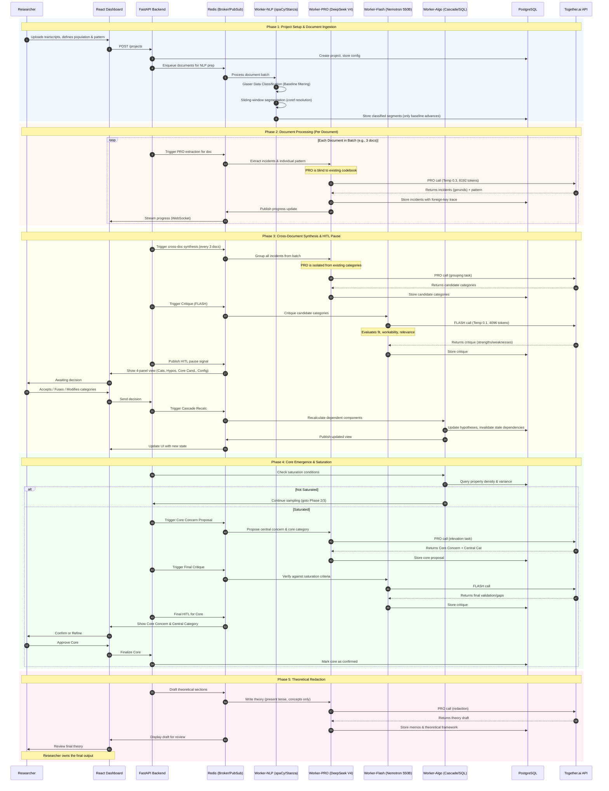

# Geno – AI-Assisted Classic Grounded Theory featuring auto-segmenter and theoretical coding playground 

Presented at ALAS 2026 – [Read the full paper](https://github.com/diegopaucarv/gt/blob/main/Documentacion/ALAS26_modelo_trabalho_completo.pdf)

Geno is a production‑grade system that automates the discovery of latent patterns in qualitative data. It orchestrates **96 specialised agents** across multiple LLMs and NLP workers, following the rigorous inductive logic of Classical Grounded Theory. The system proposes, critiques, and surfaces evidence – but the final theoretical decisions always remain with the human researcher.


---

## 🧠 The Core Loop

Every theoretical decision in Geno follows the same rhythm:

```text
PROPOSE → CRITIQUE → HUMAN‑IN‑THE‑LOOP (HITL) → SYNTHESISE
```

- **Propose** – An LLM agent reads raw data *without* seeing any existing codebook, ensuring inductive freshness.
- **Critique** – A separate agent evaluates the proposal against CGT criteria (fit, relevance, modifiability, workability).
- **Decide** – The researcher reviews the proposal, the critique, and the supporting evidence, then accepts, rejects, or refines.

This architecture is designed to prevent the "imposition" problem that Glaser identified in traditional CAQDAS tools – the tendency to force new data into pre‑existing categories.

---

## 🤖 AI & ML Engineering

### Model Architecture

Geno uses a **two‑tier model strategy** for cost‑effective, reliable operation:

| Model | Role | Temperature | Tokens | Cost Ratio |
|-------|------|-------------|--------|------------|
| **PRO** (DeepSeek V4 Pro) | Generation – proposes incidents, categories, hypotheses, and theoretical sections | 0.3 | 8,192 | 10× |
| **FLASH** (Nemotron 550B) | Verification – critiques labels, checks saturation, detects unsupported claims | 0.1 | 4,096 | 1× |

The PRO model is used for creative, pattern‑seeking tasks where openness is valuable. FLASH handles repetitive verification tasks where consistency is paramount. This separation is both methodologically sound and economically viable for sustained research.

### Agent Orchestration

All agents are orchestrated using **LangGraph** state graphs, which enable:

- **Loops** – Iterative reasoning until conditions are met.
- **HITL interrupts** – Pause execution at defined gateways for human review.
- **Conditional transitions** – Branching logic based on project state (e.g., saturation level, number of documents processed).

### Prompt Engineering

Every agent prompt is carefully engineered with:

- **Explicit role definitions** – "You are a novice researcher with no prior knowledge of this domain."
- **Structured output schemas** – All responses are constrained to JSON schemas, ensuring type‑safe, predictable outputs.
- **Chain‑of‑thought reasoning** – Agents are instructed to show their reasoning before producing a final answer, improving traceability.
- **Context isolation** – Proposing agents never see existing categories; critiquing agents evaluate only against the raw data.

### Key AI Pipelines

1. **Glaser Data Classification** – Each text segment is classified as *baseline* (real experience), *properline* (normative discourse), *interpreted* (interviewer‑primed), *vague* (evasion), or *conceptual* (metaphor/jargon). Only baseline data proceeds to coding – this prevents the theory from describing social norms instead of actual behaviour[reference:0].

2. **Cross‑Document Synthesis** – Instead of pairwise comparisons (which scale quadratically), Geno groups all incidents from a batch in a **single LLM pass**. This is both faster and more coherent, as the model perceives patterns across documents holistically【11†L10-L15】.

3. **Cascading Recalculation** – When a category is merged or split, the system recalculates only the dependent components (hypotheses, relationships) – not the entire knowledge graph. This makes iteration cheap and encourages continuous refinement【12†L28-L35】.

4. **Saturation Detection** – A dedicated agent checks for four signals of theoretical saturation: no new properties, no new relationships, stable category definitions, and stable core category. The system pauses and alerts the researcher when saturation is approaching【17†L45-L48】.

5. **Literature as Data** – Literature is *not* consulted during analysis. Only after the core theory has emerged does the system treat published papers as additional "incidents" for constant comparison – preserving the inductive priority of the raw data【18†L12-L16】.

---

## 🏗️ Architecture Overview




### Agent Chains (8 Phases)

| Phase | Key Agents | Model Pattern |
|-------|------------|---------------|
| Data Preparation | Preprocessor, Glaser Classifier, NLP Segmenter | PRO → NLP → PRO → PRO |
| Cross‑Document Synthesis | Incident Grouper, Labeler, Hypothesis Generator | PRO → PRO↔FLASH → PRO |
| Core Emergence | Core Concern Proposer, Core Category Proposer | PRO → PRO → FLASH |
| Selective Reduction | Reduction Proposer, Reduction Critic | PRO → PRO |
| Saturation (loop) | Saturation Proposer, Saturation Critic, Memo Generator | PRO → FLASH → PRO |
| Theoretical Playground | Ghost Mapper, Memo Labeler, Conceptual Elaborator | PRO → FLASH → PRO |
| Literature Dialogue | Literature Comparator, Literature Critic | PRO → PRO |
| Applicability | Applicability Engine, Applicability Critic | PRO → PRO |

Each chain follows the **Propose → Critique → HITL** rhythm with phase‑specific variations【17†L45-L48】【18†L1-L4】.

---

## 📦 Quick Start

```bash
# Clone the repository
git clone https://github.com/diegopaucarv/gt.git
cd gt

# Set up environment variables
cp .env.example .env
# Add your DEEPSEEK_API_KEY and other credentials

# Build and run with Docker Compose
docker-compose up -d

# Access the dashboard at http://localhost:3000
```

Running a Project

    Create a project – Define your population and pattern type (concern, emotion, conduct, discourse, or identity).

    Upload documents – Transcripts are processed automatically through the Glaser classification and incident extraction pipeline.

    Review at each pause – The system stops every 3 documents. Review categories, hypotheses, and candidate core concerns.

    Confirm or refine – Accept proposals, merge categories, or redirect the analysis. The cascade recalculates only what changed.

    Let saturation guide you – When the system signals saturation, move to selective coding and theoretical writing.

🧪 Methodology

Geno implements Classical Grounded Theory as originally formulated by Barney Glaser and Anselm Strauss (1967), with later clarifications from Glaser (1978, 1995, 2010). Key methodological commitments:

    Inductive primacy – Theory emerges from data, not from pre‑existing hypotheses or literature.

    Constant comparison – Every incident is compared with every other incident, iteratively, until patterns crystallise.

    Theoretical sampling – Data collection is guided by the emerging theory, not by a pre‑determined sample size.

    Core category – The central pattern that explains how the population resolves its main concern.

    Saturation – The point at which no new properties, relationships, or categories emerge.

The system operationalises these principles through the agent architecture described above, while preserving the researcher's ultimate interpretive authority.
