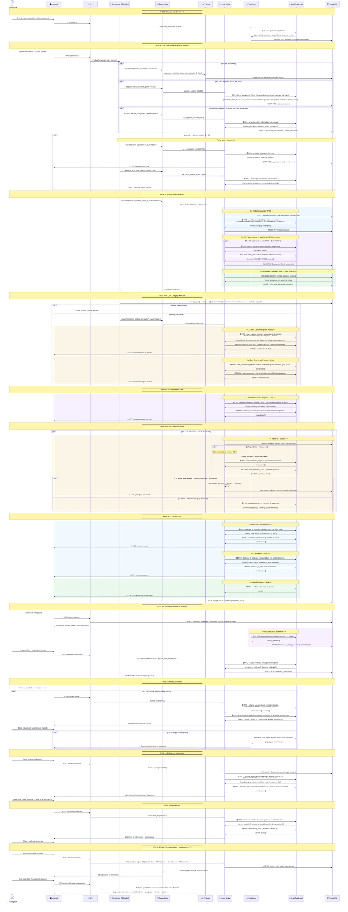

# Geno: an automated CGT System

*Añadir comparación coprocesual con métodos cualitativos tradicionales*.

```mermaid
sequenceDiagram
    actor U as 👤 Investigador
    participant FE as 🖥️ Frontend
    participant API as 🔌 API
    participant ORC as 🎯 Orchestrator (DELGADO)
    participant CEL as 📨 Celery/Redis
    participant NLP as ⚡ NLP Worker
    participant HVY as 🧠 Heavy Worker
    participant FST as ⚡ Fast Worker
    participant LLM as 🤖 LLM (Together.ai)
    participant DB as 🗄️ PostgreSQL

    Note over U,DB: ═══════════════════════════════════════════════════════<br/>FASE 0: Configuración del Proyecto<br/>═══════════════════════════════════════════════════════

    U->>FE: Crear proyecto (población + objeto de estudio)
    FE->>API: POST /projects
    API->>FST: population_generalizer (FLASH)
    FST->>LLM: 🟡 FLASH · generalizar población
    LLM-->>FST: {generalized_population, spatial_frame, temporal_frame}
    FST->>DB: INSERT INTO proyectos (population_assumption)

    Note over U,DB: ═══════════════════════════════════════════════════════<br/>FASE A: Open Coding (por documento, iterativo)<br/>═══════════════════════════════════════════════════════

    U->>FE: Upload documentos + Ejecutar Pipeline
    FE->>API: POST /pipeline/run
    API->>ORC: PipelineOrchestrator.start_pipeline()

    loop Por cada documento
        ORC->>CEL: dispatch("segmentar_documento", queue="nlp")
        CEL->>NLP: segmentar + clasificar (glaser_data_classifier ⚙️+FLASH)
        NLP->>DB: INSERT INTO segmentos (tipo_dato_glaser)
    end

    loop Por cada segmento BASELINE (oro)
        ORC->>CEL: dispatch("extract_incident", queue="heavy")
        CEL->>HVY: incident_extractor (FLASH)
        HVY->>LLM: 🟡 FLASH · 4 preguntas de Glaser (pregunta 4 parametrizada por object_of_study)
        LLM-->>HVY: {jot, what_is_this_about, what_category, what_is_happening, participants_pattern, confidence, keep_moving}
        HVY->>DB: INSERT INTO extracted_incidents
    end

    loop Por cada documento (tras extraer todos sus incidentes)
        ORC->>CEL: dispatch("extract_core_pattern", queue="heavy")
        CEL->>HVY: core_pattern_extractor (PRO)
        HVY->>LLM: 🟣 PRO · sintetizar patrón individual del entrevistado
        LLM-->>HVY: {pattern_description, evidence_quotes, confidence}
        HVY->>DB: UPDATE document_processes SET pattern_of_interest
    end

    alt doc_count ≥ 3 y doc_count % 3 == 0
        Note over ORC,DB: Pausa cada 3 documentos

        ORC->>CEL: dispatch("verify_population", queue="heavy")
        CEL->>HVY: A1 — population_context (PRO)
        HVY->>LLM: 🟣 PRO · actualizar contexto poblacional
        LLM-->>HVY: {surprising_details, language_patterns}
        HVY->>DB: INSERT INTO population_contexts (version N+1)
        HVY-->>FE: 🛑 HITL: ¿población correcta?

        ORC->>CEL: dispatch("verify_core_pattern", queue="heavy")
        CEL->>HVY: A4 — core_pattern_verifier (PRO)
        HVY->>LLM: 🟣 PRO · ¿convergen los patrones individuales?
        LLM-->>HVY: {convergence_assessment, converging[], diverging[]}
        HVY-->>FE: 🛑 HITL: ¿patrón de interés correcto?
    end

    Note over U,DB: ═══════════════════════════════════════════════════════<br/>FASE B: Síntesis Cross-Document<br/>═══════════════════════════════════════════════════════

    ORC->>CEL: dispatch("process_synthesis_agents_b", queue="heavy")
    CEL->>HVY: Phase B (AbortableTask + checkpoints)

    rect rgb(88, 166, 255, 0.1)
        Note over HVY,LLM: ── B1: Incident Comparator (PRO) ──
        HVY->>DB: SELECT extracted_incidents (SOLO incidentes, sin categorías)
        HVY->>LLM: 🟣 PRO · pre-filtro por embedding + batch comparison<br/>(ContextWindowManager: Map-Reduce con presupuesto de contexto)
        LLM-->>HVY: {incident_groups[], ungrouped[]}
        HVY->>DB: INSERT INTO incident_groups
    end

    rect rgb(163, 113, 247, 0.1)
        Note over HVY,LLM: ── B2+B3: Pattern Labeler ↔ Label Critic (SelfRefinement) ──
        loop Máx 3 iteraciones (Generate PRO → Critic FLASH)
            HVY->>LLM: 🟣 PRO · pattern_labeler: proponer etiquetas para grupos
            LLM-->>HVY: {proposed_labels[]}
            HVY->>LLM: 🟡 FLASH · label_critic: evaluar etiquetas (diff estructurado)
            LLM-->>HVY: {verdict: SAT|MOD|FORCED, issues[]}
        end
        HVY->>DB: INSERT INTO categorias (labels aprobadas)
    end

    rect rgb(63, 185, 80, 0.1)
        Note over HVY,DB: ── B4: Evidence Retriever (⚙️ ALG, RAG sin LLM) ──
        HVY->>DB: TEI embedding search por cada categoría aprobada
        DB-->>HVY: top-K segmentos con evidencia textual
        HVY->>DB: INSERT INTO code_document_summaries
    end

    HVY->>ORC: transition("sintetizado")

    Note over U,DB: ═══════════════════════════════════════════════════════<br/>FASE 5b-A: Core Category Detection<br/>═══════════════════════════════════════════════════════

    ORC->>DB: maturity_gate() — chequeo SQL determinístico (≥3 cats saturadas, ≥2 relaciones, ≥3 vinculadas al patrón)
    alt maturity gate NO pasa
        ORC-->>FE: 🔴 Gate cerrado: mostrar qué falta
    else maturity gate PASA
        ORC->>CEL: dispatch("selective_coding_coordinator", queue="heavy")
        CEL->>HVY: Coordinator (AbortableTask)

        rect rgb(210, 153, 34, 0.1)
            Note over HVY,LLM: ── A1: Main Concern Proposer + Critic ──
            HVY->>LLM: 🟣 PRO · main_concern_proposer: sensar patrón de interés<br/>desde sistema completo de categorías + memos
            LLM-->>HVY: {candidates[] (gerundio, rationale, supporting_codes, orphan_patterns)}
            HVY->>LLM: 🟣 PRO · main_concern_critic: evaluar grounding, cobertura, abstracción
            LLM-->>HVY: {verdict: SAT|MOD|FORCED}
            HVY-->>FE: 🛑 HITL: confirmar patrón de interés
        end

        rect rgb(210, 153, 34, 0.1)
            Note over HVY,LLM: ── A2: Core Emergence Proposer + Critic ──
            HVY->>LLM: 🟣 PRO · core_emergence_proposer: evaluar centralidad, poder unificador, grab teórico
            LLM-->>HVY: {candidates[]}
            HVY->>LLM: 🟡 FLASH · core_emergence_critic: test de intercambiabilidad de incidentes
            LLM-->>HVY: {verdict: valid|refine|split}
            HVY-->>FE: 🛑 HITL: confirmar categoría central
        end
    end

    Note over U,DB: ═══════════════════════════════════════════════════════<br/>FASE 5b-B: Selective Reduction<br/>═══════════════════════════════════════════════════════

    rect rgb(163, 113, 247, 0.1)
        Note over HVY,LLM: ── Selective Reduction Proposer + Critic ──
        HVY->>LLM: 🟣 PRO · selective_reduction_proposer: filtrar + fusionar por relevancia al patrón
        LLM-->>HVY: {kept[], merged[], discarded[] (con rationale)}
        HVY->>LLM: 🟣 PRO · selective_reduction_critic: evaluar falsos positivos/negativos
        LLM-->>HVY: {evaluations[]}
        HVY-->>FE: 🛑 HITL: confirmar sistema reducido
    end

    Note over U,DB: ═══════════════════════════════════════════════════════<br/>FASE 5b-C: Core Saturation Loop<br/>═══════════════════════════════════════════════════════

    loop Por cada categoría ≥4 × cada documento
        rect rgb(210, 153, 34, 0.1)
            Note over HVY,DB: ── Panel de 4 señales ──
            HVY->>DB: Señal 1: saturation_metrics.rolling_std (⚙️ barata)
            alt rolling_std alto → no saturada
                Note over HVY: Saltar llamada LLM (ahorro ~70%)
            else rolling_std bajo → posible saturación
                HVY->>LLM: 🟣 PRO · core_saturation_proposer: ¿nuevas expansiones?
                LLM-->>HVY: {expansions[]}
                HVY->>LLM: 🟡 FLASH · core_saturation_critic: ¿expansión genuina?
                LLM-->>HVY: {verdict, did_state_expand}
            end
            alt 3 its sin did_state_expand + cobertura completa + integración
                HVY->>HVY: MemoMaker: Generate → Simplify → Correlate
                HVY->>DB: INSERT INTO memos (structured_fields, versionado)
                HVY-->>FE: 🛑 HITL: ¿categoría saturada?
            else no satura → TheoSampler (bajo demanda)
                HVY->>LLM: 🟣 PRO · buscar incidentes en extremos de gradientes
                LLM-->>HVY: {relevant_segments[], sampling_recommendation}
            end
        end
    end

    Note over U,DB: ═══════════════════════════════════════════════════════<br/>FASE 5b-D: Database A/B<br/>═══════════════════════════════════════════════════════

    rect rgb(121, 192, 255, 0.1)
        Note over HVY,LLM: ── Database A: Nodos planos ──
        HVY->>LLM: 🟣 PRO · database_a_proposer: construir nodos con entity_type
        LLM-->>HVY: {nodes[] (label, entity_type, definition, is_core)}
        HVY->>LLM: 🟣 PRO · database_a_critic: evaluar sistema de nodos
        LLM-->>HVY: {verdict, issues[]}
        HVY-->>FE: 🛑 HITL: confirmar nodos
    end

    rect rgb(121, 192, 255, 0.1)
        Note over HVY,LLM: ── Database B: Edges ──
        HVY->>LLM: 🟣 PRO · database_b_proposer: construir edges con relationship_type
        LLM-->>HVY: {edges[] (source, target, relationship_type, evidence)}
        HVY->>LLM: 🟣 PRO · database_b_critic: evaluar relaciones
        LLM-->>HVY: {verdict, issues[]}
        HVY-->>FE: 🛑 HITL: confirmar relaciones
    end

    rect rgb(63, 185, 80, 0.1)
        Note over HVY,LLM: ── Global Saturation Check ──
        HVY->>LLM: 🟣 PRO · verificar 3 condiciones globales
        LLM-->>HVY: {verdict}
        HVY-->>FE: 🛑 HITL: ¿cerrar codificación selectiva?
    end

    ORC->>DB: UPDATE proyectos SET estado = 'playground_ready'

    Note over U,DB: ═══════════════════════════════════════════════════════<br/>FASE 6b: Theoretical Playground (Sorting)<br/>═══════════════════════════════════════════════════════

    U->>FE: 🎨 Navegar al Playground
    FE->>API: GET /projects/{id}/theory
    API->>DB: SELECT categorias, relaciones, hypotheses, memos, theoretical_codes
    API-->>FE: ecosistema completo (blobs + tendrils + ghosts)

    rect rgb(163, 113, 247, 0.1)
        Note over FST,LLM: ── Pre-clasificación de memos ──
        FST->>LLM: 🟡 FLASH · memo_theoretical_tagger: afinidad a 12 familias
        LLM-->>FST: {family_affinities[]}
        FST->>DB: INSERT INTO memo_sorting_attempts (pre-clasificación)
    end

    U->>FE: Arrastrar blobs + elegir familia teórica
    FE->>API: POST /elaboration/relationship
    API->>HVY: conceptual_elaborator (PRO) + ghost_blob_mapper (PRO)
    HVY->>LLM: 🟣 PRO · buscar evidencia convergente/divergente
    LLM-->>HVY: {converging_evidence[], diverging_evidence[]}
    HVY->>DB: INSERT INTO conceptual_relationships
    HVY-->>FE: Tendril con fisuras doradas (divergencias)

    Note over U,DB: ═══════════════════════════════════════════════════════<br/>FASE 6a: Redacción Natural<br/>═══════════════════════════════════════════════════════

    U->>FE: Iniciar redacción desde pilas de memos
    loop Por cada pila de memos (sorting group)
        FE->>API: POST /writing/section
        API->>HVY: natural_writer (PRO)
        HVY->>LLM: 🟣 PRO · redactar borrador desde memos ordenados<br/>(ContextWindowManager si la pila excede contexto)
        LLM-->>HVY: {draft, citations[], concepts[]}
        HVY->>LLM: 🟣 PRO · writing_critic: evaluar tiempo verbal, conceptos vs personas, dosis de citas
        LLM-->>HVY: {verdict: SAT|MOD|FORCED, issues[{type, location, suggestion}]}
        HVY-->>FE: Borrador con marcado de colores
        U->>FE: Editar directamente sobre el texto marcado
    end

    opt Gap Feeling (segundo plano)
        FST->>LLM: 🟡 FLASH · gap_feeler: detectar afirmaciones sin memo
        LLM-->>FST: {gaps[{type, description}]}
        FST-->>FE: 🔔 Gaps detectados durante la escritura
    end

    Note over U,DB: ═══════════════════════════════════════════════════════<br/>FASE 6c: Diálogo con la Literatura<br/>═══════════════════════════════════════════════════════

    U->>FE: Iniciar diálogo con literatura
    FE->>API: POST /literature/compare
    API->>HVY: literature_comparer (PRO)
    HVY->>DB: RAG search → fragmentos relevantes por categoría
    HVY->>LLM: 🟣 PRO · codificar literatura como incidentes, evaluar emergent fit<br/>(ContextWindowManager: una categoría a la vez)
    LLM-->>HVY: {table[{category, extends, modifies, integrates, transcends}]}
    HVY->>LLM: 🟣 PRO · literature_critic: ¿forzando coincidencias? ¿literatura como autoridad?
    LLM-->>HVY: {verdict, issues[]}
    HVY-->>FE: Tabla Extiende/Modifica/Integra/Trasciende
    U->>FE: Seleccionar celdas a integrar → notas al pie automáticas

    Note over U,DB: ═══════════════════════════════════════════════════════<br/>FASE 6d: Aplicabilidad<br/>═══════════════════════════════════════════════════════

    FE->>API: POST /applicability/generate
    API->>HVY: applicability_engine (PRO)
    HVY->>LLM: 🟣 PRO · identificar variables de control y acceso, redactar directrices
    LLM-->>HVY: {control_variables[], access_variables[], guidelines[], implications[]}
    HVY->>LLM: 🟣 PRO · applicability_critic: ¿genuinas o genéricas?
    LLM-->>HVY: {verdict, issues[]}
    HVY-->>FE: Directrices de intervención + proyecciones
    U->>FE: Editar y confirmar directrices

    Note over U,DB: ═══════════════════════════════════════════════════════<br/>TRANSVERSAL: Re-especificación + Modificación HITL<br/>═══════════════════════════════════════════════════════

    U->>FE: Modificar un output de agente
    FE->>API: POST /modification/apply
    API->>HVY: HITLModificationAgent (P5): FLASH filter → PRO planner → ReactRunner → PRO evaluator
    HVY->>DB: UPDATE output + WIPE tablas dependientes
    HVY->>CEL: Reiniciar pipeline desde el nodo correcto
    CEL-->>FE: SSE: progreso en tiempo real

    U->>FE: Click Stage-Gate Review (botón púrpura)
    FE->>API: GET /projects/{id}/respect-suggestions
    API->>HVY: ReSpecAgent (PRO): monitorear señales de re-especificación
    HVY-->>FE: Sugerencias de revisión por nivel (incidente → categoría → relación → teoría)
```
