# Geno: an automated CGT System
*Presented at ALAS 2026*

*Añadir comparación coprocesual con métodos cualitativos tradicionales*.

```mermaid
sequenceDiagram
    actor U as 👤 Investigador
    participant FE as 🖥️ Frontend
    participant API as 🔌 API
    participant ORC as 🎯 Orchestrator (DELGADO)
    participant CEL as 📨 Celery/Redis
    participant NLP as ⚡ NLP Worker
    participant HVY as 🧠 Heavy Worker
    participant FST as ⚡ Fast Worker
    participant LLM as 🤖 LLM (Together.ai)
    participant DB as 🗄️ PostgreSQL

    Note over U,DB: ═══════════════════════════════════════════════════════<br/>FASE 0: Configuración del Proyecto<br/>═══════════════════════════════════════════════════════

    U->>FE: Crear proyecto (población + objeto de estudio)
    FE->>API: POST /projects
    API->>FST: population_generalizer (FLASH)
    FST->>LLM: 🟡 FLASH · generalizar población
    LLM-->>FST: {generalized_population, spatial_frame, temporal_frame}
    FST->>DB: INSERT INTO proyectos (population_assumption)

    Note over U,DB: ═══════════════════════════════════════════════════════<br/>FASE A: Open Coding (por documento, iterativo)<br/>═══════════════════════════════════════════════════════

    U->>FE: Upload documentos + Ejecutar Pipeline
    FE->>API: POST /pipeline/run
    API->>ORC: PipelineOrchestrator.start_pipeline()

    loop Por cada documento
        ORC->>CEL: dispatch("segmentar_documento", queue="nlp")
        CEL->>NLP: segmentar + clasificar (glaser_data_classifier ⚙️+FLASH)
        NLP->>DB: INSERT INTO segmentos (tipo_dato_glaser)
    end

    loop Por cada segmento BASELINE (oro)
        ORC->>CEL: dispatch("extract_incident", queue="heavy")
        CEL->>HVY: incident_extractor (FLASH)
        HVY->>LLM: 🟡 FLASH · 4 preguntas de Glaser (pregunta 4 parametrizada por object_of_study)
        LLM-->>HVY: {jot, what_is_this_about, what_category, what_is_happening, participants_pattern, confidence, keep_moving}
        HVY->>DB: INSERT INTO extracted_incidents
    end

    loop Por cada documento (tras extraer todos sus incidentes)
        ORC->>CEL: dispatch("extract_core_pattern", queue="heavy")
        CEL->>HVY: core_pattern_extractor (PRO)
        HVY->>LLM: 🟣 PRO · sintetizar patrón individual del entrevistado
        LLM-->>HVY: {pattern_description, evidence_quotes, confidence}
        HVY->>DB: UPDATE document_processes SET pattern_of_interest
    end

    alt doc_count ≥ 3 y doc_count % 3 == 0
        Note over ORC,DB: Pausa cada 3 documentos

        ORC->>CEL: dispatch("verify_population", queue="heavy")
        CEL->>HVY: A1 — population_context (PRO)
        HVY->>LLM: 🟣 PRO · actualizar contexto poblacional
        LLM-->>HVY: {surprising_details, language_patterns}
        HVY->>DB: INSERT INTO population_contexts (version N+1)
        HVY-->>FE: 🛑 HITL: ¿población correcta?

        ORC->>CEL: dispatch("verify_core_pattern", queue="heavy")
        CEL->>HVY: A4 — core_pattern_verifier (PRO)
        HVY->>LLM: 🟣 PRO · ¿convergen los patrones individuales?
        LLM-->>HVY: {convergence_assessment, converging[], diverging[]}
        HVY-->>FE: 🛑 HITL: ¿patrón de interés correcto?
    end

    Note over U,DB: ═══════════════════════════════════════════════════════<br/>FASE B: Síntesis Cross-Document<br/>═══════════════════════════════════════════════════════

    ORC->>CEL: dispatch("process_synthesis_agents_b", queue="heavy")
    CEL->>HVY: Phase B (AbortableTask + checkpoints)

    rect rgb(88, 166, 255, 0.1)
        Note over HVY,LLM: ── B1: Incident Comparator (PRO) ──
        HVY->>DB: SELECT extracted_incidents (SOLO incidentes, sin categorías)
        HVY->>LLM: 🟣 PRO · pre-filtro por embedding + batch comparison<br/>(ContextWindowManager: Map-Reduce con presupuesto de contexto)
        LLM-->>HVY: {incident_groups[], ungrouped[]}
        HVY->>DB: INSERT INTO incident_groups
    end

    rect rgb(163, 113, 247, 0.1)
        Note over HVY,LLM: ── B2+B3: Pattern Labeler ↔ Label Critic (SelfRefinement) ──
        loop Máx 3 iteraciones (Generate PRO → Critic FLASH)
            HVY->>LLM: 🟣 PRO · pattern_labeler: proponer etiquetas para grupos
            LLM-->>HVY: {proposed_labels[]}
            HVY->>LLM: 🟡 FLASH · label_critic: evaluar etiquetas (diff estructurado)
            LLM-->>HVY: {verdict: SAT|MOD|FORCED, issues[]}
        end
        HVY->>DB: INSERT INTO categorias (labels aprobadas)
    end

    rect rgb(63, 185, 80, 0.1)
        Note over HVY,DB: ── B4: Evidence Retriever (⚙️ ALG, RAG sin LLM) ──
        HVY->>DB: TEI embedding search por cada categoría aprobada
        DB-->>HVY: top-K segmentos con evidencia textual
        HVY->>DB: INSERT INTO code_document_summaries
    end

    HVY->>ORC: transition("sintetizado")

    Note over U,DB: ═══════════════════════════════════════════════════════<br/>FASE 5b-A: Core Category Detection<br/>═══════════════════════════════════════════════════════

    ORC->>DB: maturity_gate() — chequeo SQL determinístico (≥3 cats saturadas, ≥2 relaciones, ≥3 vinculadas al patrón)
    alt maturity gate NO pasa
        ORC-->>FE: 🔴 Gate cerrado: mostrar qué falta
    else maturity gate PASA
        ORC->>CEL: dispatch("selective_coding_coordinator", queue="heavy")
        CEL->>HVY: Coordinator (AbortableTask)

        rect rgb(210, 153, 34, 0.1)
            Note over HVY,LLM: ── A1: Main Concern Proposer + Critic ──
            HVY->>LLM: 🟣 PRO · main_concern_proposer: sensar patrón de interés<br/>desde sistema completo de categorías + memos
            LLM-->>HVY: {candidates[] (gerundio, rationale, supporting_codes, orphan_patterns)}
            HVY->>LLM: 🟣 PRO · main_concern_critic: evaluar grounding, cobertura, abstracción
            LLM-->>HVY: {verdict: SAT|MOD|FORCED}
            HVY-->>FE: 🛑 HITL: confirmar patrón de interés
        end

        rect rgb(210, 153, 34, 0.1)
            Note over HVY,LLM: ── A2: Core Emergence Proposer + Critic ──
            HVY->>LLM: 🟣 PRO · core_emergence_proposer: evaluar centralidad, poder unificador, grab teórico
            LLM-->>HVY: {candidates[]}
            HVY->>LLM: 🟡 FLASH · core_emergence_critic: test de intercambiabilidad de incidentes
            LLM-->>HVY: {verdict: valid|refine|split}
            HVY-->>FE: 🛑 HITL: confirmar categoría central
        end
    end

    Note over U,DB: ═══════════════════════════════════════════════════════<br/>FASE 5b-B: Selective Reduction<br/>═══════════════════════════════════════════════════════

    rect rgb(163, 113, 247, 0.1)
        Note over HVY,LLM: ── Selective Reduction Proposer + Critic ──
        HVY->>LLM: 🟣 PRO · selective_reduction_proposer: filtrar + fusionar por relevancia al patrón
        LLM-->>HVY: {kept[], merged[], discarded[] (con rationale)}
        HVY->>LLM: 🟣 PRO · selective_reduction_critic: evaluar falsos positivos/negativos
        LLM-->>HVY: {evaluations[]}
        HVY-->>FE: 🛑 HITL: confirmar sistema reducido
    end

    Note over U,DB: ═══════════════════════════════════════════════════════<br/>FASE 5b-C: Core Saturation Loop<br/>═══════════════════════════════════════════════════════

    loop Por cada categoría ≥4 × cada documento
        rect rgb(210, 153, 34, 0.1)
            Note over HVY,DB: ── Panel de 4 señales ──
            HVY->>DB: Señal 1: saturation_metrics.rolling_std (⚙️ barata)
            alt rolling_std alto → no saturada
                Note over HVY: Saltar llamada LLM (ahorro ~70%)
            else rolling_std bajo → posible saturación
                HVY->>LLM: 🟣 PRO · core_saturation_proposer: ¿nuevas expansiones?
                LLM-->>HVY: {expansions[]}
                HVY->>LLM: 🟡 FLASH · core_saturation_critic: ¿expansión genuina?
                LLM-->>HVY: {verdict, did_state_expand}
            end
            alt 3 its sin did_state_expand + cobertura completa + integración
                HVY->>HVY: MemoMaker: Generate → Simplify → Correlate
                HVY->>DB: INSERT INTO memos (structured_fields, versionado)
                HVY-->>FE: 🛑 HITL: ¿categoría saturada?
            else no satura → TheoSampler (bajo demanda)
                HVY->>LLM: 🟣 PRO · buscar incidentes en extremos de gradientes
                LLM-->>HVY: {relevant_segments[], sampling_recommendation}
            end
        end
    end

    Note over U,DB: ═══════════════════════════════════════════════════════<br/>FASE 5b-D: Database A/B<br/>═══════════════════════════════════════════════════════

    rect rgb(121, 192, 255, 0.1)
        Note over HVY,LLM: ── Database A: Nodos planos ──
        HVY->>LLM: 🟣 PRO · database_a_proposer: construir nodos con entity_type
        LLM-->>HVY: {nodes[] (label, entity_type, definition, is_core)}
        HVY->>LLM: 🟣 PRO · database_a_critic: evaluar sistema de nodos
        LLM-->>HVY: {verdict, issues[]}
        HVY-->>FE: 🛑 HITL: confirmar nodos
    end

    rect rgb(121, 192, 255, 0.1)
        Note over HVY,LLM: ── Database B: Edges ──
        HVY->>LLM: 🟣 PRO · database_b_proposer: construir edges con relationship_type
        LLM-->>HVY: {edges[] (source, target, relationship_type, evidence)}
        HVY->>LLM: 🟣 PRO · database_b_critic: evaluar relaciones
        LLM-->>HVY: {verdict, issues[]}
        HVY-->>FE: 🛑 HITL: confirmar relaciones
    end

    rect rgb(63, 185, 80, 0.1)
        Note over HVY,LLM: ── Global Saturation Check ──
        HVY->>LLM: 🟣 PRO · verificar 3 condiciones globales
        LLM-->>HVY: {verdict}
        HVY-->>FE: 🛑 HITL: ¿cerrar codificación selectiva?
    end

    ORC->>DB: UPDATE proyectos SET estado = 'playground_ready'

    Note over U,DB: ═══════════════════════════════════════════════════════<br/>FASE 6b: Theoretical Playground (Sorting)<br/>═══════════════════════════════════════════════════════

    U->>FE: 🎨 Navegar al Playground
    FE->>API: GET /projects/{id}/theory
    API->>DB: SELECT categorias, relaciones, hypotheses, memos, theoretical_codes
    API-->>FE: ecosistema completo (blobs + tendrils + ghosts)

    rect rgb(163, 113, 247, 0.1)
        Note over FST,LLM: ── Pre-clasificación de memos ──
        FST->>LLM: 🟡 FLASH · memo_theoretical_tagger: afinidad a 12 familias
        LLM-->>FST: {family_affinities[]}
        FST->>DB: INSERT INTO memo_sorting_attempts (pre-clasificación)
    end

    U->>FE: Arrastrar blobs + elegir familia teórica
    FE->>API: POST /elaboration/relationship
    API->>HVY: conceptual_elaborator (PRO) + ghost_blob_mapper (PRO)
    HVY->>LLM: 🟣 PRO · buscar evidencia convergente/divergente
    LLM-->>HVY: {converging_evidence[], diverging_evidence[]}
    HVY->>DB: INSERT INTO conceptual_relationships
    HVY-->>FE: Tendril con fisuras doradas (divergencias)

    Note over U,DB: ═══════════════════════════════════════════════════════<br/>FASE 6a: Redacción Natural<br/>═══════════════════════════════════════════════════════

    U->>FE: Iniciar redacción desde pilas de memos
    loop Por cada pila de memos (sorting group)
        FE->>API: POST /writing/section
        API->>HVY: natural_writer (PRO)
        HVY->>LLM: 🟣 PRO · redactar borrador desde memos ordenados<br/>(ContextWindowManager si la pila excede contexto)
        LLM-->>HVY: {draft, citations[], concepts[]}
        HVY->>LLM: 🟣 PRO · writing_critic: evaluar tiempo verbal, conceptos vs personas, dosis de citas
        LLM-->>HVY: {verdict: SAT|MOD|FORCED, issues[{type, location, suggestion}]}
        HVY-->>FE: Borrador con marcado de colores
        U->>FE: Editar directamente sobre el texto marcado
    end

    opt Gap Feeling (segundo plano)
        FST->>LLM: 🟡 FLASH · gap_feeler: detectar afirmaciones sin memo
        LLM-->>FST: {gaps[{type, description}]}
        FST-->>FE: 🔔 Gaps detectados durante la escritura
    end

    Note over U,DB: ═══════════════════════════════════════════════════════<br/>FASE 6c: Diálogo con la Literatura<br/>═══════════════════════════════════════════════════════

    U->>FE: Iniciar diálogo con literatura
    FE->>API: POST /literature/compare
    API->>HVY: literature_comparer (PRO)
    HVY->>DB: RAG search → fragmentos relevantes por categoría
    HVY->>LLM: 🟣 PRO · codificar literatura como incidentes, evaluar emergent fit<br/>(ContextWindowManager: una categoría a la vez)
    LLM-->>HVY: {table[{category, extends, modifies, integrates, transcends}]}
    HVY->>LLM: 🟣 PRO · literature_critic: ¿forzando coincidencias? ¿literatura como autoridad?
    LLM-->>HVY: {verdict, issues[]}
    HVY-->>FE: Tabla Extiende/Modifica/Integra/Trasciende
    U->>FE: Seleccionar celdas a integrar → notas al pie automáticas

    Note over U,DB: ═══════════════════════════════════════════════════════<br/>FASE 6d: Aplicabilidad<br/>═══════════════════════════════════════════════════════

    FE->>API: POST /applicability/generate
    API->>HVY: applicability_engine (PRO)
    HVY->>LLM: 🟣 PRO · identificar variables de control y acceso, redactar directrices
    LLM-->>HVY: {control_variables[], access_variables[], guidelines[], implications[]}
    HVY->>LLM: 🟣 PRO · applicability_critic: ¿genuinas o genéricas?
    LLM-->>HVY: {verdict, issues[]}
    HVY-->>FE: Directrices de intervención + proyecciones
    U->>FE: Editar y confirmar directrices

    Note over U,DB: ═══════════════════════════════════════════════════════<br/>TRANSVERSAL: Re-especificación + Modificación HITL<br/>═══════════════════════════════════════════════════════

    U->>FE: Modificar un output de agente
    FE->>API: POST /modification/apply
    API->>HVY: HITLModificationAgent (P5): FLASH filter → PRO planner → ReactRunner → PRO evaluator
    HVY->>DB: UPDATE output + WIPE tablas dependientes
    HVY->>CEL: Reiniciar pipeline desde el nodo correcto
    CEL-->>FE: SSE: progreso en tiempo real

    U->>FE: Click Stage-Gate Review (botón púrpura)
    FE->>API: GET /projects/{id}/respect-suggestions
    API->>HVY: ReSpecAgent (PRO): monitorear señales de re-especificación
    HVY-->>FE: Sugerencias de revisión por nivel (incidente → categoría → relación → teoría)
```

This pipeline orchestrates LLM agents (via Together.ai) and specialized workers to process documents, extract incidents, synthesize patterns, and generate theory from qualitative data, following the Grounded Theory method.

---

## 📦 High-level flow

The system is organized into sequential phases:

1. **Project setup** – Definition of population and object of study.
2. **Open Coding** – Segmentation, extraction of incidents and individual patterns per document.
3. **Cross‑Document Synthesis** – Comparison of incidents, labeling, and evidence retrieval.
4. **Core category detection** – Identification of the pattern of interest and emerging categories.
5. **Selective reduction** – Filtering and merging of relevant categories.
6. **Saturation** – Verification of theoretical saturation and memo generation.
7. **Theoretical playground** – Memo classification, relationship building, and natural writing.
8. **Dialogue with the literature** – Comparison with external sources.
9. **Applicability** – Generation of intervention guidelines.

*(The complete Mermaid diagram is at the beginning of the original README; this summary is a simplified version for quick orientation).*

---

## ⚙️ Prerequisites

- Docker and Docker Compose (recommended)
- A Together.ai API key (free with initial credits)
- (Optional) Python 3.10+ (for local development)

---

## 🔐 Environment setup (`.env`)

The system uses environment variables for secrets. **Never commit your `.env`** (it is already in `.gitignore`).

Your `.env` file must contain **these three mandatory variables** (exactly as you provided them to me):

JWT_SECRET=dev-jwt-secret-gt-local
HMAC_SECRET=dev-celery-hmac-gt-local
TOGETHER_API_KEY=xxxx

### Explanation of each variable

| Variable | Value in your `.env` | Purpose |
|----------|----------------------|---------|
| `JWT_SECRET` | `dev-jwt-secret-gt-local` | JWT session signing for user authentication. **In production, replace this with a secure value** (e.g. `secrets.token_urlsafe(64)`). |
| `HMAC_SECRET` | `dev-celery-hmac-gt-local` | Internal Celery task signing (workers). **Change this in production as well**. |
| `TOGETHER_API_KEY` | `xxxx` | **Replace this `xxxx` value with your real key** from Together.ai. You can get it at [https://api.together.ai/settings/api-keys](https://api.together.ai/settings/api-keys). |

> **Note**: The rest of the configuration (database, MinIO, Redis, segmentation paths) already has default values in `config.py` and `docker-compose.yml`, so you **do not need to define them in `.env`** for local development. If you want to override them, add the corresponding variables (e.g. `DB_NAME`, `REDIS_URL`).

### Steps to create your `.env`

1. Copy the example (if it exists) or create the file directly:
   cp .env.example .env

2. Open `.env` with your editor and paste the content above.

3. Replace `xxxx` with your actual `TOGETHER_API_KEY`.

---

## 🐳 Running the system with Docker (recommended)

# Build images (only the first time)
docker-compose build

# Start all services (API, workers, Redis, DB, MinIO)
docker-compose up -d

# View logs in real time
docker-compose logs -f

# Stop services
docker-compose down

Once started, the API will be available at `http://localhost:8000` (by default).

---

## 💻 Local development (without Docker)

If you prefer to run without Docker for debugging:

# 1. Create and activate a virtual environment
python -m venv venv
source venv/bin/activate      # Linux/Mac
# venv\Scripts\activate       # Windows

# 2. Install dependencies
pip install -r requirements.txt

# 3. Make sure Redis and PostgreSQL are running locally
#    (or use docker-compose only for those services)

# 4. Export the environment variables (or load .env)
export JWT_SECRET=dev-jwt-secret-gt-local
export HMAC_SECRET=dev-celery-hmac-gt-local
export TOGETHER_API_KEY=xxxx   # your real key

# 5. Run migrations (if using Django/Flask + ORM)
python manage.py migrate

# 6. Start the development server
python manage.py runserver

---

## 🧪 Useful commands

| Command | Description |
|---------|-------------|
| `make test` | Run the test suite |
| `make lint` | Check code style (flake8, black) |
| `docker-compose exec api bash` | Access the API container |
| `docker-compose exec worker bash` | Access the Celery worker container |
| `docker-compose logs -f worker` | View worker logs in real time |

---

## 📁 Additional documentation

Detailed documentation for each agent (prompts, alignment criteria, and examples) is available in the [`Documentacion/cgt_alignment/`](https://github.com/diegopaucarv/gt/tree/main/Documentacion/cgt_alignment) folder.

> **Note**: In your message you mentioned `kb.md` inside that folder, but **it does not exist in the main branch**. If this is a new file or located in another branch, let me know and I will add it to the README.

---

## ⚠️ Security considerations

- The `dev-*` values for JWT and HMAC are **for local development only**. In any production or staging environment, **generate unique and secure secrets**.
- Never expose your `TOGETHER_API_KEY` in logs or public repositories.
- The `.env` file is already in `.gitignore`; verify that it has not been accidentally committed.

---

## 🆘 Support

If you encounter errors when starting the system, verify that:
- Docker is running and has enough resources (at least 4 GB of RAM recommended).
- Your `TOGETHER_API_KEY` is valid and has available credits.
- Ports 8000, 5432, 6379, and 9000 are not occupied by other services.

---

# GT — Pipeline de Teoria Fundamentada (Grounded Theory)

**Sistema automatizado para análise qualitativa baseado na Teoria Fundamentada (CGT)**  
*Apresentado no ALAS 2026*

Este pipeline orquestra agentes LLM (via Together.ai) e workers especializados para processar documentos, extrair incidentes, sintetizar padrões e gerar teoria a partir de dados qualitativos, seguindo o método da Teoria Fundamentada.

---

## 📦 Fluxo de alto nível

O sistema é organizado em fases sequenciais:

1. **Configuração do projeto** – Definição da população e objeto de estudo.
2. **Codificação aberta (Open Coding)** – Segmentação, extração de incidentes e padrões individuais por documento.
3. **Síntese entre documentos** – Comparação de incidentes, rotulagem e recuperação de evidências.
4. **Detecção da categoria central** – Identificação do padrão de interesse e categorias emergentes.
5. **Redução seletiva** – Filtragem e fusão de categorias relevantes.
6. **Saturação** – Verificação da saturação teórica e geração de memos.
7. **Playground teórico** – Classificação de memos, elaboração de relações e redação natural.
8. **Diálogo com a literatura** – Comparação com fontes externas.
9. **Aplicabilidade** – Geração de diretrizes de intervenção.

*(O diagrama completo em Mermaid está no início do README original; este resumo é uma versão simplificada para orientação rápida).*

---

## ⚙️ Pré-requisitos

- Docker e Docker Compose (recomendado)
- Python 3.10+ (para desenvolvimento local)
- Uma chave de API da [Together.ai](https://together.ai) (gratuita com créditos iniciais)

---

## 🔐 Configuração do ambiente (`.env`)

O sistema utiliza variáveis de ambiente para segredos. **Nunca commite o seu `.env`** (ele já está no `.gitignore`).

Seu arquivo `.env` deve conter **estas três variáveis obrigatórias** (exatamente como você me forneceu):

JWT_SECRET=dev-jwt-secret-gt-local
HMAC_SECRET=dev-celery-hmac-gt-local
TOGETHER_API_KEY=xxxx

### Explicação de cada variável

| Variável | Valor no seu `.env` | Finalidade |
|----------|---------------------|------------|
| `JWT_SECRET` | `dev-jwt-secret-gt-local` | Assinatura de sessões JWT para autenticação de usuários. **Em produção, troque por um valor seguro** (ex. `secrets.token_urlsafe(64)`). |
| `HMAC_SECRET` | `dev-celery-hmac-gt-local` | Assinatura de tarefas internas do Celery (workers). **Troque também em produção**. |
| `TOGETHER_API_KEY` | `xxxx` | **Substitua este valor `xxxx` pela sua chave real** da Together.ai. Você pode obtê-la em [https://api.together.ai/settings/api-keys](https://api.together.ai/settings/api-keys). |

> **Nota**: O restante da configuração (banco de dados, MinIO, Redis, caminhos de segmentação) já possui valores padrão em `config.py` e `docker-compose.yml`, portanto você **não precisa defini-los no `.env`** para desenvolvimento local. Se quiser sobrescrevê-los, adicione as variáveis correspondentes (ex. `DB_NAME`, `REDIS_URL`).

### Passos para criar seu `.env`

1. Copie o exemplo (se existir) ou crie o arquivo diretamente:
   cp .env.example .env

2. Abra o `.env` com seu editor e cole o conteúdo acima.

3. Substitua `xxxx` pela sua `TOGETHER_API_KEY` real.

---

## 🐳 Executando o sistema com Docker (recomendado)

# Construir as imagens (somente na primeira vez)
docker-compose build

# Iniciar todos os serviços (API, workers, Redis, DB, MinIO)
docker-compose up -d

# Ver logs em tempo real
docker-compose logs -f

# Parar os serviços
docker-compose down

Uma vez iniciado, a API estará disponível em `http://localhost:8000` (por padrão).

---

## 💻 Desenvolvimento local (sem Docker)

Se preferir executar sem Docker para depuração:

# 1. Criar e ativar um ambiente virtual
python -m venv venv
source venv/bin/activate      # Linux/Mac
# venv\Scripts\activate       # Windows

# 2. Instalar dependências
pip install -r requirements.txt

# 3. Certifique-se de que Redis e PostgreSQL estejam rodando localmente
#    (ou use docker-compose apenas para esses serviços)

# 4. Exportar as variáveis de ambiente (ou carregar o .env)
export JWT_SECRET=dev-jwt-secret-gt-local
export HMAC_SECRET=dev-celery-hmac-gt-local
export TOGETHER_API_KEY=xxxx   # sua chave real

# 5. Executar migrações (se usar Django/Flask + ORM)
python manage.py migrate

# 6. Iniciar o servidor de desenvolvimento
python manage.py runserver

---

## 🧪 Comandos úteis

| Comando | Descrição |
|---------|-----------|
| `make test` | Executar a suíte de testes |
| `make lint` | Verificar estilo do código (flake8, black) |
| `docker-compose exec api bash` | Acessar o container da API |
| `docker-compose exec worker bash` | Acessar o container do worker Celery |
| `docker-compose logs -f worker` | Ver logs do worker em tempo real |

---

## 📁 Documentação adicional

A documentação detalhada de cada agente (prompts, critérios de alinhamento e exemplos) está disponível na pasta [`Documentacion/cgt_alignment/`](https://github.com/diegopaucarv/gt/tree/main/Documentacion/cgt_alignment).

> **Nota**: Na sua mensagem você mencionou `kb.md` dentro dessa pasta, mas **ele não existe na branch principal**. Se for um arquivo novo ou localizado em outra branch, me avise e eu o incorporarei ao README.

---

## ⚠️ Considerações de segurança

- Os valores `dev-*` para JWT e HMAC são **apenas para desenvolvimento local**. Em qualquer ambiente de produção ou pré-produção, **gere segredos únicos e seguros**.
- Nunca exponha sua `TOGETHER_API_KEY` em logs ou repositórios públicos.
- O arquivo `.env` já está no `.gitignore`; verifique se ele não foi commitado acidentalmente.

---

## 🆘 Suporte

Se encontrar erros ao iniciar o sistema, verifique se:
- O Docker está rodando e tem recursos suficientes (mínimo de 4 GB de RAM recomendados).
- Sua `TOGETHER_API_KEY` é válida e tem créditos disponíveis.
- As portas 8000, 5432, 6379 e 9000 não estão ocupadas por outros serviços.

---

# GT — Pipeline de Teoría Fundamentada (Grounded Theory)

**Sistema automatizado para análisis cualitativo basado en la Teoría Fundamentada (CGT)**  
*Presentado en ALAS 2026*

Este pipeline orquesta agentes LLM (vía Together.ai) y workers especializados para procesar documentos, extraer incidentes, sintetizar patrones y generar teoría desde datos cualitativos, siguiendo el método de la Teoría Fundamentada.

---

## 📦 Flujo de alto nivel

El sistema se organiza en fases secuenciales:

1. **Configuración del proyecto** – Definición de población y objeto de estudio.
2. **Open Coding** – Segmentación, extracción de incidentes y patrones individuales por documento.
3. **Síntesis Cross‑Document** – Comparación de incidentes, etiquetado y recuperación de evidencia.
4. **Detección de categoría central** – Identificación del patrón de interés y categorías emergentes.
5. **Reducción selectiva** – Filtrado y fusión de categorías relevantes.
6. **Saturación** – Verificación de saturación teórica y generación de memos.
7. **Playground teórico** – Clasificación de memos, elaboración de relaciones y redacción natural.
8. **Diálogo con la literatura** – Comparación con fuentes externas.
9. **Aplicabilidad** – Generación de directrices de intervención.

*(El diagrama completo en Mermaid se encuentra al inicio del README original; este resumen es una versión simplificada para orientación rápida).*

---

## ⚙️ Requisitos previos

- Docker y Docker Compose (recomendado)
- Python 3.10+ (para desarrollo local)
- Una clave de API de [Together.ai](https://together.ai) (gratuita con créditos iniciales)

---

## 🔐 Configuración del entorno (`.env`)

El sistema utiliza variables de entorno para secretos. **Nunca commitees tu `.env`** (ya está en `.gitignore`).

Tu archivo `.env` debe contener **estas tres variables obligatorias** (tal como me las has proporcionado):

JWT_SECRET=dev-jwt-secret-gt-local
HMAC_SECRET=dev-celery-hmac-gt-local
TOGETHER_API_KEY=xxxx

### Explicación de cada variable

| Variable | Valor en tu `.env` | Propósito |
|----------|-------------------|-----------|
| `JWT_SECRET` | `dev-jwt-secret-gt-local` | Firma de sesiones JWT para autenticación de usuarios. **En producción, cámbialo por un valor seguro** (ej. `secrets.token_urlsafe(64)`). |
| `HMAC_SECRET` | `dev-celery-hmac-gt-local` | Firma de tareas internas de Celery (workers). **En producción, cámbialo también**. |
| `TOGETHER_API_KEY` | `xxxx` | **Reemplaza este valor `xxxx` por tu clave real** de Together.ai. Puedes obtenerla en [https://api.together.ai/settings/api-keys](https://api.together.ai/settings/api-keys). |

> **Nota**: El resto de la configuración (base de datos, MinIO, Redis, rutas de segmentación) ya tiene valores por defecto en `config.py` y `docker-compose.yml`, por lo que **no necesitas definirlos en `.env`** para desarrollo local. Si quieres sobrescribirlos, añade las variables correspondientes (ej. `DB_NAME`, `REDIS_URL`).

### Pasos para crear tu `.env`

1. Copia el ejemplo (si existe) o crea el archivo directamente:
   cp .env.example .env

2. Abre `.env` con tu editor y pega el contenido de arriba.

3. Sustituye `xxxx` por tu `TOGETHER_API_KEY` real.

---

## 🐳 Levantar el sistema con Docker (recomendado)

# Construir imágenes (solo la primera vez)
docker-compose build

# Levantar todos los servicios (API, workers, Redis, DB, MinIO)
docker-compose up -d

# Ver logs en tiempo real
docker-compose logs -f

# Detener los servicios
docker-compose down

Una vez levantado, la API estará disponible en `http://localhost:8000` (por defecto).

---

## 💻 Desarrollo local (sin Docker)

Si prefieres ejecutar sin Docker para depuración:

# 1. Crear y activar entorno virtual
python -m venv venv
source venv/bin/activate      # Linux/Mac
# venv\Scripts\activate       # Windows

# 2. Instalar dependencias
pip install -r requirements.txt

# 3. Asegúrate de tener Redis y PostgreSQL corriendo localmente
#    (o usa docker-compose solo para esos servicios)

# 4. Exportar las variables de entorno (o cargar .env)
export JWT_SECRET=dev-jwt-secret-gt-local
export HMAC_SECRET=dev-celery-hmac-gt-local
export TOGETHER_API_KEY=xxxx   # tu clave real

# 5. Ejecutar migraciones (si usas Django/Flask + ORM)
python manage.py migrate

# 6. Iniciar el servidor de desarrollo
python manage.py runserver

---

## 🧪 Comandos útiles

| Comando | Descripción |
|---------|-------------|
| `make test` | Ejecutar suite de pruebas |
| `make lint` | Revisar estilo de código (flake8, black) |
| `docker-compose exec api bash` | Acceder al contenedor de la API |
| `docker-compose exec worker bash` | Acceder al contenedor del worker de Celery |
| `docker-compose logs -f worker` | Ver logs del worker en tiempo real |

---

## 📁 Documentación adicional

La documentación detallada de cada agente (prompts, criterios de alineación y ejemplos) se encuentra en la carpeta [`Documentacion/cgt_alignment/`](https://github.com/diegopaucarv/gt/tree/main/Documentacion/cgt_alignment).

> **Nota**: En tu mensaje mencionaste `kb.md` dentro de esa carpeta, pero **no existe en la rama principal**. Si se trata de un archivo nuevo o ubicado en otra rama, indícamelo y lo incorporaré al README.

---

## ⚠️ Consideraciones de seguridad

- Los valores `dev-*` para JWT y HMAC son **solo para desarrollo local**. En cualquier entorno de producción o preproducción, **genera secretos únicos y seguros**.
- Nunca expongas tu `TOGETHER_API_KEY` en logs o repositorios públicos.
- El archivo `.env` ya está en `.gitignore`; verifica que no se haya commiteado accidentalmente.

---

## 🆘 Soporte

Si encuentras errores al levantar el sistema, verifica que:
- Docker esté corriendo y tenga suficientes recursos (mínimo 4 GB de RAM recomendados).
- Tu `TOGETHER_API_KEY` sea válida y tenga créditos disponibles.
- Los puertos 8000, 5432, 6379 y 9000 no estén ocupados por otros servicios.

---

